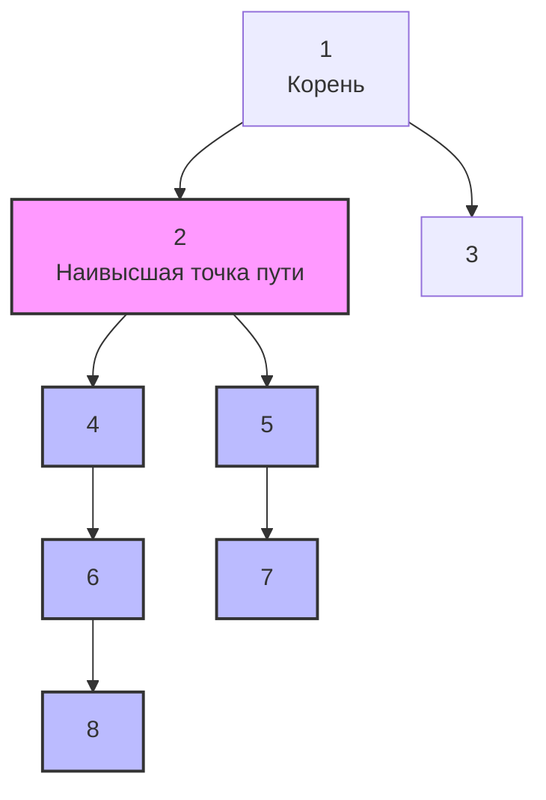

## Разбор задачи: Diameter of Binary Tree

В прошлой статье [[3. Maximum Depth of Binary Tree]] мы научились спускаться от корня к самому глубокому листу. Но что если нам нужно найти самое длинное расстояние между **любыми двумя узлами** в дереве? Эта задача известна как **Диаметр бинарного дерева** (LeetCode №543).

**Условие:** Дано бинарное дерево. Нужно вычислить длину его диаметра. Диаметр дерева — это длина самого длинного пути между любыми двумя узлами. Этот путь **может не проходить** через корень дерева. 
*Примечание: Длина пути между двумя узлами измеряется количеством ребер между ними, а не количеством узлов.*

Эта задача — лакмусовая бумажка на Middle/Senior собеседованиях. Она проверяет, умеете ли вы применять Post-order обход (обратный обход) и управлять состоянием между рекурсивными вызовами.

---

## Интуиция: Причем тут максимальная глубина?

Давайте посмотрим на дерево. Любой путь в дереве имеет наивысшую точку (узел, который ближе всего к корню всего дерева). 
Для любого узла `X`, самый длинный путь, который проходит через `X` как через наивысшую точку, равен:
**Глубина левого поддерева + Глубина правого поддерева**.


В примере выше самый длинный путь проходит через узлы `8-6-4-2-5-7`. Он имеет длину 5 ребер (6 узлов). Корень `1` в этом пути не участвует.
Узел `2` здесь выступает "мостом". Его левая глубина равна 3 (узлы 4, 6, 8), а правая глубина равна 2 (узлы 5, 7). Итого локальный диаметр: `3 + 2 = 5`.

Следовательно, алгоритм звучит так:
1. Обходим дерево алгоритмом DFS.
2. В каждом узле вычисляем глубину левого и правого поддеревьев.
3. Складываем их. Если сумма больше глобального максимума, обновляем максимум.
4. Возвращаем наверх `max(left, right) + 1` (как в задаче на глубину).

Поскольку нам нужны результаты от детей *до* того, как мы сможем вычислить результат для родителя, мы используем **Post-order DFS** (Обратный обход: сначала дети, потом родитель).

---

## Подход 1: Классическое решение с замыканием (Closure)

На собеседовании кандидаты чаще всего пишут это решение. Оно быстрое в написании и использует замыкание для хранения глобального состояния.
```go
func diameterOfBinaryTree(root *TreeNode) int {
    diameter := 0
    
    // Замыкание для Post-order DFS
    var dfs func(node *TreeNode) int
    dfs = func(node *TreeNode) int {
        if node == nil {
            return 0
        }
        
        // Спускаемся максимально вниз
        leftDepth := dfs(node.Left)
        rightDepth := dfs(node.Right)
        
        // Считаем диаметр через текущий узел
        currentDiameter := leftDepth + rightDepth
        if currentDiameter > diameter {
            diameter = currentDiameter // Обновляем захваченную переменную
        }
        
        // Возвращаем максимальную глубину текущего поддерева
        return max(leftDepth, rightDepth) + 1
    }
    
    dfs(root)
    return diameter
}
```

> [!info] Под капотом: Escape Analysis и замыкания
> Код выше решает задачу за `O(N)` по времени и `O(H)` по памяти (стек). Но давайте посмотрим на него глазами компилятора Go.
> 
> Переменная `diameter` объявлена внутри `diameterOfBinaryTree`, но изменяется внутри анонимной функции `dfs`. В Go, когда локальная переменная захватывается (captured) и модифицируется замыканием, компилятор не может безопасно оставить ее на стеке. 
> 
> Если вы запустите `go build -gcflags="-m"`, вы увидите:
> `moved to heap: diameter`
> `func literal escapes to heap`
> 
> Это означает, что переменная `diameter` аллоцируется в куче (Heap), а не на стеке (Stack). В высоконагруженном бэкенде, если эта функция вызывается миллионы раз в секунду (например, при маршрутизации пакетов в дереве), вы создадите огромную нагрузку на Garbage Collector из-за мусорных микро-аллокаций.

---

## Подход 2: Production-Ready (Pure Function без аллокаций)

Как Senior Go Engineer, вы можете предложить решение без использования глобальных переменных, указателей или замыканий. 

Функция может возвращать сразу два значения: максимальную глубину поддерева и максимальный диаметр, найденный внутри этого поддерева. Это делает функцию **чистой (Pure Function)**. Все переменные будут жить исключительно в регистрах процессора и фреймах стека горутины. Никаких аллокаций в куче!
```go
func diameterOfBinaryTree(root *TreeNode) int {
    // Нас интересует только диаметр, глубину корня игнорируем
    _, maxDiameter := dfsPure(root)
    return maxDiameter
}

// dfsPure возвращает (глубина поддерева, максимальный диаметр в поддереве)
func dfsPure(node *TreeNode) (int, int) {
    if node == nil {
        return 0, 0
    }
    
    // Получаем данные от левого и правого потомков
    leftDepth, leftMaxDiam := dfsPure(node.Left)
    rightDepth, rightMaxDiam := dfsPure(node.Right)
    
    // 1. Считаем диаметр, где текущий узел - это наивысшая точка моста
    currentDiam := leftDepth + rightDepth
    
    // 2. Находим максимальный диаметр из всех возможных:
    // Либо он целиком в левом поддереве, либо в правом, либо проходит через нас.
    bestSubDiam := max(leftMaxDiam, rightMaxDiam)
    bestDiam := max(currentDiam, bestSubDiam)
    
    // Возвращаем (глубина текущего дерева, лучший найденный диаметр)
    return max(leftDepth, rightDepth) + 1, bestDiam
}
```

> [!tip] Собеседование
> Если вы напишете "чистую" функцию и упомянете избавление от Escape Analysis — это мощный сигнал для интервьюера, что вы понимаете рантайм Go, а не просто заучили паттерны с LeetCode. 
> 
> Использование указателя (передача `maxDiam *int` в параметры) — это плохая альтернатива чистому подходу, так как указатель на локальную переменную, переданный по стеку вниз, в Go часто тоже заставляет переменную "убегать" в кучу, если компилятор не сможет гарантировать ее безопасность. Возврат нескольких значений (tuple) в Go реализован максимально эффективно через регистры (с версии Go 1.17 ABI), поэтому `return int, int` практически бесплатен.

### Оценка сложности
- **Время:** `O(N)`, где `N` — количество узлов дерева. Алгоритм посещает каждый узел ровно один раз во время обратного обхода.
- **Память:** `O(H)`, где `H` — высота дерева. Память расходуется только на стек вызовов горутины. В худшем случае (вырожденное дерево в связный список) это `O(N)`, в сбалансированном дереве — `O(log N)`.

---

## Ловушки и Corner Cases (Gotchas)

1. **Не путайте узлы и ребра.** В некоторых ресурсах (или на устаревших платформах) диаметр определяют как количество *узлов* в пути. На LeetCode диаметр — это количество *ребер*. Наш алгоритм считает именно ребра (потому что мы не прибавляем `+1` к `leftDepth + rightDepth` при расчете `currentDiam`). Если спросят узлы — просто верните `maxDiameter + 1`.
2. **Нулевой корень:** Не забывайте базовое условие `if root == nil`.
3. **Отрицательные значения:** Деревья могут хранить отрицательные значения (например, вес узлов), но в классической задаче на диаметр вес ребер всегда равен `1`, так что структура данных не влияет на логику обхода.

Мы научились находить глубину и диаметр. Однако, эффективность работы с деревьями напрямую зависит от их формы. Если дерево превращается в длинную макаронину, `O(log N)` деградирует до `O(N)`. В следующей статье мы разберем, как определить, что с деревом все в порядке: [[5. Balanced Binary Tree]].