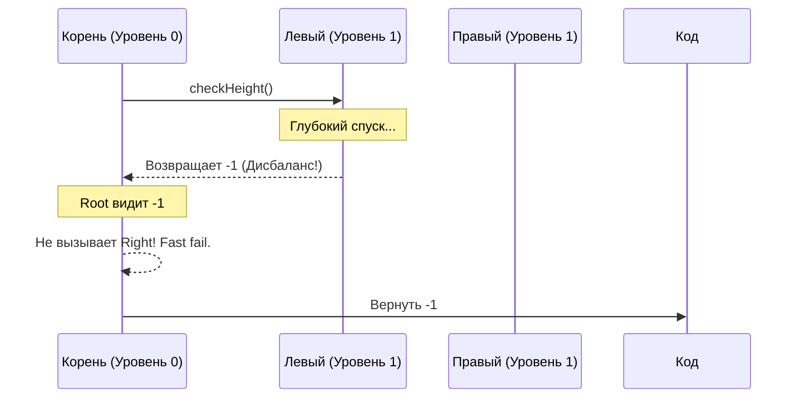

## Цена дисбаланса: Почему форма дерева имеет значение

В предыдущих задачах ([[3. Maximum Depth of Binary Tree]] и [[4. Diameter of Binary Tree]]) мы обходили бинарные деревья, не задумываясь об их форме. Но в реальной системной инженерии форма дерева — это вопрос жизни и смерти для производительности.

**Сбалансированное бинарное дерево (Balanced Binary Tree)** — это дерево, в котором высота левого и правого поддеревьев *любого* узла отличается не более чем на 1.

**Почему это критично?**
Любая операция в бинарном дереве поиска (поиск, вставка, удаление) зависит от его высоты. 
- Если дерево идеально сбалансировано, его высота $H = \log_2(N)$. Поиск среди миллиона элементов займет всего ~20 шагов.
- Если дерево вырождается (каждый узел имеет только одного потомка), оно превращается в связный список (Linked List). Высота становится $H = N$. Поиск среди миллиона элементов займет миллион шагов.

> [!info] Под капотом: Сравнение языков и баз данных
> В стандартной библиотеке C++ `std::map` реализована на базе Красно-черного дерева (Red-Black Tree), которое автоматически балансирует себя при каждой вставке. В Java класс `HashMap` при коллизиях в одной корзине (bucket) превращает связный список в сбалансированное дерево, чтобы гарантировать время поиска $O(\log N)$ вместо $O(N)$. 
> В Go встроенный тип `map` (под капотом это структура `hmap`) использует исключительно хеш-таблицы с цепочками переполнения, без фоллбэка на деревья. Однако сбалансированные деревья (B-Trees) активно используются в Go-бэкенде при разработке баз данных (например, `bbolt` или индексы `PostgreSQL`, с которыми мы работаем). Дисбаланс таких деревьев ведет к катастрофическому увеличению числа чтений с диска (Disk I/O) и промахам в кэше процессора (Cache Misses).

Задача LeetCode №110 требует написать алгоритм, который проверит, является ли данное дерево сбалансированным.

---

## Подход 1: Наивный Top-Down (Анти-паттерн)

Самое интуитивное решение — использовать уже знакомую нам функцию получения глубины дерева, вызывая её для левого и правого потомка каждого узла.
```go
// Вспомогательная функция для расчета высоты
func depth(node *TreeNode) int {
    if node == nil {
        return 0
    }
    return max(depth(node.Left), depth(node.Right)) + 1
}

// Наивный подход
func isBalancedNaive(root *TreeNode) bool {
    if root == nil {
        return true
    }
    
    leftHeight := depth(root.Left)
    rightHeight := depth(root.Right)
    
    // Проверяем текущий узел и рекурсивно проверяем детей
    return abs(leftHeight - rightHeight) <= 1 && 
           isBalancedNaive(root.Left) && 
           isBalancedNaive(root.Right)
}

func abs(x int) int {
    if x < 0 { return -x }
    return x
}
```

> [!warning] Ловушка / Gotcha
> Это решение выдаст правильный ответ, но вы провалите хардовое интервью.
> **Временная сложность:** $O(N^2)$ в худшем случае (когда дерево вырождено). 
> Проблема в многократном повторном вычислении: функция `depth` будет обходить одни и те же нижние узлы снова и снова для каждого родительского узла. Процессор будет выполнять колоссальную лишнюю работу, забивая кэши L1/L2 одними и теми же адресами памяти (Cache Thrashing), в то время как полезная работа стоит на месте.

*Примечание:* Обратите внимание, что мы написали свою функцию `abs(int) int`. Стандартная `math.Abs()` принимает и возвращает `float64`. Постоянное приведение типов (cast) `int` -> `float64` -> `int` съест дополнительные такты процессора. В Go-коде, чувствительном к производительности, для целых чисел пишут свои простые хелперы.

---

## Подход 2: Оптимальный Bottom-Up (Post-order DFS)

Чтобы сделать алгоритм $O(N)$, нам нужно вычислять высоту дерева и проверять балансировку **одновременно**, двигаясь снизу вверх. 
Мы используем обратный обход (Post-order DFS): сначала опрашиваем детей, затем принимаем решение на уровне родителя.

Если мы обнаруживаем, что где-то внизу поддерево не сбалансировано, мы немедленно прекращаем работу и прокидываем сигнал ошибки наверх (**Fast Fail**). В качестве сигнала ошибки (своеобразного флага) мы будем использовать значение `-1`, так как реальная высота дерева не может быть отрицательной.
```go
type TreeNode struct {
    Val   int
    Left  *TreeNode
    Right *TreeNode
}

func isBalanced(root *TreeNode) bool {
    // Если результат обхода не -1, дерево сбалансировано
    return checkHeight(root) != -1
}

// checkHeight возвращает высоту поддерева.
// Если поддерево не сбалансировано, немедленно возвращает -1.
func checkHeight(node *TreeNode) int {
    if node == nil {
        return 0 // Базовый случай: высота пустого дерева = 0
    }
    
    // 1. Проверяем левое поддерево
    leftHeight := checkHeight(node.Left)
    if leftHeight == -1 {
        return -1 // Fast fail: ошибка уже найдена внизу, прерываем обход
    }
    
    // 2. Проверяем правое поддерево
    rightHeight := checkHeight(node.Right)
    if rightHeight == -1 {
        return -1 // Fast fail
    }
    
    // 3. Проверяем баланс текущего узла
    // Если разница высот больше 1, сигнализируем о нарушении
    diff := leftHeight - rightHeight
    if diff < -1 || diff > 1 { // Избегаем функции abs для максимальной скорости
        return -1
    }
    
    // 4. Если все ОК, возвращаем честную высоту текущего узла
    if leftHeight > rightHeight {
        return leftHeight + 1
    }
    return rightHeight + 1
}
```

### Визуализация Fast Fail механизма



> [!info] Под капотом: Go ABI и регистры процессора
> Почему мы возвращаем `-1`, а не кортеж `(int, bool)` (высота, сбалансировано ли)?
> Технически, в Go возврат нескольких значений — это идиома. Начиная с Go 1.17 (переход на register-based ABI), компилятор Go возвращает значения не через стек, а через аппаратные регистры процессора. 
> Возврат `(int, bool)` поместил бы значения в регистры `RAX` и `RBX`. Это очень быстро.
> Однако возврат единственного `int` требует проверки только одного регистра `RAX`. Это дает микро-оптимизацию на уровне ассемблерных инструкций: вместо двух сравнений (проверка флага и чтение значения) мы делаем одно. В масштабах дерева с миллионами узлов подход с `-1` как Sentinel Value (сигнальным значением) экономит ценные такты CPU и делает код более компактным для Inlining-а компилятором.

### Оценка сложности
- **Время:** $O(N)$, где $N$ — количество узлов дерева. В лучшем и худшем случае каждый узел посещается ровно один раз. Благодаря механизму "Fast fail" (short-circuiting), алгоритм может завершиться значительно быстрее $O(N)$, если дисбаланс находится близко к корню.
- **Память:** $O(H)$, где $H$ — высота дерева. Затраты идут исключительно на фреймы стека горутины при рекурсии. В худшем случае (вырожденное дерево) это $O(N)$, в лучшем — $O(\log N)$. Никаких аллокаций в куче (Escape Analysis проходит чисто).

---

## Резюме для интервью

1. Всегда уточняйте определение: сбалансированное дерево — это то, где разница высот поддеревьев **каждого** узла не превышает 1. Разница между самым длинным и самым коротким путем от корня до листа может быть больше 1 (это не AVL-дерево).
2. Заранее упомяните наивный подход $O(N^2)$ и объясните, почему вы не будете его писать (многократный обход одних и тех же узлов разрушает кэш-линии процессора).
3. Используйте Post-order обход снизу-вверх, чтобы совместить вычисление высоты и проверку баланса.
4. Примените "Fast fail": если поддерево вернуло дисбаланс, прокидывайте ошибку наверх, минуя вычисления для соседних веток.

Мы научились оценивать структуру дерева. Но бинарные деревья раскрывают свой истинный потенциал только тогда, когда данные в них упорядочены (Binary Search Tree — BST). Переходим к одной из самых важных задач, которая проверяет фундаментальное понимание структур данных: [[6. Validate BST]].