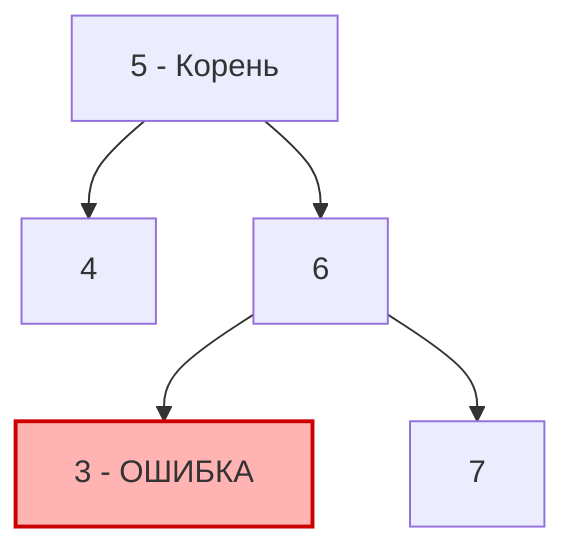

## От структуры к порядку: Binary Search Tree

В предыдущих статьях мы рассматривали бинарные деревья как обычные контейнеры для данных, фокусируясь на их форме (например, в [[5. Balanced Binary Tree]]). Теперь мы переходим к семантике. 

**Бинарное дерево поиска (Binary Search Tree, BST)** — это фундаментальная структура данных, на которой базируются индексы реляционных БД (B-Trees) и различные in-memory хранилища. Главное свойство BST: для *любого* узла все значения в его **левом поддереве** строго меньше значения самого узла, а все значения в его **правом поддереве** строго больше.

Задача "Validate Binary Search Tree" (LeetCode №98) просит проверить, является ли заданное бинарное дерево валидным BST. Это одна из самых коварных задач на собеседованиях, на которой "сыплются" многие кандидаты из-за одной классической ловушки.

---

## Ловушка локальной проверки (The Local Validation Trap)

Самая частая ошибка кандидатов (особенно уровня Junior/Middle) — это написать рекурсию, которая проверяет только непосредственных детей текущего узла:
```go
// АНТИ-ПАТТЕРН! ТАК ПИСАТЬ НЕЛЬЗЯ!
func isValidBSTNaive(node *TreeNode) bool {
    if node == nil { return true }
    if node.Left != nil && node.Left.Val >= node.Val { return false }
    if node.Right != nil && node.Right.Val <= node.Val { return false }
    return isValidBSTNaive(node.Left) && isValidBSTNaive(node.Right)
}
```

Почему это не работает? Посмотрим на дерево:



Код выше скажет, что это дерево валидно! 
- Узел `5`: `4 < 5` и `6 > 5` (ОК)
- Узел `6`: `3 < 6` и `7 > 6` (ОК)

Но по правилам BST, **все** узлы в правом поддереве корня `5` должны быть больше `5`. Узел `3` находится справа от `5`, но он меньше. Дерево инвалидно!

---

## Подход 1: Top-Down DFS с передачей границ (Min/Max Boundaries)

Чтобы решить проблему глобальной валидации, мы должны передавать ограничения сверху вниз. Когда мы идем влево, мы обновляем верхнюю границу (максимум). Когда идем вправо — нижнюю (минимум).

> [!warning] Ловушка / Gotcha: Границы типов в Go
> Если вы решите использовать `math.MinInt` и `math.MaxInt` для инициализации границ, будьте осторожны! В LeetCode значения узлов (`Val`) могут быть равны минимальному или максимальному значению 32-битного числа (`math.MinInt32`). 
> Если вы работаете на 64-битной архитектуре (где `int` в Go — это 64 бита), использование `math.MinInt64` сработает. Но идиоматичный, архитектурно-независимый и production-ready способ в Go — использовать **указатели на узлы** (или указатели на `int`), чтобы элегантно обрабатывать отсутствие границы (бесконечность).

### Идиоматичное решение (с указателями)
```go
type TreeNode struct {
    Val   int
    Left  *TreeNode
    Right *TreeNode
}

func isValidBST(root *TreeNode) bool {
    // Передаем nil как отсутствие ограничений (бесконечность)
    return validate(root, nil, nil)
}

func validate(node, minNode, maxNode *TreeNode) bool {
    if node == nil {
        return true
    }
    
    // Проверяем нарушение границ
    if minNode != nil && node.Val <= minNode.Val {
        return false
    }
    if maxNode != nil && node.Val >= maxNode.Val {
        return false
    }
    
    // Идем влево: верхняя граница становится текущим узлом
    // Идем вправо: нижняя граница становится текущим узлом
    return validate(node.Left, minNode, node) && 
           validate(node.Right, node, maxNode)
}
```

> [!info] Под капотом: Аллокации и Escape Analysis
> Передача указателей `minNode` и `maxNode` в Go здесь абсолютно бесплатна с точки зрения сборщика мусора (GC). Мы передаем указатели на *уже существующие* в куче узлы дерева. Никаких новых аллокаций не происходит. Весь overhead заключается только в росте стека вызовов горутины, что дает сложность по памяти `O(H)`, где `H` — высота дерева.

---

## Подход 2: In-Order Traversal (Симметричный обход)

Если вы вспомните теорию из статьи [[1. Теория. Деревья]], то у BST есть магическое свойство: **In-Order обход (Лево -> Корень -> Право) всегда выдает строго возрастающую последовательность элементов**.

Следовательно, нам не нужно хранить весь массив обойденных элементов. Достаточно помнить только **предыдущее значение** и проверять, что текущее значение строго больше него.

### Решение через итеративный In-Order DFS (эмуляция стека)

Рекурсивный In-Order с указателем `prev` тоже работает, но на хардовых секциях ценится умение писать итеративные обходы (чтобы не убить стек горутины на вырожденном дереве в 100,000 узлов).
```go
func isValidBSTIterative(root *TreeNode) bool {
    var stack []*TreeNode
    curr := root
    
    // Используем указатель для хранения предыдущего значения
    // nil означает, что мы еще не посетили ни одного узла
    var prev *TreeNode 
    
    for curr != nil || len(stack) > 0 {
        // Уходим максимально влево
        for curr != nil {
            stack = append(stack, curr)
            curr = curr.Left
        }
        
        // Pop из стека
        curr = stack[len(stack)-1]
        stack = stack[:len(stack)-1]
        
        // Главная проверка: текущий элемент должен быть больше предыдущего
        if prev != nil && curr.Val <= prev.Val {
            return false
        }
        prev = curr // Обновляем prev
        
        // Переходим к правому поддереву
        curr = curr.Right
    }
    
    return true
}
```

> [!tip] Собеседование
> Какой подход выбрать на интервью?
> - **Top-Down (с передачей границ):** Часто отрабатывает быстрее на *инвалидных* деревьях, так как механизм "Fast Fail" срабатывает сразу при спуске, не дожидаясь полного спуска влево.
> - **In-Order:** Логически проще для понимания, если вы хорошо знаете паттерны обхода.
> В идеале нужно озвучить оба: сказать, что In-Order дает отсортированный массив, но написать Top-Down рекурсию, так как она занимает меньше строк кода и легче читается.

### Сложность обоих подходов
- **Время:** `O(N)`, где `N` — количество узлов. В худшем случае (валидное дерево) придется обойти все узлы.
- **Память:** `O(H)`, где `H` — высота дерева. В рекурсии это стек вызовов, в итеративном — слайс `stack`. Для сбалансированного дерева это `O(log N)`, для вырожденного — `O(N)`.

## Краевые случаи (Edge Cases)

1. **Дубликаты:** По классическому определению LeetCode (и математики), BST **не содержит дубликатов**. Значения строго меньше (`<`) или строго больше (`>`). Если вам на интервью говорят, что дубликаты разрешены (например, слева могут быть равные значения), вам придется использовать `<=`, но обязательно уточните это у интервьюера!
2. **Пустое дерево:** `root == nil` считается валидным BST. Наш код корректно возвращает `true`.
3. **Дерево из одного узла:** Возвращает `true`.

Понимание свойства In-Order обхода для BST открывает двери к целому классу задач. Если мы знаем, что обход выдает отсортированный массив, мы можем легко находить элементы по их порядковому номеру, не сохраняя само дерево в массив. Этот паттерн мы применим в следующей задаче: [[7. Kth Smallest Element in BST]].