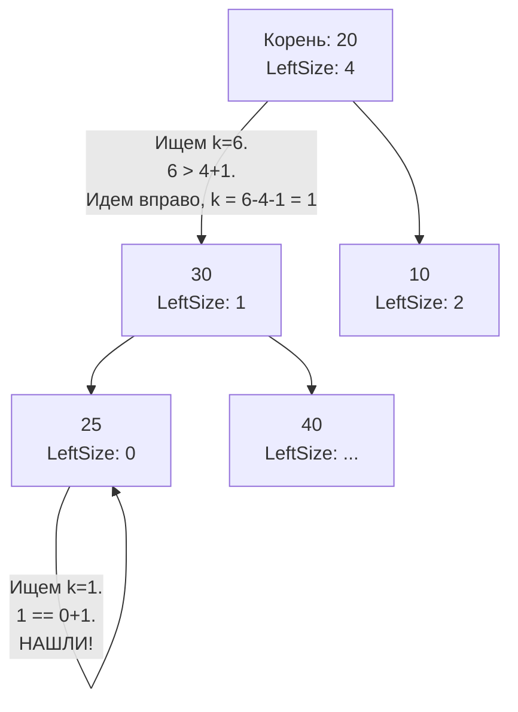

## Магия In-Order: Поиск K-го наименьшего элемента

В предыдущей статье [[6. Validate BST]] мы выяснили главное архитектурное свойство бинарного дерева поиска: **In-Order обход (Симметричный обход: Лево -> Корень -> Право) посещает узлы в строго возрастающем порядке**.

Задача "Kth Smallest Element in a BST" (LeetCode №230) предлагает найти $k$-й по величине (наименьший) элемент в BST. $k$ имеет 1-индексацию (то есть $k=1$ — это самый маленький элемент).

На интервью уровня Junior часто ожидают простого применения рекурсии. Но для Middle+/Senior позиций эта задача превращается в разговор о потреблении памяти, раннем выходе (Early Exit) и модификации структур данных под высокие нагрузки (System Design).

---

## Подход 1: Наивный (Полный рекурсивный обход)

Первое, что приходит в голову — обойти всё дерево, сложить значения в слайс и вернуть `slice[k-1]`.
```go
func kthSmallestNaive(root *TreeNode, k int) int {
    var result []int
    
    var inorder func(node *TreeNode)
    inorder = func(node *TreeNode) {
        if node == nil {
            return
        }
        inorder(node.Left)
        result = append(result, node.Val)
        inorder(node.Right)
    }
    
    inorder(root)
    return result[k-1]
}
```

> [!warning] Ловушка / Gotcha: Катастрофа в Production
> Представьте, что в вашем дереве (например, in-memory индексе) 10 миллионов записей, а пользователь запрашивает $k=5$. 
> Этот код обойдет **все 10 миллионов узлов**. Он создаст на куче (Heap) слайс `result` огромного размера, вызовет множество реаллокаций памяти под капотом `append`, заставит Garbage Collector потеть, собирая мусор после отработки запроса. 
> Временная сложность и сложность по памяти будут $O(N)$. На интервью такой код приведет к провалу, если вы не назовете его "наивным черновиком".

---

## Подход 2: Итеративный DFS с ранним выходом (Оптимальный для LeetCode)

Нам не нужно всё дерево. Как только мы посетили $k$-й элемент в порядке возрастания, мы должны немедленно прервать выполнение и вернуть результат. 

Лучший способ контролировать этот процесс — написать **итеративный In-Order DFS**, эмулируя стек вызовов вручную. Это дает нам полный контроль над циклом.
```go
type TreeNode struct {
    Val   int
    Left  *TreeNode
    Right *TreeNode
}

func kthSmallest(root *TreeNode, k int) int {
    // В идеале можно преаллоцировать стек, если мы знаем высоту H: 
    // stack := make([]*TreeNode, 0, H)
    var stack []*TreeNode
    curr := root
    
    // Крутимся, пока есть текущий узел или стек не пуст
    for curr != nil || len(stack) > 0 {
        // 1. Уходим максимально влево до самого маленького элемента
        for curr != nil {
            stack = append(stack, curr)
            curr = curr.Left
        }
        
        // 2. Достаем узел из стека (Pop)
        curr = stack[len(stack)-1]
        stack = stack[:len(stack)-1]
        
        // 3. "Посещаем" узел: уменьшаем счетчик k
        k--
        if k == 0 {
            return curr.Val // Ранний выход (Early Exit)
        }
        
        // 4. Переходим в правое поддерево
        curr = curr.Right
    }
    
    return -1 // Достижимо только если k больше количества узлов в дереве
}
```

### Mechanical Sympathy: Почему это работает быстро?

- **Время:** В лучшем случае (когда $k$ мало) мы спускаемся только по левой ветке. Спуск занимает $O(H)$ шагов (где $H$ — высота дерева), плюс $k$ шагов обхода. Итоговая временная сложность: $O(H + k)$. Если $k \ll N$, мы экономим гигантское количество тактов CPU.
- **Память:** $O(H)$. Максимальный размер слайса `stack` равен высоте дерева. Для сбалансированного дерева из миллиона узлов стек будет содержать около 20 элементов. Это крошечная аллокация, которая отработает молниеносно.

---

## Подход 3: Senior Level. Follow-up с модификацией дерева

На серьезных секциях (особенно в компаниях FAANG / BigTech) вам обязательно зададут **Follow-up вопрос**:
*"Что если BST часто модифицируется (вставки/удаления), и операция нахождения k-го элемента вызывается очень часто? Как оптимизировать время поиска до $O(H)$?"*

Здесь проверяют вашу способность к System Design. Текущий алгоритм $O(H + k)$ работает за линейное время в худшем случае (если $k \approx N$). Чтобы сделать поиск чисто логарифмическим, нам нужно **изменить саму структуру данных**.

Мы превращаем наше дерево в **Order Statistic Tree (Дерево порядковой статистики)**.

### Идея: Хранение размера поддерева

Мы добавляем в каждый узел `TreeNode` дополнительное поле `LeftSize` — количество элементов в его левом поддереве.
```go
type AugmentedTreeNode struct {
    Val      int
    LeftSize int // Количество узлов в левом поддереве
    Left     *AugmentedTreeNode
    Right    *AugmentedTreeNode
}
```

Как это ускоряет поиск?
Когда мы стоим в узле, мы смотрим на его `LeftSize`.
1. Если $k == LeftSize + 1$, значит текущий корень и есть наш $k$-й элемент! Мы его нашли.
2. Если $k \le LeftSize$, значит искомый элемент точно находится в левом поддереве. Мы идем влево, $k$ не меняется.
3. Если $k > LeftSize + 1$, значит элемент находится в правом поддереве. Мы идем вправо, но теперь мы ищем $(k - LeftSize - 1)$-й элемент.


> [!tip] Собеседование
> Реализовывать Order Statistic Tree на доске обычно не просят (это займет слишком много времени из-за логики обновления счетчиков при вставке и ребалансировке AVL/Red-Black дерева). Но **рассказать** этот концепт голосом — обязательное условие для получения оценки "Strong Hire". 
> Этот же принцип используется в базах данных. Когда вы делаете `SELECT ... OFFSET k LIMIT 1` по индексу (B-Tree), база данных (если не использует оптимизации) вынуждена физически просканировать и пропустить $k$ элементов, что делает большой `OFFSET` очень медленным.

## Итоги

1. **In-Order обход** BST выдает элементы по возрастанию. Это основа для любой задачи, связанной с поиском $k$-го наименьшего или наибольшего (для наибольшего — обходим `Right -> Root -> Left`).
2. **Никогда не обходите дерево целиком**, если вам нужен только один элемент. Итеративный стек позволяет прервать обход (Early Exit) ровно в нужный момент.
3. **Follow-up:** Если операции чтения происходят при высоких нагрузках, мы размениваем память (дополнительное поле `LeftSize` в каждом узле) и время записи (поддержание актуального счетчика при вставках) на сверхбыстрое время чтения $O(H)$. Это классический трейдофф в архитектуре баз данных.

До сих пор мы работали с деревьями как с живыми объектами в оперативной памяти (в куче). Но что происходит, когда нам нужно передать это дерево по сети (например, через gRPC) или сохранить на диск? Мы не можем просто передать указатели. Об этом в следующей статье — одной из самых сложных задач на LeetCode по уровню Hard: [[8. Serialize and Deserialize Binary Tree]].