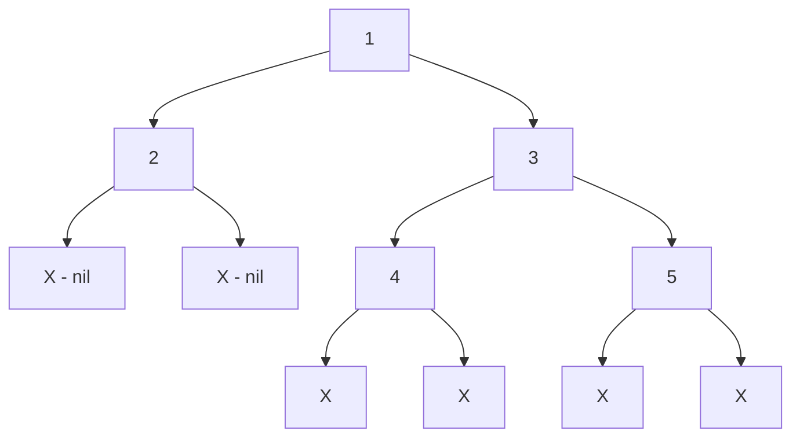

## Указатели не летают по сети: Зачем нужна сериализация

До этого момента мы работали с деревьями исключительно в оперативной памяти (RAM) текущего процесса. Узлы были связаны **указателями** — физическими (точнее, виртуальными) адресами ячеек памяти в куче нашего Go-приложения (например, `0xc00008a010`).

Но что, если нам нужно:
1. Сохранить состояние дерева в базу данных (на диск)?
2. Передать дерево соседнему микросервису по сети через gRPC или REST?
3. Отправить дерево в очередь сообщений (Kafka/RabbitMQ)?

**Указатель нельзя передать по сети.** В другом процессе по адресу `0xc00008a010` будет лежать мусор или данные другой программы. Следовательно, нам нужно превратить трехмерный граф объектов с указателями в плоскую последовательность байтов (или строку). Этот процесс называется **Сериализацией** (Flattening / Marshalling). Обратный процесс — **Десериализацией**.

Задача "Serialize and Deserialize Binary Tree" (LeetCode №297, уровень Hard) требует спроектировать алгоритм для упаковки и распаковки бинарного дерева. Это классическая архитектурная задача.

---

## Архитектурный выбор: Почему не `encoding/json`?

На собеседовании кандидаты часто спрашивают: *"Почему бы просто не прогнать структуру через стандартный пакет `json.Marshal`?"*

Технически, в Go это сработает (если сделать поля публичными). Но давайте посмотрим на результат:

```json
{
  "Val": 1,
  "Left": {
    "Val": 2,
    "Left": null,
    "Right": null
  },
  "Right": {
    "Val": 3,
    "Left": null,
    "Right": null
  }
}
```

> [!warning] Ловушка / Gotcha: Оверхед сериализации
> Для дерева из трех узлов мы сгенерировали около 150 байт JSON-строки. Из них 90% — это служебные ключи (`"Val"`, `"Left"`, `"Right"`, кавычки, пробелы). 
> В высоконагруженном бэкенде, передавая миллионы узлов, вы забьете пропускную способность сети (Network Bandwidth) и сожжете CPU на парсинге ключей словаря. Для внутренних протоколов нужна максимально компактная бинарная или строковая репрезентация.

Мы можем сделать формат намного плотнее, опираясь исключительно на порядок обхода: `1,2,X,X,3,X,X`.

---

## Подход: Pre-Order DFS (Прямой обход)

Существует два эффективных способа сериализации деревьев: через BFS (по уровням) и через DFS (в глубину). На практике **Pre-order DFS (Корень -> Лево -> Право)** используется чаще, так как он тривиально десериализуется рекурсией без использования дополнительных очередей памяти.

**Алгоритм сериализации:**
1. Если узел пустой (`nil`), записываем специальный маркер, например `X`, и разделитель (запятую).
2. Если узел существует, записываем его значение и разделитель.
3. Рекурсивно сериализуем левое поддерево.
4. Рекурсивно сериализуем правое поддерево.

**Пример:**

Pre-order сериализация даст нам строку: `1,2,X,X,3,4,X,X,5,X,X,`

### Mechanical Sympathy: Построение строк в Go

Строки в Go неизменяемы (immutable). Операция конкатенации `str += "a"` каждый раз выделяет новый блок памяти и копирует туда старую строку. В цикле это дает сложность аллокаций $O(N^2)$.

> [!info] Под капотом: strings.Builder
> Для склеивания строк в Go существует `strings.Builder`. Внутри него лежит обычный байтовый слайс `[]byte`. Методы `WriteString` работают как обычный `append`. Когда мы вызываем `sb.String()`, Go использует магию `unsafe.Pointer`, чтобы конвертировать `[]byte` в `string` без копирования памяти (Zero-copy).

### Идиоматичный код на Go
```go
import (
    "strconv"
    "strings"
)

type TreeNode struct {
    Val   int
    Left  *TreeNode
    Right *TreeNode
}

type Codec struct{}

func Constructor() Codec {
    return Codec{}
}

// Serializes a tree to a single string.
func (this *Codec) serialize(root *TreeNode) string {
    var sb strings.Builder
    
    var dfs func(*TreeNode)
    dfs = func(node *TreeNode) {
        if node == nil {
            sb.WriteString("X,")
            return
        }
        
        // Записываем значение узла и разделитель
        sb.WriteString(strconv.Itoa(node.Val))
        sb.WriteString(",")
        
        // Спускаемся дальше
        dfs(node.Left)
        dfs(node.Right)
    }
    
    dfs(root)
    return sb.String()
}
```

---

## Десериализация: От строки к графу

Процесс распаковки еще интереснее. Мы берем нашу строку `1,2,X,X,3,4,X,X,5,X,X,`, разбиваем ее по запятым в массив токенов и начинаем читать слева направо.

Мы используем глобальный (в рамках функции) указатель (или индекс) для отслеживания текущего читаемого токена.

```go
// Deserializes your encoded data to tree.
func (this *Codec) deserialize(data string) *TreeNode {
    // Разбиваем строку на слайс токенов
    tokens := strings.Split(data, ",")
    idx := 0 // Указатель на текущий читаемый токен
    
    var dfs func() *TreeNode
    dfs = func() *TreeNode {
        // Защита от выхода за пределы (хотя при валидной строке не произойдет)
        if idx >= len(tokens) {
            return nil
        }
        
        val := tokens[idx]
        idx++ // Сдвигаем указатель
        
        // Базовый случай: наткнулись на маркер пустого узла
        if val == "X" || val == "" {
            return nil
        }
        
        // Конвертируем строку в число и создаем узел
        num, _ := strconv.Atoi(val)
        node := &TreeNode{Val: num}
        
        // Рекурсивно собираем левое и правое поддерево
        // Порядок вызовов ОБЯЗАТЕЛЬНО должен совпадать с сериализацией (Pre-order)
        node.Left = dfs()
        node.Right = dfs()
        
        return node
    }
    
    return dfs()
}
```

> [!tip] Собеседование: Хардкорная оптимизация десериализации
> Использование `strings.Split(data, ",")` — это быстрый и удобный способ для LeetCode. Но если мы работаем на позиции System Architect, мы должны заметить проблему: `strings.Split` для дерева из 10 миллионов узлов выделит в куче новый слайс размером в 10 миллионов строковых заголовков (`reflect.StringHeader`), что создаст гигантскую нагрузку на Garbage Collector.
> 
> **Оптимизированный подход (Zero-allocation reader):**
> Вместо `Split`, мы должны написать итератор (Scanner), который будет искать индекс следующей запятой через `strings.IndexByte(data[offset:], ',')` и отрезать подстроки "на лету" без выделения огромного массива токенов. 
> Если вы упомянете этот нюанс на системном интервью — это однозначный маркер Senior-инженера.

### Оценка сложности
- **Время:** $O(N)$ для обоих процессов. Мы посещаем каждый узел (и обрабатываем каждый символ строки) ровно один раз. Разбор строки через `strconv.Atoi` также работает за линейное время от длины числа.
- **Память:** $O(N)$. При сериализации мы аллоцируем память под строку в `strings.Builder`. При десериализации (в нашем LeetCode-решении) мы аллоцируем слайс строк через `Split`. Также добавляется $O(H)$ на глубину стека рекурсии, но $O(N)$ для строки доминирует.

---

## Итоги

1. **Сериализация** — обязательный процесс для передачи сложных графовых структур данных (вроде деревьев) через плоские каналы (сеть, файловая система, пайпы).
2. **Pre-order DFS** — самый лаконичный способ плоского представления дерева. За счет сохранения маркеров `nil` (например, `X`), структура дерева фиксируется однозначно, и нам не нужны скобки или сложный синтаксис JSON.
3. В Go склеивание строк в цикле должно происходить **исключительно** через `strings.Builder`. Использование оператора `+` приведет к деградации производительности до $O(N^2)$ и переполнению памяти.

Деревья — это мощно. Но бинарное дерево — это лишь частный случай более глобальной математической концепции. Что если у узла может быть не два, а произвольное количество детей? Что если дети могут ссылаться обратно на родителей или образовывать кольцевые зависимости? Мы покидаем уютный мир иерархий и переходим в хаотичный мир сетей, маршрутов и зависимостей. Открываем новый, важнейший раздел: [[1. Теория. Графы]].