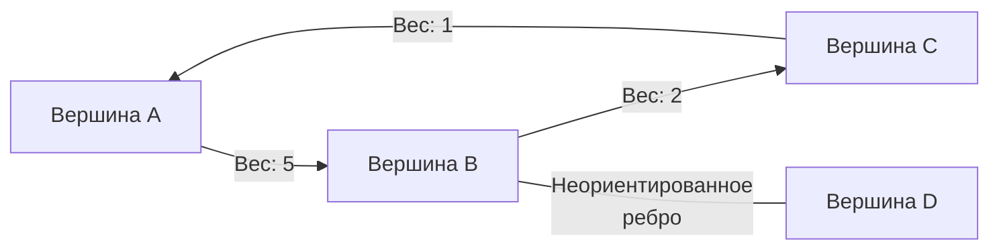
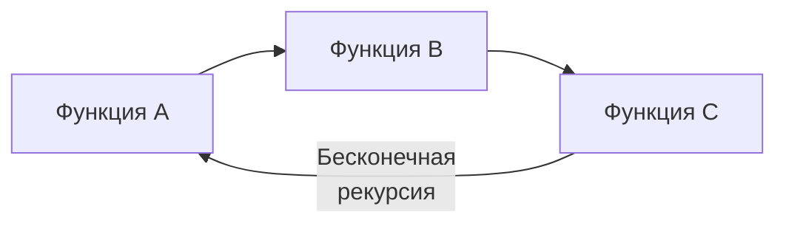

## От иерархий к сетям: Зачем нужны графы?

В разделе про деревья мы работали со строгими иерархиями: от корня к листьям. Но реальный мир редко бывает иерархичным. 
- Микросервисы, вызывающие друг друга (Trace ID в Jaeger).
- Сетевая маршрутизация TCP/IP (OSPF, BGP).
- Взаимные блокировки в транзакциях БД (Deadlock detection).
- Социальные сети и графы рекомендаций.
- Сборка мусора в Go (GC): поиск недостижимых объектов — это обход направленного графа ссылок.

Всё это — **Графы (Graphs)**. Если дерево — это река, текущая в одном направлении, то граф — это система озер, соединенных каналами, где вода может течь куда угодно, в том числе образуя водовороты (циклы).

> [!info] Под капотом: Дерево — это частный случай графа
> С точки зрения дискретной математики, бинарное дерево — это связный направленный ациклический граф (Directed Acyclic Graph, DAG), в котором количество ребер ровно на одно меньше количества вершин ($E = V - 1$), и в каждый узел (кроме корня) входит ровно одно ребро. 
> Как только вы добавляете вторую связь к узлу или создаете цикл, дерево превращается в полноценный граф.

---

## Анатомия графа

Граф состоит из двух множеств:
1. **Вершины (Vertices / Nodes, $V$)**: Сами объекты (пользователи, сервера, города).
2. **Ребра (Edges, $E$)**: Связи между объектами.

Графы классифицируют по двум главным свойствам:
- **Направленность**:
  - *Неориентированный (Undirected)*: Связь двусторонняя (как дружба).
  - *Ориентированный (Directed / Digraph)*: Связь односторонняя (как подписка: А подписан на Б).
- **Вес**:
  - *Невзвешенный (Unweighted)*: Все связи равны (расстояние всегда = 1).
  - *Взвешенный (Weighted)*: Каждая связь имеет стоимость (задержка в миллисекундах сети, цена билета на самолет).


---

## Представление графа в памяти Go

Процессор не понимает абстрактных кружочков со стрелочками. Нам нужно уложить граф в линейную память (RAM). Существует три классических подхода, и выбор структуры кардинально меняет производительность (Big O) алгоритмов.

### 1. Матрица смежности (Adjacency Matrix)

Это двумерный массив `N x N`, где `matrix[i][j]` хранит вес ребра от вершины `i` к `j` (или 1/0 для невзвешенного графа).
```go
// Граф на 4 вершины
matrix := [][]int{
    {0, 1, 0, 0}, // Из 0 есть путь в 1
    {1, 0, 1, 1}, // Из 1 есть путь в 0, 2, 3
    {0, 1, 0, 0},
    {0, 1, 0, 0},
}
```

- **Время проверки наличия ребра:** $O(1)$. Быстрее не бывает.
- **Память:** $O(V^2)$. 
- **Когда использовать:** Только для очень "плотных" графов (Dense Graphs), где количество ребер $E \approx V^2$. 

> [!warning] Ловушка / Gotcha
> Если в вашем графе 100,000 пользователей (вершин), матрица смежности займет $100,000 \times 100,000 \times 8$ байт $\approx 80$ Гигабайт оперативной памяти. Большую часть этой памяти будут занимать нули. Это классическая ошибка Out Of Memory (OOM) на собеседованиях.

### 2. Список смежности (Adjacency List)

Это массив (или хэш-таблица), где для каждой вершины хранится список её соседей. Именно это представление используется в **95% задач на бэкенд-интервью и LeetCode**.

Идиоматично на Go это выглядит двумя способами.

**Способ А: Через `map` (Когда вершины — это строки, UUID или разреженные ID)**
```go
graph := make(map[string][]string)
graph["user-1"] = []string{"user-2", "user-3"}
graph["user-2"] = []string{"user-1"}
```

**Способ Б: Через `slice` (Когда вершины пронумерованы от 0 до $V-1$)**
```go
// graph[0] хранит соседей вершины 0
graph := make([][]int, numVertices)
graph[0] = []int{1, 2}
graph[1] = []int{0, 3}
```

- **Память:** $O(V + E)$. Максимально экономно.
- **Обход соседей:** Мы итерируемся только по существующим связям, не тратя время на нули.

---

## Mechanical Sympathy: Мапа или Слайс?

На Middle+/Senior собеседовании вас спросят: *"Почему `[][]int` работает в разы быстрее, чем `map[int][]int`, если асимптотическая сложность $O(V+E)$ одинаковая?"*

Это вопрос на понимание кэш-линий и внутреннего устройства Go.

1. **Overhead (Накладные расходы)**: 
   Слайс слайсов — это просто непрерывный кусок памяти с заголовками `reflect.SliceHeader` (по 24 байта). Доступ к `graph[5]` — это простая арифметика указателей (базовый адрес + `5 * 24`).
   Тип `map` в Go (под капотом структура `hmap`) — это сложный массив "бакетов" (buckets). Чтобы получить `map[5]`, Go должен вычислить хэш от `5`, найти нужный бакет по битовой маске, обойти цепочку переполнения (overflow pointers) и сравнить ключи. Это сотни инструкций процессора вместо двух.
2. **Локальность кэша (Cache Locality)**:
   При создании `[][]int` базовые массивы внутренних слайсов часто аллоцируются кучно (особенно если заранее задать capacity). При обходе процессору легко подгружать их в L1/L2 кэш.
   При вставке элементов в `map`, значения разбрасываются по памяти псевдослучайным образом (зависит от хэш-функции). Обход соседей через мапу вызывает постоянные промахи кэша (Cache Misses).

> [!tip] Собеседование
> **Золотое правило LeetCode на Go:** Если ключи графа — это строки или случайные ID, первым проходом преобразуйте их в целые числа $0 \dots N-1$ (через вспомогательную `map[string]int`), а сам граф постройте через `[][]int`. Это ускорит алгоритмы вроде DFS/BFS на порядок и спасет вас от Time Limit Exceeded (TLE) на жестких тестах.

### 3. Список ребер (Edge List)

Это просто плоский массив структур, представляющих связи.
```go
type Edge struct {
    From   int
    To     int
    Weight int
}
edges := []Edge{{0, 1, 5}, {1, 2, -1}}
```
Используется редко для общего обхода, но критически важен для специфичных алгоритмов: поиска минимального остовного дерева (алгоритм Крускала) или поиска кратчайшего пути с отрицательными весами (алгоритм Беллмана-Форда).

---

## Главный враг графов: Циклы

В бинарном дереве мы могли бездумно спускаться вниз: `node = node.Left`. Мы знали, что рано или поздно упремся в `nil`.
В графах этот подход приведет к катастрофе. Вершина A указывает на B, B указывает на C, а C указывает обратно на A. 


Если мы запустим наивный DFS в таком графе, горутина мгновенно исчерпает стек, и приложение упадет с неуловимой `panic: stack overflow`.

**Как с этим бороться?**
Необходимо отслеживать состояние. В графах всегда вводят дополнительную структуру — множество посещенных вершин (`visited`).
- В Go это обычно слайс булевых значений `visited := make([]bool, N)` (если ключи $0 \dots N-1$) или хэш-таблица `visited := make(map[int]bool)`.
- Если `visited[node] == true`, мы немедленно прекращаем обход этой ветки.

## Как распознать граф на собеседовании?

Графовые задачи часто маскируют под реальные сценарии. Если вы слышите в условии:
- *"Можно ли добраться из точки А в точку Б?"* (Связность, DFS)
- *"Найдите кратчайший путь / минимальное количество шагов"* (BFS, Дейкстра)
- *"Есть зависимости между задачами (Course Schedule), можно ли выполнить их все?"* (Топологическая сортировка, поиск циклов)
- *"Найдите количество островов на матрице / Сетке (Grid)"* (Да, 2D-матрица с ячейками — это граф, где ребра — это движения вверх/вниз/влево/вправо).

Имея базовое представление о структуре, мы можем переходить к самым частым операциям. Первое, с чем мы столкнемся — это задачи на поиск островов и выявление тупиковых зацикливаний. Все эти алгоритмы разбираются в статье: [[2. Компоненты и циклы]].