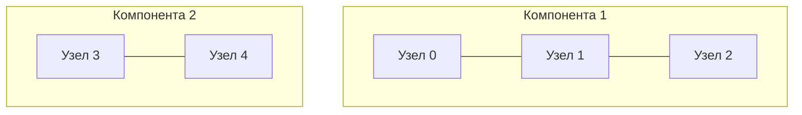
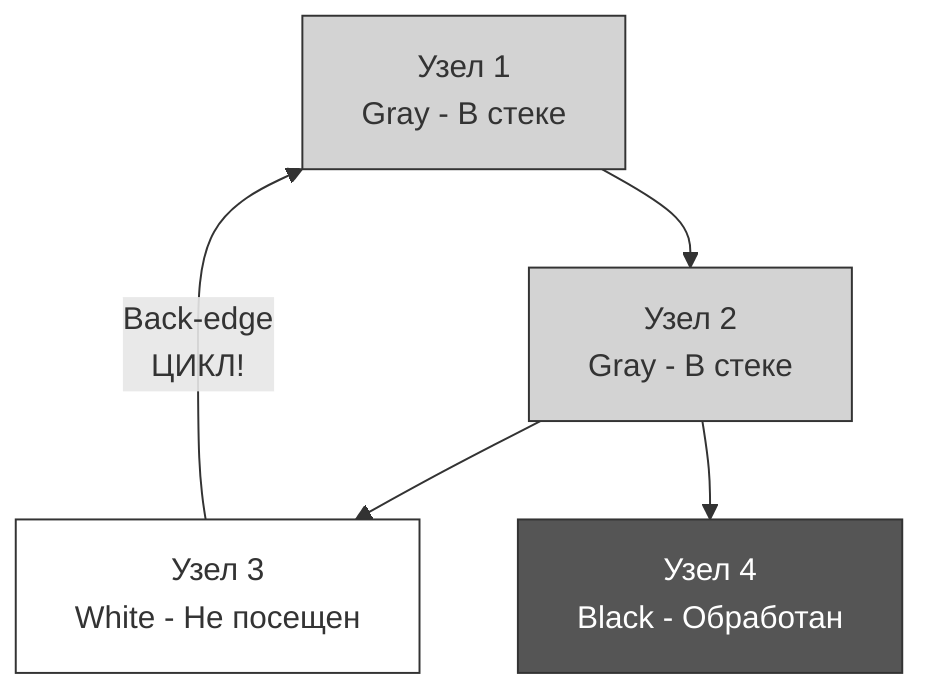

## Фундамент анализа графов: Компоненты и Циклы

В прошлой статье [[1. Теория. Графы]] мы определились с тем, как эффективно хранить графы в памяти Go (`[][]int` вместо `map`), чтобы не злить кэш процессора. Теперь перейдем к двум самым важным свойствам любой сетевой структуры: **Связности** и **Ацикличности**.

В мире бэкенда эти абстракции решают вполне конкретные задачи:
- **Компоненты связности**: Разделена ли наша P2P-сеть или кластер баз данных (Network Partition/Split Brain)? Могут ли микросервисы достучаться друг до друга?
- **Поиск циклов**: Нет ли у нас Deadlock-а в транзакциях? Не создали ли мы кольцевую зависимость (Circular Dependency) при внедрении зависимостей (DI)? Не уйдет ли наш роутер в бесконечный цикл при пересылке пакета?

На собеседованиях 80% графовых задач сводятся к выявлению одной из этих двух характеристик.

---

## 1. Компоненты связности (Connected Components)

**Компонента связности** в неориентированном графе — это подмножество вершин, где из любой вершины можно добраться до любой другой, и к этому подмножеству нельзя добавить больше ни одной вершины (оно максимально).

Если граф разорван на части — у него несколько компонент связности.

### Алгоритм: Покраска или Заливка (Flood Fill)

Задача поиска всех компонент сводится к тому, чтобы "закрасить" все достижимые узлы одним цветом, затем найти первый незакрашенный узел и начать красить вторым цветом, и так далее.


### Идиоматичная реализация на Go

Решим типовую подзадачу: дан $N$ (количество узлов от 0 до $N-1$) и список неориентированных ребер. Нужно найти количество компонент.

```go
func countComponents(n int, edges [][]int) int {
    // 1. Строим список смежности
    graph := make([][]int, n)
    for _, edge := range edges {
        u, v := edge[0], edge[1]
        graph[u] = append(graph[u], v)
        graph[v] = append(graph[v], u)
    }

    // 2. Массив посещенных вершин
    visited := make([]bool, n)
    components := 0

    // Функция обхода (DFS)
    var dfs func(node int)
    dfs = func(node int) {
        visited[node] = true
        for _, neighbor := range graph[node] {
            if !visited[neighbor] {
                dfs(neighbor)
            }
        }
    }

    // 3. Ищем непосещенные узлы
    for i := 0; i < n; i++ {
        if !visited[i] {
            components++ // Нашли новую изолированную группу
            dfs(i)       // Закрашиваем всю группу
        }
    }

    return components
}
```

> [!info] Под капотом: Плотность упаковки булевых массивов
> Тип `bool` в Go занимает 1 байт (8 бит), хотя логически требует лишь 1 бит. Массив `make([]bool, n)` из 100,000 элементов займет 100 КБ, что легко помещается в L2-кэш процессора.
> Если вы хотите показать хардкорный System Design на интервью при $N > 10^8$, можно упомянуть реализацию `visited` через **Bitset** (`[]uint64`), где каждый бит отвечает за свой узел. Это сократит потребление памяти в 8 раз и ускорит сканирование непосещенных узлов через битовые операции. Но для LeetCode обычного `[]bool` достаточно.

---

## 2. Поиск циклов (Cycle Detection)

Если компоненты связности чаще ищут в неориентированных графах, то циклы — головная боль **ориентированных** графов (Directed Graphs).

В неориентированном графе цикл найти тривиально: если во время обхода мы уткнулись в уже посещенную вершину (и это не тот узел, откуда мы только что пришли) — это цикл.

В **ориентированном графе** всё сложнее. Схождение двух разных путей в один узел не означает цикл. Цикл возникает только тогда, когда мы встречаем так называемое **Back-edge (Обратное ребро)** — ребро, указывающее на предка, который *в данный момент находится в стеке вызовов*.

### Метод Трех Цветов (White-Gray-Black)

Для ориентированных графов одного флага `visited` недостаточно. Нам нужны состояния:
1 - **White (0)**: Вершина еще не посещалась.
2 - **Gray (1)**: Вершина посещена, мы всё еще обходим её потомков (она находится в Call Stack).
3 - **Black (2)**: Вершина и все её потомки полностью обработаны.



### Идиоматичный Go-код: Детектор циклов
```go
func hasCycle(n int, graph [][]int) bool {
    // Используем uint8 вместо int для экономии памяти и 
    // лучшей утилизации кэш-линий процессора.
    // 0 = White, 1 = Gray, 2 = Black
    colors := make([]uint8, n)

    var dfs func(node int) bool
    dfs = func(node int) bool {
        // Красим текущий узел в серый (добавляем в "стек")
        colors[node] = 1

        for _, neighbor := range graph[node] {
            if colors[neighbor] == 1 {
                // Сосед серый! Мы нашли обратное ребро в текущем пути.
                return true
            }
            if colors[neighbor] == 0 {
                // Если сосед белый, идем в него
                if dfs(neighbor) {
                    return true // Прокидываем ошибку наверх (Fast Fail)
                }
            }
            // Если сосед черный (2), игнорируем его — это просто кросс-ребро.
        }

        // Все потомки обработаны, красим в черный (убираем из "стека")
        colors[node] = 2
        return false
    }

    // Граф может быть несвязным, поэтому запускаем обход из каждой белой вершины
    for i := 0; i < n; i++ {
        if colors[i] == 0 {
            if dfs(i) {
                return true
            }
        }
    }

    return false
}
```

> [!warning] Ловушка / Gotcha: Black-узлы
> Многие кандидаты забывают красить узлы в черный (состояние 2) при возврате из рекурсии и просто сбрасывают их обратно в белый (состояние 0) — паттерн Backtracking-а.
> **Это фатальная ошибка асимптотики.** Если вы будете сбрасывать узлы в белый, алгоритм начнет заново обходить одни и те же поддеревья из других путей. Сложность деградирует с $O(V + E)$ до экспоненциальной $O(2^V)$. Черный цвет гарантирует, что мы посетим каждый узел *ровно один раз*.

### Mechanical Sympathy: Графы и Garbage Collector (GC)

Знаете ли вы, что Go-рантайм использует именно этот метод Трех Цветов (Tricolor Mark-and-Sweep алгоритм) для работы сборщика мусора? 
Вся память вашего приложения — это направленный граф, где структуры — это узлы, а указатели — это направленные ребра. 
GC в Go ищет **компоненты связности**, достижимые из корней (глобальных переменных и стеков горутин). Объекты красятся в серый (добавлены в очередь на сканирование), затем в черный (отсканированы). Все белые объекты в конце цикла GC удаляются. 
Понимание графов на этом уровне отличает кодера от инженера.

---

## Итог

1. **Компоненты связности** в неориентированном графе находятся простым DFS/BFS и одним булевым массивом `visited`.
2. **Поиск циклов** в ориентированном графе требует трех состояний (White/Gray/Black). Встреча серого узла = цикл.
3. Использование `[]uint8` для массива состояний позволяет плотнее упаковывать данные в кэш-линии CPU, снижая количество промахов кэша (Cache Misses).

Поиск циклов — это не просто проверка "есть/нет". Этот механизм является фундаментом для решения задач с зависимостями. Как отсортировать задачи так, чтобы каждая выполнялась только после завершения её зависимостей (например, сборка Docker-образов или модулей в `go mod`)? Об этом мы поговорим в разборе одной из самых популярных задач с LeetCode: [[3. Course Schedule]].