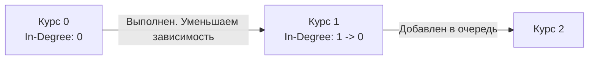

## Зависимости и Дедлоки: Проектирование графов исполнения

В предыдущей статье [[2. Компоненты и циклы]] мы разобрали абстрактный механизм поиска циклов с помощью окрашивания вершин графа. Пора применить эту математику к реальной инженерной задаче.

Задача **Course Schedule** (LeetCode №207) звучит так: *Вам нужно пройти `numCourses` курсов (от `0` до `numCourses - 1`). Даны зависимости (prerequisites), где `[a, b]` означает, что для прохождения курса `a` вы обязаны сначала пройти курс `b`. Можете ли вы завершить все курсы?*

Для студента это задача про расписание. Для Backend-разработчика это задача про **Оркестрацию и Разрешение зависимостей (Dependency Resolution)**.

Где это применяется под капотом:
1. **Пакетные менеджеры**: Как `go mod`, `npm` или `apt` понимают, в каком порядке скачивать и собирать пакеты?
2. **Внедрение зависимостей (DI)**: Фреймворки вроде `uber-go/fx` строят граф зависимостей ваших сервисов перед стартом приложения. Если `UserService` требует `DB`, а `DB` требует `Config`, который требует `UserService` — мы получаем фатальную кольцевую зависимость (Circular Dependency).
3. **Оркестраторы**: Apache Airflow или ArgoCD выполняют таски, выстроенные в DAG (Directed Acyclic Graph).

Если в графе зависимостей есть **цикл**, задача невыполнима. Происходит классический Deadlock. Следовательно, Course Schedule сводится к одной цели: **проверить, является ли данный направленный граф ациклическим (DAG)**.

---

## Подход 1: DFS и Метод Трех Цветов

Этот подход мы уже реализовали ранее. Мы идем в глубину по цепочке зависимостей. Если в процессе обхода мы натыкаемся на курс, который сейчас находится "в процессе изучения" (в стеке вызовов) — мы нашли цикл.

### Идиоматичная реализация на Go
```go
func canFinishDFS(numCourses int, prerequisites [][]int) bool {
    // 1. Строим список смежности (Adjacency List)
    // graph[i] содержит список курсов, зависящих от курса i
    graph := make([][]int, numCourses)
    for _, req := range prerequisites {
        course, pre := req[0], req[1]
        graph[pre] = append(graph[pre], course)
    }

    // 2. Массив состояний для метода трех цветов
    // 0 - White (не посещен)
    // 1 - Gray (в процессе обхода текущего пути)
    // 2 - Black (полностью обработан и проверен, циклов нет)
    state := make([]uint8, numCourses)

    var dfs func(node int) bool
    dfs = func(node int) bool {
        if state[node] == 1 {
            return false // Нашли цикл (уперлись в серую вершину)
        }
        if state[node] == 2 {
            return true // Уже проверенная безопасная ветка
        }

        // Красим в серый (добавляем в Call Stack)
        state[node] = 1

        // Проверяем всех, кто зависит от текущего курса
        for _, neighbor := range graph[node] {
            if !dfs(neighbor) {
                return false // Fast Fail: прокидываем ошибку наверх
            }
        }

        // Выходим из узла, красим в черный (безопасно)
        state[node] = 2
        return true
    }

    // 3. Запускаем обход для каждого курса (граф может быть несвязным)
    for i := 0; i < numCourses; i++ {
        if state[i] == 0 {
            if !dfs(i) {
                return false
            }
        }
    }

    return true
}
```

> [!info] Под капотом: Аллокации списка смежности
> В строке `graph[pre] = append(graph[pre], course)` мы вызываем `append` для потенциально пустых слайсов. Это вызывает микро-аллокации в куче (Heap). 
> В условиях жестких ограничений (или HFT систем) мы могли бы аллоцировать один большой плоский массив размером `len(prerequisites)` и использовать индексы-смещения (Offset Array / CSR формат). Но для 99% бэкенд-задач и LeetCode массива слайсов `[][]int` более чем достаточно, так как базовый массив `graph` выделяется непрерывным блоком, обеспечивая приемлемую локальность кэша (Cache Locality).

---

## Подход 2: Алгоритм Кана (Kahn's Algorithm) — Топологическая сортировка через BFS

Если DFS — это рекурсивное погружение, то Алгоритм Кана (BFS) моделирует реальный процесс прохождения курсов.

Концепция строится вокруг понятия **In-Degree (Входящая степень)** — это количество невыполненных зависимостей для данного узла.
1. Мы считаем `In-Degree` для каждого курса.
2. Курсы с `In-Degree == 0` не имеют зависимостей. Мы можем "пройти" их прямо сейчас. Кладем их в очередь (Queue).
3. Достаем курс из очереди, "проходим" его и "снимаем" зависимость со всех соседних курсов (уменьшаем их `In-Degree` на 1).
4. Если у соседа `In-Degree` стал равен 0, он тоже готов к прохождению — кидаем его в очередь.
5. В конце сравниваем: совпадает ли количество пройденных курсов с `numCourses`? Если нет — значит, оставшиеся курсы заблокировали друг друга в цикле.

### Визуализация алгоритма Кана


### Production-ready реализация BFS

```go
func canFinish(numCourses int, prerequisites [][]int) bool {
    graph := make([][]int, numCourses)
    inDegree := make([]int, numCourses) // Массив входящих степеней

    // 1. Строим граф и считаем входящие степени
    for _, req := range prerequisites {
        course, pre := req[0], req[1]
        graph[pre] = append(graph[pre], course)
        inDegree[course]++ // Увеличиваем счетчик зависимостей
    }

    // 2. Инициализируем очередь курсами без зависимостей
    queue := make([]int, 0, numCourses)
    for i := 0; i < numCourses; i++ {
        if inDegree[i] == 0 {
            queue = append(queue, i)
        }
    }

    completedCount := 0

    // 3. Обрабатываем очередь
    for len(queue) > 0 {
        // Dequeue
        node := queue[0]
        queue = queue[1:] 
        
        completedCount++

        // Уменьшаем In-Degree для всех зависимых курсов
        for _, neighbor := range graph[node] {
            inDegree[neighbor]--
            // Если зависимостей больше нет - в очередь
            if inDegree[neighbor] == 0 {
                queue = append(queue, neighbor)
            }
        }
    }

    // Если смогли пройти все курсы, циклов нет
    return completedCount == numCourses
}
```

> [!warning] Ловушка / Gotcha: Утечка памяти в очереди
> В статьях по деревьям (например, в задаче BFS обхода) мы упоминали, что сдвиг слайса `queue = queue[1:]` оставляет базовый массив в памяти и требует зануления первого элемента `queue[0] = nil`, чтобы Garbage Collector мог собрать отработанные узлы.
> 
> **Почему мы не зануляем элемент здесь?** 
> Наша очередь хранит простые числа типа `int` (значимый тип, Value Type), а не указатели `*TreeNode`. Garbage Collector в Go сканирует только те сегменты памяти, которые содержат указатели (pointers). Оставшиеся позади числа `int` в базовом массиве не удерживают никакие другие объекты в куче. Утечки памяти (Memory Leak) объектов не происходит! Это тонкий нюанс работы Go GC, который отлично зайдет на Senior-интервью.

---

## Сравнение подходов (DFS vs BFS)

На собеседовании вас обязательно спросят: *"Какой алгоритм выбрать?"*

Оба алгоритма имеют идентичную асимптотическую сложность:
- **Время:** $O(V + E)$, где $V$ — курсы, $E$ — зависимости. Мы посещаем каждую вершину и каждое ребро ровно один раз.
- **Память:** $O(V + E)$ для хранения графа (список смежности) + $O(V)$ для вспомогательных массивов (`state` или `inDegree` + `queue`).

**Выбор зависит от контекста:**
1. Если нужно **просто проверить наличие цикла**, DFS обычно работает чуть быстрее в реальности, так как механизм "Fast Fail" может обнаружить цикл глубоко в графе на первых же шагах и прервать выполнение, в то время как BFS (Kahn) будет честно обрабатывать все независимые узлы слоя 0.
2. Если в случае успеха вам нужно **вывести правильный порядок прохождения курсов**, Алгоритм Кана (BFS) делает это естественным образом — порядок извлечения из очереди и есть ваш Topological Sort.

Именно этот второй пункт (вывод порядка выполнения) является логичным продолжением. Что, если нам мало знать факт возможности сборки, и мы должны передать планировщику (Scheduler) точный список действий шаг за шагом? Это переводит нас к следующей задаче: [[4. Course Schedule II]].