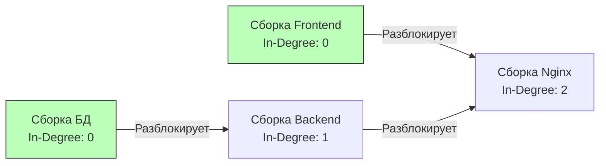

## От проверки к исполнению: Топологическая сортировка

В предыдущей статье [[3. Course Schedule]] мы научились отвечать на вопрос "Можно ли вообще собрать этот проект?", выявляя циклические зависимости. Но в реальной инженерии простого ответа `true` или `false` недостаточно. 

Планировщику ОС (Scheduler), системе CI/CD (GitLab, GitHub Actions), пакетному менеджеру (go mod) или системе инициализации (systemd) нужен **точный, пошаговый план выполнения**. 

Задача **Course Schedule II** (LeetCode №210) требует вернуть массив — правильную последовательность прохождения всех `numCourses`. Если граф содержит цикл (Deadlock), мы должны вернуть пустой массив `[]`.

Эта алгоритмическая концепция называется **Топологической сортировкой (Topological Sort)**.

---

## Что такое Топологическая сортировка?

Топологическая сортировка применима **только** к направленным ациклическим графам (Directed Acyclic Graph, DAG). 
Это такое упорядочивание вершин, при котором для каждого направленного ребра `U -> V` вершина `U` находится в массиве *раньше*, чем вершина `V`.


> Топологический порядок для графа выше: `[Сборка БД, Сборка Frontend, Сборка Backend, Сборка Nginx]`. 
> Заметьте, что "БД" и "Frontend" независимы друг от друга, поэтому порядок `[Сборка Frontend, Сборка БД, ...]` также является абсолютно верным. Топологическая сортировка часто имеет **несколько валидных решений**.

На интервью ожидают, что вы напишете один из двух классических алгоритмов: BFS (Алгоритм Кана) или DFS (Обратный обход).

---

## Подход 1: BFS (Алгоритм Кана) — Инженерный стандарт

Алгоритм Кана (Kahn's Algorithm) — это де-факто стандарт для задач на оркестрацию. Он не только ищет циклы, но и *естественным образом* генерирует топологический порядок, так как мы берем узлы ровно в тот момент, когда они "готовы" к исполнению.

### Идиоматичный Go-код (Production-ready)

Мы используем тот же подход, что и в предыдущей задаче, но добавляем сборку результата (slice `order`).
```go
func findOrder(numCourses int, prerequisites [][]int) []int {
    graph := make([][]int, numCourses)
    inDegree := make([]int, numCourses)

    // 1. Строим граф: зависимость -> зависимый (A разблокирует B)
    for _, req := range prerequisites {
        course, pre := req[0], req[1]
        graph[pre] = append(graph[pre], course)
        inDegree[course]++
    }

    // 2. Инициализируем очередь и преаллоцируем результирующий слайс
    queue := make([]int, 0, numCourses)
    for i := 0; i < numCourses; i++ {
        if inDegree[i] == 0 {
            queue = append(queue, i)
        }
    }

    // Capacity сразу равен numCourses, чтобы избежать реаллокаций в цикле
    order := make([]int, 0, numCourses)

    // 3. Обрабатываем очередь (BFS)
    for len(queue) > 0 {
        node := queue[0]
        queue = queue[1:] 
        
        // Добавляем готовый курс в итоговый план
        order = append(order, node)

        // Разблокируем соседей
        for _, neighbor := range graph[node] {
            inDegree[neighbor]--
            if inDegree[neighbor] == 0 {
                queue = append(queue, neighbor)
            }
        }
    }

    // 4. Проверка на Deadlock
    // Если мы добавили в план не все курсы, значит оставшиеся образуют цикл
    if len(order) != numCourses {
        return []int{} // По условию задачи при цикле возвращаем пустой массив
    }

    return order
}
```

> [!info] Mechanical Sympathy: Capacity слайсов
> Обратите внимание на строку `order := make([]int, 0, numCourses)`.
> Многие разработчики пишут просто `var order []int`. В таком случае вызовы `append` под капотом будут выделять память: на 0 элементов, потом на 1, 2, 4, 8, 16... Это требует вызовов `runtime.growslice`, копирования старых данных в новый блок памяти и оставляет мусор для GC.
> Указав Capacity равным `numCourses` изначально, мы делаем ровно **одну** аллокацию памяти нужного размера. Это паттерн проектирования High-Performance кода в Go.

---

## Подход 2: DFS (Обратный обход с Тремя Цветами)

Если вы фанат рекурсии, топологическую сортировку можно реализовать через DFS. Но здесь кроется коварная логическая ловушка, на которой проваливают лайв-кодинг.

Если мы построили граф как `Pre -> Course` (Предмет открывает доступ к Курсу), и запускаем DFS, мы спускаемся максимально глубоко по графу. Узел, который мы красим в черный цвет (состояние 2 — обработан) **самым первым**, — это конечный узел графа (тот, кто никого не разблокирует). 

Значит, DFS собирает план выполнения **задом наперед**.
Нам нужно либо добавлять элементы в массив, а потом перевернуть его (Reverse), либо (что эффективнее) заполнять массив с конца, используя указатель (Index).

### Реализация DFS с заполнением с конца
```go
func findOrderDFS(numCourses int, prerequisites [][]int) []int {
    graph := make([][]int, numCourses)
    for _, req := range prerequisites {
        course, pre := req[0], req[1]
        graph[pre] = append(graph[pre], course)
    }

    // Состояния: 0 - White, 1 - Gray (в стеке), 2 - Black (обработан)
    state := make([]uint8, numCourses)
    
    // Аллоцируем массив нужной длины, заполненный нулями
    order := make([]int, numCourses)
    // Указатель для заполнения с конца
    insertIdx := numCourses - 1 

    var dfs func(node int) bool
    dfs = func(node int) bool {
        if state[node] == 1 {
            return false // Цикл!
        }
        if state[node] == 2 {
            return true // Уже обработан
        }

        state[node] = 1

        for _, neighbor := range graph[node] {
            if !dfs(neighbor) {
                return false
            }
        }

        state[node] = 2
        // САМОЕ ВАЖНОЕ: добавляем узел в план после обработки всех его потомков
        order[insertIdx] = node
        insertIdx-- // Сдвигаем указатель влево
        
        return true
    }

    for i := 0; i < numCourses; i++ {
        if state[i] == 0 {
            if !dfs(i) {
                return []int{} // При цикле возвращаем пустой массив
            }
        }
    }

    return order
}
```

> [!tip] Собеседование
> **Вопрос:** Какой подход лучше использовать на проде?
> **Ответ:** BFS (Kahn's Algorithm) предпочтительнее для оркестрации. Он не расходует стек вызовов горутины, что критично для графов с длинными цепочками зависимостей. Более того, BFS можно легко адаптировать под **параллельное выполнение** независимых задач (например, запуск нескольких горутин-воркеров для сборки пакетов с `In-Degree == 0`), в то время как классический рекурсивный DFS строго последователен.

---

## Краевые случаи (Gotchas & Edge Cases)

При решении Course Schedule II нужно вслух проговорить интервьюеру следующие сценарии:
1 - **Изолированные вершины (Несвязный граф)**: Курс может вообще не иметь зависимостей и не быть чьей-либо зависимостью. Наши алгоритмы обрабатывают это корректно: Kahn добавит его в очередь на старте, а внешний цикл `for i := 0; i < numCourses` в DFS запустит обход с него напрямую.
2 - **Пустой массив `prerequisites`**: Это значит, что курсы можно проходить в любом порядке. Kahn вернет `[0, 1, 2, ..., numCourses-1]`.
3 - **Цикл на старте**: Например, `prerequisites = [[1,0],[0,1]]`. Ни один курс не попадет в очередь (так как у всех `In-Degree > 0`), длина `order` будет 0, что не равно `numCourses`, и алгоритм корректно вернет `[]`.

Мы закончили с классическими направленными графами и зависимостями. Теперь пора переходить к другой, не менее популярной форме представления графов на собеседованиях — **двумерным матрицам (Сеткам / Grids)**. Начнем с абсолютного хита алгоритмических интервью, который дают почти во всех компаниях: [[5. Number of Islands]].