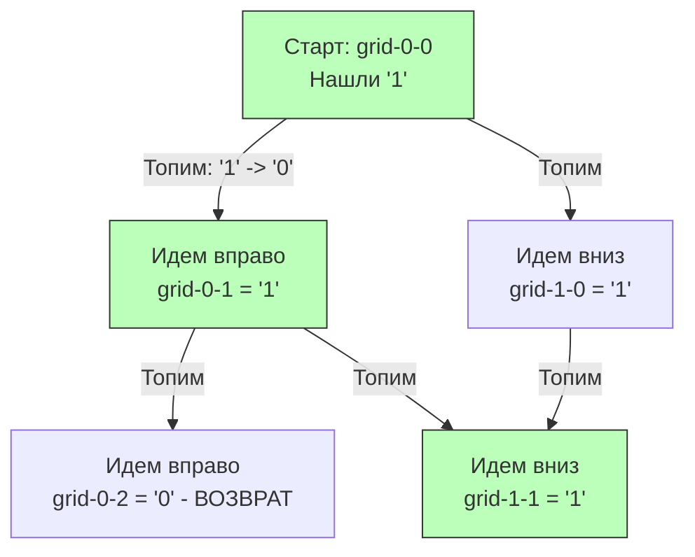

## Неявные графы: Матрицы и Двумерные Сетки

В статьях [[1. Теория. Графы]] и [[2. Компоненты и циклы]] мы явно строили граф через список смежности (Adjacency List). Но на алгоритмических секциях есть огромный класс задач, где граф **неявный** (Implicit Graph).

Самый популярный представитель этого класса — двумерная матрица (Grid), а абсолютный хит собеседований — задача **Number of Islands** (LeetCode №200). 

**Условие:** Дана двумерная сетка `m x n`, состоящая из `'1'` (суша) и `'0'` (вода). Остров окружен водой и образуется путем соединения соседних участков суши по горизонтали и вертикали (по диагонали нельзя). Необходимо посчитать количество островов.

С точки зрения теории графов, эта задача — прямой аналог поиска **Компонент связности**.
- **Вершины ($V$)**: Каждая ячейка с `'1'`.
- **Ребра ($E$)**: Связи между соседними (вверх, вниз, влево, вправо) ячейками с `'1'`.

Вам не нужно строить `map` или `[][]int`. Сетка *уже* является графом. Координаты `(r, c)` — это адрес узла, а его соседи математически вычисляются как `(r+1, c), (r-1, c), (r, c+1), (r, c-1)`.

---

## Подход 1: DFS (Поиск в глубину) и Мутация входа

Самый простой и популярный метод — пройтись по всей матрице двойным циклом. Как только мы встречаем `'1'`, мы увеличиваем счетчик островов и запускаем DFS (алгоритм Flood Fill / Заливка), чтобы "затопить" весь найденный остров, превратив его `'1'` в `'0'`. 

Это гарантирует, что мы не посчитаем один и тот же остров дважды.
```go
func numIslands(grid [][]byte) int {
    if len(grid) == 0 {
        return 0
    }

    islands := 0
    rows := len(grid)
    cols := len(grid[0])

    // Вспомогательная функция DFS
    var dfs func(r, c int)
    dfs = func(r, c int) {
        // Проверка выхода за границы и проверка на воду
        if r < 0 || c < 0 || r >= rows || c >= cols || grid[r][c] == '0' {
            return
        }

        // "Топим" сушу, чтобы не зациклиться и не посчитать дважды
        grid[r][c] = '0'

        // Идем в 4 направлениях
        dfs(r+1, c) // Вниз
        dfs(r-1, c) // Вверх
        dfs(r, c+1) // Вправо
        dfs(r, c-1) // Влево
    }

    // Сканируем всю матрицу
    for r := 0; r < rows; r++ {
        for c := 0; c < cols; c++ {
            if grid[r][c] == '1' {
                islands++
                dfs(r, c) // Затапливаем найденный остров
            }
        }
    }

    return islands
}
```

> [!warning] Ловушка / Gotcha: Побочные эффекты (Side Effects)
> Мутация входных аргументов (`grid[r][c] = '0'`) — это великолепный трюк для LeetCode, так как он снижает использование памяти до $O(1)$ (если не считать стек рекурсии). 
> Но в реальном production-бэкенде изменение переданного по указателю слайса — это **грубейшее нарушение потокобезопасности** и паттерн Side Effect. Если эта сетка используется другим слоем приложения (например, для отрисовки карты), ваш код её уничтожит. 
> На Senior-собеседовании вы **обязаны** спросить: *"Могу ли я модифицировать входную матрицу, или мне нужно выделить отдельный массив `visited` для потокобезопасности?"*.

### Визуализация Flood Fill


---

## Mechanical Sympathy: Нагрузка на стек и кэш

Оценивая сложность DFS-решения, мы получаем:
- **Время:** $O(M \times N)$, где $M$ — количество строк, $N$ — столбцов. Мы посещаем каждую ячейку константное количество раз.
- **Память:** $O(M \times N)$ в худшем случае для стека вызовов горутины.

**1. Проблема глубины стека:**
Представьте матрицу $1000 \times 1000$, состоящую целиком из суши, выстроенной змейкой. Глубина рекурсии DFS достигнет $1,000,000$ вызовов.
Каждый вызов `dfs(r, c)` добавляет фрейм в стек горутины. Стек начнет расти, рантайму Go придется многократно копировать стек в новые участки памяти (Stack Growth), что создаст чудовищные задержки (Latency Spikes) и съест десятки мегабайт RAM на один запрос.

**2. Проблема структуры `[][]byte`:**
Многие думают, что двумерный массив в Go — это прямоугольник в памяти. Нет.
Слайс `[][]byte` — это слайс заголовков `SliceHeader`, каждый из которых указывает на *отдельный* базовый массив в памяти. Эти строки (`rows`) могут быть разбросаны по всей куче (Heap). 
Когда DFS прыгает вверх-вниз (`r+1`, `r-1`), процессор получает **Cache Misses**, так как соседние по вертикали ячейки лежат далеко друг от друга в физической памяти.

> [!info] Под капотом: Плоские массивы (Flat Arrays)
> В высоконагруженных системах (карты в играх, гео-индексы) 2D-сетки всегда реализуют через одномерный массив (Flat 1D Slice).
> Сетка $M \times N$ выделяется как `grid := make([]byte, M*N)`. 
> Доступ к координате `(r, c)` вычисляется по формуле: `index = r * N + c`.
> Это обеспечивает идеальную локальность кэша (Spatial Locality) и избавляет от накладных расходов на хранение `SliceHeader` для каждой строки.

---

## Подход 2: Итеративный BFS с отдельным массивом visited

Если матрица огромная (как в Production) и модифицировать вход нельзя, мы используем алгоритм BFS (Поиск в ширину) и отдельную матрицу посещений.
```go
func numIslandsBFS(grid [][]byte) int {
    if len(grid) == 0 {
        return 0
    }

    rows, cols := len(grid), len(grid[0])
    islands := 0
    
    // Выделяем массив visited. Для экономного расхода памяти можно 
    // использовать Bitset (1 бит на ячейку), но здесь для читаемости bool.
    visited := make([][]bool, rows)
    for i := range visited {
        visited[i] = make([]bool, cols)
    }

    // Направления: вверх, вправо, вниз, влево
    dirs := [4][2]int{{-1, 0}, {0, 1}, {1, 0}, {0, -1}}

    bfs := func(startR, startC int) {
        // Очередь хранит координаты
        queue := [][2]int{{startR, startC}}
        visited[startR][startC] = true

        for len(queue) > 0 {
            curr := queue[0]
            queue[0] = [2]int{0, 0} // Избегаем утечки
            queue = queue[1:]
            r, c := curr[0], curr[1]

            // Проверяем 4 направления
            for _, d := range dirs {
                nr, nc := r+d[0], c+d[1]
                
                // Валидация
                if nr >= 0 && nc >= 0 && nr < rows && nc < cols && 
                   grid[nr][nc] == '1' && !visited[nr][nc] {
                    
                    visited[nr][nc] = true // Отмечаем сразу при добавлении в очередь!
                    queue = append(queue, [2]int{nr, nc})
                }
            }
        }
    }

    for r := 0; r < rows; r++ {
        for c := 0; c < cols; c++ {
            if grid[r][c] == '1' && !visited[r][c] {
                islands++
                bfs(r, c)
            }
        }
    }

    return islands
}
```

> [!warning] Ловушка / Gotcha: Дубликаты в BFS очереди
> Самая частая алгоритмическая ошибка при написании BFS для матриц — помечать ячейку как посещенную `visited = true` в момент *извлечения* из очереди (Dequeue), а не в момент *добавления* (Enqueue).
> В графах-решетках к одной и той же ячейке можно прийти с двух сторон. Если не пометить её сразу при добавлении, обе соседние ячейки добавят её в очередь. Очередь раздуется в экспоненциальной прогрессии (Memory Limit Exceeded). Всегда ставьте флаг `visited` перед `append`.

## Итог

1. **Неявные графы**: 2D-матрицы — это графы, где координаты это узлы, а смещения (`r±1`, `c±1`) — ребра.
2. **Алгоритм**: Задача "Количество островов" — это поиск компонент связности. DFS пишется быстрее, BFS безопаснее для памяти при гигантских сетках.
3. **System Design**: Модификация массива in-place экономит `O(M*N)` памяти, но ломает Thread-Safety. Если можете, используйте `visited` или Bitset.
4. **Слайсы**: `[][]byte` в Go плох для кэша L1/L2. В реальных high-load проектах матрицы выравнивают (flatten) в одномерный `[]byte`.

Теперь, когда мы научились "заливать" области и ходить по матрице, мы можем усложнить правила. Что если "вода" может течь только под определенным уклоном, и нам нужно определить, куда она в итоге попадет? Эта концепция множественных стартовых точек подробно разбирается в следующей задаче: [[6. Pacific Atlantic Water Flow]].