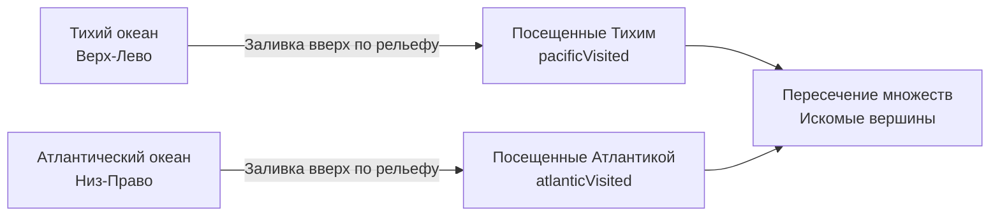

## Смена перспективы: Реверсивный обход графа

В задаче [[5. Number of Islands]] мы искали замкнутые области, запуская алгоритм заливки из конкретной точки. Но в системной инженерии и маршрутизации часто встречается паттерн **Множественных источников (Multi-source)**. 

Задача **Pacific Atlantic Water Flow** (LeetCode №417) — это классический пример такого паттерна.

**Условие:** Дана матрица высот `m x n`. Остров омывается Тихим океаном (сверху и слева) и Атлантическим океаном (снизу и справа). Вода может течь **вниз или на том же уровне** (то есть в соседние ячейки с высотой `<=`).
Нужно найти координаты всех ячеек, дождевая вода из которых может достичь **обоих** океанов.

---

## Наивный подход: Прямая симуляция

Первое, что приходит в голову джуниору — это симуляция законов физики. 
Давайте пройдемся двойным циклом по всем ячейкам `(r, c)`. Для каждой ячейки запустим DFS. Если DFS найдет путь до левой/верхней границы и до правой/нижней — добавим клетку в ответ.

**Почему это провал на интервью?**
Представьте, что у вас остров, который идет под уклон в виде ступенек. Для ячейки на вершине DFS обойдет весь остров. Для ячейки чуть ниже — почти весь остров. 
Мы будем многократно вычислять одни и те же пути. Временная сложность такого алгоритма составит $O((M \times N)^2)$. Для матрицы $1000 \times 1000$ (миллион ячеек) это $10^{12}$ операций. Вы получите Time Limit Exceeded (TLE).

---

## Архитектурное решение: Инверсия потока (Reverse Flow)

Чтобы снизить сложность до линейной $O(M \times N)$, нам нужно **сменить точку обзора**. 
Вместо того чтобы пускать воду с каждой горы вниз, давайте **затопим остров от океанов вверх**.

Мы знаем, что вода течет вниз (высота `X >= Y`). Значит, если мы идем *от океана*, мы можем двигаться только **вверх или по плоскости** (высота `X <= Y`).

Алгоритм звучит так:
1. Запускаем обход (DFS или BFS) от всех ячеек, граничащих с Тихим океаном. Отмечаем все достижимые клетки как `pacificVisited`.
2. Запускаем обход от всех ячеек, граничащих с Атлантическим океаном. Отмечаем все достижимые клетки как `atlanticVisited`.
3. Проходим по матрице один раз. Если ячейка есть и в `pacificVisited`, и в `atlanticVisited` — это наш ответ.


---

## Идиоматичная реализация (Middle Level)

В этой реализации мы используем два массива `visited`. Это крепкий, легко читаемый код, который ожидают от уверенного миддл-разработчика.
```go
func pacificAtlanticMiddle(heights [][]int) [][]int {
    if len(heights) == 0 {
        return nil
    }

    rows, cols := len(heights), len(heights[0])
    pacific := make([][]bool, rows)
    atlantic := make([][]bool, rows)
    for i := 0; i < rows; i++ {
        pacific[i] = make([]bool, cols)
        atlantic[i] = make([]bool, cols)
    }

    var dfs func(r, c int, visited [][]bool, prevHeight int)
    dfs = func(r, c int, visited [][]bool, prevHeight int) {
        // Проверка границ
        if r < 0 || c < 0 || r >= rows || c >= cols {
            return
        }
        // Вода не может течь "вверх" от океана, если высота меньше предыдущей
        if heights[r][c] < prevHeight {
            return
        }
        // Защита от циклов
        if visited[r][c] {
            return
        }

        visited[r][c] = true

        // Идем в 4 стороны
        currH := heights[r][c]
        dfs(r+1, c, visited, currH)
        dfs(r-1, c, visited, currH)
        dfs(r, c+1, visited, currH)
        dfs(r, c-1, visited, currH)
    }

    // Запускаем DFS от береговых линий
    for r := 0; r < rows; r++ {
        dfs(r, 0, pacific, heights[r][0])           // Левый берег
        dfs(r, cols-1, atlantic, heights[r][cols-1]) // Правый берег
    }
    for c := 0; c < cols; c++ {
        dfs(0, c, pacific, heights[0][c])           // Верхний берег
        dfs(rows-1, c, atlantic, heights[rows-1][c]) // Нижний берег
    }

    // Ищем пересечение
    var res [][]int
    for r := 0; r < rows; r++ {
        for c := 0; c < cols; c++ {
            if pacific[r][c] && atlantic[r][c] {
                res = append(res, []int{r, c})
            }
        }
    }

    return res
}
```

---

## Mechanical Sympathy: Оптимизация для Senior/Lead (Bitmasks & Flat Arrays)

Как Principal Engineer, вы должны видеть недостатки предыдущего кода:
1. **Перерасход памяти**: Два массива `[][]bool`. В 64-битной системе `[][]bool` — это не просто байты. Это массив заголовков `SliceHeader` (по 24 байта каждый), указывающих на разрозненные куски памяти. Для матрицы $1000 \times 1000$ это создаст $2000$ лишних аллокаций в куче и сломает Spatial Locality (локальность кэша).
2. **Лишние проверки**: Мы дважды обходим граф и дважды храним почти одинаковые состояния.

**Решение:**
Мы можем сжать всё состояние матрицы в **один одномерный массив (Flat Array)** типа `[]byte`, а принадлежность к океанам закодировать **Битовыми масками (Bitmasks)**.

- `00` (0) — не посещено
- `01` (1) — достижимо из Тихого (Pacific)
- `10` (2) — достижимо из Атлантического (Atlantic)
- `11` (3) — достижимо из обоих (Искомое состояние)

> [!info] Под капотом: Математика плоских массивов
> Любую 2D-матрицу можно развернуть в 1D-массив непрерывной памяти.
> Координата `(r, c)` превращается в индекс: `idx = r * COLS + c`.
> Это позволяет выделить весь массив одной инструкцией аллокатора, и процессор будет загружать ячейки в L1-кэш целыми линиями (Cache Lines), минимизируя промахи.

### Production-Ready реализация (Bitmasks)
```go
func pacificAtlantic(heights [][]int) [][]int {
    if len(heights) == 0 {
        return nil
    }

    rows, cols := len(heights), len(heights[0])
    
    // Единый плоский массив состояний
    // 1 - Pacific, 2 - Atlantic, 3 - Both
    states := make([]byte, rows*cols) 

    var dfs func(r, c int, stateMask byte, prevHeight int)
    dfs = func(r, c int, stateMask byte, prevHeight int) {
        if r < 0 || c < 0 || r >= rows || c >= cols {
            return
        }
        
        idx := r*cols + c // Вычисление 1D индекса
        
        // Условие реверсивного стока
        if heights[r][c] < prevHeight {
            return
        }
        
        // Побитовое И: Если в текущем состоянии УЖЕ есть нужные биты маски, 
        // значит этот океан тут уже был, идем дальше.
        if states[idx]&stateMask == stateMask {
            return
        }

        // Побитовое ИЛИ: Добавляем биты текущего океана
        states[idx] |= stateMask

        currH := heights[r][c]
        dfs(r+1, c, stateMask, currH)
        dfs(r-1, c, stateMask, currH)
        dfs(r, c+1, stateMask, currH)
        dfs(r, c-1, stateMask, currH)
    }

    // Pacific (Mask = 1)
    for c := 0; c < cols; c++ { dfs(0, c, 1, heights[0][c]) }
    for r := 0; r < rows; r++ { dfs(r, 0, 1, heights[r][0]) }

    // Atlantic (Mask = 2)
    for c := 0; c < cols; c++ { dfs(rows-1, c, 2, heights[rows-1][c]) }
    for r := 0; r < rows; r++ { dfs(r, cols-1, 2, heights[r][cols-1]) }

    // Собираем результат: ищем ячейки, где установлены оба бита (состояние 3)
    var res [][]int
    for r := 0; r < rows; r++ {
        for c := 0; c < cols; c++ {
            if states[r*cols+c] == 3 {
                res = append(res, []int{r, c})
            }
        }
    }

    return res
}
```

> [!tip] Собеседование
> Если вы напишете решение с битовыми масками и одномерным массивом, вы продемонстрируете глубокое понимание `Mechanical Sympathy`. 
> Вы показываете интервьюеру: "Я знаю, что аллокации в куче дороги, я знаю, что многомерные слайсы в Go — это массивы указателей, и я умею упаковывать флаги в регистры процессора для максимальной производительности".

### Оценка сложности
- **Время:** $O(M \times N)$. В худшем случае (совершенно плоский остров) каждый узел будет посещен максимум 2 раза (один раз Тихим океаном, один раз Атлантическим). Благодаря проверке `states[idx]&stateMask == stateMask` мы мгновенно отсекаем повторные проходы.
- **Память:** $O(M \times N)$. В оптимизированной версии мы используем ровно один массив `[]byte` размером $M \times N$ байт, что в $16$ раз компактнее, чем `[][]bool` (не считая заголовков). Дополнительная память тратится на стек горутины при глубокой рекурсии.

## Итоги и Корнер-кейсы

1. **Многоточечный старт**: Если у задачи несколько источников (береговая линия, границы матрицы, очаги возгорания), всегда выгодно запускать обход параллельно/последовательно от всех источников, передавая единое состояние (матрицу `visited`).
2. **Инверсия логики**: Если прямой обход дает $O(N^2)$, подумайте, можно ли начать с конца. Этот паттерн часто встречается в задачах на маршруты.
3. **Плоская матрица (Flat Grid)**: Это профессиональный стандарт работы с графикой и сетками в Go, экономящий GC-циклы.

Мы разобрали поиск путей и компонент. Но графы таят в себе еще одну угрозу. Иногда добавление всего одного ребра превращает строгую иерархию в хаотичный цикл. Как быстро обнаруживать такие "лишние" связи в динамически меняющихся сетях (например, в P2P или при балансировке маршрутизаторов)? Эту проблему мы решим в следующей статье: [[7. Redundant Connection]].