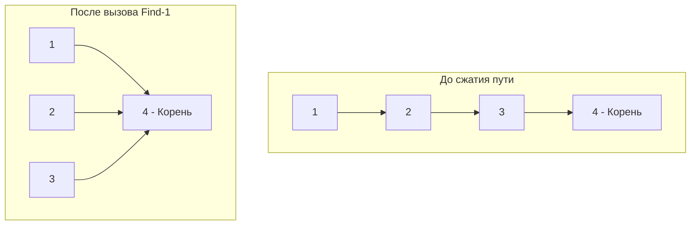

## Цена лишней связи: От иерархии к хаосу

Представьте, что вы проектируете локальную сеть дата-центра. Все коммутаторы (свитчи) соединены в древовидную топологию. Дерево (Tree) обладает идеальным свойством: между любыми двумя узлами существует строго **один уникальный путь**. 

Но что произойдет, если сетевой инженер случайно воткнет кабель, соединив два коммутатора, которые уже были связаны через другие узлы? 
Иерархия мгновенно превратится в **граф с циклом**. В компьютерных сетях это вызывает **Broadcast Storm (Шторм широковещательных пакетов)** — коммутаторы начинают бесконечно пересылать один и тот же пакет по кругу, пока сеть не "ляжет" от 100% нагрузки на CPU. 

Для предотвращения этого в сетях работает протокол STP (Spanning Tree Protocol), который программно "отключает" лишние линки. 
Задача **Redundant Connection** (LeetCode №684) просит нас написать алгоритм, который найдет этот самый "лишний" кабель.

**Условие:** Дан неориентированный граф из $N$ узлов (пронумерованных от $1$ до $N$) и $N$ ребер. Изначально это было дерево из $N$ узлов и $N-1$ ребер, к которому добавили ровно одно новое ребро. Найдите ребро, добавление которого привело к образованию цикла. Если таких ребер несколько (по условию добавления ребер в массиве), верните то, которое встречается в массиве последним.

---

## Почему не DFS или BFS?

Первая мысль на собеседовании — использовать обход в глубину.
Мы можем добавлять ребра в пустой граф по одному и перед добавлением каждого ребра `[u, v]` запускать DFS, чтобы проверить: *"А есть ли уже путь между u и v?"*. 
Если путь есть — значит, добавление этого ребра создаст цикл. Это наш ответ.

> [!warning] Ловушка / Gotcha: Временная сложность
> В графе $N$ ребер. Перед добавлением каждого ребра мы запускаем DFS, который в худшем случае обходит все уже добавленные $O(N)$ ребер. Итоговая сложность: $O(N^2)$.
> Для $N = 1000$ это миллион операций (работает). Но для $N = 10^5$ (типичный размер таблиц маршрутизации или БД) это $10^{10}$ операций — алгоритм упадет по таймауту (TLE). Нам нужна структура данных, которая умеет проверять связность двух узлов за константное $O(1)$ время.

---

## Знакомьтесь: Union-Find (Система непересекающихся множеств)

**Disjoint Set Union (DSU)** или **Union-Find** — это узкоспециализированная, но невероятно мощная структура данных. Она создана исключительно для двух операций:
1. **Find(x)** — узнать, к какому множеству (компоненте связности) принадлежит элемент `x`.
2. **Union(x, y)** — объединить два множества, содержащие элементы `x` и `y`.

Вместо того чтобы строить сложные списки смежности (`[][]int`), DSU хранит всё в одном плоском массиве `parent`.

Изначально каждый узел — это изолированное множество, и он является "родителем" самому себе: `parent[i] = i`.
Когда мы соединяем два узла, мы просто делаем корень одного множества родителем корня другого.

### Mechanical Sympathy: Почему DSU так быстр?

DSU базируется на массивах, а не на указателях (как мы делали в структурах деревьев `*TreeNode`).
В Go массив `parent := make([]int, N)` выделяется единым непрерывным блоком памяти в куче (Heap). Процессор загружает этот массив в кэш-линии (Cache Lines) L1/L2 порциями по 64 байта. Операция перехода к родителю `parent[x]` — это не переход по случайному адресу оперативной памяти (Pointer Chasing), а молниеносное вычисление смещения: `base_address + x * 8`.

---

## Две магии DSU: Оптимизации, которые делают алгоритм O(1)

Наивная реализация DSU может выродиться в длинный связный список (хуже, чем дерево). Чтобы операции `Find` и `Union` работали за околоконстантное время, применяют две эвристики:

### 1. Сжатие путей (Path Compression) при Find
Когда мы ищем корень множества для элемента `x`, мы проходим через цепочку его родителей. Почему бы сразу не перевесить всех пройденных узлов напрямую к корню? В следующий раз `Find` для любого из них отработает за 1 шаг.


### 2. Объединение по размеру / рангу (Union by Size)
Когда мы объединяем два множества, мы должны решить, кто станет новым корнем. Если мы подвесим большое множество к маленькому, глубина дерева увеличится. Если подвесить маленькое к большому — глубина почти не изменится. Для этого нужен второй массив `size`, хранящий количество узлов в множестве.

---

## Идиоматичная реализация на Go

```go
// DSU структура для системы непересекающихся множеств
type DSU struct {
    parent []int
    size   []int
}

// NewDSU создает новую структуру DSU.
// Используем размер n+1, так как в задаче узлы пронумерованы с 1 (1-indexed).
func NewDSU(n int) *DSU {
    dsu := &DSU{
        parent: make([]int, n+1),
        size:   make([]int, n+1),
    }
    for i := 0; i <= n; i++ {
        dsu.parent[i] = i // Изначально каждый сам себе родитель
        dsu.size[i] = 1   // Размер каждого начального множества - 1
    }
    return dsu
}

// Find находит корень множества, к которому принадлежит x, 
// применяя оптимизацию "Сжатие путей" (Path Compression).
func (d *DSU) Find(x int) int {
    if d.parent[x] != x {
        // Рекурсивно находим корень и сразу перезаписываем родителя.
        // Это сплющивает дерево, ускоряя будущие запросы.
        d.parent[x] = d.Find(d.parent[x])
    }
    return d.parent[x]
}

// Union объединяет два множества. 
// Возвращает false, если они УЖЕ были в одном множестве (найден цикл).
func (d *DSU) Union(x, y int) bool {
    rootX := d.Find(x)
    rootY := d.Find(y)

    // Если корни совпадают, добавление ребра (x, y) создаст цикл!
    if rootX == rootY {
        return false
    }

    // Оптимизация "Объединение по размеру" (Union by Size).
    // Подвешиваем меньшее дерево к корню большего.
    if d.size[rootX] < d.size[rootY] {
        d.parent[rootX] = rootY
        d.size[rootY] += d.size[rootX]
    } else {
        d.parent[rootY] = rootX
        d.size[rootX] += d.size[rootY]
    }

    return true
}

func findRedundantConnection(edges [][]int) []int {
    // В задаче количество узлов равно количеству ребер N (граф с 1 циклом)
    n := len(edges)
    dsu := NewDSU(n)

    for _, edge := range edges {
        u, v := edge[0], edge[1]
        // Пытаемся объединить два узла
        if !dsu.Union(u, v) {
            // Если они уже были объединены, мы нашли лишнее ребро
            return edge
        }
    }

    return nil
}
```

> [!tip] Собеседование: Индексация 0-based vs 1-based
> В условии сказано, что узлы нумеруются от `1` до `N`. 
> Многие кандидаты пытаются выделять массив размером `N` и везде делать вычитание `edge[0] - 1` и `edge[1] - 1`. 
> Это повышает когнитивную нагрузку и риск опечаток (Off-by-one error). В Go выделение одного лишнего `int` (8 байт) в массиве `make([]int, n+1)` абсолютно бесплатно. Создавайте массив `N+1` и используйте оригинальные значения узлов как индексы.

### Оценка сложности (Амортизационный анализ)

Если вы применяете обе оптимизации (Сжатие путей и Объединение по рангу/размеру), математическая сложность операций `Find` и `Union` падает до $O(\alpha(N))$.

> [!info] Под капотом: Функция Аккермана
> $\alpha(N)$ — это обратная функция Аккермана. Она растет настолько медленно, что для любого $N$, меньшего чем количество атомов в видимой Вселенной, значение $\alpha(N)$ не превышает 5. 
> Следовательно, с инженерной точки зрения, $O(\alpha(N))$ — это константное время $O(1)$. 
> Временная сложность всего алгоритма составит строго $O(N)$, так как мы делаем $N$ вызовов почти константной функции.
> Пространственная сложность (память): $O(N)$ для хранения двух массивов `parent` и `size`.

## Итог

1. **Динамическая связность**: Когда граф строится постепенно (ребра добавляются в рантайме), алгоритм DFS бесполезен из-за сложности $O(N^2)$.
2. **DSU (Union-Find)**: Отраслевой стандарт для задач разбиения на кластеры, поиска компонент связности и детектирования циклов в **неориентированных** графах.
3. **Оптимизации**: DSU без "сжатия путей" и "размера" — это плохой код. Обязательно применяйте их, чтобы сплющить дерево и получить $O(1)$ на запрос.

DSU решает вопросы топологии, где вес кабеля (или расстояние) не имеет значения (Невзвешенные графы). Но в сетях цена маршрута — задержка (latency) — критически важна. Как найти не просто путь, а самый *быстрый* путь от балансировщика до сервера, когда каждая сеть имеет свой пинг? Об этом мы поговорим в разборе фундаментального алгоритма Дейкстры в следующей задаче: [[8. Network Delay Time]].