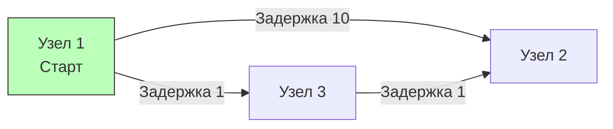

## Анатомия задержек: Взвешенные графы и маршрутизация

В предыдущих статьях мы рассматривали графы, где все связи были равнозначны. Если нам нужно было найти кратчайший путь, мы использовали BFS (как в матрицах [[5. Number of Islands]]), потому что каждое ребро "стоило" ровно один шаг.

Но в реальном мире системного программирования графы **взвешенные (Weighted Graphs)**. 
- В сетях (OSPF, BGP) каждое соединение имеет свою задержку (ping) или пропускную способность.
- В микросервисной архитектуре вызов `Service A -> Service B` может занимать 10мс, а `Service A -> Service C` — 50мс.
- В картах (Яндекс/Google) дороги имеют разную длину и ограничения скорости.

Задача **Network Delay Time** (LeetCode №743) — это симуляция рассылки пакета по сети.
**Условие:** Дана сеть из `N` узлов (от 1 до N). Даны направленные взвешенные ребра `times[i] = [u, v, w]`, где `u` — источник, `v` — цель, а `w` — время прохождения сигнала. Мы отправляем сигнал из узла `k`. Нужно узнать, через какое время ВСЕ узлы получат сигнал. Если хотя бы один узел недостижим, вернуть `-1`.

Эта задача — идеальный полигон для реализации одного из самых важных алгоритмов Computer Science: **Алгоритма Дейкстры (Dijkstra's Algorithm)**.

---

## Почему BFS здесь не работает?

Представьте классический обход в ширину (BFS). Он идет по графу слоями (уровнями). 


Если мы запустим наивный BFS из Узла 1, он сначала посетит Узел 2 (за 10мс) и Узел 3 (за 1мс). Он решит, что кратчайший путь до Узла 2 равен 10. 
Но сигнал, отправленный через Узел 3, достигнет Узла 2 за `1 + 1 = 2` миллисекунды! 

**Вывод:** В пространстве взвешенных графов количество ребер (прыжков) больше не отражает реальное расстояние. Нам нужен механизм, который всегда будет рассматривать **ближайший по времени** узел, а не ближайший по топологии.

---

## Алгоритм Дейкстры и Min-Heap (Очередь с приоритетом)

Алгоритм Дейкстры работает по "жадному" принципу:
1. Заводим массив минимальных расстояний `dist` до каждого узла. Изначально до всех узлов расстояние бесконечно (`math.MaxInt`), а до стартового `k` — равно 0.
2. Используем **Очередь с приоритетом (Min-Heap)**, которая всегда выдает узел с *минимальным накопленным временем*. Кладем туда старт: `(Узел: k, Время: 0)`.
3. Извлекаем узел из кучи. Если извлеченное время больше, чем уже записанное в `dist` — игнорируем (устаревший путь).
4. Проходим по всем соседям этого узла. Считаем `newTime = Время текущего + Вес ребра`.
5. Если `newTime < dist[neighbor]`, мы нашли более быстрый путь! Обновляем `dist[neighbor]` и кидаем соседа в кучу `(neighbor, newTime)`.

---

## Идиоматичная реализация на Go (Production-Ready)

В Go нет встроенной структуры `PriorityQueue` "из коробки" как `std::priority_queue` в C++ или `PriorityQueue` в Java. Нам нужно реализовать интерфейс `heap.Interface` из стандартного пакета `container/heap`.

На хардовых собеседованиях написание этого бойлерплейта ожидается от кандидата наизусть.
```go
import (
    "container/heap"
    "math"
)

// 1. Описываем элемент кучи и саму кучу
type Item struct {
    node   int
    weight int
}

type MinHeap []Item

// Реализация интерфейса sort.Interface
func (h MinHeap) Len() int           { return len(h) }
func (h MinHeap) Less(i, j int) bool { return h[i].weight < h[j].weight }
func (h MinHeap) Swap(i, j int)      { h[i], h[j] = h[j], h[i] }

// Реализация интерфейса heap.Interface
func (h *MinHeap) Push(x any) {
    *h = append(*h, x.(Item))
}

func (h *MinHeap) Pop() any {
    old := *h
    n := len(old)
    item := old[n-1]     // Берем последний элемент
    *h = old[0 : n-1]    // Сужаем слайс
    return item
}

// 2. Основная функция
type Edge struct {
    to     int
    weight int
}

func networkDelayTime(times [][]int, n int, k int) int {
    // Строим список смежности. 
    // Узлы 1-indexed, поэтому аллоцируем n+1 для прямого доступа без сдвигов.
    graph := make([][]Edge, n+1)
    for _, t := range times {
        u, v, w := t[0], t[1], t[2]
        graph[u] = append(graph[u], Edge{to: v, weight: w})
    }

    // Инициализируем расстояния бесконечностью
    dist := make([]int, n+1)
    for i := 1; i <= n; i++ {
        dist[i] = math.MaxInt
    }
    dist[k] = 0

    // Инициализируем кучу
    pq := &MinHeap{}
    heap.Init(pq)
    heap.Push(pq, Item{node: k, weight: 0})

    // Главный цикл Дейкстры
    for pq.Len() > 0 {
        curr := heap.Pop(pq).(Item)
        u := curr.node
        currDist := curr.weight

        // Оптимизация: если мы извлекли устаревший путь, пропускаем
        if currDist > dist[u] {
            continue
        }

        // Релаксация ребер (Relaxation)
        for _, edge := range graph[u] {
            v := edge.to
            newDist := currDist + edge.weight

            // Если нашли путь короче, обновляем и добавляем в кучу
            if newDist < dist[v] {
                dist[v] = newDist
                heap.Push(pq, Item{node: v, weight: newDist})
            }
        }
    }

    // Ищем максимальное время среди всех узлов (когда последний узел получит сигнал)
    maxTime := 0
    for i := 1; i <= n; i++ {
        if dist[i] == math.MaxInt {
            return -1 // Если хотя бы один узел остался бесконечностью, он недостижим
        }
        if dist[i] > maxTime {
            maxTime = dist[i]
        }
    }

    return maxTime
}
```

> [!info] Под капотом: Mechanical Sympathy и interface{}
> Почему пакет `container/heap` в Go выглядит таким громоздким? 
> Он был спроектирован до появления дженериков (Go 1.18). Методы `Push` и `Pop` принимают и возвращают пустой интерфейс `any` (`interface{}`). 
> Когда вы делаете `heap.Push(pq, Item{...})`, структура `Item` **упаковывается (Boxing)** в интерфейс. Компилятор Go (Escape Analysis) достаточно умен, чтобы часто оставлять эти аллокации на стеке, но в сложных графах частые упаковки/распаковки могут триггерить GC. 
> На Senior-секциях стоит упомянуть, что в Go 1.22+ можно использовать пакет `slices` и писать кастомные дженерик-кучи для экстремального HighLoad, но `container/heap` остается стандартом де-факто на собеседованиях.

---

## Оценка сложности

- **Время:** $O(E \log V)$, где $E$ — количество ребер, $V$ — количество вершин. Каждое ребро обрабатывается и может добавить элемент в кучу. Вставка/Извлечение из кучи стоит $O(\log V)$.
- **Память:** $O(V + E)$ для хранения графа (список смежности) и $O(V)$ для кучи и массива `dist`. Итоговая пространственная сложность линейная.

> [!warning] Ловушка / Gotcha: Отрицательные веса
> Алгоритм Дейкстры **математически ломается**, если в графе есть ребра с отрицательным весом.
> Дейкстра делает жадное предположение: *добавив новое ребро, путь может стать только длиннее или остаться таким же (вес $\ge$ 0)*. Поэтому, как только узел извлекается из кучи, его минимальное расстояние считается окончательным. 
> Если на собеседовании скажут: *"У нас есть кэш-ноды, маршрутизация через которые 'возвращает' нам время (отрицательный вес)"*, вам придется использовать **Алгоритм Беллмана-Форда** (сложность $O(V \times E)$).

---

## Краевые случаи и Edge Cases

1. **Несвязный граф:** По условию мы должны проверить, все ли узлы получили сигнал. Именно поэтому в конце мы итерируемся от $1$ до $N$. Если `dist[i] == math.MaxInt`, значит узел находился в другой компоненте связности. Мы корректно возвращаем `-1`.
2. **Нулевые веса (0 мс):** Алгоритм Дейкстры отлично работает с нулевыми весами (это не отрицательные).
3. **Параллельные ребра:** Между `A` и `B` может быть проложено несколько кабелей с разной задержкой. Алгоритм обработает их корректно — более длинные просто отсеются проверкой `newDist < dist[v]`.
4. **Устаревшие элементы в куче:** В процессе работы алгоритма один и тот же узел может попасть в кучу несколько раз с разными весами (например, мы нашли путь за 10мс, кинули в кучу, а потом нашли за 5мс и снова кинули). Строка `if currDist > dist[u] { continue }` элегантно отбрасывает устаревшие дубликаты за $O(1)$, избавляя нас от сложной логики удаления элементов из середины кучи.

Мы научились находить абсолютный кратчайший путь. Но в бизнесе кратчайший путь — не всегда оптимальный. Представьте, что вы покупаете авиабилеты: самый дешевый рейс может иметь 5 пересадок, что нарушает наши бизнес-ограничения. Как модифицировать поиск графа, если у нас есть лимит на количество прыжков? Эту сложную и невероятно практичную задачу мы разберем в следующей статье: [[9. Cheapest Flights Within K Stops]].