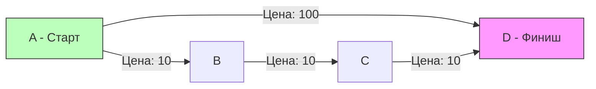

## Бизнес-ограничения в маршрутизации

В предыдущей задаче [[8. Network Delay Time]] мы искали абсолютный кратчайший путь, используя алгоритм Дейкстры. Но в реальной инженерии чистая математика часто сталкивается с бизнес-ограничениями. 

Пользователь не всегда хочет самый дешевый авиабилет, если ради него придется сделать 5 пересадок и лететь двое суток. В системах бронирования (Amadeus, Sabre) или балансировщиках трафика (когда каждый "прыжок" через прокси увеличивает риск потери пакета) вводится ограничение на максимальное количество промежуточных узлов (Hops).

Задача **Cheapest Flights Within K Stops** (LeetCode №787) моделирует именно этот сценарий:
**Условие:** Дано `n` городов и массив перелетов `flights`, где `flights[i] = [from, to, price]`. Нужно найти самый дешевый маршрут из `src` в `dst`, сделав **не более `K` пересадок** (то есть максимум `K+1` перелетов). Если такого маршрута нет, вернуть `-1`.

---

## Почему ломается классический Дейкстра?

Жадные алгоритмы, такие как Дейкстра, оптимизируют только один параметр (в нашем случае — цену). Если мы запустим обычного Дейкстру, он найдет самый дешевый путь, но этот путь может состоять из `K+5` пересадок.


> **Пример:** Если `K = 0` (прямой рейс без пересадок). 
> Дейкстра пойдет по пути `A -> B -> C -> D` (сумма 30). На шаге `C -> D` он поймет, что лимит пересадок превышен, и отбросит путь. Но к этому моменту прямой путь `A -> D` (сумма 100) мог быть уже выкинут из кучи как "слишком дорогой" или узел `D` был бы помечен как "посещенный" с неверной ценой.

Чтобы починить Дейкстру, нам придется хранить в Priority Queue не только `(цена, узел)`, но и `пересадки`. Более того, массив минимальных расстояний `dist` должен превратиться в 2D-матрицу `dist[node][stops]`, так как нам может быть выгодно прийти в узел более дорогим путем, если он экономит пересадки. Это сильно усложняет код и увеличивает потребление памяти.

Нам нужен алгоритм, который умеет считать шаги естественным образом.

---

## Подход 1: Итеративный BFS (Поиск в ширину)

Самый интуитивный способ контролировать количество пересадок — это обходить граф по уровням (Level-Order Traversal). Один уровень BFS = один перелет. Мы ограничиваем глубину поиска циклом на `K+1` итераций.

Для предотвращения взрыва очереди (когда мы бесконечно ходим по дорогим путям) мы будем поддерживать массив `minCost`, обновляя его только если нашли более дешевый путь.

### Идиоматичный Go-код (BFS)
```go
func findCheapestPriceBFS(n int, flights [][]int, src int, dst int, k int) int {
    // 1. Строим список смежности
    type Edge struct { to, price int }
    graph := make([][]Edge, n)
    for _, f := range flights {
        u, v, w := f[0], f[1], f[2]
        graph[u] = append(graph[u], Edge{to: v, price: w})
    }

    // Массив минимальных стоимостей до узлов
    minCost := make([]int, n)
    for i := range minCost {
        minCost[i] = math.MaxInt32
    }
    minCost[src] = 0

    // Очередь хранит пары: {текущий узел, накопленная стоимость}
    type State struct { node, cost int }
    queue := []State{{node: src, cost: 0}}

    // Максимум K+1 перелетов (уровней)
    for stops := 0; stops <= k && len(queue) > 0; stops++ {
        levelSize := len(queue)
        
        for i := 0; i < levelSize; i++ {
            curr := queue[0]
            queue = queue[1:] // Сдвиг слайса (допустимо для Value Type структур)

            // Пробуем улететь во все доступные города
            for _, edge := range graph[curr.node] {
                nextCost := curr.cost + edge.price
                
                // Если новый путь дешевле известного, идем туда
                if nextCost < minCost[edge.to] {
                    minCost[edge.to] = nextCost
                    queue = append(queue, State{node: edge.to, cost: nextCost})
                }
            }
        }
    }

    if minCost[dst] == math.MaxInt32 {
        return -1
    }
    return minCost[dst]
}
```

**Оценка:** Это хорошее, крепкое решение. Время $O(E \times K)$, память $O(V + E)$. Но для сеньорной позиции есть решение, которое математически элегантнее и еще лучше работает с процессорным кэшем.

---

## Подход 2: Алгоритм Беллмана-Форда (Bellman-Ford)

Классический алгоритм Беллмана-Форда находит кратчайшие пути от одной вершины до всех остальных, обрабатывая **все ребра графа $V-1$ раз**. 
Магия в том, что после $i$-й итерации алгоритм гарантированно находит кратчайшие пути, содержащие **не более $i$ ребер**. 

Это идеальное совпадение с бизнес-логикой нашей задачи! Нам не нужно делать $V-1$ итераций, нам нужно сделать ровно **`K+1` итераций**. И нам даже не нужно строить список смежности — мы будем итерироваться прямо по исходному массиву `flights`.

> [!warning] Ловушка / Gotcha: Чтение грязных данных (Read-after-Write)
> Представьте, что у нас есть ребра `A -> B` и `B -> C`. 
> На первой итерации мы обновили расстояние до `B`. Если в той же итерации мы дойдем до ребра `B -> C`, мы обновим и `C`, опираясь на новое значение `B`. 
> Таким образом, мы "пролетели" два ребра за одну итерацию! Это нарушает лимит пересадок `K`. 
> **Лечение:** Нам нужно два массива `dist`. Один хранит результаты *предыдущей* итерации (из него мы только читаем), второй накапливает результаты *текущей* (в него мы пишем).

### Production-Ready код (С фокусом на Mechanical Sympathy)
```go
import "math"

func findCheapestPrice(n int, flights [][]int, src int, dst int, k int) int {
    // Используем MaxInt32, чтобы избежать переполнения при сложении (dist + price)
    // в 64-битных системах, если бы мы использовали math.MaxInt.
    const Inf = math.MaxInt32

    // Массив текущих минимальных цен
    dist := make([]int, n)
    for i := range dist {
        dist[i] = Inf
    }
    dist[src] = 0

    // Временный массив для изоляции итераций
    temp := make([]int, n)

    // Делаем ровно k+1 шагов (максимально допустимое число перелетов)
    for i := 0; i <= k; i++ {
        // Копируем результаты прошлого шага.
        // copy() в Go использует ассемблерную инструкцию memmove под капотом,
        // это работает со скоростью пропускной способности RAM.
        copy(temp, dist)

        // Идем по списку ВСЕХ ребер
        for _, flight := range flights {
            u, v, price := flight[0], flight[1], flight[2]

            // Если мы можем долететь до u (цена не бесконечность)
            if dist[u] != Inf && dist[u]+price < temp[v] {
                // Записываем результат в temp, чтобы избежать "грязного" чтения
                // в этой же итерации другими ребрами.
                temp[v] = dist[u] + price
            }
        }

        // Синхронизируем массивы
        copy(dist, temp)
    }

    if dist[dst] == Inf {
        return -1
    }
    return dist[dst]
}
```

### Mechanical Sympathy: Почему это обожает CPU?

Давайте посмотрим на это глазами процессора:
1. **Никаких указателей и вложенных структур**: Мы работаем с плоскими `[]int` и исходным 2D слайсом `flights` (который в памяти лежит достаточно кучно). 
2. **Предсказуемый паттерн доступа к памяти**: Внутренний цикл `for _, flight := range flights` идет строго последовательно от нулевого индекса до последнего. Это активирует аппаратный **Hardware Prefetcher**, который заранее подгружает данные из RAM в L1-кэш.
3. **Отсутствие аллокаций в цикле**: Мы выделили два массива `dist` и `temp` один раз до начала цикла. Встроенная функция `copy()` не выделяет новую память, она просто перемещает байты. Никакого давления на Garbage Collector (GC).

### Оценка сложности
- **Время:** $O(E \times K)$, где $E$ — количество перелетов (длина массива `flights`). Мы делаем $K+1$ проход по всему массиву ребер.
- **Память:** $O(V)$, где $V$ — количество городов (`n`). Нам нужны только два массива `dist` и `temp` размером $n$. Это фантастически экономно по сравнению с Дейкстрой, которому нужна куча и сложный `map`.

## Итог графового раздела

Эта задача завершает наше погружение в классические алгоритмы на графах. Вы увидели, как одни и те же сетевые структуры можно обходить по-разному в зависимости от бизнес-ограничений:
- Для простого поиска компонент — DFS.
- Для поиска кратчайшего пути по ребрам — BFS.
- Для абсолютного времени доставки сигнала — Дейкстра.
- Для систем с ограничениями на количество прыжков — Беллман-Форд или модифицированный BFS.
- Для мгновенного нахождения циклов и объединения кластеров — Union-Find.

Кстати, о последнем. Мы вскользь касались DSU в задаче о лишнем кабеле, но эта структура настолько важна для распределенных систем (определение сплит-брейна, кластеризация данных), что заслуживает отдельного глубокого разбора. Переходим к следующему фундаментальному разделу: [[1. Теория. Union Find]].