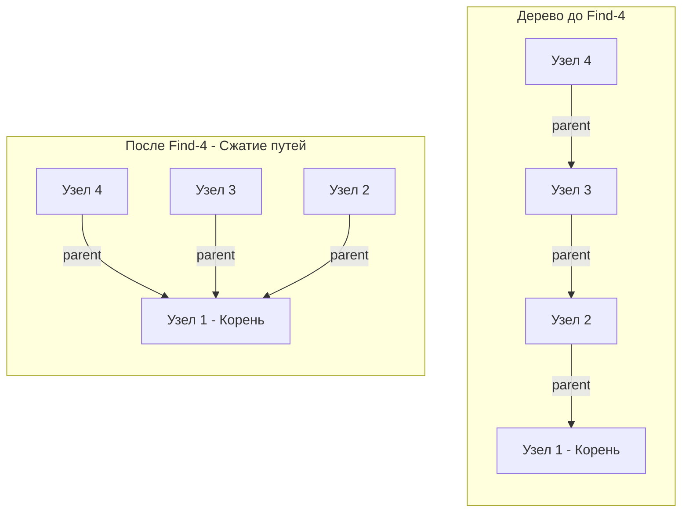

## Система непересекающихся множеств (DSU)

В разделе про графы, разбирая задачу [[7. Redundant Connection]], мы вскользь познакомились с элегантной структурой данных — **Union-Find** (также известной как **Disjoint Set Union, DSU** или Система непересекающихся множеств). 

DFS и BFS отлично справляются с анализом статических графов, где все ребра известны заранее. Но в распределенных системах сети **динамические**:
- Новые узлы подключаются к кластеру.
- Кабели прокладываются между дата-центрами.
- В социальной сети пользователи добавляют друг друга в друзья в реальном времени.

Если после каждого добавления связи нам нужно отвечать на вопрос *"Связаны ли теперь узел А и узел Б?"*, запуск DFS даст сложность $O(V + E)$ на каждый запрос. Для миллиона узлов система мгновенно ляжет.

Union-Find создана именно для **Динамической связности (Dynamic Connectivity)**. Она отвечает на запросы объединения и проверки связности практически за $O(1)$.

---

## Архитектура DSU: Массивы вместо указателей

Классическое дерево в Go (как мы видели в разделе деревьев) строится на указателях:
```go
// Так мы НЕ будем делать в DSU
type Node struct {
    Val    int
    Parent *Node
}
```

Union-Find отбрасывает ООП-подход в пользу **Data-Oriented Design (Специфичного для данных проектирования)**. Мы используем плоские массивы.
```go
type DSU struct {
    parent []int // Хранит индекс родителя для каждого узла
    size   []int // Хранит размер дерева (используется только для корней)
}

func NewDSU(n int) *DSU {
    dsu := &DSU{
        parent: make([]int, n),
        size:   make([]int, n),
    }
    for i := 0; i < n; i++ {
        dsu.parent[i] = i // Изначально каждый узел — корень своего собственного дерева
        dsu.size[i] = 1   // Размер каждого дерева равен 1
    }
    return dsu
}
```

> [!info] Под капотом: Mechanical Sympathy и Garbage Collector
> Почему плоские `[]int` настолько лучше указателей `*Node`?
> 1. **Аллокации:** `make([]int, n)` выделяет память в куче **ровно один раз** единым непрерывным блоком. Создание $N$ структур `Node` потребует $N$ аллокаций, разбросанных по всей куче.
> 2. **Локальность кэша (Cache Locality):** Когда процессор обращается к `parent[i]`, он загружает в кэш L1 целую кэш-линию (64 байта), забирая вместе с `parent[i]` еще 7 соседних элементов. Поиск по массиву работает со скоростью пропускной способности RAM. Указатели же вызывают промахи кэша (Cache Misses).
> 3. **Garbage Collector:** Слайс примитивов `[]int` не содержит указателей. Сборщик мусора (GC) в Go не сканирует содержимое таких слайсов в фазе Mark. Если у вас DSU на 10 миллионов элементов, GC просто игнорирует эти 80 Мегабайт, экономя такты CPU.

---

## Две магии DSU: Find и Union

В основе структуры лежат две операции. Без специальных оптимизаций они могут выродиться в связный список ($O(N)$), но с двумя хитростями их сложность падает до $O(1)$.

### 1. Операция Find и Сжатие путей (Path Compression)

Операция `Find(x)` ищет **Корень (Представителя)** множества, к которому принадлежит `x`. Корень — это узел, у которого `parent[x] == x`.

**Оптимизация:** Когда мы идем от узла к корню, мы проходим цепочку промежуточных родителей. Зачем проходить их снова в следующий раз? Давайте в процессе возврата из рекурсии **перевесим все пройденные узлы напрямую к корню**. Это называется Сжатием путей.
```go
func (d *DSU) Find(x int) int {
    // Если x не является своим собственным родителем, значит он не корень
    if d.parent[x] != x {
        // Рекурсивно ищем корень и СРАЗУ перезаписываем родителя x.
        // Это "сплющивает" дерево.
        d.parent[x] = d.Find(d.parent[x])
    }
    return d.parent[x]
}
```



### 2. Операция Union и Объединение по размеру (Union by Size)

Операция `Union(x, y)` объединяет множества, в которых находятся `x` и `y`. 

Мы находим корень `x` (пусть это `rootX`) и корень `y` (пусть `rootY`). Чтобы объединить множества, нам нужно сделать один корень родителем другого: `parent[rootX] = rootY`.

**Оптимизация:** Если мы подвесим большое, глубокое дерево к маленькому, общая глубина нового дерева сильно увеличится (что замедлит будущие `Find`). Нам нужно всегда **подвешивать меньшее дерево к корню большего**. Для этого мы и храним массив `size`.
```go
// Возвращает true, если объединение произошло.
// Возвращает false, если x и y УЖЕ были в одном множестве (найден цикл).
func (d *DSU) Union(x, y int) bool {
    rootX := d.Find(x)
    rootY := d.Find(y)

    if rootX == rootY {
        return false // Они уже в одном множестве
    }

    // Подвешиваем меньшее дерево к большему
    if d.size[rootX] < d.size[rootY] {
        d.parent[rootX] = rootY
        d.size[rootY] += d.size[rootX] // Обновляем размер нового корня
    } else {
        d.parent[rootY] = rootX
        d.size[rootX] += d.size[rootY]
    }

    return true
}
```

> [!tip] Собеседование
> Существует альтернатива `Union by Size` — это `Union by Rank` (по рангу/высоте дерева). Логика идентична, но мы храним не количество узлов, а приблизительную высоту дерева. 
> На практике `Size` предпочтительнее, так как во многих задачах на графы нас часто просят вывести *"размер компоненты связности"* (например: "Какого размера самый большой кластер серверов?"). Массив `size` уже содержит готовый ответ `d.size[d.Find(x)]` за $O(1)$!

---

## Асимптотическая сложность и Функция Аккермана

На хардовом интервью вас могут попросить оценить точную временную сложность этих операций.
Ответ $O(1)$ технически неверен, но на практике это именно так.

Если мы используем **обе** оптимизации (Сжатие путей + Объединение по размеру), амортизированное время выполнения любой операции `Find` или `Union` составляет $O(\alpha(N))$.

$\alpha(N)$ — это **Обратная функция Аккермана (Inverse Ackermann function)**.
Она растет настолько медленно, что для любых мыслимых в физической Вселенной значений $N$ (вплоть до $10^{80}$ атомов во Вселенной), значение $\alpha(N)$ не превышает $5$.
С точки зрения инженерии процессора, $5$ тактов на итерацию — это константа. Поэтому мы смело называем это околоконстантным временем $O(1)$.

- **Время создания DSU:** $O(N)$, так как нужно инициализировать массивы `parent` и `size`.
- **Время Find / Union:** $O(\alpha(N)) \approx O(1)$.
- **Память:** $O(N)$ для хранения двух плоских массивов.

---

## Резюме: Когда применять Union-Find?

У вас должен загораться "ментальный триггер" на DSU, если в задаче на LeetCode или на секции System Design есть следующие условия:
1. **Динамическое добавление ребер**: Связи между объектами появляются последовательно во времени.
2. **Проверка связности (Connectivity)**: Вопросы типа "Могут ли A и B общаться друг с другом?".
3. **Кластеризация**: Разбиение объектов на непересекающиеся группы (компоненты).
4. **Поиск лишнего ребра (цикла) в неориентированном графе**: Как только `Union(u, v)` возвращает `false`, вы нашли цикл.
5. **Алгоритм Крускала (Kruskal's Algorithm)**: Поиск минимального остовного дерева (MST).

> [!warning] Ловушка / Gotcha: Чего DSU не умеет?
> DSU **не умеет удалять ребра** с сохранением $O(\alpha(N))$ сложности. Если в задаче сказано "связь между серверами оборвалась", классический Union-Find вам не поможет (потребуются сложные структуры типа Dynamic Connectivity over Link-Cut Trees или откат операций).
> DSU **не умеет находить кратчайший путь**. Он знает только *факт* связности, но не маршрут. Для маршрутов используйте BFS или Дейкстру.
> DSU предназначен **только для неориентированных графов**.

Теперь, когда у нас есть математически идеальная структура в арсенале, давайте посмотрим, в каких типовых задачах она применяется, и какие шаблоны кода стоит выучить наизусть. Переходим к практическому разбору: [[2. Применения]].