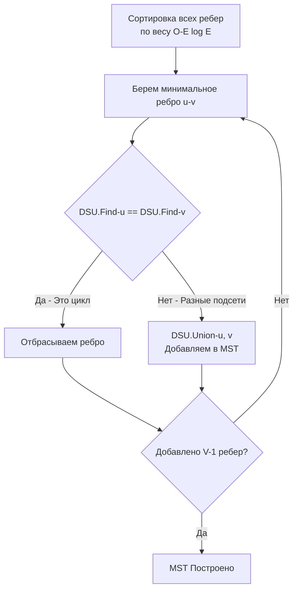

## Инструмент для динамического мира: Где DSU незаменим

В статье [[1. Теория. Union Find]] мы разобрали математический аппарат Системы непересекающихся множеств (DSU) и выяснили, что благодаря массивам и плоской памяти (Data-Oriented Design) она работает за почти константное время $O(\alpha(N))$. 

Но зачем нам учить эту структуру, если мы уже умеем обходить графы с помощью DFS и BFS? 

Ответ кроется в слове **"Динамика"**. DFS и BFS — это инструменты для *статичных* графов. Они анализируют слепок системы в конкретный момент времени. DSU — это инструмент для систем, которые *меняются прямо сейчас*.

В этой статье мы разберем четыре главных архитектурных паттерна, где применение Union-Find на собеседовании или в production-коде является единственно верным решением.

---

## Паттерн 1: Динамическая связность (Dynamic Connectivity)

Представьте, что вы пишете мониторинг для P2P-сети или кластера баз данных. Изначально у вас $N$ изолированных серверов. Каждую секунду между какими-то двумя серверами поднимается TCP-соединение (появляется ребро). 
Вам нужно в реальном времени отвечать на вопрос: *"Сколько сейчас изолированных подсетей (компонент связности) осталось?"*

Если использовать DFS: при добавлении каждого нового ребра нам придется заново запускать обход всего графа, что даст временную сложность $O(V + E)$ на каждый чих сети. При тысячах подключений в секунду CPU будет уничтожен.

**Решение через DSU:**
Мы модифицируем структуру Union-Find, добавляя счетчик компонент. Изначально счетчик равен $N$. При каждом успешном `Union` (когда мы объединяем два *разных* множества), счетчик уменьшается на 1.
```go
type DSU struct {
    parent     []int
    size       []int
    components int // Счетчик изолированных кластеров
}

func NewDSU(n int) *DSU {
    dsu := &DSU{
        parent:     make([]int, n),
        size:       make([]int, n),
        components: n, // Изначально N компонент
    }
    for i := 0; i < n; i++ {
        dsu.parent[i] = i
        dsu.size[i] = 1
    }
    return dsu
}

// ... реализация Find с path compression ...

func (d *DSU) Union(x, y int) bool {
    rootX := d.Find(x)
    rootY := d.Find(y)

    if rootX == rootY {
        return false
    }

    if d.size[rootX] < d.size[rootY] {
        d.parent[rootX] = rootY
        d.size[rootY] += d.size[rootX]
    } else {
        d.parent[rootY] = rootX
        d.size[rootX] += d.size[rootY]
    }
    
    // Два множества слились в одно, общее число компонент уменьшилось
    d.components-- 
    return true
}
```

> [!tip] Собеседование
> Хранение поля `components` внутри DSU — это стандартный прием для Senior-разработчиков. Это превращает задачу вычисления компонент из $O(N)$ в $O(1)$. Достаточно просто вернуть `d.components`.

---

## Паттерн 2: Минимальное остовное дерево (Kruskal's Algorithm)

**Сценарий:** Вам нужно проложить оптоволокно между 10 дата-центрами. Кабели стоят по-разному в зависимости от ландшафта (взвешенный граф). Вам нужно соединить все ДЦ так, чтобы общая стоимость кабеля была минимальной, и при этом не было колец (лишних трат).

Эта задача называется поиском Минимального остовного дерева (Minimum Spanning Tree, MST). **Алгоритм Крускала** решает её невероятно изящно с помощью DSU:

1. Сортируем все возможные ребра по возрастанию их веса (цены).
2. Берем самое дешевое ребро и пытаемся сделать `Union(u, v)`.
3. Если `Union` возвращает `true` (узлы были не связаны), мы добавляем ребро в наш план (покупаем кабель).
4. Если `Union` возвращает `false` (узлы УЖЕ связаны через другие ДЦ), мы пропускаем это ребро — оно создаст цикл и лишние траты.
5. Заканчиваем, когда добавили $V-1$ ребер.


> [!info] Под капотом: Предиктор ветвлений (Branch Predictor)
> Алгоритм Крускала обожает современные процессоры. После сортировки ребер (которая тоже cache-friendly, если использовать `[]struct`), мы входим в жесткий цикл с вызовом `Union`. 
> Поскольку DSU использует плоские массивы и быстро "сплющивает" пути, процессор отлично предсказывает ветвления (Branch Prediction) и минимизирует сбросы конвейера (Pipeline Flushes). На плотных графах Крускал с DSU часто работает быстрее, чем алгоритм Прима (аналог Дейкстры для MST).

---

## Паттерн 3: Эквивалентность и слияние сущностей (Identity Resolution)

В бэкенде часто возникает задача "склейки" профилей пользователей (Identity Resolution). 
- Профиль 1 имеет Email `A`.
- Профиль 2 имеет Phone `B`.
- В систему поступает заказ, где указан Email `A` и Phone `B`. 
Вывод: Профиль 1 и Профиль 2 — это один и тот же человек. Их нужно объединить в один кластер.

Здесь нет явного графа. Здесь есть **Классы эквивалентности (Equivalence Classes)**. DSU идеально подходит для этого. Мы можем использовать `map[string]string` вместо `[]int` в качестве массива `parent`, если ключами являются строки (email или телефон), либо сначала замаппить все уникальные строки в целочисленные ID.

На LeetCode эта концепция встречается в сложной задаче **Accounts Merge** (№721), где нужно объединить аккаунты, имеющие общие email-адреса. Без DSU эта задача превращается в кошмар со множеством вложенных `map` и рекурсивных вызовов DFS, где легко поймать Stack Overflow. С DSU — это просто последовательность операций `Union(email1, email2)`.

---

## Паттерн 4: Поиск избыточных связей (Детектор циклов)

Этот паттерн мы подробно реализовали в задаче о шторме широковещательных пакетов. 
Если в *неориентированном* графе при добавлении ребра `(u, v)` операция `Union(u, v)` возвращает `false` (то есть `Find(u) == Find(v)`), мы со стопроцентной вероятностью нашли **цикл**.

**Важное ограничение:** DSU находит циклы только в **неориентированных** графах. 
Если граф *ориентированный* (стрелки имеют направление, как в зависимостях модулей `go mod`), DSU использовать **нельзя**. В ориентированных графах пути `A -> B` и `A -> C -> B` не всегда образуют цикл, но DSU скажет, что они в одном множестве. Для ориентированных графов используйте DFS (Трехцветный метод) или BFS (Алгоритм Кана).

---

## Итог: Чек-лист для выбора DSU

Используйте Union-Find, если на архитектурной секции или лайв-кодинге звучит:
1. "Группировка" или "Кластеризация".
2. Ребра/связи добавляются *со временем* (streaming data).
3. Нужно проверить, находятся ли объекты в одной "сети" / "группе".
4. Требуется найти Минимальное остовное дерево (MST).

Не пытайтесь использовать DSU, если:
1. Граф ориентированный (Directed Graph).
2. Нужно найти *маршрут* или *кратчайший путь* (DSU не знает маршрутов, он знает только факт принадлежности).
3. Ребра *удаляются* (DSU поддерживает только добавление; удаление требует персистентных структур, что выходит за рамки любых собеседований).

С теорией покончено. Теперь у нас есть полностью готовая заготовка (boilerplate) структуры `DSU` со счетчиком компонент, и мы можем порвать любую задачу, связанную с кластеризацией графов. Начнем с классики, где применение DSU сокращает код в три раза по сравнению с DFS: [[3. Number of Connected Components]].