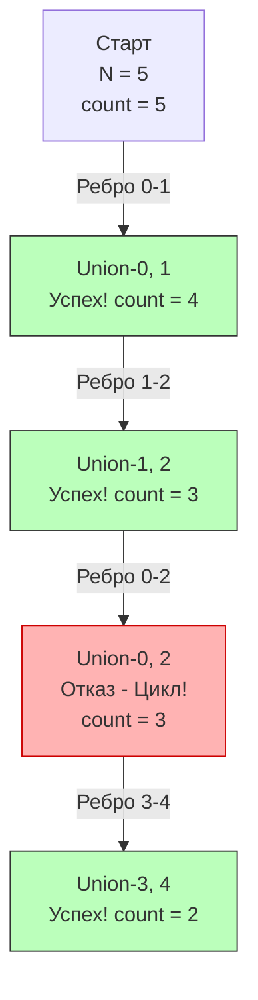

## "Hello World" для Union Find

Задача **Number of Connected Components in an Undirected Graph** (LeetCode №323) — это азбука для структуры данных DSU (Disjoint Set Union). Если вы поняли её, вы сможете решить 80% задач на кластеризацию графов.

**Условие:** Вам дано `n` узлов, пронумерованных от `0` до `n-1`, и массив неориентированных ребер `edges`. Напишите функцию, которая вернет количество изолированных компонент связности в этом графе.

Эта задача — прямой аналог того, как в распределенных системах оркестратор (например, Kubernetes или Consul) определяет, на сколько независимых сегментов (split-brain) развалился кластер серверов после сетевого сбоя (Network Partition).

---

## Почему DSU, а не DFS/BFS?

Мы уже решали задачу подсчета компонент в разделе про графы (см. [[2. Компоненты и циклы]]). Там мы строили список смежности (`[][]int`), заводили массив `visited` и запускали рекурсивный DFS. Зачем нам переписывать это через DSU?

Разница кроется в **Mechanical Sympathy** и стоимости инициализации:

1. **Список смежности (Adjacency List):** Чтобы запустить DFS, вам нужно сначала выделить массив слайсов `make([][]int, n)`, а затем для каждого ребра `(u, v)` делать `append` в `graph[u]` и `graph[v]`. Это $O(E)$ микро-аллокаций в куче. Если $E$ (количество ребер) достигает миллионов, GC в Go получит серьезную нагрузку.
2. **DSU (Плоские массивы):** Union-Find не строит граф. Он просто выделяет два плоских массива `parent` и `size` размером $N$. Это ровно две аллокации. Затем он проходит по массиву ребер, выполняя математические операции с индексами. Никаких `append`, никакого роста слайсов под капотом, никакого Pointer Chasing.

> [!info] Под капотом: L1 Cache и Предсказатель ветвлений
> Когда мы обрабатываем ребра через `Union(u, v)`, процессор обращается к массиву `parent`. Так как это непрерывный кусок памяти, процессор заранее подгружает соседние элементы в кэш-линии (Prefetching). 
> Алгоритм сжатия путей делает деревья плоскими (глубина 1-2 уровня). Это означает, что цикл `while parent[x] != x` (в рекурсивной или итеративной форме) почти никогда не уходит глубоко. Предсказатель ветвлений (Branch Predictor) современного CPU легко "схватывает" этот паттерн, сводя пенальти за ветвление к минимуму.

---

## Идея решения

Вместо того чтобы искать компоненты после построения графа, мы будем **считать их в реальном времени**:
1. Изначально у нас нет ни одного ребра. Значит, каждый из $N$ узлов — это изолированная компонента. Мы ставим счетчик `count = n`.
2. Мы берем ребро `(u, v)`. 
3. Делаем операцию `Union(u, v)`.
4. Если `u` и `v` находились в разных множествах, операция `Union` объединяет их. Две компоненты слились в одну. Значит, мы делаем `count--`.
5. Если `u` и `v` УЖЕ были в одном множестве (вызов `Union` вернул `false`), значит это ребро образует цикл внутри уже существующей компоненты. Количество компонент не меняется.


---

## Идиоматичный Go-код (Шаблон DSU для Production)

Этот код — золотой стандарт (boilerplate) реализации DSU на Go, который вы должны уметь писать с закрытыми глазами на любом собеседовании.
```go
// DSU структура с поддержкой подсчета компонент
type DSU struct {
    parent     []int
    size       []int
    components int // Текущее количество кластеров
}

// NewDSU выделяет память и инициализирует состояния
func NewDSU(n int) *DSU {
    dsu := &DSU{
        parent:     make([]int, n),
        size:       make([]int, n),
        components: n, // Сначала каждый узел изолирован
    }
    for i := 0; i < n; i++ {
        dsu.parent[i] = i
        dsu.size[i] = 1
    }
    return dsu
}

// Find ищет корень с оптимизацией "Сжатие путей" (Path Compression)
func (d *DSU) Find(x int) int {
    if d.parent[x] != x {
        // Рекурсивный поиск корня и переподвешивание узла
        d.parent[x] = d.Find(d.parent[x])
    }
    return d.parent[x]
}

// Union объединяет множества с оптимизацией "Объединение по размеру"
// Возвращает true, если произошло реальное слияние.
func (d *DSU) Union(x, y int) bool {
    rootX := d.Find(x)
    rootY := d.Find(y)

    // Если у них один корень, они уже в одной компоненте связности
    if rootX == rootY {
        return false
    }

    // Подвешиваем меньшее дерево к корню большего
    if d.size[rootX] < d.size[rootY] {
        d.parent[rootX] = rootY
        d.size[rootY] += d.size[rootX]
    } else {
        d.parent[rootY] = rootX
        d.size[rootX] += d.size[rootY]
    }

    // Уменьшаем глобальный счетчик независимых компонент
    d.components--
    return true
}

// Главная функция решения задачи
func countComponents(n int, edges [][]int) int {
    // 1. Создаем структуру
    dsu := NewDSU(n)

    // 2. Обрабатываем каждое ребро графа
    for _, edge := range edges {
        u, v := edge[0], edge[1]
        // Union под капотом сам обновит счетчик dsu.components
        dsu.Union(u, v)
    }

    // 3. Возвращаем итоговое значение счетчика за O(1)
    return dsu.components
}
```

### Оценка сложности
- **Временная сложность:** $O(V + E \cdot \alpha(V))$. 
  Создание массивов занимает $O(V)$. Затем мы делаем $E$ вызовов `Union`, каждый из которых работает за амортизированное время $O(\alpha(V))$, что на практике эквивалентно $O(1)$. Итоговое время: почти линейное от размера входных данных. Это быстрее любого DFS, так как константа операций процессора (контекст вызова, работа с кэшем) здесь минимальна.
- **Пространственная сложность:** $O(V)$. Мы выделяем два массива размером `n`. Независимо от того, сколько у нас миллионов ребер, расход оперативной памяти жестко фиксирован количеством узлов.

> [!warning] Ловушка / Gotcha: Нумерация вершин
> Всегда проверяйте условие задачи! В этой задаче узлы нумеруются от `0` до `n-1` (0-indexed). Это позволяет использовать `make([]int, n)` и обращаться к `parent[0]`. 
> Однако во многих других задачах LeetCode (например, в следующей) вершины могут быть нумерованы от `1` до `n` (1-indexed). В таком случае выделяйте `make([]int, n+1)`, чтобы не мучиться с постоянными смещениями `u-1`, `v-1`, которые неизбежно приведут к обидной баге "Index out of range" на лайв-кодинге. Лишний `int` (8 байт) в Go ничего не стоит.

## Итог

Мы научились "на лету" считать количество независимых кластеров, не строя сам граф. Это фундаментальный паттерн. В следующей статье мы применим ровно этот же шаблон кода к задаче, которую мы уже разбирали в теории графов, чтобы закрепить понимание поиска лишних связей (циклов): [[4. Redundant Connection]].