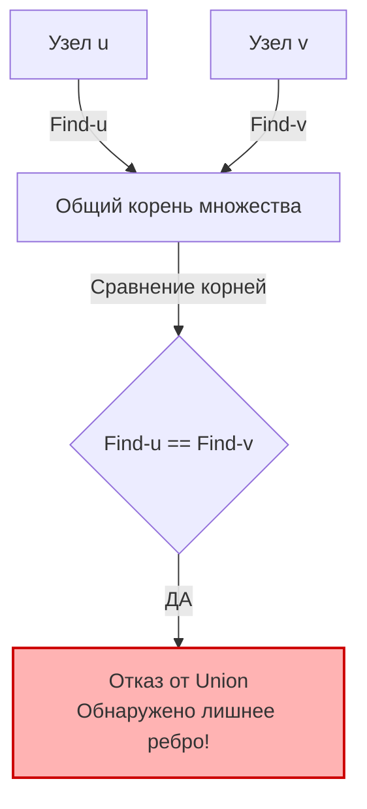

## Возвращение к истокам: DSU в чистом виде

В разделе, посвященном графам, мы уже концептуально разбирали проблему Broadcast Storm и циклов в топологиях дата-центров (статья [[7. Redundant Connection]]). Там мы выяснили, что алгоритмы обхода вроде DFS или BFS не подходят для потокового добавления ребер из-за сложности $O(N^2)$, и впервые заговорили о структуре Union-Find.

Теперь, когда у нас есть железобетонный, оптимизированный шаблон DSU из статьи [[3. Number of Connected Components]], мы можем решить задачу **Redundant Connection** (LeetCode №684) буквально в 10 строк бизнес-логики. 

Здесь мы сфокусируемся именно на том, как элегантно шаблон DSU ложится на задачу поиска цикла и какие подводные камни с индексацией нас ждут на собеседовании.

---

## Идеальное применение: Почему DSU создан для этой задачи?

**Условие напоминает:** Нам дают дерево из $N$ узлов, в которое добавили ровно одно лишнее ребро. Дерево превратилось в граф с одним циклом. Нам дают ребра по одному, и мы должны найти то самое ребро, которое замыкает кольцо.

В контексте DSU логика элементарна:
1. Изначально все $N$ узлов — это $N$ изолированных множеств (компонент).
2. Мы берем ребро `u-v` и пытаемся сделать `Union(u, v)`.
3. Если узлы `u` и `v` были в **разных** множествах, ребро `u-v` объединяет их. Это нормальное построение дерева.
4. Если узлы `u` и `v` УЖЕ находятся в **одном** множестве (то есть у них общий корень: `Find(u) == Find(v)`), значит, между ними уже существовал какой-то путь. Добавление ребра `u-v` **создает цикл**. Это и есть наше лишнее ребро.

### Визуализация момента истины


---

## Идиоматичная реализация и ловушка с индексацией

> [!warning] Ловушка / Gotcha: 1-based indexing
> Внимательно читайте условие! В этой задаче узлы нумеруются от `1` до `N`. 
> В прошлой задаче они нумеровались от `0` до `N-1`. Если вы по привычке выделите массив `make([]int, n)` и попытаетесь обратиться к `parent[n]`, вы получите `panic: index out of range` прямо на лайв-кодинге.
> 
> **Решение Senior-инженера:** Никогда не делайте сдвиги вроде `u-1` и `v-1` по всему коду — это порождает баги. Просто выделите массив на один элемент больше `make([]int, n+1)` и игнорируйте нулевой индекс. Память в 8 байт (один `int`) стоит ровно ноль, а читаемость кода и надежность возрастают многократно.

```go
// Используем наш стандартный шаблон DSU
type DSU struct {
    parent []int
    size   []int
}

// NewDSU аллоцирует массивы размером N+1
func NewDSU(n int) *DSU {
    dsu := &DSU{
        parent: make([]int, n+1),
        size:   make([]int, n+1),
    }
    // Инициализируем элементы от 1 до N
    for i := 1; i <= n; i++ {
        dsu.parent[i] = i
        dsu.size[i] = 1
    }
    return dsu
}

func (d *DSU) Find(x int) int {
    if d.parent[x] != x {
        d.parent[x] = d.Find(d.parent[x]) // Сжатие путей
    }
    return d.parent[x]
}

// Union возвращает false, если множества УЖЕ объединены
func (d *DSU) Union(x, y int) bool {
    rootX := d.Find(x)
    rootY := d.Find(y)

    if rootX == rootY {
        return false // Найден цикл!
    }

    // Объединение по размеру (Union by Size)
    if d.size[rootX] < d.size[rootY] {
        d.parent[rootX] = rootY
        d.size[rootY] += d.size[rootX]
    } else {
        d.parent[rootY] = rootX
        d.size[rootX] += d.size[rootY]
    }

    return true
}

func findRedundantConnection(edges [][]int) []int {
    // В графе, который был деревом, количество узлов равно количеству ребер
    n := len(edges)
    
    dsu := NewDSU(n)

    // Обрабатываем ребра в том порядке, в котором они даны
    for _, edge := range edges {
        u, v := edge[0], edge[1]
        
        // Как только Union не смог объединить узлы, мы возвращаем это ребро
        if !dsu.Union(u, v) {
            return edge
        }
    }

    return nil
}
```

---

## Под капотом: Скорость и Escape Analysis

Давайте посмотрим на это решение с точки зрения рантайма Go. 
Мы не создаем ни одного пользовательского слайса внутри цикла. Нам не нужна очередь (как в BFS) или стек (как в DFS). 

- **Аллокации:** Происходят ровно один раз внутри `NewDSU`. `make([]int, n+1)` выделяет два непрерывных блока памяти в куче.
- **Локальность кэша:** В цикле `for _, edge := range edges` мы читаем данные последовательно. Процессор включает Hardware Prefetcher и загружает `edges` в кэш. Обращения к `d.parent` и `d.size` благодаря сжатию путей также очень быстро локализуются в горячих линиях L1/L2 кэша.
- **Временная сложность:** $O(N \cdot \alpha(N))$. Для $N$ ребер мы делаем операции, стремящиеся к константе $O(1)$. По сути, алгоритм отрабатывает за линейное время $O(N)$.
- **Пространственная сложность:** $O(N)$ для хранения структуры DSU.

> [!tip] Собеседование
> Почему в условии сказано: *"Если таких ребер несколько, верните то, которое встречается в массиве последним"*?
> Это подсказка, что алгоритм должен обрабатывать ребра **последовательно**. Наш DSU именно так и делает: он строит дерево шаг за шагом. То ребро, на котором DSU "споткнется" и найдет цикл, и будет тем самым "последним", замкнувшим кольцо в истории построения графа.

## Итог

Задачи на компоненты связности и поиск циклов в неориентированных графах (где узлы — это просто числа `int`) с помощью DSU решаются механически, по одному и тому же шаблону. Вы просто копируете структуру и пишете 5 строк логики в цикле.

Но что, если узлы — это не числа от $1$ до $N$? Что, если нам нужно склеивать профили пользователей, где идентификаторами служат строки (Email или номер телефона)? Здесь плоские массивы `[]int` напрямую не сработают. Как модифицировать DSU для работы с бизнес-сущностями и строками, мы разберем в одной из самых неприятных и частых задач на собеседованиях в FAANG: [[5. Accounts Merge]].