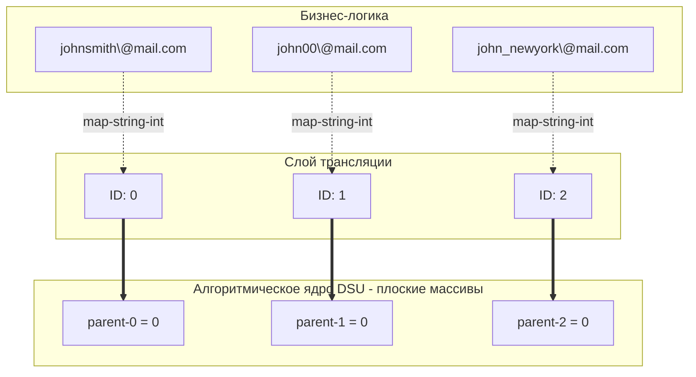

## Склейка профилей (Identity Resolution) в реальном мире

В предыдущих статьях (см. [[1. Теория. Union Find]] и [[3. Number of Connected Components]]) мы работали с DSU в идеальных лабораторных условиях: наши узлы были заботливо пронумерованы от `0` до `N-1`. Процессор обожает такие данные, ведь они идеально ложатся в индексы массивов.

Но в реальном Enterprise-бэкенде (особенно в CRM, системах антифрода и Data Lakes) графы строятся не на абстрактных числах, а на бизнес-сущностях. 
Пользователь может зарегистрироваться с ноутбука по email, а через месяц войти с телефона по номеру. Система создает два разных профиля. Когда пользователь делает заказ, указывая и email, и телефон, система должна понять, что это **один и тот же человек**, и объединить его историю покупок. Этот процесс называется **Identity Resolution**.

Задача **Accounts Merge** (LeetCode №721) моделирует именно этот сценарий.

**Условие:** Дан массив аккаунтов, где `accounts[i][0]` — это имя (Name), а остальные элементы `accounts[i][1:]` — это email-адреса этого человека. 
Два аккаунта принадлежат одному человеку, если у них есть **хотя бы один общий email**. Заметьте: даже если имена совпадают (оба "John"), но общих email нет — это два разных человека. И наоборот, если имена совпадают и есть общий email, их нужно слить в один аккаунт. 
Нужно вернуть склеенные аккаунты, где первым элементом идет имя, а дальше — отсортированные по алфавиту уникальные email-адреса.

---

## Архитектурная проблема: Строки вместо чисел

Каждый уникальный `email` — это узел графа. Если два email лежат в одном аккаунте, между ними есть ребро. Нам нужно найти компоненты связности.

Первая интуиция джуниора — переписать структуру DSU так, чтобы она работала со строками:
```go
// АНТИПАТТЕРН: DSU на мапах
type BadDSU struct {
    parent map[string]string
    size   map[string]int
}
```
Почему на собеседовании в BigTech это вызовет вопросы?
Операция `Find` требует прыжков по родителям (`parent[x]`). В случае с `map[string]string`, каждый прыжок — это вычисление хэша от строки, обход бакетов хэш-таблицы (сопровождаемый промахами кэша CPU) и побайтовое сравнение строк. Алгоритм Аккермана $O(\alpha(N))$ потеряет всю свою магию из-за гигантских константных накладных расходов.

### Решение Senior-инженера: Data-Oriented Design

Мы разделяем логику:
1. **Трансляция (Маппинг):** Мы один раз присваиваем каждому уникальному email целочисленный ID (от `0` до `K-1`).
2. **Алгоритм (DSU):** Запускаем наш сверхбыстрый шаблон DSU на плоских массивах `[]int`.
3. **Агрегация:** Собираем email-ы обратно в группы, опираясь на их корневые ID.


---

## Идиоматичная реализация на Go

Код ниже разбит на четкие логические блоки. Мы используем наш стандартный шаблон DSU без изменений.
```go
import "sort"

// 1. Стандартный, высокопроизводительный DSU
type DSU struct {
    parent []int
    size   []int
}

func NewDSU(n int) *DSU {
    dsu := &DSU{
        parent: make([]int, n),
        size:   make([]int, n),
    }
    for i := 0; i < n; i++ {
        dsu.parent[i] = i
        dsu.size[i] = 1
    }
    return dsu
}

func (d *DSU) Find(x int) int {
    if d.parent[x] != x {
        d.parent[x] = d.Find(d.parent[x])
    }
    return d.parent[x]
}

func (d *DSU) Union(x, y int) {
    rootX := d.Find(x)
    rootY := d.Find(y)
    if rootX == rootY {
        return
    }
    if d.size[rootX] < d.size[rootY] {
        d.parent[rootX] = rootY
        d.size[rootY] += d.size[rootX]
    } else {
        d.parent[rootY] = rootX
        d.size[rootX] += d.size[rootY]
    }
}

// 2. Основная бизнес-логика
func accountsMerge(accounts [][]string) [][]string {
    emailToID := make(map[string]int)
    emailToName := make(map[string]string)
    idCounter := 0

    // Шаг 1: Присваиваем каждому уникальному email свой ID 
    // и запоминаем, какому имени он принадлежит
    for _, acc := range accounts {
        name := acc[0]
        for i := 1; i < len(acc); i++ {
            email := acc[i]
            if _, exists := emailToID[email]; !exists {
                emailToID[email] = idCounter
                emailToName[email] = name
                idCounter++
            }
        }
    }

    // Шаг 2: Инициализируем DSU и связываем email-ы из одних аккаунтов
    dsu := NewDSU(idCounter)
    for _, acc := range accounts {
        // Берем первый email в аккаунте как опорный
        firstEmailID := emailToID[acc[1]]
        // Объединяем с ним все остальные email в этом аккаунте
        for i := 2; i < len(acc); i++ {
            dsu.Union(firstEmailID, emailToID[acc[i]])
        }
    }

    // Шаг 3: Группируем email-ы по их корневому ID в DSU
    rootToEmails := make(map[int][]string)
    for email, emailID := range emailToID {
        rootID := dsu.Find(emailID)
        rootToEmails[rootID] = append(rootToEmails[rootID], email)
    }

    // Шаг 4: Формируем итоговый результат
    // Выделяем память под слайс сразу нужного размера (Mechanical Sympathy)
    res := make([][]string, 0, len(rootToEmails))

    for _, emails := range rootToEmails {
        // Сортируем email-ы лексикографически (требование задачи)
        sort.Strings(emails)
        
        // Получаем имя (все email в этой группе принадлежат одному имени)
        name := emailToName[emails[0]]
        
        // Преаллоцируем слайс: 1 место под имя + количество email
        mergedAccount := make([]string, 0, len(emails)+1)
        mergedAccount = append(mergedAccount, name)
        mergedAccount = append(mergedAccount, emails...)
        
        res = append(res, mergedAccount)
    }

    return res
}
```

> [!warning] Ловушка / Gotcha: Аллокации при `append`
> Обратите внимание на строки создания слайсов в Шаге 4:
> `res := make([][]string, 0, len(rootToEmails))`
> `mergedAccount := make([]string, 0, len(emails)+1)`
> Если вы напишете `var res [][]string` или `mergedAccount := []string{name}`, вы заставите рантайм Go многократно вызывать `runtime.growslice`, выделять новые массивы в куче и копировать данные при каждом `append`. Задание Capacity заранее — это обязательный маркер опытного Go-инженера.

---

## Под капотом: Строки, GC и Сортировка

Давайте разберем, насколько наш код эффективен с точки зрения рантайма Go.

1. **Строки (Strings) в Go:**
Строка в Go — это структура `StringHeader`, содержащая указатель на базовый массив байт и длину (всего 16 байт на 64-битной архитектуре). 
Когда мы копируем email в `rootToEmails` или `mergedAccount`, мы копируем **только заголовки (16 байт)**. Сами текстовые данные (массивы байт) остаются в исходном месте, выделенном при чтении входных аргументов `accounts`. Мы не создаем копий строк в памяти!

2. **Сортировка `sort.Strings`:**
Функция переставляет местами те самые 16-байтные заголовки. При сравнении двух строк рантайм Go сначала сравнивает их длины, а затем (если нужно) делает быстрый ассемблерный вызов `memcmp` для базовых массивов байт.

3. **Сложность:**
   - **Время:** $O(N \cdot K \cdot \log(N \cdot K))$, где $N$ — количество аккаунтов, $K$ — максимальное число email в аккаунте. Основное время тратится не на DSU (который работает за около $O(1)$), а на **сортировку** итоговых групп `sort.Strings(emails)`.
   - **Память:** $O(N \cdot K)$. Мы создали `map` для отображения строк в числа, DSU размером с количество уникальных email, и структуру для группировки. В худшем случае все email уникальны, и мы потратим память, пропорциональную размеру входа.

## Итог

Задача **Accounts Merge** учит нас важнейшему принципу проектирования: **отделяйте бизнес-сущности от алгоритмических примитивов**.
Не пытайтесь заставить DSU, графы или деревья работать напрямую со строками или тяжелыми структурами (OOP-подход). Транслируйте их в скаляры (целые числа), "скормите" быстрым алгоритмам на плоских массивах (Data-Oriented approach), а затем смапьте результаты обратно. Это ключ к написанию высоконагруженного бэкенда на Go.

Мы научились склеивать компоненты и находить избыточные связи в неориентированных сетях. Но что определяет, является ли граф вообще деревом? Существуют строгие правила, по которым сеть признается валидной иерархией. Этот концепт (и финальный босс раздела про компоненты) мы разберем в следующей задаче: [[6. Graph Valid Tree]].