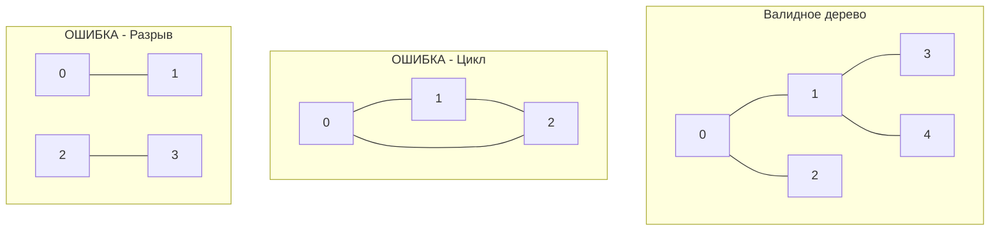

## Фундаментальные законы сетей: Что делает граф деревом?

Мы уже видели, как легко строгая иерархия ломается от одной лишней связи в задаче о дата-центрах ([[4. Redundant Connection]]). Но там нам гарантировали, что граф был деревом до добавления кабеля. 

А что, если нам просто "высыпают" массив из $N$ узлов и массив случайных ребер? Как математически строго и алгоритмически быстро доказать, что перед нами **Валидное дерево (Valid Tree)**?

Эта задача (LeetCode №261, *Graph Valid Tree*) — финальный босс базовой теории графов на собеседованиях. Она проверяет, знаете ли вы фундаментальные дискретные свойства структур данных, с которыми работаете каждый день (будь то DOM-дерево браузера, AST-дерево компилятора Go или древовидная топология серверов).

С точки зрения теории графов, **Дерево — это неориентированный граф, удовлетворяющий двум строгим условиям:**
1. **Ацикличность:** В графе нет ни одного цикла (ни одного пути, возвращающегося в исходную точку).
2. **Связность:** Из любого узла можно добраться до любого другого (ровно одна компонента связности).


---

## Математический Fast Fail: Правило `N - 1`

Самая частая ошибка кандидатов — сходу начать писать сложный DFS/BFS для обхода всего графа или инициализировать гигантский DSU, не взглянув на размерности.

Математика гласит: **Любое дерево из $N$ вершин всегда содержит ровно $N - 1$ ребер.**
- Если ребер больше, чем $N - 1$ — по принципу Дирихле там **обязательно есть цикл**.
- Если ребер меньше, чем $N - 1$ — граф **гарантированно разорван** (несвязный).

> [!tip] Собеседование
> Начните решение с проверки: `if len(edges) != n - 1 { return false }`. 
> Это константное $O(1)$ время. Если интервьюер подкинет вам тест на 10 миллионов вершин и 10 миллионов ребер, ваш код вернет `false` за 1 наносекунду, в то время как код других кандидатов "подавится" созданием структур данных и упадет по Time Limit. Демонстрация знания математических инвариантов — это мощнейший сигнал для нанимающего менеджера.

Но одного этого условия недостаточно! Граф может иметь $N - 1$ ребер, но при этом содержать цикл в одной части и разрыв в другой. Нам нужен быстрый детектор циклов.

---

## Архитектура решения: Почему снова DSU?

У нас есть два пути:
1. **DFS/BFS:** Выделить массив слайсов `make([][]int, n)`, заполнить его ребрами $O(E)$, завести массив `visited` и запустить обход, проверяя, что мы посетили все $N$ узлов и не встретили back-edge.
2. **Union-Find (DSU):** Пройтись по массиву ребер, объединяя узлы. Если `Union` попытается объединить узлы, которые уже в одном множестве — мы нашли цикл.

Для этой задачи DSU выигрывает "всухую" по Mechanical Sympathy.
- **Никаких сложных аллокаций:** Мы не строим `[][]int`. Мы просто выделяем два плоских `[]int` массива.
- **Кэш процессора:** Итерирование по `edges` и обращение к `parent` линейно предсказуемы для CPU (Hardware Prefetcher).

### Идиоматичная реализация на Go
```go
// Стандартный шаблон DSU (Disjoint Set Union)
type DSU struct {
    parent []int
    size   []int
}

func NewDSU(n int) *DSU {
    dsu := &DSU{
        parent: make([]int, n),
        size:   make([]int, n),
    }
    for i := 0; i < n; i++ {
        dsu.parent[i] = i
        dsu.size[i] = 1
    }
    return dsu
}

func (d *DSU) Find(x int) int {
    if d.parent[x] != x {
        d.parent[x] = d.Find(d.parent[x]) // Сжатие путей
    }
    return d.parent[x]
}

// Union возвращает false, если обнаружен цикл
func (d *DSU) Union(x, y int) bool {
    rootX := d.Find(x)
    rootY := d.Find(y)

    if rootX == rootY {
        return false // Цикл найден!
    }

    // Объединение по размеру
    if d.size[rootX] < d.size[rootY] {
        d.parent[rootX] = rootY
        d.size[rootY] += d.size[rootX]
    } else {
        d.parent[rootY] = rootX
        d.size[rootX] += d.size[rootY]
    }

    return true
}

func validTree(n int, edges [][]int) bool {
    // 1. Быстрая математическая проверка (Fast Fail)
    if len(edges) != n-1 {
        return false
    }

    // 2. Инициализация DSU
    dsu := NewDSU(n)

    // 3. Поиск циклов
    for _, edge := range edges {
        u, v := edge[0], edge[1]
        
        // Если Union возвращает false, мы пытаемся соединить узлы,
        // которые УЖЕ связаны другим путем -> Это цикл.
        if !dsu.Union(u, v) {
            return false
        }
    }

    // Теорема графов: Если в графе N вершин, ровно N-1 ребер,
    // и нет циклов, то этот граф ГАРАНТИРОВАННО является одним связным деревом.
    // Нам даже не нужно считать количество компонент связности в конце!
    return true
}
```

> [!info] Под капотом: Избыточность проверок
> Вы могли заметить, что мы не проверяем счетчик `components == 1` в конце (как делали в [[3. Number of Connected Components]]). 
> Почему это безопасно? 
> Это следствие из определения Эйлеровых графов. Если мы успешно выполнили цикл из `N - 1` операций `Union`, и ни одна из них не вернула `false` (цикл), значит мы успешно произвели `N - 1` слияний изолированных множеств. 
> Изначально было `N` множеств. Каждое из `N - 1` успешных слияний уменьшает количество множеств ровно на 1. 
> Математика: $N - (N - 1) = 1$. У нас гарантированно осталась ровно одна компонента связности. Дополнительные проверки — это трата тактов CPU.

### Оценка сложности
- **Временная сложность:** $O(N \cdot \alpha(N))$. 
  Проверка `len(edges)` занимает $O(1)$. Инициализация DSU занимает $O(N)$. Цикл `for` выполняется $N-1$ раз, и каждый вызов `Union` работает за амортизированное околоконстантное время $O(\alpha(N))$. Итоговое время: практически линейное $O(N)$.
- **Память:** $O(N)$. Мы выделяем два массива `parent` и `size` размером $N$. Это минимально возможный overhead для задачи с таким входом.

---

## Итог

Задача **Graph Valid Tree** — это бриллиант графовых алгоритмов. Она объединяет в себе:
1. Знание дискретной математики (правило $E = V - 1$).
2. Умение применять "Short-circuiting" (ранний выход).
3. Понимание того, как структура DSU элегантно доказывает ацикличность без тяжелых рекурсий.

В рамках системного программирования этот алгоритм используется для валидации топологий (например, проверка конфигурации серверов на отсутствие кольцевых маршрутов в дата-центре перед деплоем настроек на маршрутизаторы).

Мы разобрали теорию и типовые применения Union-Find. Наш код готов к Production. В завершение этого раздела мы применим этот же шаблон к еще одной классической задаче, которая часто прячется за метафорами реального мира, — поиску провинций на карте: [[7. Number of Provinces]].