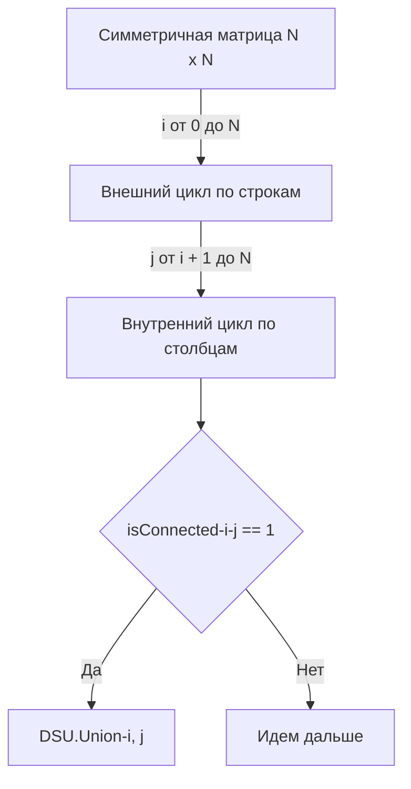

## Скрытые графы: Матрица смежности и кластеризация

Мы подошли к финалу раздела про Систему непересекающихся множеств. В предыдущих задачах ([[3. Number of Connected Components]] и [[6. Graph Valid Tree]]) графы подавались нам в виде **Списка ребер (Edge List)** — компактного массива связей.

Но в Enterprise-системах данные часто приходят в виде матриц. Задача **Number of Provinces** (LeetCode №547) — это классический пример такого входа.

**Условие:** Есть $N$ городов. Некоторые из них соединены между собой, некоторые — нет. Если город А соединен с городом Б, а Б соединен с В, то А соединен с В косвенно.
**Провинция** — это группа прямо или косвенно соединенных городов (то есть компонента связности).
Вам дана матрица `isConnected` размером $N \times N$, где `isConnected[i][j] = 1`, если город $i$ напрямую соединен с городом $j$, и `0` в противном случае.
Нужно вернуть общее количество провинций.

С точки зрения алгоритмики, "Number of Provinces" и "Number of Connected Components" — это **буквально одна и та же задача**. Разница заключается исключительно в структуре данных, которую нам передают на вход: Матрица смежности (Adjacency Matrix) вместо Списка ребер.

---

## Архитектурная разница: Список ребер vs Матрица смежности

Почему формат входа так важен на собеседовании? Он диктует асимптотическую сложность.

1. **Список ребер (`edges [][]int`)**:
   Мы видим только существующие связи. Время обработки пропорционально количеству ребер $O(E)$. В разреженных графах (Sparse Graphs), где ребер мало, это невероятно быстро.
2. **Матрица смежности (`isConnected [][]int`)**:
   Мы видим сетку $N \times N$. Чтобы найти все связи, мы **обязаны** прочитать каждую ячейку матрицы, даже если граф абсолютно пустой (0 ребер). Время обработки всегда $O(N^2)$. Это хорошо работает только для плотных графов (Dense Graphs).

> [!warning] Ловушка / Gotcha: Дублирование работы
> В неориентированном графе матрица смежности всегда **симметрична** относительно главной диагонали: если `isConnected[i][j] == 1`, то и `isConnected[j][i] == 1`. 
> Кроме того, главная диагональ всегда равна 1 (город всегда соединен сам с собой: `isConnected[i][i] == 1`).
> Джуниоры запускают двойной цикл от `0` до `N` и делают $N^2$ проверок. Это означает, что они пытаются объединить город с самим собой, а также дважды обрабатывают каждую связь (сначала как $A \to B$, потом как $B \to A$). Это пустая трата тактов процессора!

### Оптимизация (Треугольная итерация)

Как Senior-разработчик, вы должны итерироваться только по **верхнему треугольнику** матрицы (где `j > i`). Это сокращает количество итераций ровно в два раза: с $N^2$ до $\frac{N(N-1)}{2}$.


---

## Идиоматичная реализация через DSU

Для этой задачи мы используем наш "золотой шаблон" DSU со встроенным счетчиком компонент связности.
```go
type DSU struct {
    parent     []int
    size       []int
    components int
}

func NewDSU(n int) *DSU {
    dsu := &DSU{
        parent:     make([]int, n),
        size:       make([]int, n),
        components: n, // Изначально каждый город — отдельная провинция
    }
    for i := 0; i < n; i++ {
        dsu.parent[i] = i
        dsu.size[i] = 1
    }
    return dsu
}

func (d *DSU) Find(x int) int {
    if d.parent[x] != x {
        d.parent[x] = d.Find(d.parent[x]) // Сжатие путей
    }
    return d.parent[x]
}

func (d *DSU) Union(x, y int) bool {
    rootX := d.Find(x)
    rootY := d.Find(y)

    if rootX == rootY {
        return false // Уже в одной провинции
    }

    if d.size[rootX] < d.size[rootY] {
        d.parent[rootX] = rootY
        d.size[rootY] += d.size[rootX]
    } else {
        d.parent[rootY] = rootX
        d.size[rootX] += d.size[rootY]
    }

    d.components-- // Слияние произошло, провинций стало на одну меньше
    return true
}

func findCircleNum(isConnected [][]int) int {
    n := len(isConnected)
    if n == 0 {
        return 0
    }

    dsu := NewDSU(n)

    // Итерируемся только по верхнему треугольнику матрицы!
    // i - текущий город
    // j - город, с которым мы проверяем связь
    for i := 0; i < n; i++ {
        for j := i + 1; j < n; j++ {
            if isConnected[i][j] == 1 {
                // Если есть связь, объединяем их в одну провинцию
                dsu.Union(i, j)
            }
        }
    }

    // Возвращаем итоговое количество изолированных провинций
    return dsu.components
}
```

> [!info] Под капотом: Кэш-линии процессора и `[][]int` в Go
> В Go многомерный слайс `[][]int` — это массив заголовков `SliceHeader`, указывающих на разрозненные массивы строк в памяти. 
> Наш двойной цикл `for i ... for j` — это итерация **по строкам** (Row-major order). Процессор подгружает строку `isConnected[i]` в кэш L1, и внутренний цикл по `j` читает элементы из кэша со скоростью света. 
> Если бы вы написали внутренний цикл по `i` (итерация по столбцам), вы бы прыгали по разным строкам (разным `SliceHeader`) на каждой итерации, получая постоянные Cache Misses и разрушая производительность. На интервью в HFT-компании (High-Frequency Trading) этот нюанс является решающим.

### Оценка сложности
- **Временная сложность:** $O(N^2)$. Мы обязаны прочитать матрицу (или хотя бы её половину), что занимает $O(N^2)$ операций. Внутри мы вызываем `Union`, который работает за $O(\alpha(N)) \approx O(1)$. Итоговое время строго квадратично от числа городов.
- **Пространственная сложность:** $O(N)$. Нам нужны только два массива `parent` и `size` длины $N$ для структуры DSU. Сама матрица `isConnected` не копируется и не мутируется.

---

## Альтернатива: Зачем здесь DFS?

Можно ли решить эту задачу без DSU? Да. Можно завести массив `visited := make([]bool, n)` и запускать рекурсивный DFS для каждого непосещенного города $i$, обходя всю матрицу для поиска его соседей.

**Какой подход выбрать на интервью?**
- Оба подхода используют $O(N^2)$ времени и $O(N)$ памяти (DFS тратит память на стек вызовов горутины, DSU — на массивы).
- DSU пишется чуть дольше (из-за бойлерплейта структуры), но он математически изящнее и **не использует стек вызовов** (избавляет от риска `stack overflow` при огромных графах и не заставляет рантайм делать `stack growth`).
- Если у вас уже "набита рука" на шаблон DSU, используйте его. Это демонстрирует системный подход к Data-Oriented Design.

## Итог раздела Графов и DSU

Мы проделали огромный путь от базового понимания узлов до глубокой аналитики распределенных сетей. Вы научились:
1. Представлять графы в памяти так, чтобы угодить процессору.
2. Искать кратчайшие пути с ограничениями и без (Дейкстра, Беллман-Форд, BFS).
3. Работать с направленными зависимостями (Топологическая сортировка).
4. Элегантно кластеризовать динамические данные через Union-Find, экономя мегабайты оперативной памяти.

Но в распределенных системах и бэкенде задачи не ограничиваются маршрутизацией. Зачастую нам нужно не просто "найти путь", а постоянно поддерживать порядок данных, чтобы мгновенно выдавать **самый важный, самый приоритетный или самый свежий элемент**. 
Очереди сообщений, планировщики ОС, таймеры в Go (runtime timers) — все они полагаются на следующую фундаментальную структуру данных, к изучению которой мы переходим: [[1. Теория. Кучи]].