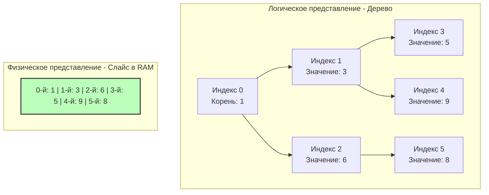

## Две "Кучи" в Computer Science: Терминологический конфликт

Перед тем как погрузиться в алгоритмы, мы как инженеры должны разграничить два совершенно разных понятия, которые на русском языке звучат одинаково:

1. **Heap Memory (Куча в памяти)** — область оперативной памяти, куда рантайм Go (Escape Analysis) отправляет переменные, которые должны жить дольше функции, их создавшей. Эту память убирает Garbage Collector (GC).
2. **Heap Data Structure (Структура данных Куча)** — специализированное дерево, о котором пойдет речь в этом разделе.

В контексте алгоритмических собеседований под словом "Куча" (Heap) **всегда** подразумевается структура данных, а точнее — **Бинарная куча (Binary Heap)**. Это фундаментальный строительный блок для реализации **Очередей с приоритетом (Priority Queues)**.

---

## Что такое Бинарная куча?

Бинарная куча — это бинарное дерево, которое подчиняется двум строгим правилам:

1. **Свойство формы (Complete Binary Tree):** Дерево заполняется строго сверху вниз и слева направо. Не может быть ситуации, когда узел справа существует, а слева от него пусто.
2. **Свойство кучи (Heap Property):** 
   - **Min-Heap (Минимальная куча):** Значение любого узла *меньше или равно* значениям его потомков. Корень дерева всегда содержит **минимальный** элемент.
   - **Max-Heap (Максимальная куча):** Значение любого узла *больше или равно* значениям его потомков. Корень содержит **максимальный** элемент.

В отличие от Бинарного дерева поиска (BST из раздела [[1. Теория. Деревья]]), куча не сортирует элементы строго слева направо. Куча гарантирует только вертикальный порядок (родитель-потомок). Между братьями (левым и правым узлом) порядка нет.

---

## Mechanical Sympathy: Идеальная локальность кэша

Если вы помните классическое бинарное дерево, мы реализовывали его через структуру с указателями (`Left *Node`, `Right *Node`). Указатели разбросаны по куче (в памяти), что приводит к промахам кэша (Cache Misses).

Гениальность Бинарной кучи в том, что благодаря "Свойству формы" (дерево всегда заполнено плотно), **ей не нужны указатели**. Куча идеально укладывается в обычный плоский массив (`slice` в Go)!

Для любого элемента по индексу `i`:
- **Левый потомок:** `2*i + 1`
- **Правый потомок:** `2*i + 2`
- **Родитель:** `(i - 1) / 2`


Процессор просто обожает Бинарные кучи. Когда вы обходите кучу, `Hardware Prefetcher` процессора подгружает массив в L1-кэш целыми линиями по 64 байта. Арифметика индексов (`2*i+1`) выполняется за один такт CPU с помощью инструкций битового сдвига (`i << 1 + 1`). 

Это Data-Oriented Design в чистом виде. Именно поэтому таймеры (Timers) в планировщике Go исторически были реализованы на базе 4-арной кучи (слайса).

---

## Основные операции и их стоимость

1. **Вставка - Push O-log N:**
   Мы добавляем новый элемент в конец массива (`append`). Но он может нарушить свойство кучи. Поэтому мы выполняем операцию **Sift Up (Всплытие)**: сравниваем элемент с родителем и меняем их местами, пока элемент не займет правильное место.

2. **Извлечение корня - Pop O-log N:**
   Корень — это нулевой элемент массива `arr[0]`. Как удалить его, не сдвигая весь массив за $O(N)$? 
   Мы меняем корень местами с **самым последним элементом** массива. Затем укорачиваем слайс `arr = arr[:len-1]` (это константная операция). Бывший последний элемент оказался в корне и сломал кучу. Мы выполняем **Sift Down (Погружение)**: меняем его с наименьшим из детей, пока он не осядет на дно.

3. **Получение минимума - Peek O-1:**
   Просто `arr[0]`.

> [!tip] Собеседование: Heapify vs Сортировка
> На хардовом интервью вас спросят: *"Сколько стоит создать кучу из неотсортированного массива из N элементов?"*
> Многие отвечают $O(N \log N)$, предполагая вставку по одному элементу. Это ошибка.
> Алгоритм Флойда (Heapify) строит кучу за линейное время **$O(N)$**. Он делает это, проходя массив с конца к началу и выполняя Sift Down для каждого узла. Это мощнейшая оптимизация, когда нам нужно быстро найти медиану или k-й элемент без полной сортировки массива.

---

## Кучи в Go: Пакет `container/heap`

В стандартной библиотеке Go нет готовой структуры "Куча из коробки". Вместо этого Go предоставляет пакет `container/heap`, который содержит логику алгоритмов (Sift Up / Sift Down), но требует от вас реализовать интерфейс `heap.Interface`.

Это классический паттерн проектирования в Go: рантайм берет на себя математику, а вы управляете памятью.

### Идиоматичный код Min-Heap для LeetCode

Любой Senior Go-разработчик должен уметь писать этот бойлерплейт с закрытыми глазами за 30 секунд.

```go
import "container/heap"

// 1. Создаем тип на базе слайса
type IntHeap []int

// 2. Реализуем встроенный интерфейс sort.Interface (3 метода)
func (h IntHeap) Len() int           { return len(h) }
// Если нужен Max-Heap, меняем знак: return h[i] > h[j]
func (h IntHeap) Less(i, j int) bool { return h[i] < h[j] } 
func (h IntHeap) Swap(i, j int)      { h[i], h[j] = h[j], h[i] }

// 3. Реализуем методы Push и Pop специально для container/heap
// Важно: приемник должен быть по указателю (*IntHeap), так как мы меняем длину слайса
func (h *IntHeap) Push(x any) {
    // x прилетает в виде пустого интерфейса any
    *h = append(*h, x.(int))
}

func (h *IntHeap) Pop() any {
    old := *h
    n := len(old)
    // Извлекаем последний элемент (который пакет heap уже поставил в конец)
    x := old[n-1]
    // Обрезаем слайс
    *h = old[0 : n-1]
    // Обязательно возвращаем интерфейс
    return x
}

func main() {
    h := &IntHeap{2, 1, 5}
    // O(N) построение кучи на месте (Heapify)
    heap.Init(h) 
    
    // O(log N) добавление
    heap.Push(h, 3) 
    
    // O(log N) извлечение минимума
    min := heap.Pop(h).(int) // Вернет 1
}
```

> [!warning] Ловушка / Gotcha: Интерфейсы и Escape Analysis
> Пакет `container/heap` был написан задолго до появления дженериков (Go 1.18). Поэтому его контракт требует передачи элементов как `any` (`interface{}`).
> Когда мы делаем `heap.Push(h, 5)`, целочисленный примитив `5` **упаковывается в интерфейс (Boxing)**. В высоконагруженных циклах (сотни миллионов итераций) это может заставить компилятор выделить память в куче (Escape to Heap), что создаст мусор для GC. 
> В современном высокопроизводительном Go-бэкенде для узких мест часто пишут кастомные Generic-кучи (используя пакет `cmp`), чтобы избежать аллокаций интерфейсов. Но для LeetCode и типовых собеседований `container/heap` — это золотой стандарт.

---

## Итог

1. Бинарная куча — это частичная сортировка. Она не знает ничего о полном порядке элементов, она знает только то, что на вершине находится Абсолютный Чемпион (минимум или максимум).
2. Дерево кучи не требует указателей `*Node`, оно идеально ложится в `[]int`, максимизируя скорость работы CPU кэша.
3. Построение кучи из массива стоит $O(N)$, а извлечение и вставка — $O(\log N)$.

Когда у вас есть структура, которая всегда держит самый большой (или маленький) элемент на поверхности и позволяет добавлять элементы "на лету", открывается целый класс задач. Чаще всего они сводятся к поиску $K$ самых частых, самых близких или самых больших элементов среди миллионов записей (например, в логах или стримах данных). Этот фундаментальный паттерн мы разберем в следующей статье: [[2. Задачи Top K]].