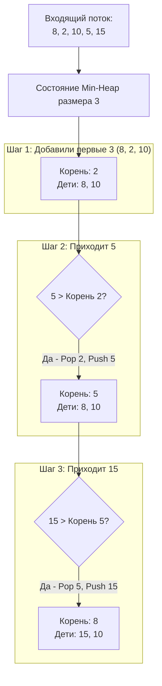

## Паттерн Top K: Поиск "Элиты" в данных

В реальных высоконагруженных системах мы редко хотим получить абсолютно все данные. Бизнесу нужны выжимки:
- 10 самых популярных товаров за сутки (Top K Frequent).
- 5 ближайших водителей такси к пользователю (K Closest).
- 100 самых активных пользователей для рассылки (Top K Largest).

Когда на алгоритмическом собеседовании вы слышите фразы *"наибольшие"*, *"наименьшие"*, *"самые частые"* в связке с конкретным числом **K**, в вашей голове должна мгновенно загораться неоновая вывеска: **ИСПОЛЬЗОВАТЬ КУЧУ (HEAP)**.

В этой статье мы разберем архитектурный паттерн решения задач класса Top K, сравним его с сортировкой и заглянем под капот работы памяти процессора.

---

## Наивный подход: Полная сортировка

Самое первое и интуитивное решение, которое пишет Junior-разработчик — собрать все данные в массив (слайс), отсортировать его и взять первые `K` элементов.
```go
func getTopKNaive(nums []int, k int) []int {
    // В Go 1.21+ используем обобщенную сортировку
    slices.SortFunc(nums, func(a, b int) int {
        return b - a // Сортируем по убыванию
    })
    return nums[:k]
}
```

> [!warning] Ловушка / Gotcha: Проблема масштаба
> Этот код отлично работает для массива из 1000 элементов. Временная сложность: $O(N \log N)$.
> Но что, если `nums` — это лог-файл транзакций за год размером 500 Гигабайт, а нам нужно найти всего $K=10$ самых крупных переводов? 
> Вы не сможете загрузить 500 ГБ в оперативную память для выполнения `slices.Sort`. Вам придется писать внешнюю сортировку (External Sort) на диске (SSD/HDD), что убьет IO подсистему и займет часы. Нам нужен алгоритм, который забирает данные **потоком (Streaming)** и требует минимум оперативной памяти.

---

## Архитектура решения: Паттерн "Куча размера K"

Бинарная куча, которую мы разобрали в [[1. Теория. Кучи]], позволяет нам поддерживать список кандидатов в "Топ", не храня все остальные данные.

**Главный контринтуитивный парадокс паттерна Top K:**
- Чтобы найти $K$ **наибольших** элементов, нужно использовать **Min-Heap (Минимальную кучу)**.
- Чтобы найти $K$ **наименьших** элементов, нужно использовать **Max-Heap (Максимальную кучу)**.

### Почему для "наибольших" нужна Min-Heap?

Представьте, что $K = 3$. Мы ищем 3 самых богатых людей. 
Мы заводим Min-Heap. Особенность Min-Heap в том, что самый **бедный** из этой тройки всегда находится на самом верху (в корне кучи `heap[0]`). 

Когда приходит новый человек из потока данных, нам нужно принять решение: достоин ли он войти в Топ-3? 
Мы просто сравниваем его с корнем кучи (самым бедным из топа). 
- Если новый человек беднее корня, мы его игнорируем. 
- Если он богаче корня — мы "выгоняем" корень (`Pop`) и добавляем нового человека (`Push`).


### Оценка сложности
- **Память:** $O(K)$. Нам нужен слайс размером ровно `K`. Для $K=10$ это всего 80 байт. Это легко помещается в L1-кэш процессора, работает со скоростью света и позволяет обрабатывать бесконечные потоки данных (Data Streams).
- **Время:** Вставка и удаление из кучи занимают $O(\log K)$. Мы делаем это (в худшем случае) для каждого из $N$ элементов. Итоговое время: $O(N \log K)$. 
Так как обычно $K \ll N$ (например $K=10, N=1,000,000$), логарифм от $K$ — это крошечная константа ($\log_2 10 \approx 3.3$). Алгоритм работает почти за линейное время $O(N)$.

---

## Mechanical Sympathy: Кэш процессора и Куча

Давайте посмотрим на операцию проверки элемента с точки зрения "железа":
```go
// val - новый элемент из потока
if val > h.IntHeap[0] { // Обращение к корню
    heap.Pop(h)
    heap.Push(h, val)
}
```

Куча в Go — это обычный слайс (непрерывный кусок памяти). Корень всегда находится по индексу `0`. 
Так как размер слайса равен $K$ (и обычно он мал), **весь этот слайс постоянно живет в самом быстром L1-кэше ядра процессора**. 
Проверка `val > h.IntHeap[0]` не требует похода в основную оперативную память (RAM). Это означает, что для 99% элементов потока, которые не проходят проверку (не достойны войти в Топ), отбраковка происходит за считанные такты CPU. Алгоритм не просто математически эффективен $O(N \log K)$, он еще и максимально аппаратно-дружелюбен (Hardware-Friendly).

> [!tip] Собеседование: Куча vs Quickselect
> Продвинутый интервьюер спросит вас: *"А можно ли решить задачу Top K за $O(N)$ времени?"*
> Да, можно. Существует алгоритм **Quickselect** (Основанный на логике QuickSort), который в среднем случае находит k-й элемент за $O(N)$. 
> **Но у него есть два фатальных недостатка для бэкенда:**
> 1. Он работает **только с массивами в памяти (In-memory)**. Он должен переставлять элементы внутри массива. Он не работает с бесконечными потоками (Streams) или огромными файлами, которые не влезают в RAM.
> 2. В худшем случае (при неудачном выборе опорного элемента - pivot) его сложность деградирует до $O(N^2)$.
> Поэтому для потоковой обработки и гарантии предсказуемой задержки (Latency) в production всегда выбирают Кучу.

---

## Резюме: Шаблон решения

Для любой задачи формата "Найди K самых X", ваш алгоритм в Go будет выглядеть так:
1. Выбрать правильную кучу: для Top K "Самых больших" пишем Min-Heap. Для Top K "Самых маленьких" пишем Max-Heap.
2. Преаллоцировать структуру кучи с `Capacity = K` (чтобы избежать реаллокаций).
3. Пройтись по данным:
   - Если размер кучи `< K`, просто делаем `Push`.
   - Если размер `== K`, смотрим на корень. Если новый элемент "лучше" корня (больше для Min-Heap, меньше для Max-Heap), делаем `Pop` и `Push`.
4. В конце куча будет содержать искомые K элементов.

С теорией покончено. Пора применить этот шаблон к самой популярной задаче из этой категории, которая попадается на собеседованиях почти в 100% случаев, если секция посвящена структурам данных. Переходим к практике: [[3. Kth Largest Element in Array]].