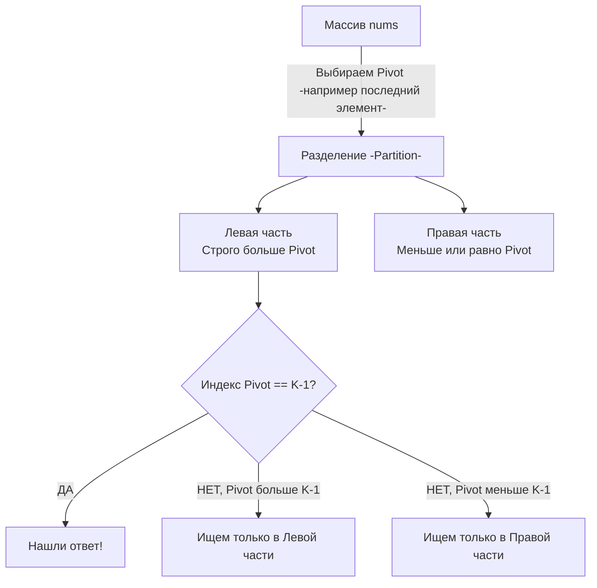

Задача **Kth Largest Element in an Array** (LeetCode №215) — это абсолютная классика алгоритмических собеседований. 

**Условие:** Дан массив целых чисел `nums` и целое число `k`. Нужно вернуть $k$-й по величине элемент в массиве. 
*Примечание:* Это должен быть $k$-й элемент в отсортированном порядке, а не $k$-й уникальный элемент (дубликаты учитываются).

На интервью уровня Junior достаточно просто отсортировать массив. Но от претендента на Middle+/Senior ожидают глубокого понимания компромиссов между памятью, временем исполнения и поведением кэша процессора. Эта задача — идеальный полигон для сравнения двух мощнейших концепций: **Очередей с приоритетом (Heaps)** и **Алгоритма Quickselect**.

---

## Подход 1: Наивный (Полная сортировка)

Самый простой и читаемый код, который можно написать на Go:
```go
import "slices"

func findKthLargestSort(nums []int, k int) int {
    // В Go 1.21+ используем пакет slices.
    // По умолчанию slices.Sort сортирует по возрастанию.
    slices.Sort(nums)
    // k-й наибольший находится по индексу len - k
    return nums[len(nums)-k]
}
```

> [!info] Под капотом: pdqsort в Go
> Начиная с Go 1.19, стандартная сортировка использует алгоритм **Pattern-Defeating Quicksort (pdqsort)**. Он работает за $O(N)$ на уже отсортированных данных и гарантирует $O(N \log N)$ в худшем случае, обходя слабости классического Quicksort. 
> Из-за идеальной локальности кэша (массив переставляется in-place), этот подход на практике работает невероятно быстро для массивов до 100,000 элементов, часто обгоняя более сложные $O(N)$ алгоритмы за счет низких константных накладных расходов.

**Оценка:**
- **Время:** $O(N \log N)$.
- **Память:** $O(\log N)$ для стека вызовов внутри сортировки.

На собеседовании этот подход нужно озвучить первым, сказать про `pdqsort` и перейти к более оптимальным решениям.

---

## Подход 2: Min-Heap размера K (Потоковый алгоритм)

Как мы обсуждали в статье [[2. Задачи Top K]], чтобы найти $K$ *наибольших* элементов, мы используем **Минимальную кучу (Min-Heap)** размера $K$.

Алгоритм:
1. Кладем первые $K$ элементов в Min-Heap.
2. Для каждого оставшегося элемента: сравниваем его с корнем кучи (минимальным из текущего Топ-K).
3. Если новый элемент больше корня — удаляем корень и добавляем новый элемент.
4. В конце в корне кучи останется ровно $k$-й наибольший элемент.

### Идиоматичная реализация (container/heap)
```go
import "container/heap"

// 1. Бойлерплейт для Min-Heap
type MinHeap []int

func (h MinHeap) Len() int           { return len(h) }
func (h MinHeap) Less(i, j int) bool { return h[i] < h[j] }
func (h MinHeap) Swap(i, j int)      { h[i], h[j] = h[j], h[i] }

func (h *MinHeap) Push(x any) {
    *h = append(*h, x.(int))
}

func (h *MinHeap) Pop() any {
    old := *h
    n := len(old)
    x := old[n-1]
    *h = old[0 : n-1]
    return x
}

// 2. Основная логика
func findKthLargestHeap(nums []int, k int) int {
    // Выделяем память ровно под K элементов, чтобы избежать реаллокаций
    h := make(MinHeap, 0, k)
    
    for _, num := range nums {
        if h.Len() < k {
            heap.Push(&h, num)
        } else if num > h[0] {
            // Если элемент больше самого маленького в нашем Топ-К
            heap.Pop(&h)
            heap.Push(&h, num)
            
            // Оптимизация: можно заменить Pop и Push на одну операцию:
            // h[0] = num
            // heap.Fix(&h, 0)
            // Это сэкономит аллокации интерфейсов и вызовы append!
        }
    }
    
    // Корень кучи - это самый маленький элемент из K наибольших
    return h[0]
}
```

> [!tip] Собеседование: Оптимизация `heap.Fix`
> Замена пары `heap.Pop` + `heap.Push` на присваивание корню `h[0] = num` с последующим вызовом `heap.Fix(&h, 0)` — это маркер Senior-инженера. 
> `Pop` уменьшает слайс, `Push` делает `append`. Оба работают через пустой интерфейс `any`, что может триггерить Escape Analysis и выделять память в куче (Heap Memory). 
> `h[0] = num` работает напрямую с памятью массива, а `heap.Fix` просто делает операцию `Sift Down` (погружение) за $O(\log K)$, не меняя длину слайса и не аллоцируя мусор для GC.

**Оценка:**
- **Время:** $O(N \log K)$. В худшем случае каждый элемент инициирует перестроение кучи.
- **Память:** $O(K)$ для хранения кучи. Идеально для Streaming Data, где размер потока $N$ бесконечен (или не влезает в RAM), а $K$ фиксировано.

---

## Подход 3: Quickselect (Алгоритм Хоара)

Если интервьюер просит алгоритм со временем $O(N)$, он ждет **Quickselect**.
Этот алгоритм основан на логике быстрой сортировки (Quicksort), но вместо того чтобы рекурсивно сортировать обе половины массива, он отбрасывает ту половину, в которой искомого элемента точно нет.

### Логика работы (Partitioning)

Мы выбираем опорный элемент (Pivot). Переставляем элементы так, чтобы все числа **больше** Pivot оказались слева, а все числа **меньше** — справа (поскольку мы ищем $k$-й *наибольший*).
После разделения Pivot встает на свой финальный индекс `p`. 
- Если `p == k - 1`, мы нашли ответ!
- Если `p < k - 1`, искомый элемент находится в правой части.
- Если `p > k - 1`, искомый элемент в левой части.


### Идиоматичная реализация In-Place

> [!warning] Ловушка / Gotcha: Худший случай $O(N^2)$
> В последних версиях LeetCode добавили тесты (например, массив из 100,000 пятерок или уже отсортированный массив), которые "убивают" наивный Quickselect по Time Limit Exceeded. 
> Если всегда брать последний элемент в качестве Pivot, на таких массивах алгоритм будет отрезать по одному элементу, деградируя до $O(N^2)$.
> **Лечение:** Рандомизация выбора Pivot или хотя бы выбор центрального элемента!
```go
import "math/rand"

func findKthLargest(nums []int, k int) int {
    // Ищем k-й наибольший (0-indexed)
    targetIndex := k - 1
    
    var quickSelect func(left, right int) int
    quickSelect = func(left, right int) int {
        // Базовый случай: остался один элемент
        if left == right {
            return nums[left]
        }
        
        // Рандомизация Pivot для избежания худшего случая O(N^2)
        pivotIdx := left + rand.Intn(right-left+1)
        
        // Прячем Pivot в самый конец, чтобы он не мешал обходу
        nums[pivotIdx], nums[right] = nums[right], nums[pivotIdx]
        pivot := nums[right]
        
        // Указатель для элементов, которые больше Pivot
        storeIndex := left
        
        for i := left; i < right; i++ {
            if nums[i] > pivot { // Сортируем по убыванию (большие влево)
                nums[storeIndex], nums[i] = nums[i], nums[storeIndex]
                storeIndex++
            }
        }
        
        // Возвращаем Pivot на его законное место
        nums[storeIndex], nums[right] = nums[right], nums[storeIndex]
        
        // Сравниваем финальный индекс Pivot с искомым targetIndex
        if storeIndex == targetIndex {
            return nums[storeIndex]
        } else if storeIndex > targetIndex {
            // Искомый элемент левее
            return quickSelect(left, storeIndex-1)
        } else {
            // Искомый элемент правее
            return quickSelect(storeIndex+1, right)
        }
    }
    
    return quickSelect(0, len(nums)-1)
}
```

### Mechanical Sympathy Quickselect-а

- **Память:** $O(1)$ (если переписать рекурсию на цикл) или $O(\log N)$ на стек вызовов. Мы сортируем массив **на месте (In-Place)**. Никаких аллокаций.
- **Кэш CPU:** Цикл `for i := left; i < right` идет строго линейно. Аппаратный Prefetcher обеспечивает идеальное попадание в L1-кэш.
- **Ветвления (Branching):** Условие `if nums[i] > pivot` вызывает Branch Misprediction, если данные хаотичны. Если массив заполнен случайными данными, процессор будет ошибаться в 50% случаев, сбрасывая конвейер (Pipeline Flush). Несмотря на это, математическое уменьшение массива в 2 раза на каждом шаге делает Quickselect невероятно быстрым.

---

## Итог: Что выбрать?

Интервьюеры любят спрашивать: *"Если у тебя есть Quickselect за $O(N)$ и Heap за $O(N \log K)$, что ты выберешь для продакшена?"*

**Правильный ответ Senior-инженера:**
Зависит от ограничений памяти и характеристик данных:
1. **Quickselect:** Выбираем, если массив целиком помещается в оперативную память (In-Memory) и мы имеем право его **мутировать** (изменять порядок элементов). Он быстрее в абсолютных числах за счет кэш-линий.
2. **Min-Heap размера K:** Выбираем, если данные поступают из бесконечного канала (Streaming/Kafka), массив не влезает в память, или массив передан по ссылке только для чтения (Read-Only). 

Мы научились искать абстрактные числа. Но что, если элементы несут бизнес-ценность, и нам нужно найти не самое большое значение, а самое **часто встречающееся** (например, топ поисковых запросов или самые популярные IP-адреса для rate-лимитера)? Эту задачу мы разберем в следующей статье: [[4. Top K Frequent Elements]].