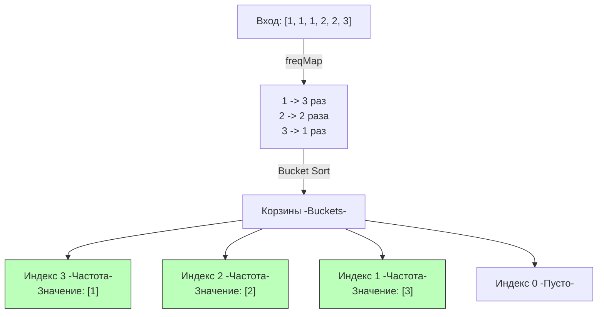

## Бизнес-ценность частотности: От абстракции к аналитике

В предыдущей статье [[3. Kth Largest Element in Array]] мы искали $K$-е по величине число, оперируя исключительно самими значениями элементов. Но в реальных бэкенд-системах (и на системных секциях FAANG) нас редко интересуют просто большие числа. 

Нас интересуют **частоты (Frequencies)**:
- **Антифрод (Rate Limiting)**: Найти 10 IP-адресов, с которых идет больше всего запросов.
- **Аналитика**: Вывести 5 самых популярных товаров на главной странице (Trending).
- **Кэширование**: Алгоритм LFU (Least Frequently Used) должен знать, какие ключи запрашиваются реже всего, чтобы вытеснить их из памяти.

Задача **Top K Frequent Elements** (LeetCode №347) просит нас вернуть $K$ наиболее часто встречающихся элементов из массива.

Здесь мы комбинируем два инструмента: хэш-таблицы для агрегации и кучи (или корзины) для ранжирования.

---

## Шаг 1: Фундамент — Агрегация частот

Независимо от того, какой алгоритм ранжирования мы выберем дальше, первым шагом мы обязаны собрать частотный словарь. В Go для этого идеально подходит `map[int]int`.
```go
freqMap := make(map[int]int)
for _, num := range nums {
    freqMap[num]++
}
```

> [!info] Под капотом: Размер map
> Если вы заранее знаете, что в массиве из $N$ элементов может быть много уникальных чисел (например, ID товаров), хорошим тоном будет задать `Capacity` для мапы при создании: `make(map[int]int, len(nums))`. Это избавит рантайм Go от необходимости делать дорогостоящие эвакуации бакетов (map growth / rehashing) при заполнении мапы.

---

## Подход 1: Min-Heap (Потоковый и универсальный)

Используя паттерн, описанный в [[2. Задачи Top K]], мы применяем **Минимальную кучу (Min-Heap) размера K**.

Но теперь элементами кучи будут не просто числа, а структуры `Item`, содержащие само значение и его частоту. 
**Ключевое отличие:** Куча сортирует элементы *по их частоте*, а не по значению.
```go
import "container/heap"

// 1. Описываем структуру элемента
type Item struct {
    val   int
    count int
}

// 2. Реализуем интерфейс кучи
type MinHeap []Item

func (h MinHeap) Len() int           { return len(h) }
// ВАЖНО: Сравниваем по частоте, чтобы наименее частый был в корне
func (h MinHeap) Less(i, j int) bool { return h[i].count < h[j].count }
func (h MinHeap) Swap(i, j int)      { h[i], h[j] = h[j], h[i] }

func (h *MinHeap) Push(x any) {
    *h = append(*h, x.(Item))
}

func (h *MinHeap) Pop() any {
    old := *h
    n := len(old)
    x := old[n-1]
    *h = old[0 : n-1]
    return x
}

func topKFrequentHeap(nums []int, k int) []int {
    // 1. Агрегация частот
    freqMap := make(map[int]int)
    for _, num := range nums {
        freqMap[num]++
    }

    // 2. Инициализируем кучу емкостью K
    h := make(MinHeap, 0, k)
    
    // 3. Поддерживаем размер кучи равным K
    for val, count := range freqMap {
        if h.Len() < k {
            heap.Push(&h, Item{val: val, count: count})
        } else if count > h[0].count {
            // Если новый элемент встречается чаще, чем "худший" из нашего Топ-K
            h[0] = Item{val: val, count: count}
            heap.Fix(&h, 0) // Оптимизация Sift Down без аллокаций
        }
    }

    // 4. Собираем результат
    res := make([]int, 0, k)
    for _, item := range h {
        res = append(res, item.val)
    }
    
    return res
}
```

### Оценка сложности
- **Время:** $O(N \log K)$. Сбор частот занимает $O(N)$. Проход по мапе из $U$ уникальных элементов (где $U \le N$) с вставкой в кучу занимает $O(U \log K)$. Поскольку $K \le U \le N$, итоговое время асимптотически равно $O(N \log K)$.
- **Память:** $O(N)$ для хэш-таблицы + $O(K)$ для кучи.

---

## Подход 2: Корзинная сортировка (Bucket Sort) - Уровень Senior

Интервьюер может задать вопрос: *"А можно ли решить эту задачу за чистое $O(N)$ время?"*

Да, можно. Мы можем использовать свойство конкретно этой задачи: **Частота любого элемента не может превышать размер массива $N$.** 
Следовательно, мы можем создать массив (корзины), где **индекс** — это частота, а **значение** — список элементов с такой частотой.



### Идиоматичная реализация (Bucket Sort)

```go
func topKFrequent(nums []int, k int) []int {
    // 1. Агрегация частот
    freqMap := make(map[int]int)
    for _, num := range nums {
        freqMap[num]++
    }

    // 2. Инициализация корзин.
    // Максимальная частота равна len(nums). Следовательно, нужен массив размером len+1
    buckets := make([][]int, len(nums)+1)
    
    // 3. Раскидываем элементы по корзинам
    for val, count := range freqMap {
        // Мы не знаем заранее, сколько элементов будет иметь одинаковую частоту,
        // поэтому используем append
        buckets[count] = append(buckets[count], val)
    }

    // 4. Собираем топ K с конца (от максимальной частоты к минимальной)
    res := make([]int, 0, k)
    for i := len(buckets) - 1; i >= 0 && len(res) < k; i-- {
        if len(buckets[i]) > 0 {
            // Распаковываем корзину
            for _, val := range buckets[i] {
                res = append(res, val)
                if len(res) == k {
                    return res
                }
            }
        }
    }

    return res
}
```

### Mechanical Sympathy: Какой подход выбрать для Production?

Оба алгоритма проходят тесты на LeetCode "на отлично". Но в реальной системе выбор зависит от характера данных:

1. **Bucket Sort ($O(N)$ время, $O(N)$ память)**:
   - **Плюсы:** Абсолютно линейное время. Нет оверхеда на балансировку дерева и работу с `interface{}` как в пакете `heap`.
   - **Минусы:** Огромный расход памяти, если $N$ очень велико (например, 10 миллионов логов). `make([][]int, 10000000)` выделит 10 миллионов `SliceHeader`-ов (по 24 байта = 240 МБ) *просто под корзины*, большинство из которых останутся пустыми (`nil`). Это сильно нагрузит GC.

2. **Min-Heap ($O(N \log K)$ время, $O(N)$ память для мапы, $O(K)$ для кучи)**:
   - **Плюсы:** Идеально подходит для обработки потоковых данных (Streaming). Вы можете держать кучу размером $K=10$ в оперативной памяти (буквально в кэше L1) и "скармливать" ей бесконечный поток входящих событий из Kafka, постоянно поддерживая актуальный Топ-10.
   - **Минусы:** Чуть больше тактов процессора на операции `Sift Down` при обновлении кучи, плюс overhead пакета `container/heap`.

> [!tip] Собеседование
> Рассказ о том, что Bucket Sort создает разреженный массив слайсов (Sparse Array of Slices) и тратит лишние мегабайты памяти ради линейного времени — это прямой путь к офферу уровня Senior. Инженер мыслит не только "Big O", но и байтами памяти.

## Итог

Мы разобрались, как ранжировать элементы по их частоте с помощью кучи или корзинной сортировки. 
Но кучи способны не только находить экстремумы. Они умеют **сшивать воедино** упорядоченные потоки данных. 
Как слить миллионы отсортированных строк из десятка разных шардов базы данных в один отсортированный поток, не загружая их все в оперативную память? Эту классическую архитектурную задачу мы решим в следующей статье: [[5. Merge K Sorted Lists]].