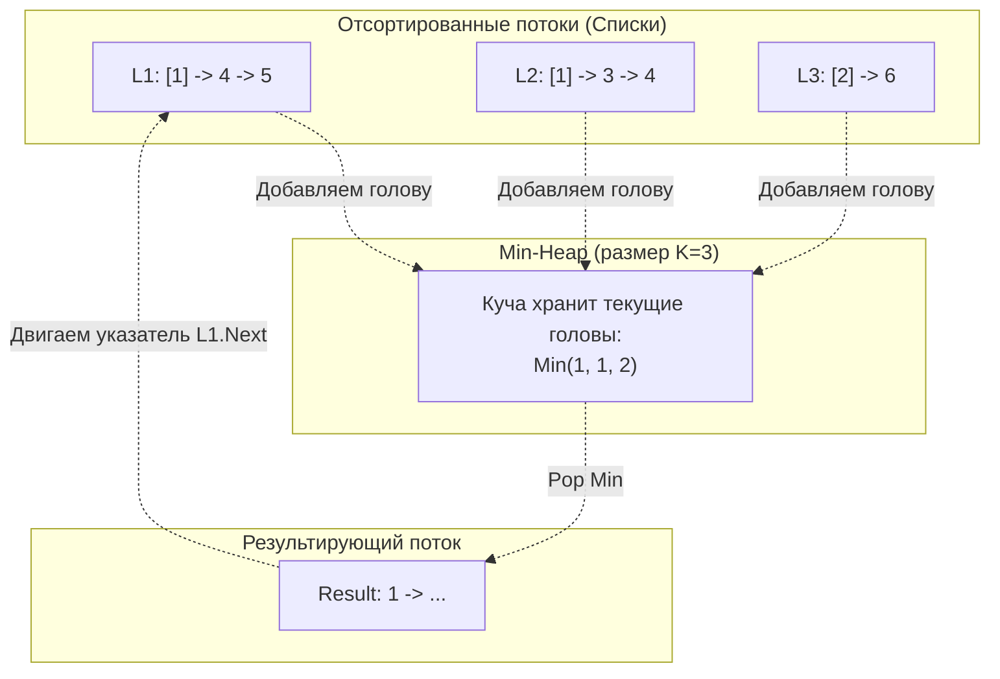

## Оркестрация потоков: Слияние отсортированных данных

В системном программировании и архитектуре баз данных есть фундаментальная проблема: **Агрегация отсортированных шардов**.
Представьте, что у вас есть 10 серверов баз данных (шардов). Вы делаете запрос: `SELECT * FROM logs ORDER BY timestamp DESC`. Каждый шард возвращает вам *свой* отсортированный поток логов. Вам нужно на лету слить эти 10 потоков в один общий отсортированный ответ для клиента, не загружая все терабайты данных в оперативную память балансировщика.

Эта операция — основа алгоритма внешней сортировки (External Sort), который используется в СУБД (PostgreSQL, ClickHouse) для слияния данных с диска. 

Задача **Merge k Sorted Lists** (LeetCode №23) моделирует именно этот процесс на классических связных списках (Linked Lists).

**Условие:** Дан массив из `k` связных списков, каждый из которых отсортирован по возрастанию. Нужно слить их все в один отсортированный связный список и вернуть его голову.

---

## Подход 1: Min-Heap (Потоковая обработка)

Если у нас есть $K$ отсортированных списков, самый маленький элемент гарантированно находится **среди голов (первых узлов)** этих $K$ списков. 
Мы можем завести Минимальную кучу (Min-Heap) и положить туда по одному (первому) элементу из каждого списка. 

**Алгоритм:**
1. Инициализируем Min-Heap и кладем в нее головы всех `K` списков.
2. Извлекаем из кучи минимальный узел (Pop). Этот узел точно является глобальным минимумом на текущий момент.
3. Добавляем этот узел в наш итоговый результирующий список.
4. Если у извлеченного узла есть следующий элемент (`node.Next != nil`), мы добавляем этот следующий элемент в кучу (Push).
5. Повторяем, пока куча не опустеет.


### Идиоматичная реализация на Go

```go
import "container/heap"

// Определение узла связного списка (дается LeetCode)
type ListNode struct {
    Val  int
    Next *ListNode
}

// 1. Бойлерплейт для кучи, хранящей указатели на узлы
type MinHeap []*ListNode

func (h MinHeap) Len() int           { return len(h) }
// Сравниваем узлы по их значению
func (h MinHeap) Less(i, j int) bool { return h[i].Val < h[j].Val }
func (h MinHeap) Swap(i, j int)      { h[i], h[j] = h[j], h[i] }

func (h *MinHeap) Push(x any) {
    *h = append(*h, x.(*ListNode))
}

func (h *MinHeap) Pop() any {
    old := *h
    n := len(old)
    x := old[n-1]
    *h = old[0 : n-1]
    return x
}

// 2. Основная логика
func mergeKListsHeap(lists []*ListNode) *ListNode {
    h := &MinHeap{}
    heap.Init(h)

    // Инициализируем кучу головами всех непустых списков
    for _, list := range lists {
        if list != nil {
            heap.Push(h, list)
        }
    }

    // Используем паттерн "Фиктивный узел" (Dummy Node)
    // Это избавляет от необходимости писать if head == nil при вставке первого элемента
    dummy := &ListNode{}
    curr := dummy

    // Пока в куче есть узлы
    for h.Len() > 0 {
        // Достаем минимальный узел
        minNode := heap.Pop(h).(*ListNode)
        
        // Прицепляем его к результату
        curr.Next = minNode
        curr = curr.Next
        
        // Если у этого списка есть продолжение, кидаем его в кучу
        if minNode.Next != nil {
            heap.Push(h, minNode.Next)
        }
    }

    return dummy.Next
}
```

### Mechanical Sympathy: Оценка и нюансы
- **Время:** $O(N \log K)$, где $N$ — общее количество всех узлов во всех списках, а $K$ — количество списков. Куча никогда не вырастает больше размера $K$. Вставка и извлечение стоят $O(\log K)$.
- **Память:** $O(K)$ для хранения кучи. Мы **не создаем новые узлы**, мы просто перевешиваем указатели (`Next`).
- **Цена интерфейсов:** Опять же, мы используем пакет `container/heap`, что приводит к упаковке `*ListNode` в `any`. Для связных списков, которые и так фрагментированы в куче (Pointer Chasing), это не так критично, но в сверхбыстрых системах этот оверхед можно убрать, написав дженерик-кучу.

---

## Подход 2: Разделяй и властвуй (Divide & Conquer)

Подход с кучей идеален для потоковой передачи данных по сети. Но если все списки **уже лежат в оперативной памяти**, мы можем обойтись вообще без дополнительных структур данных, используя паттерн слияния (как в сортировке слиянием — Merge Sort).

Мы можем написать вспомогательную функцию `mergeTwoLists`, которая сливает два списка за $O(L_1 + L_2)$. 
Затем мы берем наш массив из $K$ списков и начинаем сливать их попарно:
- 0-й с 1-м -> новый список А
- 2-й с 3-м -> новый список Б
И так далее. Массив из $K$ списков превращается в массив из $K/2$ списков. Повторяем процесс, пока не останется 1 список.

### Идиоматичная реализация (In-Place)
```go
// Вспомогательная функция слияния ДВУХ списков
func mergeTwoLists(l1, l2 *ListNode) *ListNode {
    dummy := &ListNode{}
    curr := dummy

    for l1 != nil && l2 != nil {
        if l1.Val < l2.Val {
            curr.Next = l1
            l1 = l1.Next
        } else {
            curr.Next = l2
            l2 = l2.Next
        }
        curr = curr.Next
    }

    // Прицепляем хвост того списка, который не закончился
    if l1 != nil {
        curr.Next = l1
    } else {
        curr.Next = l2
    }

    return dummy.Next
}

// Главная функция: Разделяй и властвуй
func mergeKLists(lists []*ListNode) *ListNode {
    if len(lists) == 0 {
        return nil
    }

    // Будем сужать окно массива, пока не останется 1 элемент
    for len(lists) > 1 {
        var merged []*ListNode

        // Идем с шагом 2, сливая пары
        for i := 0; i < len(lists); i += 2 {
            l1 := lists[i]
            var l2 *ListNode
            if i+1 < len(lists) {
                l2 = lists[i+1]
            }
            
            // Сливаем и добавляем в новый массив текущей итерации
            merged = append(merged, mergeTwoLists(l1, l2))
        }
        
        // Переходим к следующему "уровню" дерева слияний
        lists = merged
    }

    return lists[0]
}
```

### Сравнение с Min-Heap

Оба подхода имеют одинаковую временную сложность $O(N \log K)$. 
- В случае кучи логарифм возникает из-за операций `Sift Down/Up` при каждой вставке.
- В случае Divide & Conquer логарифм возникает из-за глубины "дерева слияний" (мы делим массив $K$ пополам $\log_2 K$ раз).

**Что выберет Senior?**
В чистом виде на LeetCode подход **Divide & Conquer** часто отрабатывает **быстрее** (в миллисекундах) и требует строго $O(1)$ дополнительной памяти (переиспользование массива `lists` можно сделать in-place без выделения нового слайса `merged`). Это происходит из-за отсутствия boxing/unboxing интерфейсов и отсутствия накладных расходов на вызовы `heap.Push/Pop`.

Однако, если интервьюер спрашивает: *"А что если списки не влезают в память, и мы читаем их итераторами из сети?"*, вы должны использовать вариант с **Min-Heap**. Divide & Conquer требует полного доступа к связным спискам, а Min-Heap потребляет данные по одному узлу (lazy evaluation).

## Итог

Задачи на K-элементов (Top K, Merge K) — это краеугольный камень системного дизайна на уровне алгоритмов. 
- Для работы с частотами и скользящими окнами в потоке данных — используйте **Min-Heap**.
- Для слияния статических In-Memory структур — используйте **Divide & Conquer**.

На этом мы завершаем раздел структур данных, отвечающих за экстремумы и ранжирование, и переходим к следующему классу задач, где нас интересует не порядок элементов, а быстрый доступ и вычисление суммы на отрезках.