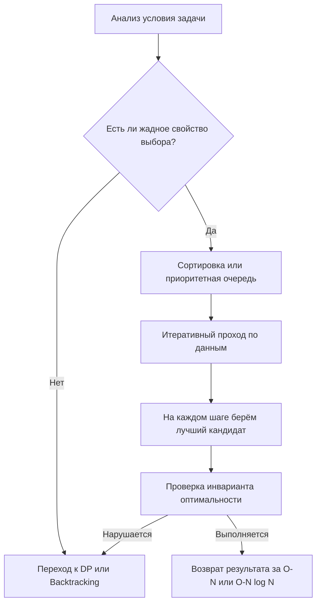

## Философия жадных алгоритмов: локальный оптимум, глобальная гарантия

Жадные алгоритмы (Greedy Algorithms) строятся на интуитивно простом принципе: на каждом шаге выбирать локально оптимальное решение в надежде, что это приведёт к глобально оптимальному результату. В отличие от динамического программирования или backtracking, жадность не откатывает решения и не исследует дерево состояний. Она принимает выбор навсегда. Именно поэтому жадные решения работают за `O(N)` или `O(N log N)`, потребляют `O(1)` дополнительной памяти и идеально ложатся на горячие пути высоконагруженных бэкенд-систем: планировщики задач, распределение ресурсов, маршрутизация пакетов и сжатие данных.



На собеседованиях жадные алгоритмы проверяют не умение писать циклы, а способность формально доказывать корректность, отличать истинную жадность от эвристики и предвидеть компромиссы между скоростью, памятью и детерминированностью. В Go это также тест на понимание механики сортировки, управления памятью и работы с плавающей точкой.

## Математический фундамент: как доказать оптимальность

Жадный алгоритм корректен только при наличии двух свойств:
1. **Жадное свойство выбора (Greedy Choice Property)**: локально оптимальный выбор можно безопасно включить в глобальное решение без потери оптимальности.
2. **Оптимальная подструктура (Optimal Substructure)**: оптимальное решение задачи содержит оптимальные решения подзадач.

Доказательство корректности на интервью обычно проводится через два метода:

### 1. Greedy Stays Ahead (Жадный остаётся впереди)
По индукции показываем, что после `k` шагов жадное решение всегда «не хуже» любого другого. Например, в задаче выбора непересекающихся интервалов: если жадный алгоритм выбрал интервал с самым ранним окончанием, он оставляет максимальное «свободное место» для следующих выборов. Любой другой выбор сужает пространство решений раньше, значит, жадный не может проиграть.

### 2. Exchange Argument (Аргумент обмена)
Берём произвольное оптимальное решение и последовательно заменяем его элементы жадными выборами. Если после каждой замены целевая функция не ухудшается, а количество жадных шагов растёт, значит, жадное решение тоже оптимально. Этот метод универсален для задач на расписания, кодирование Хаффмана и минимальные остовные деревья.

> [!info] Под капотом
> На белую доску никогда не пишите «это очевидно». Интервьюер ожидает формальную запись: `Пусть S* - оптимальное решение, S_g - жадное. Докажем, что |S_g| >= |S*|...`. В бэкенде это трансформируется в SLA: вы должны гарантировать, что ваша эвристика не нарушит бизнес-контракт. Жадность без доказательства — это баг в продакшене.

## Механическая симпатия: CPU, кэш и сортировка в рантайме Go

Почти все жадные алгоритмы начинаются с сортировки данных по ключу (время начала, стоимость, вес). Это доминирующая стадия `O(N log N)`. Как Go реализует это на уровне железа?

```go
import (
	"slices"
	"fmt"
)

type Interval struct {
	Start int
	End   int
}

// ScheduleIntervals жадно выбирает максимальное число непересекающихся интервалов
func ScheduleIntervals(intervals []Interval) ([]Interval, error) {
	if len(intervals) == 0 {
		return nil, fmt.Errorf("empty input")
	}

	// Сортировка по времени окончания: O(N log N)
	slices.SortFunc(intervals, func(a, b Interval) int {
		if a.End < b.End { return -1 }
		if a.End > b.End { return 1 }
		return 0
	})

	result := make([]Interval, 0, len(intervals)/2)
	result = append(result, intervals[0])
	lastEnd := intervals[0].End

	for i := 1; i < len(intervals); i++ {
		if intervals[i].Start >= lastEnd {
			result = append(result, intervals[i])
			lastEnd = intervals[i].End
		}
	}

	return result, nil
}
```

> [!info] Под капотом
> **Внутренности `slices.SortFunc` в Go:** Рантайм использует алгоритм **PDQSort** (Pattern-Defeating Quicksort). Он комбинирует Quicksort (быстрая средняя сложность), HeapSort (защита от `O(N²)` на деградировавших данных) и InsertionSort (оптимизация для малых подмассивов `<= 16` элементов). Все операции происходят in-place, что минимизирует аллокации. Однако `SortFunc` принимает замыкание. В Go 1.22+ замыкание без захвата внешних переменных не аллоцируется в куче, но если оно захватывает `result` или `lastEnd`, Escape Analysis пометит его как `escapes to heap`. Это создаёт скрытое давление на GC при вызове на `10⁵` элементах. Решение: передавать в сортировку только данные, вычислять метаданные до или после, либо использовать `slices.SortStableFunc` если требуется стабильность.

### Кэш-локальность и предсказание ветвлений
Цикл жадного выбора `for i := 1; i < len; i++` читает `intervals` последовательно. Это идеально для аппаратного prefetcher: CPU заранее подгружает следующие 64 байта в L1-кэш. Ветвление `if intervals[i].Start >= lastEnd` имеет высокую предсказуемость на реальных данных (интервалы часто пересекаются), поэтому pipeline flush возникает редко. Напротив, случайный доступ или сортировка указателей `[]*Interval` разрушает locality: каждый `End` лежит в случайной области кучи, промах L1 стоит ~4 такта, RAM ~100+ тактов. Для массивов `> 10⁵` разница в throughput достигает 3-5x.

## Идиоматичная реализация и скрытые накладные расходы

### Плавающая точка и стабильность сравнений
Жадные алгоритмы часто работают с дробными весами или вероятностями. Сравнение `float64` через `<` и `>` небезопасно из-за погрешностей IEEE-754. В Go это решается через epsilon-сравнение или сортировку по целочисленному представлению:

```go
import "math"

// Безопасное сравнение для жадных условий
func floatCmp(a, b float64) int {
	if math.Abs(a-b) < 1e-9 { return 0 }
	if a < b { return -1 }
	return 1
}
```

### In-place vs Copy-on-Write
Жадность часто мутирует входные данные. Если вызывающий код ожидает иммутабельность, вы создадите скрытый баг. Идиоматичный Go требует либо явного копирования `result := make([]T, len(in)); copy(result, in)`, либо чёткого контракта в документации: `// Mutates input slice for O-1 memory`. На Senior-уровне это обязательное требование.

> [!warning] Ловушка / Gotcha
> **Сортировка `[]interface{}` или `[]any`:** Категорический антипаттерн. Упаковка значения в интерфейс аллоцирует память в куче, добавляет уровень косвенности и ломает кэш-локальность. Компилятор не может заинлайнить сравнение, вызывается dynamic dispatch `runtime.eface2` или `runtime.iface2`. Для жадных алгоритмов, где сортировка занимает 80% времени, это просадка RPS на 40-60%. Всегда используйте типизированные слайсы или `slices` с дженериками.

## Когда жадность проигрывает: границы применимости

Жадные алгоритмы работают только когда выбор на шаге `i` не ограничивает допустимость шага `i+1`. Как только появляется **зависимость между состояниями** или **ограниченный ресурс с дискретными шагами**, жадность ломается.

| Задача | Жадность работает? | Почему | Альтернатива |
|--------|-------------------|--------|--------------|
| Размен монет (USD: 1,5,10,25) | Да | Каноническая система номиналов | Жадная |
| Размен монет (1,3,4) для 6 | Нет | Жадность: 4+1+1=3 монеты. Оптимально: 3+3=2 монеты | Динамическое программирование |
| Рюкзак 0-1 (целые предметы) | Нет | Локально выгодный предмет по весу/стоимости может не влезть | Динамическое программирование |
| Рюкзак дробный (можно брать часть) | Да | Дробное заполнение устраняет дискретность | Жадная |

> [!info] Под капотом
> Как быстро распознать, что жадность не сработает на интервью? Попробуйте контрпример на 3-4 элементах. Если локальный выбор «съедает» ресурс, который был критичен для комбинации из двух менее выгодных шагов, переходите к DP. В системном дизайне это аналогично выбору между кэшированием (жадный доступ к RAM) и вытеснением на диск (учёт будущих паттернов).

## Вопросы с собеседований: от белых досок до продакшена

> [!tip] Собеседование
> **Вопрос:** Как доказать, что ваш жадный алгоритм оптимален, не прибегая к перебору?
> **Ответ:** Использовать Exchange Argument. Предположим, что существует оптимальное решение `O`, отличающееся от жадного `G`. Покажите, что можно заменить первый отличающийся элемент `O` на элемент `G`, не ухудшив целевую функцию. Повторяйте, пока `O` не превратится в `G`. Это строгое доказательство, которое интервьюер ожидает на Middle+/Senior.

> [!tip] Собеседование
> **Вопрос:** Почему в Go `sort.Slice` может быть медленнее ручной реализации цикла?
> **Ответ:** `sort.Slice` требует замыкания-компаратора. Если компилятор не может заинлайнить его (например, из-за захвата внешних переменных или сложной логики), каждая пара элементов вызывает косвенный вызов функции. Ручная сортировка вставок или слияния для малых данных избегает этого оверхеда. В Go 1.21+ `slices.Sort` решает проблему через дженерики, позволяя компилятору генерировать моно-морфный код, который работает на уровне указателей без dynamic dispatch.

> [!tip] Собеседование
> **Вопрос:** Как реализовать жадный алгоритм в многопоточной среде без глобальной блокировки?
> **Ответ:** Разделить данные на независимые партиции, применить жадность локально, затем слить результаты. Например, в задаче распределения задач по воркерам: каждый воркер забирает топ-K задач из своей очереди, глобальный координатор разрешает конфликты. Это паттерн MapReduce. Если жадность требует глобального состояния, она по определению не параллелизуема без синхронизации, и тогда лучше перейти к lock-free очередям или шардированным структурам.

> [!tip] Собеседование
> **Вопрос:** Чем жадный алгоритм отличается от аппроксимационного в контексте NP-полных задач?
> **Ответ:** Жадный может быть точным (если доказано свойство выбора). Аппроксимационный гарантирует результат в пределах коэффициента `α` от оптимального, но никогда не достигает точного значения. В бэкенде аппроксимация используется, когда `O(2^N)` неприемлемо, а жадный эвристик даёт приемлемое качество с детерминированной латентностью. Пример: жадная упаковка в контейнеры (First-Fit) гарантирует `1.7 * OPT`, но работает за `O(N log N)`.

## Итог: чек-лист для проектирования жадных решений

1. **Доказывайте корректность**: используйте Greedy Stays Ahead или Exchange Argument. Без доказательства это эвристика, а не алгоритм.
2. **Контролируйте сортировку**: `slices.Sort` с типизированными компараторами. Избегайте `[]any`, замыканий с захватом и указателей, если не требуется.
3. **Минимизируйте аллокации**: in-place сортировка, предвыделение `result` с `make([]T, 0, hint)`, возврат copy-on-write если требуется иммутабельность.
4. **Проверяйте зависимости**: если выбор шага `i` влияет на допустимость `i+1` или создаёт конфликт ресурсов, жадность не сработает. Переходите к DP или потокам.
5. **Защищайтесь от float**: используйте epsilon-сравнение или целочисленные метрики. IEEE-754 не прощает жадных решений в финтехе и биллинге.
6. **Профилируйте PDQSort**: на больших данных сортировка доминирует. Если время критично, рассмотрите частичную сортировку `slices.SortFunc` + `nsmallest`, или переход к линейным алгоритмам подсчёта.

Жадные алгоритмы — это баланс между математической строгостью и инженерной эффективностью. Умение доказать оптимальность, предсказать поведение на уровне кэш-линий и выбрать правильные примитивы сортировки в Go напрямую коррелирует с готовностью проектировать предсказуемые и высокопроизводительные системы.

В следующей статье мы применим жадные принципы к классическим задачам на интервалы, разберём scheduling, merging, point intersection и оптимизацию под CPU-cache: [[2. Интервальные задачи]]