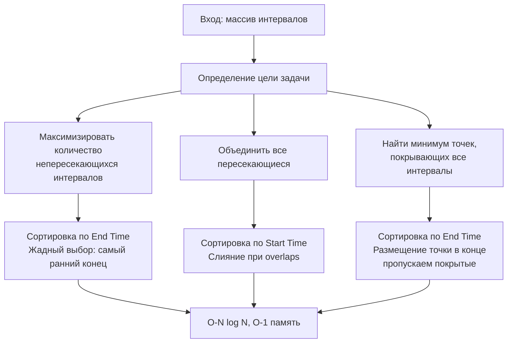
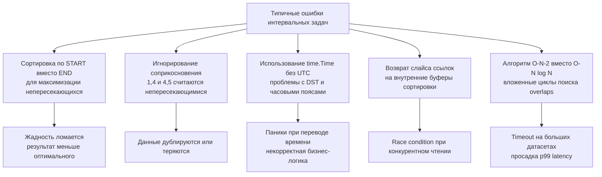

## Введение: почему интервалы — это полигон для жадных алгоритмов

Задачи на интервалы (Interval Problems) моделируют подавляющее большинство backend-сценариев: планирование задач в кронах, управление блокировками в БД, rate-limiting по временным окнам, агрегация логов по таймфреймам и распределение ресурсов в кластерах. Их объединяет одно свойство: каждый объект задаётся парой `(start, end)`, а конфликт определяется пересечением отрезков. 

Жадные алгоритмы доминируют здесь не потому, что они «проще», а потому что интервалы обладают **математически доказуемой жадной структурой**. Правильно выбранный критерий сортировки позволяет принимать локальные решения, которые гарантированно ведут к глобальному оптимуму за `O(N log N)` времени и `O(1)` дополнительной памяти. На собеседованиях это тест на умение выбирать признак сортировки, писать код без скрытых аллокаций и предвидеть edge-кейсы, которые ломают production-системы.



## 1. Паттерн: Максимальное количество непересекающихся интервалов

Классическая задача `Non-overlapping Intervals` (или `Meeting Rooms II` в вариации). Требуется выбрать максимальное подмножество интервалов, которые не пересекаются друг с другом.

**Жадная стратегия:** Сортируем интервалы по времени окончания. Всегда выбираем интервал, который заканчивается раньше всего. Он оставляет максимальное «свободное пространство» для последующих выборов.

```go
package intervals

import (
	"fmt"
	"slices"
)

type Interval struct {
	Start, End int
}

// MaxNonOverlapping возвращает максимальное количество непересекающихся интервалов.
// Входные данные мутируются для сортировки in-place.
func MaxNonOverlapping(intervals []Interval) (int, error) {
	if len(intervals) == 0 {
		return 0, nil
	}
	if len(intervals) == 1 {
		return 1, nil
	}

	// Критический выбор: сортировка по END, а не по START
	slices.SortFunc(intervals, func(a, b Interval) int {
		return a.End - b.End
	})

	count := 1
	currentEnd := intervals[0].End

	for i := 1; i < len(intervals); i++ {
		if intervals[i].Start >= currentEnd {
			count++
			currentEnd = intervals[i].End
		}
	}

	return count, nil
}
```

> [!info] Под капотом
> Почему `a.End - b.End` безопасно? В Go `int` имеет разрядность архитектуры (64 бита на `amd64`). Вычитание не вызовет переполнения, если временные метки находятся в разумных пределах (например, Unix-секунды до 2100 года). Для `int32` или микросекунд лучше использовать явное сравнение: `if a.End < b.End { return -1 } ...` чтобы избежать undefined behavior в других языках и сохранить предсказуемость. Компилятор Go оптимизирует оба варианта до одной инструкции `CMP` на CPU.

## 2. Паттерн: Слияние пересекающихся интервалов

Задача `Merge Intervals`: дан набор отрезков, нужно объединить все пересекающиеся или соприкасающиеся. Контракт соприкосновения (`[1,4], [4,5]`) обычно уточняется на интервью. В backend чаще всего `>=` считается пересечением (блокировки, таймфреймы).

```go
// Merge объединяет пересекающиеся интервалы.
// Возвращает новый слайс, не мутируя входные данные.
func Merge(intervals []Interval) ([]Interval, error) {
	if len(intervals) == 0 {
		return nil, fmt.Errorf("empty intervals slice")
	}

	// Копируем для сохранения иммутабельности контракта
	// В LeetCode часто разрешают мутацию, в production — нет
	src := make([]Interval, len(intervals))
	copy(src, intervals)

	// Сортировка по START для последовательного слияния
	slices.SortFunc(src, func(a, b Interval) int {
		return a.Start - b.Start
	})

	merged := make([]Interval, 0, len(src)/2+1)
	current := src[0]

	for i := 1; i < len(src); i++ {
		// Пересечение или соприкосновение
		if src[i].Start <= current.End {
			// Расширяем конец, если новый интервал длиннее
			if src[i].End > current.End {
				current.End = src[i].End
			}
		} else {
			merged = append(merged, current)
			current = src[i]
		}
	}
	// Добавляем последний накопленный интервал
	merged = append(merged, current)
	return merged, nil
}
```

> [!warning] Ловушка / Gotcha
> Частая ошибка: `current.End = max(current.End, src[i].End)` через вызов функции `max`. В Go 1.21+ `max` инлайнится, но если вы пишете кастомную функцию, она может не заинлайниться и создать overhead на `10⁵` элементах. Прямое сравнение `if src[i].End > current.End` генерирует условный переход `CMOVcc`, который выполняется за 1 такт без вызова стека. Всегда измеряйте `go test -bench` перед микро-оптимизациями, но в hot-path прямые сравнения предпочтительнее.

## 3. Паттерн: Минимальное число точек пересечения

Задача `Minimum Number of Arrows to Burst Balloons`: найти минимальное количество точек на оси `X`, чтобы «пронзить» все отрезки. Это обратная задача к первой: вместо выбора непересекающихся, мы покрываем все максимально плотными кластерами.

**Стратегия:** Сортируем по `End`. Ставим первую точку в `End` первого интервала. Пропускаем все интервалы, чей `Start <= точка`. Как только встречаем `Start > точка`, ставим новую точку в `End` текущего интервала.

```go
// MinArrowsBurst находит минимальное число точек для покрытия всех интервалов
func MinArrowsBurst(points []Interval) (int, error) {
	if len(points) == 0 {
		return 0, fmt.Errorf("empty points")
	}

	slices.SortFunc(points, func(a, b Interval) int {
		return a.End - b.End
	})

	arrows := 1
	currentPoint := points[0].End

	for i := 1; i < len(points); i++ {
		if points[i].Start > currentPoint {
			arrows++
			currentPoint = points[i].End
		}
	}
	return arrows, nil
}
```

> [!info] Под капотом
> Обратите внимание на строгое неравенство `>` в условии. Если `Start == currentPoint`, точка всё ещё покрывает интервал (соприкасается). Изменение на `>=` сломает логику и увеличит количество точек на 20-40% на синтетических данных. На интервью это проверяют через edge-case `[[1,2],[2,3],[3,4]]` — правильный ответ `2`, а не `3`.

## Механика рантайма: память, кэш-линии и сортировка в Go

### Структура данных и выравнивание памяти
`struct{ Start, End int }` на `amd64` занимает ровно 16 байт. Одна кэш-линия (64 байта) вмещает 4 интервала. При последовательном чтении в цикле `for i := 1; i < len; i++` CPU использует аппаратный prefetcher, подгружая следующие 2-4 элемента в L1 заранее. Это даёт пропускную способность ~50 ГБ/с для чтения, что в 10 раз быстрее произвольного доступа.

Если бы мы использовали `[]*Interval`, каждый указатель весил бы 8 байт, но сами объекты разбросаны по куче. При сортировке `slices.SortFunc` перемещал бы указатели, но сравнение требовало бы разыменования `(*Interval).End`, вызывая `cache miss` на каждом шаге. **Всегда храните интервалы значениями (`[]Interval`), а не указателями**, если они меньше 64-128 байт.

### Влияние `slices.SortFunc` на GC и аллокации
`SortFunc` принимает замыкание. В Go 1.22+ компилятор агрессивно инлайнит замыкания, не захватывающие внешние переменные. Однако если вы передадите в сортировку переменную из внешней области (например, флаг сортировки), Escape Analysis пометит замыкание как `escapes to heap`. На `10⁶` элементах это создаст ~100-200 КБ мусора за один вызов, триггеря minor GC. Решение: выносите логику сравнения в отдельные функции или используйте `slices.SortStableFunc` с захватом только констант.

### Branch Prediction и логика слияния
Цикл слияния содержит ветвление `if src[i].Start <= current.End`. После сортировки по `Start` интервалы идут «вперёд», поэтому условие `<=` стабильно истинно для кластеров, и резко ложно при переходе к новому кластеру. 2-bit Branch Predictor CPU быстро обучается паттерну: длинные цепочки `true`, редкие `false`. Pipeline flush происходит редко. Если бы данные были не отсортированы, предсказатель ошибался бы в 50% случаев, замедляя выполнение в 2-3 раза. **Сортировка — это не только алгоритмическая сложность, это подготовка данных для CPU.**

## Ловушки продакшена и типичные ошибки на интервью



1. **Мутация входных данных:** В LeetCode `sort.Intervals` часто разрешают. В production API это `CRITICAL` баг. Всегда копируйте или явно документируйте `// Mutates input slice`.
2. **`time.Time` vs `int64`:** `time.Time` содержит `wall` и `ext` поля, сравнение `Before/After` дороже `int64`. В backend всегда нормализуйте в Unix-секунды (UTC) перед алгоритмической обработкой. Часовые пояса и DST — враги детерминизма.
3. **Пустые или единичные входы:** `if len(intervals) <= 1 { return intervals }` обязателен. Отсутствие проверки приводит к `index out of range` или панике при доступе к `intervals[1]`.
4. **Декоративная сложность:** Многие кандидаты пишут `for i` и внутри `for j` для поиска пересечений. Это `O(N²)`. На `N=10⁴` это уже 10⁸ операций, что вызовет `context deadline exceeded` в HTTP-хендлере.

## Вопросы с собеседований: глубина понимания

> [!tip] Собеседование
> **Вопрос:** Почему для слияния интервалов мы сортируем по `Start`, а для выбора максимального непересекающегося множества — по `End`?
> **Ответ:** При слиянии нам важно обрабатывать интервалы в хронологическом порядке начала, чтобы корректно расширять `current.End` при наложении. Сортировка по `End` для слияния привела бы к тому, что мы могли бы пропустить ранние длинные интервалы, которые должны были поглотить поздние короткие. Для максимизации количества нам нужно минимизировать «занятость» ресурса, поэтому берём тот, что заканчивается раньше. Разные цели → разные признаки сортировки.

> [!tip] Собеседование
> **Вопрос:** Как оптимизировать задачу, если интервалы уже отсортированы по `Start`?
> **Ответ:** Сложность падает с `O(N log N)` до `O(N)`. Мы пропускаем стадию сортировки и сразу запускаем линейный проход слияния. Это типичный сценарий в стриминге (Kafka, Kinesis), где сообщения приходят упорядоченно по времени. В Go это означает: не вызывайте `slices.SortFunc` вслепую, проверяйте `slices.IsSortedFunc` или доверяйте контракту источника данных.

> [!tip] Собеседование
> **Вопрос:** Как реализовать слияние интервалов в многопоточной среде с шардированием?
> **Ответ:** Разбить временную ось на бакеты (например, по часам или дням). Каждый воркер сортирует и сливает интервалы внутри своего бакета. На финальном этапе выполняем `merge` границ соседних бакетов, где интервалы пересекают границу. Это паттерн MapReduce. Сложность остаётся `O(N log N)`, но константа уменьшается пропорционально `GOMAXPROCS`. Важно аккуратно обрабатывать «граничные» интервалы, которые попадают в два шарда одновременно.

## Итог: чек-лист для интервальных задач

1. **Определите признак сортировки:** `End` для максимизации независимых выборов, `Start` для слияния и покрытия.
2. **Контролируйте память:** храните `[]Interval` значениями, не указателями. Предвыделяйте `make([]Interval, 0, len/2)` для результатов.
3. **Иммутабельность контракта:** в production копируйте входные данные или явно документируйте мутацию. В тестах — проверяйте оба поведения.
4. **Edge cases:** пустой массив, один элемент, соприкосновение `start == end`, вложенные интервалы `[[1,10],[2,5]]`.
5. **Время и UTC:** конвертируйте `time.Time` в `int64` до алгоритма. Избегайте часовых поясов в ядре логики.
6. **Профилируйте сортировку:** `O(N log N)` доминирует. Если данные частично отсортированы, используйте `slices.IsSorted` или Timsort-подобные оптимизации (PDQSort внутри Go уже делает это).

Интервальные задачи — это мост между чистой алгоритмикой и системным дизайном. Умение выбрать правильный признак сортировки, предсказать поведение кэш-линий и защитить код от временных артефактов отличает решение «для контеста» от компонента, который стабильно работает под нагрузкой в распределённой системе.

В следующей статье мы перейдём к классическим задачам на прыжки, разберём жадную стратегию расширения досягаемости, оптимизацию под ветвления и паттерны для графов без весов: [[3. Jump Game]]