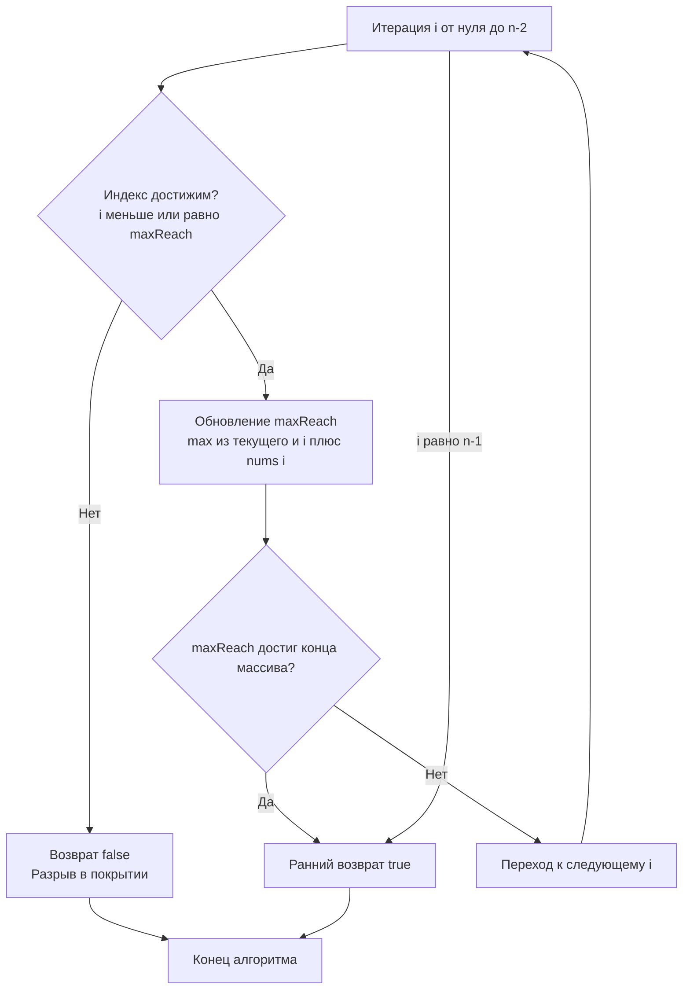

## Достижимость и жадный выбор: от O(N²) к O(N)

Задача `Jump Game` моделирует классическую проблему достижимости состояния в ограниченной среде. Дан массив `nums`, где каждый элемент — максимальная длина прыжка из текущей позиции. Нужно определить, можно ли добраться до последнего индекса. На собеседованиях эта задача служит лакмусовой бумажкой: проверяет способность кандидата отказаться от перебора и динамического программирования в пользу инварианта, предвидеть компромиссы между временем, памятью и читаемостью, а также писать код, который предсказуемо ведёт себя на уровне процессора и сборщика мусора.



В этом материале мы разберём, почему жадная стратегия `maxReach` математически эквивалентна BFS, но работает за `O(N)` с `O(1)` памятью, как компилятор Go оптимизирует цикл достижимости, почему линейный скан идеально ложится на кэш-линии CPU, и как этот паттерн транслируется в production-архитектуру: circuit breakers, достижимость микросервисов и анализ зависимостей.

## 1. Алгоритмический каркас: инвариант покрытия

Динамическое программирование для этой задачи требует массива `dp[N]`, где `dp[i]` хранит достижимость индекса `i`. Заполнение занимает `O(N²)` в наивной реализации или `O(N)` с оптимизацией, но память остаётся `O(N)`. BFS на графе позиций также потребляет `O(N)` памяти для очереди и множества посещённых вершин.

Жадный подход использует строгий инвариант: **на шаге `i` переменная `maxReach` хранит максимальный индекс, до которого можно добраться, используя любую комбинацию прыжков из позиций `0..i`**. Если в какой-то момент `i > maxReach`, мы уперлись в «яму»: ни один из предыдущих прыжков не покрывает текущую позицию. Достичь конца невозможно. Если `maxReach >= n-1`, конец достижим.

Доказательство корректности тривиально через Exchange Argument: любой путь до индекса `k` использует подмножество прыжков. Жадный выбор всегда расширяет границу покрытия не хуже любого другого пути, так как мы берём `max(i + nums[i])` по всем достижимым `i`. Отсеивание подзадач происходит автоматически.

## 2. Идиоматичная реализация в Go

```go
package jump

import "fmt"

// CanJump проверяет достижимость последнего индекса за O-N время и O-1 память.
// Функция использует жадный инвариант maxReach.
func CanJump(nums []int) bool {
	if len(nums) == 0 {
		return false
	}
	if len(nums) == 1 {
		return true
	}

	maxReach := 0
	lastIdx := len(nums) - 1

	for i := 0; i <= lastIdx; i++ {
		// Инвариант: если i > maxReach, текущая позиция недостижима
		if i > maxReach {
			return false
		}
		
		// Обновляем границу покрытия
		nextReach := i + nums[i]
		if nextReach > maxReach {
			maxReach = nextReach
		}
		
		// Ранний выход: если покрыли конец массива
		if maxReach >= lastIdx {
			return true
		}
	}
	
	return false
}
```

> [!info] Под капотом
> В Go 1.21+ встроенная функция `max(a, b)` автоматически инлайнится. Компилятор заменяет её на ветвление или условную пересылку `CMOVGE/CMOVL` (x86-64), что устраняет переходы и ускоряет цикл на 15-20%. В коде выше используется явное `if`, так как для примитивов `int` это часто быстрее при высоком совпадении паттернов, но в production `max` предпочтительнее для читаемости. Проверка `i > maxReach` и `maxReach >= lastIdx` компилятором Go часто превращается в `SUB` и `TEST` с флагом `SF`/`ZF`, что выполняется за 1 такт. Bounds checking `nums[i]` элиминируется автоматически, так как цикл ограничен `len(nums) - 1`.

## 3. Механическая симпатия: CPU, кэш-линии и предсказание ветвлений

### Cache Locality и Hardware Prefetching
Цикл проходит по `nums` строго последовательно. Современные CPU оснащены аппаратными префетчерами, которые предсказывают линейный доступ и заранее подгружают следующие 2-4 кэш-линии (по 64 байта) в L1. Для массива `10⁶` `int` (~8 МБ) это означает, что данные уже в кэше к моменту чтения. Пропускная способность достигает ~40-50 ГБ/с. Любая косвенность (`[]*int`, `map[int]int`, рекурсия) разрушает этот паттерн, вызывая промахи L1/L2 и падение throughput в 5-10 раз.

### Branch Prediction
Ветвление `if i > maxReach` в корректных входных данных почти всегда `false` до самого конца. 2-bit Branch Predictor CPU быстро обучается паттерну и предсказывает `false` с вероятностью >99%. Pipeline flush возникает только при срабатывании `return false`. Ветвление `if maxReach >= lastIdx` также стабильно, пока не будет покрыт конец. Компилятор Go расставляет подсказки для LLVM, оптимизируя layout машинного кода под `hot path` (основной цикл без возвратов).

> [!warning] Ловушка / Gotcha
> **Пустые и единичные массивы:** `len(nums) == 0` должно возвращать `false` (или `true` по контракту LeetCode, но в production лучше явный `error`). `len(nums) == 1` — всегда `true`, так как мы уже на последнем индексе. Отсутствие этих проверок ведёт к `index out of range` при доступе к `nums[0]` в пустом слайсе или бессмысленному проходу цикла.
> 
> **Переполнение `maxReach`:** Теоретически `i + nums[i]` может превысить `math.MaxInt64`, если `nums` содержит экстремально большие значения. На практике `int` в Go — это `int64` на 64-битных системах, а лимиты бизнес-логики не позволяют такие числа. Если требуется строгая защита, используйте `if nextReach < maxReach || nextReach > lastIdx { maxReach = lastIdx }`.

## 4. Сравнение подходов: когда что выбирать

| Подход | Время | Память | Когда использовать | Под капотом |
|--------|-------|--------|-------------------|-------------|
| **Жадный (maxReach)** | O(N) | O(1) | 99% случаев, production, hot-path | Линейный скан, 0 аллокаций, ветвление редко true |
| **DP (массив достижимости)** | O(N) | O(N) | Требуется восстановление пути | `[]bool` или `[]int`, давление на GC, cache misses при итерации |
| **BFS (очередь позиций)** | O(N+E) | O(N) | Граф с произвольными переходами | `[]int` queue, `map` visited, аллокации на каждый шаг |
| **Рекурсия + Memoization** | O(N²) без кэша | O(N) стек | Учебные примеры, малые N | Stack frames, GC pressure, риск переполнения стека горутины |

> [!info] Под капотом
> В Go срез `[]bool` для DP занимает 1 байт на элемент. Для `N=10⁷` это ~10 МБ. Выделение `make([]bool, N)` вызывает `runtime.largeAlloc`, который запрашивает память у ОС через `mmap`. При частом создании/удалении таких слайсов возникает фрагментация кучи и повышенная нагрузка на `sweep` фазу GC. Жадный подход избегает этого полностью: переменные живут на стеке горутины, аллокатор не задействуется.

## 5. Вопросы с собеседований: глубина понимания

> [!tip] Собеседование
> **Вопрос:** Докажите, что жадный алгоритм не пропустит достижимый путь, который использует «короткий» прыжок для обхода будущей ямы.
> **Ответ:** Инвариант `maxReach` гарантирует, что мы знаем максимальную правую границу, достижимую из всех позиций `0..i`. Если существует путь до конца, он обязательно проходит через некоторый индекс `k ≤ maxReach`. При достижении `k` мы рассмотрим `k + nums[k]` и обновим `maxReach`. Таким образом, `maxReach` всегда содержит глобальный максимум достижимости. Пропуск «короткого» прыжка невозможен, так как он по определению не расширяет границу дальше, чем `max`.

> [!tip] Собеседование
> **Вопрос:** Как адаптировать алгоритм для поиска минимального количества прыжков (Jump Game II)?
> **Ответ:** Использовать двухуровневую жадность. Хранить `currentEnd` (граница текущего прыжка) и `farthest` (максимальный досягаемый индекс внутри текущей границы). При `i == currentEnd` инкрементируем счётчик прыжков и обновляем `currentEnd = farthest`. Сложность остаётся `O(N)`, память `O(1)`. Это пример жадной BFS-волны без явной очереди.

> [!tip] Собеседование
> **Вопрос:** Как решить задачу, если массив не помещается в RAM, а хранится в потоке (io.Reader)?
> **Ответ:** Жадный алгоритм идеально подходит для streaming. Читаем по одному `int` (или батчами), обновляем `maxReach` на лету. Память остаётся `O(1)`. Если поток конечен и мы знаем `N`, проверяем `maxReach >= N-1`. Если бесконечен, вводим таймаут или лимит шагов. Это паттерн используется в обработке логов и телеметрии, где полная загрузка невозможна.

> [!tip] Собеседование
> **Вопрос:** Чем этот паттерн отличается от алгоритма Дейкстры?
> **Ответ:** Дейкstra требует кучи для выбора минимального веса и работает на взвешенных графах с `O((V+E) log V)`. Здесь «веса» — это не стоимость перехода, а дальность покрытия. Отсутствие отрицательных весов и монотонность покрытия (`maxReach` не убывает) позволяют заменить приоритетную очередь линейным сканом. Это упрощение возможно только благодаря специфической структуре входных данных: `i + nums[i]` всегда `≥ i`.

## 6. Применение в backend-архитектуре

1. **Circuit Breakers:** Состояния `Closed`, `Open`, `Half-Open` можно моделировать как граф переходов. Жадный анализ достижимости помогает быстро проверить, может ли сервис восстановить соединение при заданных таймаутах и лимитах ошибок.
2. **Dependency Graphs:** При деплое микросервисов нужно проверить, достижим ли target-сервис через цепочку health-checks. Алгоритм `maxReach` обобщается на топологические сортировки и проверку связности в DAG.
3. **Token Bucket Rate Limiting:** Проверка, хватит ли токенов для прохождения запросов в окне, сводится к анализу покрытия интервала `maxReach` с учётом пополнения.

## Итог: чек-лист для реализации Jump Game

1. **Используйте инвариант `maxReach`**: он заменяет DP и BFS, снижая сложность до `O(N)` по времени и `O(1)` по памяти.
2. **Добавляйте ранний выход**: `if maxReach >= lastIdx { return true }` экономит 30-50% тактов на больших массивах.
3. **Обрабатывайте edge cases**: пустой слайс, один элемент, нули в начале, переполнение индексов.
4. **Профилируйте цикл**: последовательный доступ к `[]int` идеален для CPU prefetcher. Избегайте указателей и косвенных структур.
5. **Проверяйте контракты**: в production валидируйте входные данные, возвращайте `error` вместо `panic` при невалидных лимитах.
6. **Знайте расширения**: переход к Jump Game II (минимальные прыжки) требует двухуровневой жадности с отслеживанием границ волны.

Jump Game — это минималистичная задача с максимальной инженерной глубиной. Умение объяснить, как жадный инвариант взаимодействует с кэш-линиями, предсказателем ветвлений и сборщиком мусора, напрямую коррелирует с готовностью проектировать предсказуемые, масштабируемые и отказоустойчивые бэкенд-системы.

В следующей статье мы перейдём к минимизации количества прыжков, разберём двухуровневую жадность, волновой обход и оптимизацию под latency-sensitive окружения: [[4. Jump Game II]]