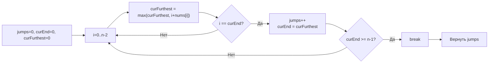

**LeetCode 45. Jump Game II.** Дан целочисленный массив `nums`, где `nums[i]` — максимальная длина прыжка, который можно совершить с позиции `i`. Требуется найти **минимальное количество прыжков**, чтобы добраться от индекса `0` до последнего индекса `n-1`. Гарантируется, что достичь последнего индекса возможно.

Эта задача — естественное продолжение [[3. Jump Game]] и центральный представитель **жадного алгоритма на массивах**. Если Jump Game проверяет достижимость (Greedy O(N)), то Jump Game II спрашивает о **минимальном** числе прыжков, что на первый взгляд заговаривает о динамическом программировании. Но наличие гарантии достижимости и монотонность дальности позволяют решить задачу за O(N) с O(1) памяти — тем самым жадным подходом, который имитирует BFS, не строя граф. Для Senior Go-разработчика это образец того, как замена очереди на целочисленную границу превращает интуитивное BFS-решение в итеративный проход без единой аллокации.

### Формулировка и уточнения

**Условие:** функция `jump(nums []int) int`. Возвращает количество прыжков. `nums[i] >= 0`. Гарантируется, что достичь последнего индекса можно.

**Вопросы интервьюеру (Senior-стиль):**
- *Может ли `nums` быть пустым или длиной 1?* Да, `n = 1` — мы уже на последнем индексе, нужно 0 прыжков.
- *Могут ли быть нули?* Да, `nums[i] = 0` означает, что из этой позиции прыгнуть нельзя, но конец всё равно достижим (значит, мы не задерживаемся в таких позициях, либо нулевые позиции обходятся).
- *Каков размер входа?* До 10⁴. Поэтому O(N) предпочтителен, O(N²) может не пройти.

### Наивное решение: динамическое программирование

Классическое DP: определим `dp[i]` — минимальное количество прыжков до индекса `i`. Инициализация: `dp[0] = 0`, остальные `math.MaxInt`. Для каждого `i` перебираем все `j < i`, и если из `j` можно допрыгнуть до `i` (`j + nums[j] >= i`), обновляем `dp[i] = min(dp[i], dp[j] + 1)`. Это O(N²) времени, O(N) памяти. При N = 10⁴ (10⁸ операций) может пройти на грани, но не демонстрирует знание жадного оптимума.

```go
// Наивный DP код опущен — он не оптимален
```

Узкое место: для каждого `i` мы проверяем все предыдущие позиции. Но мы замечаем, что дальность прыжка монотонно растёт при движении вперёд, и минимальное количество прыжков можно найти без вложенного цикла.

### Оптимальное решение: жадный BFS (однопроходный с границами)

**Идея.** Представим процесс как обход в ширину (BFS) по неявному графу, где узлы — индексы, а рёбра — возможные прыжки. BFS естественно находит кратчайший путь (минимальное количество прыжков). Но вместо очереди мы будем двигаться по уровням, отмечая границы.

На каждом шагу у нас есть текущий радиус действия `curEnd` — самый дальний индекс, которого можно достичь за текущее количество прыжков. Мы также поддерживаем `curFurthest` — самый дальний индекс, которого можно достичь **за один дополнительный прыжок** из любой точки в текущем радиусе. Когда мы проходим `curEnd` (достигаем конца текущего уровня), мы увеличиваем счётчик прыжков и обновляем `curEnd = curFurthest`. Как только `curEnd >= n-1`, мы можем достичь цели.

**Инвариант:** на старте `jumps = 0`, `curEnd = 0`, `curFurthest = 0`. После обработки всех индексов до `i-1` `curEnd` равен максимальному индексу, достижимому за `jumps` прыжков, а `curFurthest` — максимальному индексу, достижимому за `jumps+1` прыжков, используя только позиции ≤ `curEnd`. Когда `i` достигает `curEnd`, мы совершаем прыжок, увеличивая `jumps`, и новый `curEnd` становится `curFurthest`.

```go
func jump(nums []int) int {
    n := len(nums)
    if n <= 1 {
        return 0
    }
    jumps := 0
    curEnd := 0
    curFurthest := 0

    for i := 0; i < n-1; i++ {
        // обновляем самый дальний достижимый индекс
        if i+nums[i] > curFurthest {
            curFurthest = i + nums[i]
        }
        // если достигли конца текущего уровня — совершаем прыжок
        if i == curEnd {
            jumps++
            curEnd = curFurthest
            // ранний выход: если curEnd уже покрывает последний индекс
            if curEnd >= n-1 {
                break
            }
        }
    }
    return jumps
}
```

**Go-идиомы и комментарии:**
- Проверка `n <= 1` → 0 прыжков: мы уже на месте.
- Имена `curEnd`, `curFurthest` чётко отражают смысл.
- Цикл до `n-1`, потому что на последний индекс прыгать не нужно.
- Обновление `curFurthest` аккумулирует максимальную дальность.
- Условие `i == curEnd` — момент перехода на новый уровень BFS.
- Ранний выход: если `curEnd >= n-1`, можно не обрабатывать оставшиеся индексы, так как цель уже в зоне досягаемости.



### Почему это работает: BFS-перспектива и жадность

BFS гарантирует кратчайший путь в невзвешенном графе. Здесь граф — индексы массива, а ребро из `i` в `j` существует, если `j <= i + nums[i]`. Обычный BFS использовал бы очередь, но мы можем заменить её границами уровней, потому что рёбра «монотонны»: если из позиции `i` можно достичь `j`, то из любой позиции внутри текущего уровня также можно достичь `j` (поскольку все они имеют `i <= curEnd`). Следовательно, все вершины, обнаруживаемые на одном уровне, расположены непрерывным диапазоном. Граница уровня `curEnd` — это конец этого диапазона. Такой «линейный BFS» даёт O(N) времени и O(1) памяти — максимальная механическая симпатия.

На каждом шагу мы принимаем локально оптимальное решение: расширяем `curFurthest` как можно дальше. Это жадный выбор, который никогда не ухудшает глобальный минимум, потому что любой путь, использующий меньшее расширение, не сможет достичь цели быстрее. Доказательство через exchange argument: если существует оптимальное решение, которое на первом шагу не использует максимально возможный прыжок, мы можем заменить его прыжок на максимальный, не увеличив общее количество прыжков, так как новый радиус накроет не меньше позиций.

### Edge Cases

- **`n = 1`:** `[0]` — уже на месте, возврат 0.
- **`n = 2`, `nums = [1,0]`:** `curFurthest` после `i=0` = 1, `curEnd` становится 1, `jumps=1`. Ранний выход (`curEnd >= 1`). Ответ 1.
- **Все элементы единицы:** `[1,1,1,1]`. Проход: i=0: curFurthest=1, i==0 → jumps=1, curEnd=1. i=1: curFurthest=2, i==1 → jumps=2, curEnd=2. i=2: curFurthest=3, i==2 → jumps=3, curEnd=3 >=3 break. Ответ 3.
- **Большой разброс:** `[2,3,1,1,4]`. i=0: furthest=2, i==0 → jumps=1, end=2. i=1: furthest=4, i==1 (не end). i=2: i==2 → jumps=2, end=4 >=4 break. Ответ 2.
- **Нули, но конец достижим:** `[2,0,0]`. i=0: furthest=2, i==0 → jumps=1, end=2 >=2 break. Ответ 1.

### Анализ сложности

- **Время:** O(N). Каждый элемент просматривается не более одного раза. Внутреннее обновление `curFurthest` — O(1).
- **Память:** O(1). Три целочисленные переменные (`jumps`, `curEnd`, `curFurthest`). Никаких дополнительных слайсов или map.

### Mechanical Sympathy: отсутствие аллокаций и кэш-локальность

- **Чистый целочисленный проход.** Цикл идёт последовательно по непрерывному блоку памяти `nums`. Аппаратный prefetcher предсказывает следующие элементы, cache miss минимальны.
- **Отсутствие аллокаций.** Нет ни `make`, ни `append`, ни map. Все переменные живут на стеке. GC не испытывает давления.
- **Минимум ветвлений.** Внутри цикла — сравнения и арифметика. Предсказатель переходов работает идеально, особенно в типичном случае, когда `i == curEnd` происходит лишь несколько раз.
- **Сравнение с BFS на очереди.** BFS потребовал бы слайс очереди, операции `append` и `queue[1:]`, что привело бы к аллокациям и потенциальному росту нижележащего массива. Greedy-подход лишён этого недостатка полностью.

> [!info] Под капотом
> `nums` — это слайс `[]int`, заголовок которого (Data, Len, Cap) передаётся в функцию. Нижележащий массив интов лежит в куче (если он был аллоцирован вызывающей стороной). Доступ `nums[i]` — прямая адресация по смещению. Escape analysis для `jumps`, `curEnd`, `curFurthest` определяет их на стек — никакой «утечки» в кучу не происходит.

### Альтернативы и trade-off

- **DP за O(N²).** Прост в написании, но неоптимален по времени. Может не пройти при больших N.
- **BFS с очередью.** Более естественен для понимания, но требует O(N) памяти под очередь. В Go очередь на слайсе (`append` + сдвиг начала) сохраняет память под массив, который не освобождается; для одноразового вызова это терпимо, но жадный вариант чище.
- **Greedy с обратным проходом.** Можно идти с конца и искать самый левый индекс, откуда можно допрыгнуть до текущей цели, обновляя цель. Тоже O(N²) в худшем случае, если не оптимизировать.

> [!tip] Собеседование
> Вопрос: «Как ваше решение связано с BFS?»
> Ответ: «Я моделирую BFS, где уровни — это индексы, достижимые за `jumps` прыжков. Вместо хранения очереди я отслеживаю границу уровня `curEnd`. Как только я исчерпываю текущий уровень, я инкрементирую прыжки и перехожу на следующий уровень, граница которого уже вычислена как `curFurthest`. Это даёт O(N) времени и O(1) памяти без необходимости в дополнительных структурах данных».

### Итог

Jump Game II — это элегантный пример того, как жадный алгоритм, имитирующий BFS с границами уровней, находит минимальное количество прыжков за O(N) с O(1) памяти. В Go решение пишется в несколько строк, используя только целочисленные переменные, и демонстрирует идеальную механическую симпатию: последовательный доступ, ноль аллокаций и максимальная предсказуемость для CPU. Senior-разработчик видит связь с BFS и может обосновать, почему жадность здесь безопасна.

Следующая задача — **Gas Station** — предложит нам другую грань жадности: циклический обход и проверку возможности заправки с минимальным стартовым индексом. [[5. Gas Station]]