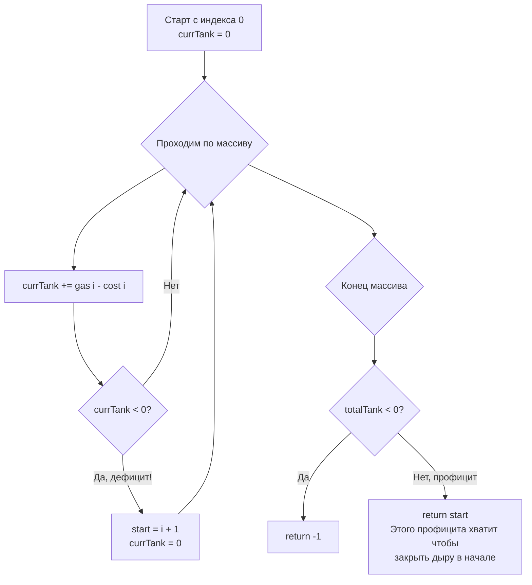

Задача Gas Station (LeetCode 134) — это жемчужина алгоритмического дизайна, которая выводит паттерн жадных алгоритмов на новый уровень. Если в [[4. Jump Game II]] мы могли позволить себе заглядывать вперед в пределах текущего прыжка, то здесь мы имеем дело с кольцевым маршрутом, где интуиция часто подводит. 

**Условие:** На кольцевой трассе расположено `n` АЗС. На станции `i` можно залить `gas[i]` литров бензина, а чтобы доехать до станции `i+1`, нужно `cost[i]` литров. Верните индекс стартовой станции, с которой можно проехать весь круг ровно один раз, или `-1`, если это невозможно. Гарантируется, что ответ единственный, если он существует.

В бэкенде эта задача моделирует маршрутизацию запросов в кольцевых топологиях (Ring Topology), балансировку нагрузки между узлами кластера с неравномерной утилизацией и управление кольцевыми буферами (Ring Buffers) в системах логирования.

## Наивный подход: Симуляция (O(N^2))

Первая мысль — попробовать стартовать с каждой станции `i` и симулировать поездку, пока топливо не закончится или мы не вернемся в начало. Это дает $O(N^2)$, что для $N=10^5$ вызовет Time Limit Exceeded (TLE). Двойной вложенный цикл с модульной арифметикой — смерть для производительности.

## Математический инсайт: Разрывая кольцо

Главный вопрос: можно ли узнать ответ за один проход (Single Pass)? Да, если мы докажем два ключевых свойства:

1. **Глобальный дефицит:** Если суммарное количество бензина на всех станциях меньше суммарной стоимости поездки ($\sum gas < \sum cost$), проехать круг невозможно ни с одной стартовой точки. Это очевидно.
2. **Локальный провал:** Если мы стартовали с точки `start` и в точке `i` у нас закончился бензин (бак стал `< 0`), то начинать путь с **любой** станции между `start` и `i` тоже бессмысленно.

> [!info] Под капотом
> Почему свойство локального провала работает? 
> Представьте, что вы стартовали с `start` с пустым баком. Доехали до `i` и бак стал `-5` (не хватило). Это значит, что на отрезке `[start, i]` суммарный дефицит составил 5 литров.
> Если бы вы попытались стартовать с точки `k` (где `start < k < i`), вы бы начали с 0 литров. Но отрезок `[k, i]` — это часть отрезка `[start, i]`. В точке `k` у вас был бы только накопленный профицит с `start` до `k`, но мы знаем, что весь отрезок в сумме убыточен. Следовательно, стартуя с 0, вы исчерпаете топливо еще быстрее. Единственный кандидат на новый старт — это станция `i+1`.

## Идиоматичный Go: O(N) без модульной арифметики

Реализация этого инсайта поразительно элегантна. Нам не нужно моделировать "круговость" массива через оператор остатка `%`. Мы проходим по массиву один раз слева направо, а в конце просто проверяем глобальный баланс.

```go
func canCompleteCircuit(gas []int, cost []int) int {
    totalTank, currTank := 0, 0
    start := 0

    for i := 0; i < len(gas); i++ {
        diff := gas[i] - cost[i]
        totalTank += diff
        currTank += diff

        // Если в текущем баке дефицит, эта стартовая точка
        // и всё, что между ней и текущей станцией, тупики.
        if currTank < 0 {
            // Сдвигаем старт на следующую станцию
            start = i + 1
            // Сбрасываем текущий бак для нового старта
            currTank = 0
        }
    }

    // Если глобальный баланс отрицательный, круг замкнуть невозможно
    if totalTank < 0 {
        return -1
    }
    
    // Иначе стартовая точка валидна
    return start
}
```



> [!warning] Ловушка / Gotcha
* Кандидаты часто боятся, что если `start` сдвигается на `i+1`, то они "не проверяют" путь от `start` обратно к `0`. Но в этом и магия `totalTank`! Если в конце `totalTank >= 0`, это значит, что профицит, накопленный на отрезке от `start` до конца массива, математически гарантированно покроет дефицит, который мы наблюдавали на отрезке от `0` до `start-1`. Дополнительный проход не нужен.

## Mechanical Sympathy: Почему Single Pass так быстр

На уровне процессора наш код — это идеальный сценарий:
1. **Sequential Access:** Мы читаем массивы `gas` и `cost` строго последовательно. Аппаратный префетчер (Hardware Prefetcher) процессора видит этот паттерн и начинает подгружать следующие кэш-линии в L1 кэш задолго до того, как они понадобятся. Cache Miss практически исключен.
2. **Отсутствие Modulo:** В наивном решении используется индекс `(i + 1) % n`. Операция деления (взятие остатка) — одна из самых долгих арифметических инструкций на CPU (занимает десятки тактов). В жадном решении мы используем только инкременты и сложения.
3. **Branch Prediction:** Условие `currTank < 0` предсказуемо. Если мы едем по участку с позитивным балансом, предсказатель ветвлений всегда будет угадывать ветку `Нет`, не сбрасывая конвейер (pipeline).

## System Design: Ring Buffers и Consistent Hashing

В распределенных системах кольцевые структуры встречаются повсеместно.

1. **LMAX Disruptor / Ring Buffers:** В высокопроизводительных очередях (как в LMAX Disruptor, используемом внутри Netty или Log4j) события записываются в кольцевой буфер. Если потребитель (Consumer) отстает, аналогия с Gas Station описывает, может ли потребитель "догнать" производителя, обрабатывая события быстрее, чем они поступают (профицит `gas`), или он безнадежно отстал (дефицит `cost`).
2. **Consistent Hashing:** Представьте, что по кольцу хеширования распределены виртуальные ноды (VNodes). Запросы (Traffic) поступают на ноды. Если нода перегружена (cost > gas), балансировщик должен "перепрыгнуть" на следующую ноду. Алгоритм Gas Station гарантирует, что если суммарная мощность кластера справляется с трафиком, мы всегда найдем стабильную точку старта, с которой трафик не приведет к каскадному отказу.

> [!tip] Собеседование
* Если вы решаете эту задачу, сначала озвучьте наивный подход $O(N^2)$. Затем скажите: *"Но мы можем использовать жадный подход за O(N). Ключевое наблюдение: если мы опустошаем бак на станции i, стартуя с j, то старт с любой станции между j и i тоже приведет к опустошению. Поэтому мы можем отбросить весь этот отрезок и начать с i+1"*.
* Обязательно объясните, почему не нужен второй проход для проверки маршрута от `start` до конца: *"Если totalTank >= 0, значит профицит на второй половине маршрута покроет дефицит первой, так как дефицит первой уже учтен в totalTank"*.

## Итог

1. **Глобальный баланс:** Если $\sum gas < \sum cost$, ответ `-1`. Это необходимое и достаточное условие невозможности.
2. **Локальный провал:** Опустошение бака отменяет весь диапазон от старта до текущей позиции. Новый кандидат — следующая станция.
3. **O(N) Single Pass:** Мы решаем задачу за один проход, без вложенных циклов и дорогих операций модульной арифметики, что делает код невероятно дружелюбным к кэшу процессора.
4. **Архитектура:** Этот паттерн отражает проверку профицита/дефицита в кольцевых буферах и топологиях, гарантируя, что система не скатится в каскадный отказ.

В следующей статье мы перейдем к самому популярному классу жадных алгоритмов на собеседованиях — работе с интервалами, и начнем с планирования ресурсов: [[6. Interval Scheduling]].