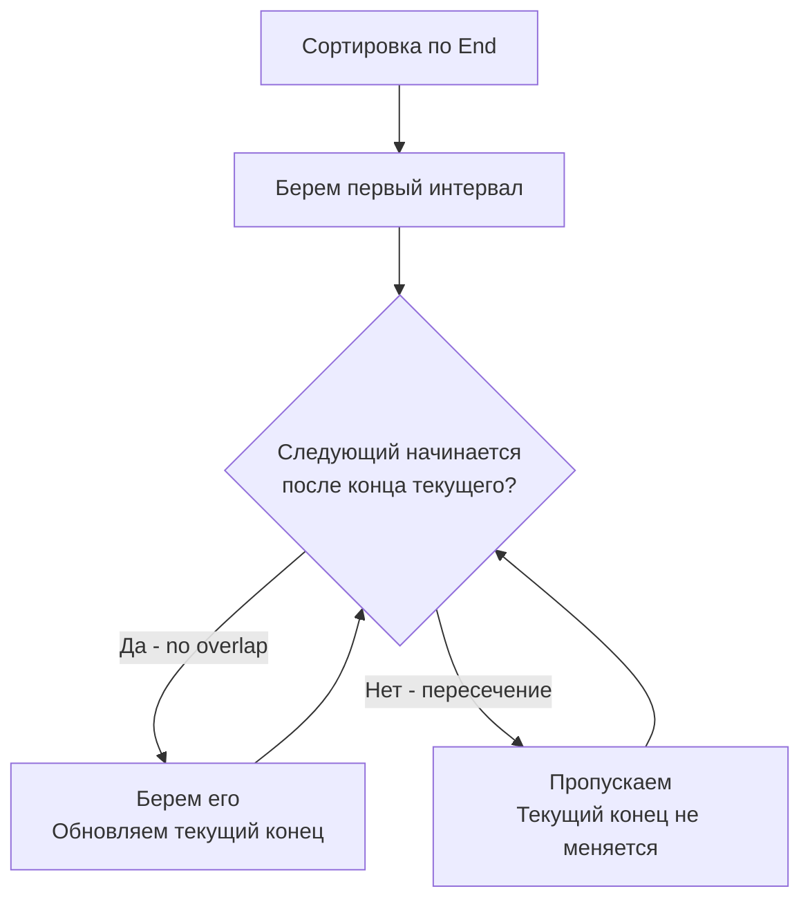

Задача Interval Scheduling (планирование интервалов) — это абсолютный фундамент жадных алгоритмов и, пожалуй, самая частая задача на System Design на собеседованиях. Если в [[5. Gas Station]] мы имели дело с кольцевыми маршрутами, то здесь мы переходим к управлению ресурсами во времени.

Классическая формулировка (лежащая в основе LeetCode 435 и 452): дан набор интервалов `[start, end]`. Нужно выбрать максимальное количество непересекающихся интервалов.

В бэкенде это моделирует всё: от бронирования переговорных комнат и выделения слотов CPU (CPU Scheduling) до шардинга временных рядов (Time-series data) в базах данных вроде InfluxDB и управления TTL ключей в Redis.

## Ключевой инсайт: Сортировка по концу, а не по началу

У разработчиков часто возникает искушение отсортировать интервалы по времени начала (`start`). Логика такая: "Начнем раньше — успеем больше". Это фатальная ошибка.

Представьте интервалы: `[0, 100]`, `[1, 2]`, `[3, 4]`.
Если мы отсортируем по `start` и возьмем `[0, 100]`, мы заблокируем весь день и сможем провести только 1 встречу. Если же мы возьмем `[1, 2]` и `[3, 4]`, то проведем 2 встречи.

**Жадный выбор:** Мы должны всегда выбирать интервал, который **заканчивается раньше всего** (сортировка по `end`). Освобождая ресурс как можно быстрее, мы максимизируем оставшееся время для остальных интервалов.

## Идиоматичный Go: `slices.SortFunc` и Generics

До Go 1.21 сортировка структур была громоздкой (через `sort.Slice` с `interface{}` и рефлексией). Современный Go предлагает `slices.SortFunc`, который работает с дженериками и инлайнится компилятором, что радикально улучшает производительность.

```go
import (
    "cmp"
    "slices"
)

type Interval struct {
    Start, End int
}

func maxNonOverlappingIntervals(intervals []Interval) int {
    if len(intervals) == 0 {
        return 0
    }

    // Сортируем по возрастанию времени окончания (End)
    slices.SortFunc(intervals, func(a, b Interval) int {
        return cmp.Compare(a.End, b.End)
    })

    count := 1
    // Индекс последнего выбранного интервала
    last := 0 

    for i := 1; i < len(intervals); i++ {
        // Если текущий интервал начинается после или в момент окончания последнего выбранного
        if intervals[i].Start >= intervals[last].End {
            count++
            last = i
        }
    }

    return count
}
```



> [!warning] Ловушка / Gotcha
* На интервью часто дают интервалы в виде `[][]int` (слайс слайсов). Работать с `[][]int` в Go — это антипаттерн с точки зрения кэша процессора. Внутренние слайсы разбросаны по куче (Pointer Chasing). Всегда конвертируйте `[][]int` в плоский массив структур `[]Interval` перед обработкой. Это займет $O(N)$, но сэкономит процессорное время на стадии сортировки и обхода.

## Mechanical Sympathy: Плоские структуры и Кэш-линии

Почему `[]Interval` (где `Interval` — структура из двух `int`) так сильно быстрее `[][]int`?

Структура из двух `int` в Go занимает 16 байт на 64-битной системе. Слайс из 1000 таких структур займет один непрерывный блок в 16 КБ. Это помещается в L1 кэш процессора (обычно 32 КБ). При обходе в цикле процессор будет подгружать данные порциями по 64 байта (кэш-линия), и доступ к `intervals[i].Start` будет происходить за 0 тактов (Cache Hit).

В случае `[][]int` каждый внутренний слайс — это указатель на объект в куче. Процессор вынужден делать Cache Miss при каждом переходе к следующему интервалу, что стоит ~100 наносекунд на чтение из RAM. Для высоконагруженных сервисов агрегации логов (где интервалов миллионы) разница во времени выполнения может составлять секунды.

## Under the Hood: Алгоритм сортировки в Go

`cmp.Compare` и `slices.SortFunc` в Go 1.21+ используют алгоритм **Pattern-defeating quicksort (pdqsort)**. 

Это гибридная сортировка, которая:
1. Выбирает хороший pivot (опорный элемент), избегая деградации до $O(N^2)$ на уже отсортированных данных (в отличие от классического QuickSort).
2. Если обнаруживает, что данные почти отсортированы, переключается на Insertion Sort (который работает за $O(N)$ на почти отсортированных массивах).
3. Если рекурсия уходит слишком глубоко, переключается на Heap Sort (гарантируя $O(N \log N)$ в худшем случае).

Для бэкенда это означает предсказуемую латентность (p99) при сортировке больших массивов временных интервалов, без неожиданных "провалов" производительности на патологических данных.

## System Design: Бронирование ресурсов и БД

В распределенных системах задача планирования интервалов возникает постоянно:

1. **Оптимистичные блокировки (Optimistic Concurrency Control):** В SQL-базах данных при бронировании ресурса мы часто используем проверку пересечения интервалов:
   ```sql
   SELECT * FROM bookings 
   WHERE room_id = 5 
   AND start_time < :new_end 
   AND end_time > :new_start;
   ```
   Если таких записей нет — интервал свободен. Алгоритм жадного планирования помогает на уровне приложения (Application Layer) подготовить батч запросов так, чтобы они гарантированно не конфликтовали, снижая количество ретраев при конкурентных вставках.

2. **Compaction в LSM-деревьях (Cassandra, RocksDB):** Во время Major Compaction SSTable-ы объединяются. Движок БД планирует компакцию диапазонов ключей (интервалов) так, чтобы параллельные потоки не обрабатывали пересекающиеся диапазоны. Использование жадного выбора по "концу диапазона" позволяет распараллелить процесс максимально эффективно.

3. **Rate Limiting (Sliding Window):** При очистке устаревших токенов в алгоритме скользящего окна система отбрасывает интервалы, чье время `end` меньше текущего, и планирует новые слоты.

> [!tip] Собеседование
> Если вас просят решить задачу с интервалами, всегда начинайте с вопроса: *"Как мы можем отсортировать эти данные?"*. Озвучьте гипотезу сортировки по `Start` и сами её опровергните контрпримером. Затем покажите сортировку по `End`. Если вы объясните, что сортировка по `End` максимизирует остаточный ресурс (свободное время), интервьюер поймет, что вы понимаете математику процесса, а не просто зазубрили паттерн.

## Итог

1. **Жадный выбор:** Сортировка по правой границе (`end`) — единственный правильный путь. Она минимизирует "занятость" ресурса.
2. **Структуры данных:** Избегайте `[][]int` для интервалов. Конвертируйте их в плоский массив структур для идеальной локальности кэша (Cache Locality).
3. **Современный Go:** Используйте `slices.SortFunc` с `cmp.Compare`. Это быстрее, безопаснее и чище, чем старый `sort.Slice`.
4. **Базы данных:** Пересечение интервалов — классическая проблема конкурентного доступа к ресурсам, решаемая как на уровне SQL-запросов, так и на уровне приложения жадными алгоритмами.

В следующей статье мы разберем обратную задачу: что делать, если нужно удалить интервалы, чтобы избежать пересечений — [[7. Non-overlapping Intervals]].