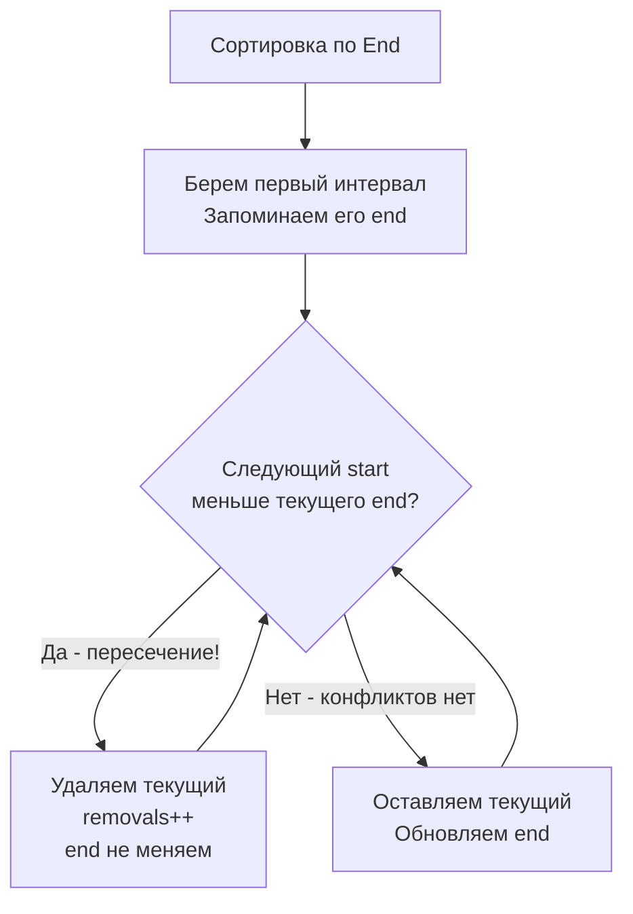

Задача Non-overlapping Intervals (LeetCode 435) — это логическое продолжение [[6. Interval Scheduling]]. Если там мы искали максимум интервалов, которые можно *оставить*, то здесь нас спрашивают о минимуме интервалов, которые нужно *удалить*, чтобы устранить все пересечения. 

С точки зрения математики, это одна и та же задача. Но для инженера разница в формулировке означает переход от задачи планирования к задаче **разрешения конфликтов (Conflict Resolution)**.

**Условие:** Дан массив интервалов `intervals`. Верните минимальное количество интервалов, которые нужно удалить, чтобы оставшиеся интервалы стали непересекающимися.

В бэкенде это моделирует разрешение коллизий при конкурентном доступе к ресурсам: от устранения конфликтов бронирования в календарях до разрешения конфликтов версий (Merge Conflicts) в распределенных БД и CRDT (Conflict-free Replicated Data Types).

## Математическая инверсия: Минимум удалений = Всего - Максимум оставшихся

Главный инсайт, который интервьюер ожидает услышать: 
$$\text{Min Removals} = \text{Total Intervals} - \text{Max Non-Overlapping Intervals}$$

Следовательно, чтобы минимизировать удаления, мы должны **максимизировать количество интервалов, которые мы можем оставить**. А это в точности задача Interval Scheduling! Мы сортируем по правому краю (`end`) и жадно берем интервалы, которые заканчиваются раньше всего.

## Идиоматичный Go: In-place логика без аллокаций

Хотя на LeetCode входные данные часто представлены как `[][]int` (что, как мы обсуждали в [[6. Interval Scheduling]], плохо для кэша из-за Pointer Chasing), мы можем применить жадный алгоритм прямо на месте, не создавая дополнительных структур.

Мы будем считать не количество "оставленных" интервалов, а сразу подсчитывать "удаленные", обновляя границу `end` только тогда, когда интервал нам подходит.

```go
import (
    "cmp"
    "slices"
)

func eraseOverlapIntervals(intervals [][]int) int {
    if len(intervals) <= 1 {
        return 0
    }

    // Сортируем по правой границе (End)
    slices.SortFunc(intervals, func(a, b []int) int {
        return cmp.Compare(a[1], b[1])
    })

    removals := 0
    // Правая граница последнего выбранного (неудаленного) интервала
    end := intervals[0][1] 

    for i := 1; i < len(intervals); i++ {
        // Если текущий интервал начинается раньше, чем закончился предыдущий выбранный,
        // значит, они пересекаются. Нам нужно удалить текущий.
        if intervals[i][0] < end {
            removals++
            // Мы НЕ обновляем end, так как "удалили" текущий интервал,
            // и правая граница предыдущего остается актуальной.
        } else {
            // Интервалы не пересекаются. "Оставляем" текущий.
            end = intervals[i][1]
        }
    }

    return removals
}
```



> [!warning] Ловушка / Gotcha
* Крайне важно определить, что считается "пересечением". Если один интервал заканчивается в момент `2`, а следующий начинается в `2` (`[1,2]` и `[2,3]`), **это НЕ пересечение**. 
> Поэтому в коде строгое неравенство `intervals[i][0] < end`. Если вы напишете `<=`, алгоритм посчитает стыкующиеся интервалы за конфликтующие, и ответ будет неверным. Всегда уточняйте этот момент у интервьюера.

## Under the Hood: Виртуальное удаление и состояние

Обратите внимание на элегантность строки `removals++` без обновления `end`. 

В наивном подходе разработчик мог бы попытаться физически удалять элементы из слайса: `intervals = append(intervals[:i], intervals[i+1:]...)`. В Go это привело бы к созданию нового базового массива (аллокации в куче) на каждое удаление, что превратило бы алгоритм $O(N \log N)$ в $O(N^2)$ по времени из-за копирования памяти, плюс вызвало бы шквал работы для Garbage Collector.

Наш подход использует **мутацию состояния (State Machine)**. Переменная `end` — это "указатель" на последний валидный элемент в виртуальном массиве результата. Мы просто игнорируем конфликтующие интервалы, не сдвигая данные. Это классический паттерн для высоконагруженных систем: вместо дорогих операций удаления (Delete), мы используем пометку как удаленного (Tombstone) или просто двигаем курсор.

## System Design: Разрешение конфликтов (OCC и CRDT)

В распределенных системах концепция "удаления пересекающихся интервалов" встречается повсеместно.

1. **Оптимистичное управление параллелизмом (OCC):** В базах данных вроде PostgreSQL или Cassandra транзакции работают параллельно. Если две транзакции пытаются заблокировать пересекающиеся диапазоны ключей (Range Locks), возникает deadlock или конфликт. Планировщик БД использует логику, аналогичную Non-overlapping Intervals: он откатывает (удаляет/прерывает) ту транзакцию, которая захватила больше ресурсов или завершилась позже, чтобы максимизировать пропускную способность остальных.
   
2. **CRDT (Conflict-free Replicated Data Types):** В системах совместного редактирования (Google Docs, Figma) или распределенных кэшах пользователи могут одновременно менять одни и те же данные (интервалы версий). Стратегия разрешения конфликтов LWW (Last Writer Wins) или "короткая транзакция побеждает длинную" — это прямая аналогия нашего жадного выбора. Мы "отбрасываем" (удаляем) длинные пересекающие интервалы в пользу коротких, чтобы сохранить консистентность стейта с минимальными потерями данных.

3. **Compaction в LSM-деревьях:** В ClickHouse или RocksDB во время слияния SSTable-ов (Compaction) система удаляет устаревшие записи. Если есть две записи с пересекающимися TTL (Time-To-Live) для одного ключа, алгоритм компакции оставляет актуальную и отбрасывает устаревшую, "обрезая" пересечения во времени.

> [!tip] Собеседование
> Если вы быстро решили задачу через `Total - Max Kept`, интервьюер может попросить вас написать вариант, который считает удаления напрямую (как в коде выше). Обязательно покажите, что вы понимаете инверсию формулы, а затем продемонстрируйте алгоритм с обновлением `end` только при отсутствии конфликта. Это покажет вашу гибкость и умение оптимизировать код "на месте".

## Итог

1. **Инверсия:** Минимум удалений = Всего интервалов - Максимум оставшихся. Суть сводится к классическому Interval Scheduling.
2. **Сортировка по `End`:** Жадный выбор остается неизменным. Интервал, который заканчивается раньше, вызывает меньше всего конфликтов в будущем.
3. **Стыки интервалов:** `[1,2]` и `[2,3]` не пересекаются. Используйте строгое неравенство `<`, а не `<=`.
4. **Виртуальное удаление:** Никогда не удаляйте элементы из слайса в цикле. Используйте курсор (переменную `end`), чтобы имитировать удаление без аллокаций и сдвигов памяти.

В следующей статье мы разберем еще одну вариацию задачи с интервалами, которая использует точно такой же жадный паттерн, но в контексте стрельбы по воздушным шарам: [[8. Minimum Number of Arrows]].