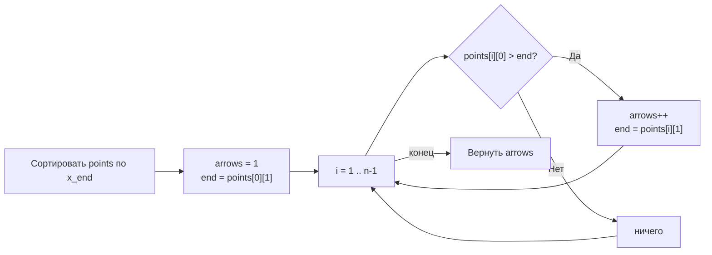

**LeetCode 452. Minimum Number of Arrows to Burst Balloons.** Даны координаты `x_start` и `x_end` горизонтальных шаров. Стрела, выпущенная вертикально из точки `x`, пробивает все шары, для которых `x_start ≤ x ≤ x_end`. Требуется найти **минимальное** количество стрел, необходимых, чтобы пробить все шары. Одна стрела может пробить любое количество шаров, если они перекрываются на одной вертикали.

Эта задача — классика жадных алгоритмов на интервалах, естественно продолжающая [[7. Non-overlapping Intervals]]. Там мы минимизировали количество удаляемых интервалов, чтобы оставить непересекающиеся; здесь мы минимизируем количество «проколов», чтобы покрыть все интервалы. И в том, и в другом случае работает один и тот же принцип: **сортировка по правому концу** и жадный выбор крайней точки. Для Senior Go-разработчика Minimum Arrows — это ещё одна возможность продемонстрировать, как правильная сортировка и аккуратное сравнение границ превращают казалось бы переборную задачу в линейный проход с O(1) дополнительной памяти, а также как избежать ловушек с переполнением или пустыми входными данными.

### Формулировка и уточнения

**Условие:** функция `findMinArrowShots(points [][]int) int`. Каждый элемент `points[i] = [x_start, x_end]` описывает шар. Длина массива `n` от 0 до 10⁵. Координаты — 32-битные целые (могут быть отрицательными). Все шары нужно пробить. Одна стрела в точке `x` пробивает все шары, у которых `x_start ≤ x ≤ x_end`.

**Вопросы интервьюеру (Senior-стиль):**
- *Может ли массив быть пустым?* Да, тогда стрел не нужно — возвращаем 0.
- *Могут ли шары вырождаться в точку?* Да, `x_start == x_end` допустимо.
- *Может ли `x_end` быть меньше `x_start`?* По условию нет, интервал корректный.
- *Каков диапазон координат?* От -2³¹ до 2³¹-1, в Go `int` на 64-битной платформе покрывает, и сравнения безопасны. Переполнение при вычислениях не грозит, так как мы не выполняем арифметику, только сравнения.

Эти ответы подтверждают: можно сортировать in-place и использовать целочисленные переменные без опасения переполнения.

### Наивное решение: полный перебор или динамическое программирование

Можно было бы рассматривать задачу как поиск минимального множества точек, протыкающих все интервалы. Наивный подход — перебрать все возможные координаты и для каждого подмножества шаров проверить покрытие — экспоненциален и нежизнеспособен. DP-подход (как для взвешенных интервалов) также избыточен: здесь нет весов, а структура задачи является классическим примером, где жадный алгоритм даёт точный оптимум, что доказано через exchange argument.

Senior сразу узнаёт паттерн: «минимальное число точек, покрывающих интервалы» → сортировка по правому концу.

### Оптимальное решение: сортировка по `x_end` и жадное прокалывание

**Идея.** Отсортируем шары по возрастанию `x_end`. Будем идти по отсортированному массиву и поддерживать `end` — координату последней выпущенной стрелы. Изначально стрела не выпущена. Для каждого шара:
- Если `x_start > end`, значит, текущая стрела уже не пробивает этот шар (она левее его начала). Выпускаем новую стрелу в точке `x_end` этого шара и увеличиваем счётчик. Обновляем `end = x_end`.
- Если `x_start <= end`, текущая стрела пробивает и этот шар, ничего не делаем.

**Почему стрельба именно в `x_end`?** Потому что `x_end` — самая правая точка, в которой можно проткнуть данный шар. Если мы выпустим стрелу правее, этот шар не будет пробит; если левее — пробитый интервал сужается, что может лишить нас возможности пробить последующие шары, у которых левый край находится дальше. Выбор крайней правой точки текущего шара **максимизирует** шанс накрыть максимальное количество следующих шаров без увеличения числа стрел.

**Инвариант:** после обработки `i` шаров переменная `arrows` содержит минимальное количество стрел для этих шаров, а `end` — координата последней стрелы, которая пробивает текущий набор. Все шары с `x_end ≤ currentEnd` точно пробиты.

```go
func findMinArrowShots(points [][]int) int {
    if len(points) == 0 {
        return 0
    }
    // Сортируем по правому концу
    sort.Slice(points, func(i, j int) bool {
        return points[i][1] < points[j][1]
    })

    arrows := 1
    end := points[0][1]

    for i := 1; i < len(points); i++ {
        // Если текущий шар начинается после нашей стрелы — нужна новая
        if points[i][0] > end {
            arrows++
            end = points[i][1]
        }
    }
    return arrows
}
```

**Go-идиомы и комментарии:**
- `sort.Slice` с замыканием, сравнивающим правые концы. Для производительности можно было бы реализовать `sort.Interface` для избежания вызова замыкания на каждом сравнении, но для `n ≤ 10^5` разница не критична; Senior может упомянуть эту микрооптимизацию.
- `arrows` начинается с 1 (первая стрела).
- Сравнение строгое `>`: если шар касается предыдущего в точке (`x_start == end`), он пробивается той же стрелой, это допустимо.
- Никаких дополнительных структур — только переменные `arrows`, `end`.



### Связь с Non-overlapping Intervals

В задаче [[7. Non-overlapping Intervals]] мы искали минимальное количество удаляемых интервалов, чтобы оставить множество непересекающихся. Здесь — минимальное количество точек (стрел), чтобы покрыть все интервалы. Оба решаются одинаковой сортировкой по правому концу и жадным выбором, но с разной целью. Если Non-overlapping отвечает на вопрос «сколько максимально может быть непересекающихся интервалов?», то Min Arrows — «сколько минимально точек необходимо, чтобы покрыть интервалы?». По теореме Кёнига/Дилворта эти величины связаны, и Senior-разработчик видит эту математическую глубину.

### Edge Cases

- **Пустой массив:** `len(points) == 0` → `0`.
- **Один шар:** одна стрела, `arrows = 1`.
- **Все шары перекрываются в одной точке:** например, `[[0,2],[1,3],[2,4]]`. После сортировки по `x_end`: `[0,2]` (end=2), `[1,3]` (начало 1 ≤ 2 — пробит), `[2,4]` (начало 2 ≤ 2 — пробит). Ответ 1. Верно.
- **Шары касаются, но не перекрываются:** `[[0,2],[2,4]]`. `[0,2]` (end=2), `[2,4]` (начало 2 ≤ 2 — пробит той же стрелой). Ответ 1. Правильно, касание считается пробитием.
- **Все шары разнесены:** `[[0,1],[2,3],[4,5]]`. Первая стрела в 1 пробивает только первый; для второго нужна новая (end=3); для третьего — ещё одна. Ответ 3.
- **Большие координаты, близкие к границам int32:** `[[-2147483646,-2147483645],[2147483646,2147483647]]`. Сортировка и сравнения корректны, переполнения нет.

> [!warning] Ловушка / Gotcha
> При использовании `sort.Slice` с замыканием `points[i][1] < points[j][1]` возможна целочисленная разность? Нет, здесь простое сравнение, безопасно. Если бы мы сортировали по разности координат, могло бы быть переполнение, но мы сортируем по одному значению. Проблема могла бы возникнуть в языках с фиксированным `int` и переполнением при вычитании, но Go сравнение `<` всегда безопасно.

### Анализ сложности

- **Время:** O(N log N). Сортировка доминирует. Линейный проход занимает O(N). При N = 10⁵ укладывается в лимиты.
- **Память:** O(1) дополнительной, если не считать входной слайс (сортировка in-place). Переменные `arrows`, `end` — на стеке.

### Mechanical Sympathy: сортировка и последовательное чтение

- **`sort.Slice`** модифицирует входной слайс in-place, не выделяя новой памяти. Замыкание `func(i, j int) bool` вызывается O(N log N) раз, но компилятор Go не всегда встраивает замыкания, что может добавить небольшие накладные расходы. Если производительность критична, Senior предложит реализовать `sort.Interface` или использовать `slices.SortFunc` (с Go 1.21). Однако для 10⁵ элементов разница мала.
- **Линейный проход** после сортировки читает слайс последовательно, что идеально для кэш-локальности: prefetcher безошибочно подгружает следующие элементы.
- **Отсутствие аллокаций** в горячем пути: `arrows`, `end` — на стеке, новые слайсы не создаются. GC не испытывает давления.
- **Целочисленные сравнения** `points[i][0] > end` — дешёвая операция.

> [!info] Под капотом
> Входной `points` — это `[][]int`, слайс слайсов. Каждый внутренний слайс — отдельный массив из двух `int` в куче. Сортировка переставляет заголовки внутренних слайсов (по 24 байта), не трогая сами массивы. Это эффективно: данные `[x_start, x_end]` не копируются при сортировке.

### Альтернативы и trade-off

- **Сортировка по левому концу и «обратный» проход.** Можно отсортировать по `x_start` и идти с конца, выбирая минимальный `x_start` для новой стрелы. Это симметричное решение, но сортировка по правому концу более интуитивна и непосредственно связана с «покрытием до конца».
- **Сканирующая линия (sweep line).** Можно разложить события начала и конца и обрабатывать их, но это избыточно и требует O(N) памяти на события.

> [!tip] Собеседование
> Вопрос: «Почему сортировка по правому концу, а не по левому?»
> Ответ: «Потому что мы хотим выпустить стрелу как можно правее, чтобы максимизировать шанс пробить следующие шары. Правая граница текущего непробитого шара — это предельно допустимая координата для стрелы, которая его пробьёт. Отсортировав по правому концу, мы последовательно рассматриваем шары по мере того, как они „заканчиваются“, и каждая новая стрела выставляется в крайнюю правую позицию, что является локально оптимальным выбором, ведущим к глобальному оптимуму».

### Итог

Minimum Number of Arrows — это хрестоматийная задача на жадный алгоритм для интервалов, решаемая сортировкой по правому концу и одним проходом. В Go она реализуется с использованием `sort.Slice` и минимальным набором переменных, что даёт O(N log N) времени и O(1) дополнительной памяти. Senior-разработчик видит её связь с [[7. Non-overlapping Intervals]] и понимает, почему выбор правого конца гарантирует оптимальность — это яркий пример жадного алгоритма с доказанной корректностью.

На этом завершается кластер **Жадные алгоритмы**. Мы освоили интервальные задачи, задачи на прыжки, расписание и покрытие. Теперь мы переходим к фундаменту, лежащему в основе многих оптимизационных задач, — **Динамическому программированию**. Первая статья расскажет о теории одномерного ДП: состояниях, переходах, оптимальной подструктуре и о том, как Go-разработчику писать DP-решения без лишних аллокаций. [[1. Теория. Динамическое программирование 1D]]