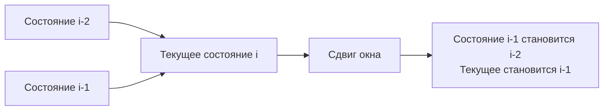

Динамическое программирование (Dynamic Programming, DP) — это один из самых пугающих паттернов на собеседованиях, который часто ассоциируется с зубрежкой сложных таблиц. Но для инженера DP — это не магия, а строгий математический аппарат для оптимизации вычислений, основанный на свойствах **оптимальной подструктуры** и **пересекающихся подзадач**.

Одномерное DP (1D DP) — это фундамент, где состояние системы описывается одним параметром (обычно индексом `i` или шагом `n`). Мы не строим двумерные матрицы, а вычисляем значения на числовой прямой, опираясь на уже вычисленные предыдущие точки.

## От рекурсии к DP: Инверсия мышления

В классических ООП-языках разработчики часто мыслят задачами "сверху вниз" (Top-Down): "чтобы решить проблему размера N, мне нужно решить N-1, а для этого N-2". Это порождает глубокую рекурсию.

В Go (как и в C) рекурсия — это не просто оверх на вызов функции. Это рост стека горутины. Изначально горутина получает стек в 2-8 КБ. При глубокой рекурсии рантайм Go вынужден делать **копирование стека (stack growth)**, выделяя новый участок памяти в куче и перенося туда кадры вызовов. Для DP-задач с $N=10^5$ это приведет к фатальному `stack overflow`.

Поэтому в Go парадигма DP смещается в сторону **Bottom-Up (восходящее DP)**. Мы начинаем с базы (0 или 1) и итеративно заполняем массив состояний до достижения N. Никакого роста стека, только предсказуемый цикл.

## Анатомия 1D DP: Слайс как машина состояний

В 1D DP мы обычно храним состояния в слайсе: `dp := make([]int, n+1)`.
Значение `dp[i]` — это оптимальный ответ для префикса задачи длины `i`. А переход (recurrence relation) выражается через предыдущие значения, например: `dp[i] = dp[i-1] + dp[i-2]`.

> [!info] Под капотом
> Когда вы создаете `make([]int, n+1)`, рантайм Go выделяет непрерывный блок памяти в куче. Компилятор знает, что вы работаете с линейным массивом фиксированного размера элементов. Процессор (Prefetcher) видит последовательный доступ `dp[i-1]`, `dp[i]`, `dp[i+1]` и заранее подгружает кэш-линии (по 64 байта, вмещающие 8 значений `int64`). Это делает Bottom-Up DP невероятно дружелюбным к архитектуре CPU (Data Locality).

## Mechanical Sympathy: O(N) памяти vs O(1) памяти

Наивная реализация 1D DP требует $O(N)$ памяти под слайс. Но особенность 1D переходов в том, что текущее состояние часто зависит только от 1-2 предыдущих.

```go
// Наивный подход: O(N) памяти, выделение в куче
func fibNaive(n int) int {
    if n <= 1 {
        return n
    }
    dp := make([]int, n+1) // Аллокация в куче, работа GC
    dp[0], dp[1] = 0, 1
    for i := 2; i <= n; i++ {
        dp[i] = dp[i-1] + dp[i-2]
    }
    return dp[n]
}
```

Для бэкенд-сервиса, обрабатывающего тысячи запросов в секунду, каждый из которых требует DP-вычисления, аллокация слайса на каждый запрос — это преступление против GC. 

**Оптимизация:** так как нам нужны только `i-1` и `i-2`, мы можем использовать переменные на стеке, уменьшив память до $O(1)$ и полностью исключив аллокации.

```go
// Идиоматичный подход: O(1) памяти, нулевые аллокации
func fibOptimized(n int) int {
    if n <= 1 {
        return n
    }
    var prev2, prev1 int64 = 0, 1 // Лежат на стеке горутины
    for i := 2; i <= n; i++ {
        curr := prev1 + prev2
        prev2, prev1 = prev1, curr // Сдвигаем окно
    }
    return int(prev1)
}
```

> [!info] Под капотом
> Переменные `prev2`, `prev1` и `curr` не escapе-ят в кучу. Компилятор Go разместит их в регистрах процессора (если это возможно) или на стеке. Доступ к регистрам занимает 0 тактов памяти (в отличие от чтения из L1 кэша, которое занимает ~4 такта). Это максимально возможная производительность. Кроме того, мы полностью избавляем Garbage Collector от необходимости сканировать и очищать слайс `dp`.



## Ловушки инициализации в Go

В отличие от C++, где неинициализированный массив содержит мусор (garbage values), Go гарантирует **Zero Values**. Слайс, созданный через `make([]int, n)`, будет заполнен нулями.

Это удобно, если база DP — это 0. Но если задача требует поиска минимума, и вы пишете:
```go
dp := make([]int, n+1) 
for i := 1; i <= n; i++ {
    dp[i] = min(dp[i], dp[i-1] + cost) // ОШИБКА!
}
```
Вы будете сравнивать с нулем, что сломает логику поиска минимума (0 всегда меньше любого положительного числа).

В Go для инициализации "бесконечностью" используйте константы из `math`:

```go
import "math"

dp := make([]int64, n+1)
for i := 1; i <= n; i++ {
    dp[i] = math.MaxInt64 // Инициализация "плюс бесконечностью"
}
dp[0] = 0 // Базовый случай
```

> [!warning] Ловушка / Gotcha
> Если вы используете `math.MaxInt64` и затем прибавляете к нему число, произойдет переполнение (integer overflow), и значение станет отрицательным. В задачах, где возможны большие суммы, всегда оставляйте "зазор" или проверяйте границы перед сложением, либо используйте пакет `math/big` (что редко нужно в алгоритмических интервью, но критично в финансах на продакшене).

## DP на бэкенде: System Design

Зачем Senior/Lead разработнику DP?

1. **Маршрутизация и графы:** Задача поиска кратчайшего пути (алгоритм Беллмана-Форда или Дейкстры с 1D массивом расстояний `dist[]`) — это чистое 1D DP.
2. **Финансовые системы:** Расчет максимальной прибыли от транзакций с ограничениями (знаменитая задача Best Time to Buy and Sell Stock) — это 1D DP с конечным автоматом состояний (держим акцию / не держим).
3. **Ограничение Rate Limiter:** Алгоритм Leaky Bucket или Token Bucket можно рассматривать как DP-переход: `tokens[i] = min(capacity, tokens[i-1] + generated - consumed)`.
4. **Секвенсинг ДНК / Diff-алгоритмы:** Поиск наибольшей общей подпоследовательности (LCS) между конфигурационными файлами для генерации патчей.

> [!tip] Собеседование
> Если интервьюер просит решить задачу (например, прыжки по лестнице или максимальная сумма подмассива), всегда начинайте с определения состояния и перехода.
> 1. *"Что такое `dp[i]`? Это максимальная сумма, которую можно набрать, дойдя до i-го элемента."*
> 2. *"Как переход? `dp[i] = max(dp[i-1], dp[i-2]) + nums[i]`"*
> 3. *"Какова база? `dp[0] = nums[0]`, `dp[1] = max(nums[0], nums[1])`"*
> 4. *"Можем ли мы оптимизировать память? Да, так как зависим только от i-1 и i-2, используем две переменные вместо массива."*
> Этот 4-шаговый фреймворк демонстрирует системный подход инженера, а не слепой перебор кода.

## Итог

1. **Bottom-Up правит бал:** В Go избегайте глубокой рекурсии (Top-Down с мемоизацией) из-за дорогого роста стеков горутин и оверхеда мап. Итеративное заполнение массива быстрее и дружелюбнее к CPU.
2. **Оптимизация памяти:** Если `dp[i]` зависит от константного числа предыдущих состояний, сжимайте массив до переменных. Это убирает аллокации в куче и давление на GC.
3. **Zero Values:** Помните, что Go инициализирует слайсы нулями. Для задач на минимум всегда явно инициализируйте `math.MaxInt64`.
4. **Инженерный подход:** DP — это не про код, а про вывод формулы перехода состояний. Код — это лишь её механическая реализация.

В следующей статье мы разберем конкретные базовые паттерны переходов состояний, которые покрывают 80% одномерных задач: [[2. Базовые паттерны]].