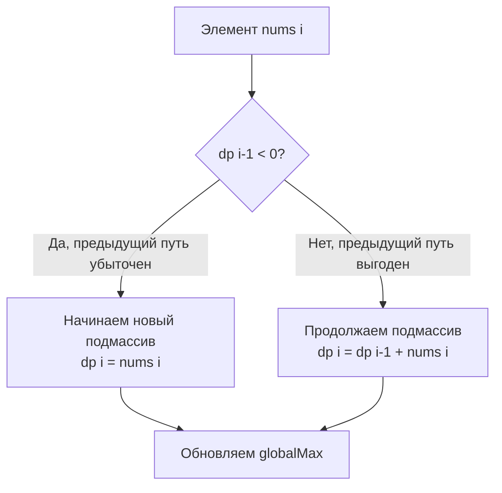

В предыдущей статье мы определили 1D DP как вычисление состояний на числовой прямой и обсудили важность восходящего подхода (Bottom-Up). Но как понять, какую формулу перехода писать? Оказывается, 80% задач на одномерное динамическое программирование сводятся к четырем базовым архетипам. Распознав паттерн, вы мгновенно получаете каркас решения.

## 1. Линейная последовательность (Fibonacci-style)

Самый простой паттерн. Состояние `dp[i]` выражается как сумма (или другая агрегация) нескольких предыдущих состояний. Классический пример — числа Фибоначчи или задача о прыжках по лестнице.

**Формула:** `dp[i] = dp[i-1] + dp[i-2]`

**Суть:** Чтобы попасть в точку `i`, мы могли прийти только из `i-1` или `i-2`. Мы берем *все* возможные пути (поэтому складываем, а не выбираем максимум).

**Оптимизация памяти:** Поскольку нам нужны только два предыдущих значения, слайс `dp` длиной $N$ — это потеря памяти. Мы используем две переменные, которые обновляем на каждом шаге. В Go эти переменные лягут прямо в регистры процессора, давая максимальную скорость.

**Где в бэкенде:** Расчет количества способов маршрутизации запроса в сети, если узлы связаны последовательно; комбинаторика в генетических алгоритмах.

## 2. Оптимальный путь (Min/Max Cost Path)

Здесь `dp[i]` означает минимальную (или максимальную) *стоимость* достижения точки `i`. В отличие от предыдущего паттерна, мы не считаем все пути, а выбираем лучший.

**Формула:** `dp[i] = min(dp[i-1], dp[i-2]) + cost[i]`

**Суть:** Мы смотрим, откуда дешевле прийти (из `i-1` или `i-2`), и добавляем стоимость нахождения в самой точке `i`.

> [!warning] Ловушка / Gotcha
> Частая ошибка — путать Линейную последовательность и Оптимальный путь. Если вас просят посчитать *количество способов* добраться до вершины — это сложение (Pattern 1). Если просят найти *минимальную стоимость* пути — это взятие минимума (Pattern 2). Выбор функции агрегации (sum vs min/max) кардинально меняет смысл задачи.

## 3. Локальный оптимум (Алгоритм Кадане)

Это самый важный паттерн для бэкенд-разработчика. Он решает задачи на поиск оптимального непрерывного подмассива (например, максимальной суммы).

Ключевое отличие: `dp[i]` здесь означает оптимальный ответ **строго заканчивающийся в индексе `i`**.

**Формула:** `dp[i] = max(nums[i], dp[i-1] + nums[i])`

**Суть:** У нас есть выбор на каждом шаге. Либо мы продолжаем предыдущий удачный подмассив и присоединяем `nums[i]`, либо предыдущий подмассив стал настолько плохим (ушел в глубокий минус), что выгоднее начать новый подмассив с `nums[i]`.

> [!info] Под капотом
> В задачах Кадане финальный ответ — это *не* `dp[n-1]`! Ответ — это максимум по всему массиву состояний `dp`. Нам нужна глобальная переменная `globalMax`, которая обновляется на каждом шаге: `globalMax = max(globalMax, dp[i])`.
> 
> С точки зрения Mechanical Sympathy, алгоритм Кадане — это один проход по слайсу (Sequential Access) с O(1) дополнительной памяти. Процессор будет загружать данные в L1 кэш порциями по 64 байта, и выполнение займет буквально наносекунды даже для массивов из миллионов элементов.

**Где в бэкенде:** Поиск пиковых нагрузок в мониторинге (максимальный всплеск RPS за непрерывный период), анализ финансовых временных рядов (максимальная прибыль акции), детекция аномалий в логах.

## 4. Конечные автоматы (Decision Making / State Machines)

Иногда одного измерения `i` недостаточно, чтобы описать все ограничения задачи. Например, в задаче "Купить и Продать Акцию" (Best Time to Buy and Sell Stock) мы находимся в точке `i`, но наше решение зависит от того, **держим ли мы акцию в руках**.

В таких задачах `dp` превращается в параллельные линии состояний:
- `dpHold[i]` — максимальная прибыль, если в день `i` мы держим акцию.
- `dpCash[i]` — максимальная прибыль, если в день `i` мы НЕ держим акцию.

**Формулы перехода:**
- `dpHold[i] = max(dpHold[i-1], dpCash[i-1] - price[i])` (либо уже держим, либо покупаем сегодня)
- `dpCash[i] = max(dpCash[i-1], dpHold[i-1] + price[i])` (либо не держим, либо продаем сегодня)

**Оптимизация памяти:** Вместо двумерного массива (или слайса слайсов) мы используем 4 переменные (`hold`, `cash`, `prevHold`, `prevCash`). Это позволяет избежать аллокации в куче и давления на GC.

**Где в бэкенде:** Моделирование конечных автоматов (Circuit Breaker: Closed, Open, Half-Open), управление сессиями (Authenticated, Unauthenticated), обработка потоков событий (Event Sourcing).

## Итог: Фреймворк решения

Когда вы видите задачу на 1D DP на собеседовании, не пишите код сразу. Проделайте этот путь:

1. **Определите, что такое `dp[i]`** (Количество путей? Минимальная стоимость? Максимальная сумма, заканчивающаяся здесь?).
2. **Найдите переход** (Откуда мы можем прийти в `i`? Нужно ли складывать все пути или брать min/max?).
3. **Определите базу** (Чему равны `dp[0]`, `dp[1]`?).
4. **Уточните ответ** (Это `dp[n-1]` или глобальный максимум по всем `dp[i]`?).
5. **Оптимизируйте память** (Можно ли заменить слайс на 2-4 переменные?).

> [!tip] Собеседование
> Если вы сразу озвучите этот фреймворк и скажете: *"Это похоже на паттерн Кадане, значит нам нужна переменная для локального максимума и глобального, при этом мы можем сжать память до O(1)"*, интервьюер поймет, что вы не угадываете решение, а проектируете его архитектуру.

В следующей статье мы применим паттерн Линейной последовательности к классической задаче, с которой начинается знакомство с DP у большинства разработчиков: [[3. Climbing Stairs]].