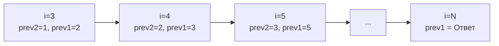

Задача о подъеме по лестнице (LeetCode 70: Climbing Stairs) — это классический "Hello World" в мире динамического программирования. Большинство разработчиков решают её за 5 минут и идут дальше, упуская глубокие архитектурные параллели. Мы же разберем её так, как смотрит на код Principal Engineer: от математики до взаимодействия со стеком горутины и кэшем процессора.

**Условие:** Вы поднимаетесь по лестнице, состоящей из `n` ступеней. На каждом шаге вы можете сделать 1 или 2 шага. Сколько существует уникальных способов добраться до вершины?

## Математика: Числа Фибоначчи

Как мы выяснили в [[2. Базовые паттерны]], это задача на линейную последовательность. Чтобы оказаться на ступени `i`, мы могли прийти туда только двумя путями: сделав шаг с `i-1` или прыжок с `i-2`. 

Следовательно, общее количество способов достичь `i` — это сумма способов достичь `i-1` и `i-2`:
$$dp[i] = dp[i-1] + dp[i-2]$$

Это определение чисел Фибоначчи со сдвигом на единицу. Базовые случаи: $dp[1] = 1$, $dp[2] = 2$.

## Подход 1. Top-Down: Рекурсия с мемоизацией

Подход "сверху вниз" использует рекурсию. Чтобы не вычислять одни и те же подзадачи многократно (что даст факториальную сложность $O(2^N)$), мы кэшируем результаты в хеш-таблице.

```go
func climbStairsTopDown(n int) int {
    memo := make(map[int]int)
    return dfs(n, memo)
}

func dfs(i int, memo map[int]int) int {
    if i <= 2 {
        return i
    }
    if val, ok := memo[i]; ok {
        return val
    }
    res := dfs(i-1, memo) + dfs(i-2, memo)
    memo[i] = res
    return res
}
```

> [!warning] Ловушка / Gotcha
> В Go использование рекурсии для DP-задач — это антипаттерн для production-кода. 
> Во-первых, хеш-таблица `memo` аллоцируется в куче. При каждом вызове `dfs` компилятор вынужден проверять выход указателя за пределы области видимости (Escape Analysis), и `memo` "убегает" в кучу.
> Во-вторых, рост стека. Горутина в Go начинает с маленького стека (около 2 КБ). При $N=10000$ глубина рекурсии составит 10000 кадров вызовов. Рантайм Go будет вынужден многократно вызывать `runtime.morestack`, аллоцировать новый стек в куче и копировать туда старые кадры. Это приведет к пиковым задержкам (latency spikes) и давлению на GC.

## Подход 2. Bottom-Up: Итеративный слайс (O(N) памяти)

Итеративный подход "снизу вверх" лишен проблем со стеком. Мы выделяем слайс и заполняем его последовательно.

```go
func climbStairsSlice(n int) int {
    if n <= 2 {
        return n
    }
    dp := make([]int, n+1)
    dp[1] = 1
    dp[2] = 2
    
    for i := 3; i <= n; i++ {
        dp[i] = dp[i-1] + dp[i-2]
    }
    return dp[n]
}
```

> [!info] Под капотом
> С точки зрения Mechanical Sympathy, этот код намного лучше рекурсии. Доступ к `dp[i-1]` и `dp[i-2]` — это последовательный доступ к непрерывному слайсу. Процессор (Prefetcher) видит линейное чтение и подгружает следующие кэш-линии (64 байта) в L1 кэш заранее.
> 
> Однако, аллокация `make([]int, n+1)` для $N=10^6$ создаст массив в 8 МБ в куче. На каждый такой запрос Garbage Collector будет тратить драгоценные циклы CPU на сканирование этого массива при Sweep-фазе. Можно ли лучше?

## Подход 3. Оптимизация памяти: O(1) (Идиоматичный Go)

В [[1. Теория. Динамическое программирование 1D]] мы обсуждали, что если состояние зависит только от константного числа предыдущих состояний, массив можно сжать до переменных.

Для вычисления `dp[i]` нужны только `dp[i-1]` и `dp[i-2]`. Зачем нам хранить историю всего массива?

```go
func climbStairs(n int) int {
    if n <= 2 {
        return n
    }
    var prev2, prev1 int64 = 1, 2 // Лежат на стеке!
    
    for i := 3; i <= n; i++ {
        curr := prev1 + prev2
        prev2, prev1 = prev1, curr // Сдвигаем "окно"
    }
    return int(prev1)
}
```

**Почему это шедевр инженерии?**
1. **Нулевые аллокации:** Переменные `prev2`, `prev1` и `curr` не попадают в кучу. Компилятор Go (через Escape Analysis) размещает их на стеке горутины или даже напрямую в регистрах процессора (например, RAX, RBX на x86_64).
2. **Отсутствие GC:** Garbage Collector вообще не видит этих переменных. Код работает детерминированно, без Stop-The-World пауз.
3. **Кэш процессора:** Операции с регистрами занимают 0 тактов доступа к памяти. Это榨取 (squeeze) абсолютного максимума из железа.



## System Design: Зачем это на бэкенде?

Кажется, что это чисто академическая задача, но паттерн "количество способов достичь состояния из двух предыдущих" встречается в распределенных системах:

1. **Сетевые маршруты:** Если у вас есть топология сети (граф-линейка или кольцо), и вы хотите узнать, сколькими путями пакет может дойти от узла A до узла B, если хопы ограничены.
2. **Генерация уникальных ID без中央 сервера (Coordinator-free):** В некоторых системах ноды генерируют ID на основе состояния соседей.
3. **Финансовые инструменты:** Расчет количества комбинаций выплат (траншами по 1 или 2 единицы), широко применяемый в актуарной математике.

> [!tip] Собеседование
> На интервью после написания O(1) решения вас обязательно спросят: *"А что если N очень большое, и результат не помещается в int64?"*
> 
> **Ответ:** В Go есть пакет `math/big` для работы с большой арифметикой. Но если $N \sim 10^9$, даже $O(N)$ цикл будет работать слишком долго (около секунды на одном ядре). В таком случае мы используем **матричное возведение в степень**. Формулу Фибоначчи можно выразить через умножение матрицы 2x2, и вычисление $N$-го элемента сойдет до $O(\log N)$ с помощью бинарного возведения в степень. Это топ-уровень ответа, гарантирующий Strong Hire.

## Итог

1. **Математика:** Задача сводится к числам Фибоначчи: $dp[i] = dp[i-1] + dp[i-2]$.
2. **Избегайте рекурсии:** Top-Down DP в Go вызывает рост стека горутины и аллокации мап в куче. Всегда переходите к Bottom-Up.
3. **Сжимайте состояние:** Если для перехода нужно только 2 предыдущих значения, слайс `dp` — это потеря памяти и лишняя работа для GC. Используйте переменные на стеке.
4. **Переполнение:** Всегда уточняйте ограничения на $N$. Если $N > 90$, результат выйдет за границы `int64`, потребуется `math/big` или модульная арифметика (взятие по модулю $10^9 + 7$).

В следующей статье мы применим паттерн оптимального выбора (Max/Min Cost Path) к задаче, где нужно выбирать, какие элементы брать, а какие пропускать: [[4. House Robber]].