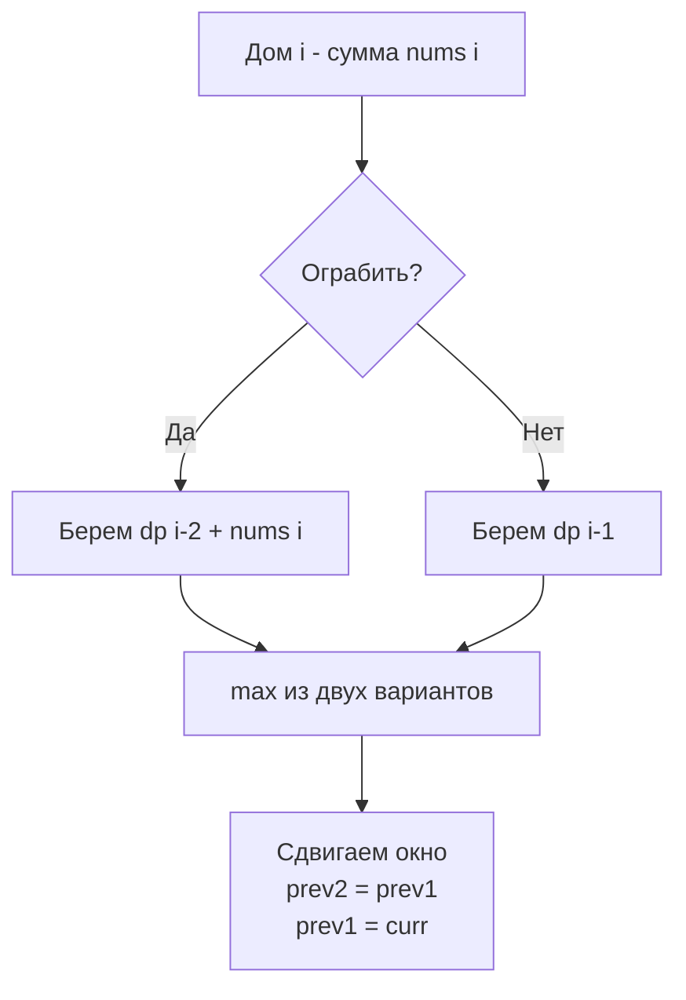

Задача о грабителе домов (LeetCode 198: House Robber) — это следующая ступень эволюции после [[3. Climbing Stairs]]. Если там мы просто складывали результаты предыдущих шагов, то здесь появляется **конфликт состояний**. Мы не можем просто взять предыдущее значение, потому что оно может быть несовместимо с текущим выбором. Это паттерн оптимального пути с выбором (Decision Making), который мы обсуждали в [[2. Базовые паттерны]].

**Условие:** Дан массив `nums`, представляющий количество денег в каждом доме. Вы не можете грабить два соседних дома подряд. Какую максимальную сумму можно украсть?

В бэкенде этот паттерн моделирует любые задачи расписаний (Scheduling) с исключающими ресурсами: выбор серверов для обслуживания запросов, если соседние серверы шарят один ресурс (БД или диск), или выбор максимальной прибыли от транзакций, если между ними должен быть кулдаун.

## Логика переходов: Конфликт соседей

Находясь у дома `i`, у нас есть ровно два выбора:
1. **Ограбить его.** Тогда мы добавляем деньги `nums[i]` к максимальной сумме, которая была у нас до этого, то есть к состоянию `i-2` (пропускаем дом `i-1`).
2. **Пропустить его.** Тогда наша текущая прибыль равна максимальной сумме, достигнутой у предыдущего дома `i-1`.

Формула перехода:
$$dp[i] = \max(dp[i-1], dp[i-2] + nums[i])$$

Базовые случаи: `dp[0] = nums[0]`, `dp[1] = max(nums[0], nums[1])`.

## Наивная реализация: Слайс состояний (O(N) памяти)

Прямолинейный перенос формулы в код дает нам слайс, хранящий историю всех состояний.

```go
func robNaive(nums []int) int {
    n := len(nums)
    if n == 1 {
        return nums[0]
    }
    
    dp := make([]int, n)
    dp[0] = nums[0]
    dp[1] = max(nums[0], nums[1])
    
    for i := 2; i < n; i++ {
        dp[i] = max(dp[i-1], dp[i-2]+nums[i])
    }
    return dp[n-1]
}
```

> [!warning] Ловушка / Gotcha
> Кажется заманчивым использовать жадный алгоритм (greedy): на каждом шаге выбирать, идти ли в дом, исходя из текущей выгоды. Но жадность не работает для DP. Представьте массив `[2, 1, 1, 2]`. Жадный алгоритм возьмет дом 0 (2), пропустит 1, возьмет 2 (1), пропустит 3. Итог: 3. Оптимально же взять дома 0 и 3, итог: 4. DP гарантирует оптимальность, так как "смотрит в будущее" через уже вычисленные подзадачи.

## Mechanical Sympathy: O(1) памяти и Escape Analysis

Как и в задаче с лестницей, хранить весь слайс `dp` бессмысленно. Для вычисления `dp[i]` нужны только `i-1` и `i-2`. Давайте перепишем код так, как это сделал бы Senior Go Engineer.

```go
func rob(nums []int) int {
    if len(nums) == 0 {
        return 0
    }
    if len(nums) == 1 {
        return nums[0]
    }
    
    // Используем две переменные вместо слайса.
    // Благодаря этому мы полностью избегаем аллокации в куче.
    var prev2, prev1 int = nums[0], max(nums[0], nums[1])
    
    for i := 2; i < len(nums); i++ {
        curr := max(prev1, prev2+nums[i])
        prev2, prev1 = prev1, curr
    }
    
    return prev1
}
```

> [!info] Под капотом
> Почему этот код в сотни раз лучше для высоконагруженного бэкенда?
> 1. **Escape Analysis:** Компилятор Go анализирует область видимости переменных. Переменные `prev2`, `prev1` и `curr` не покидают функцию `rob` и не ссылаются на другие объекты в куче. Поэтому компилятор размещает их **на стеке горутины**.
> 2. **Регистры CPU:** На этапе генерации ассемблера (SSA - Static Single Assignment) компилятор Go может вообще не использовать стек для этих переменных, а поместить их прямо в регистры процессора (например, RAX и RBX на x86_64).
> 3. **Отсутствие GC:** Garbage Collector Go ничего не знает об этих переменных. Они создаются за 0 тактов и удаляются за 0 тактов при возврате из функции.
> 4. **Data Dependency Chain:** Процессор выполняет цикл за линейное время. Зависимость данных (`curr` зависит от `prev1` и `prev2`) позволяет процессору эффективно использовать конвейер (instruction pipeline), так как нет случайных прыжков по памяти.



## Вариация паттерна: Конечный автомат (State Machine)

Формулу `dp[i] = max(dp[i-1], dp[i-2] + nums[i])` можно интерпретировать через конечный автомат с двумя состояниями:
- **Hold (Ограблен):** Текущий дом был ограблен. Значит, предыдущий точно нет. `hold[i] = skip[i-1] + nums[i]`
- **Skip (Пропущен):** Текущий дом пропущен. Значит, на предыдущем мы могли быть в любом состоянии. `skip[i] = max(skip[i-1], hold[i-1])`

Ответ: `max(hold[n-1], skip[n-1])`.

Этот подход требует 4 переменных вместо 2, что чуть менее эффективно в 1D, но **он фундаментально важен**. Когда мы перейдем к задачам на деревья (например, House Robber III), где нет простых индексов `i-1` и `i-2`, именно конечный автомат (Hold/Skip) позволит нам элегантно решать задачи на графах без глобального кэша, передавая состояния вверх по дереву рекурсии.

## System Design: Распределенные локи и шардинг

Где этот паттерн встречается в микросервисной архитектуре?

Представьте, что у вас есть кластер из N нод, выполняющих тяжелые фоновые задачи (например, генерацию отчетов). Две соседние ноды (в терминах топологии сети или шардов БД) не могут работать одновременно, так как они создают конкурирующие блокировки (Exclusive Locks) на один и тот же ресурс (например, соседние партиции БД при реорганизации индексов).

Вам нужно выбрать такое подмножество нод для запуска, чтобы суммарная пропускная способность (throughput) была максимальной, но соседние ноды никогда не пересекались. Это в чистом виде House Robber.

> [!tip] Собеседование
> Если вы решаете эту задачу, обязательно озвучьте:
> 1. Переход: "На каждом шаге мы выбираем максимум между пропуском дома и его ограблением".
> 2. Базу: "Для первых двух домов мы берем максимум из них".
> 3. Оптимизацию: "Поскольку нам нужны только два предыдущих состояния, мы сжимаем массив до двух переменных на стеке, избегая аллокаций и GC".
> 4. Сложность: "$O(N)$ по времени и $O(1)$ по памяти".

## Итог

1. **Конфликт состояний:** В отличие от линейных последовательностей, здесь мы не можем просто взять предыдущее значение. Мы выбираем между тем, чтобы использовать текущий ресурс (и пропустить предыдущий) или пропустить текущий.
2. **Сжатие памяти:** Как и в Фибоначчи, сжимаем массив до переменных на стеке, чтобы минимизировать оверхед для GC.
3. **Автоматы:** Конечный автомат (Ограблен/Пропущен) — это альтернативный взгляд на ту же формулу, который раскроет свой потенциал в более сложных задачах на графах и деревьях.

В следующей статье мы усложним условия: дома будут расположены по кругу, что сломает нашу линейную логику базы: [[5. House Robber II]].