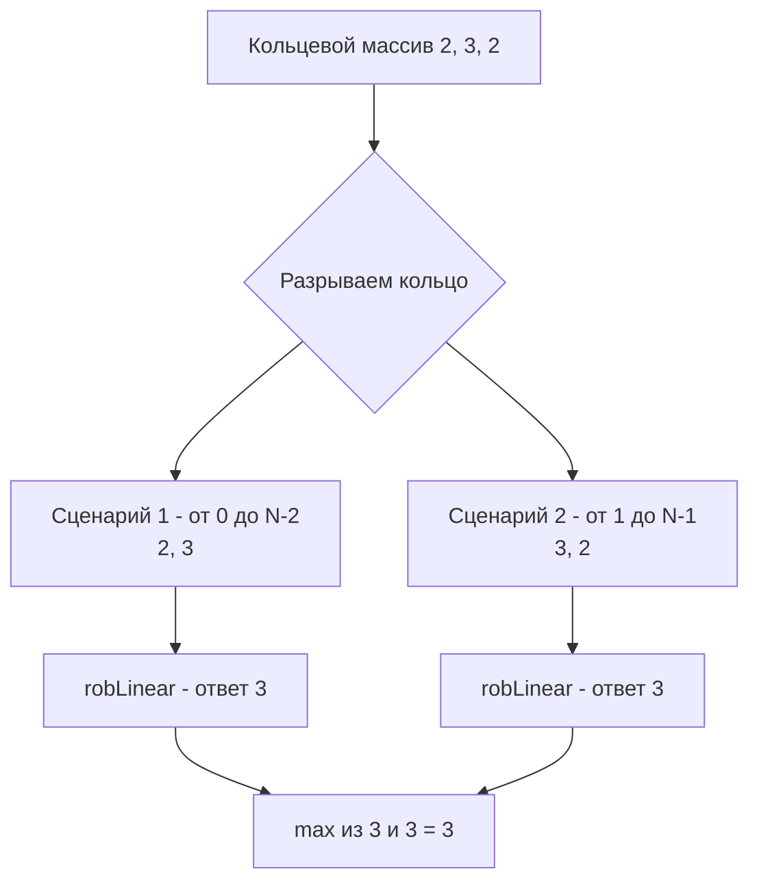

Задача House Robber II (LeetCode 213) элегантно усложняет предыдущую [[4. House Robber]], замыкая массив в кольцо. Теперь первый и последний дома стали соседями. Это крошечное изменение условия ломает линейную логику DP и заставляет нас применять декомпозицию задачи — важнейший навык System Design.

**Условие:** Дан массив `nums`, представляющий деньги в домах. Дома расположены по кругу. Вы не можете грабить два соседних дома подряд. Какую максимальную сумму можно украсть?

В бэкенде эта задача моделирует планирование задач (Scheduling) на кластере с кольцевой топологией (Ring Topology), где ноды $0$ и $N-1$ шарят один и тот же ресурс (например, сетевой интерфейс или БД), и их нельзя нагружать одновременно.

## Проблема замыкания: Разрыв кольца

В линейной версии ответом был `dp[n-1]`. В кольцевой версии мы не можем просто взять `dp[n-1]`, потому что этот переход мог учесть ограбление дома `0`, а дом `n-1` теперь с ним конфликтует.

**Инсайт:** Поскольку дома $0$ и $N-1$ теперь соседние, мы **никогда** не сможем ограбить их оба. Оптимальное решение гарантированно попадает в один из двух взаимоисключающих сценариев:

1. **Мы ограбили дом 0.** Тогда дом $N-1$ строго запрещен. Задача сводится к поиску максимума на отрезке от $0$ до $N-2$.
2. **Мы НЕ ограбили дом 0.** Тогда дом $N-1$ доступен. Задача сводится к поиску максимума на отрезке от $1$ до $N-1$.

Мы "разрываем" кольцо в конфликтующей точке, превращая одну кольцевую задачу в две классические линейные. Ответ — максимум из двух этих сценариев.

## Mechanical Sympathy: Zero-copy срезы в Go

Как передать подмассивы в нашу функцию `robLinear` из предыдущей статьи? В C++ или Java передача подмассива потребовала бы создания новой копии данных ($O(N)$ времени и памяти). 

В Go срезы (slices) работают иначе. Выражения `nums[:len(nums)-1]` и `nums[1:]` **не копируют данные**. Они создают лишь новую структуру `runtime.slice` (указатель, длина, capacity), которая указывает на тот же самый базовый массив (backing array) в памяти.

```go
func rob(nums []int) int {
    n := len(nums)
    if n == 0 {
        return 0
    }
    // Крайний случай: 1 дом. Иначе срезы дадут пустые массивы и ответ будет 0.
    if n == 1 {
        return nums[0]
    }
    
    // Сценарий 1: берем первый дом, недоступен последний
    max1 := robLinear(nums[:n-1])
    
    // Сценарий 2: не берем первый дом, доступен последний
    max2 := robLinear(nums[1:])
    
    return max(max1, max2)
}

// Таже самая O(1) реализация из предыдущей статьи
func robLinear(nums []int) int {
    var prev2, prev1 int = 0, 0
    for _, num := range nums {
        curr := max(prev1, prev2+num)
        prev2, prev1 = prev1, curr
    }
    return prev1
}
```

> [!info] Под капотом
> Когда вы делаете срез `nums[1:]`, рантайм Go просто сдвигает указатель `Data` в структуре `SliceHeader` на один элемент вперед и уменьшает `Len` и `Cap` на 1. 
> 
> Это означает, что обе функции `robLinear` будут читать **одни и те же строки кэша (Cache Lines)** из оперативной памяти. Процессор загрузит базовый массив в L1 кэш при первом вызове, и второй вызов `robLinear` отработает с нулевым количеством Cache Miss, даже не подозревая, что работает с "другим" массивом. Это классический пример того, как абстракции Go ложатся на архитектуру железа.



## Ловушки работы со срезами (Gotchas)

При использовании срезов в Go для декомпозиции массивов важно помнить о потенциальных проблемах:

1. **Утечки памяти (Memory Leaks):** Если базовый массив `nums` огромный (например, 10 МБ), а мы передаем в функцию маленький срез `nums[1:2]`, сборщик мусора Go не сможет удалить базовый массив, пока жив срез, потому что срез ссылается на его начало. В рамках алгоритмической задачи это не критично, но в production-коде (например, при парсинге логов) стоит делать явное копирование: `copy(subSlice, nums[1:])`.
2. **Мутации:** Если бы функция `robLinear` модифицировала переданный срез, она бы испортила исходные данные `nums`, так как они делят одну память. Наша реализация использует только чтение, поэтому мы в безопасности.

## System Design: Разделение Domain и Boundary условий

Подход к решению House Robber II — это микрокосм архитектурного паттерна разделения граничных условий (Edge Cases) и основной бизнес-логики.

В распределенных системах кольцевая топология часто реализуется через **Consistent Hashing** (хеш-кольцо). Если два виртуальных узла (VNodes) на кольце принадлежат одному физическому серверу, мы не можем назначать им тяжелые задачи одновременно. 

Вместо того чтобы писать сложный планировщик с циклическими проверками, мы "разрываем" кольцо по границам физического сервера и запускаем два независимых линейных планировщика. Это упрощает код, делает его детерминированным и легко масштабируемым. Такой же принцип применяется в сетевых протоколах (разрыв петли в STP - Spanning Tree Protocol) и в компиляторах при работе с циклическими графами зависимостей.

> [!tip] Собеседование
> Интервьюер может спросить: *"А что если дома стоят не по кругу, а образуют полноценный граф?"*
> Это переход к задаче Maximum Weight Independent Set (MWIS), которая для произвольного графа является NP-трудной. Но если граф является деревом (как в House Robber III), она решается за $O(N)$ с помощью Post-order DFS и конечного автомата (Hold/Skip). Озвучивание этого факта демонстрирует глубокое понимание теории графов.

## Итог

1. **Декомпозиция:** Замкнутый массив ломает линейный DP. Решение — свести задачу к двум линейным: исключить первый элемент и исключить последний элемент.
2. **Zero-copy:** Срезы в Go (`nums[:n-1]`, `nums[1:]`) не аллоцируют новую память. Они используют тот же базовый массив, что делает разрыв кольца операцией за $O(1)$ по памяти.
3. **Кэш процессора:** Обращение к разным срезам одного массива использует одни и те же кэш-линии CPU, минимизируя Cache Miss.
4. **Edge Cases:** Всегда обрабатывайте базу вручную. Если $N=1$, срезы дадут пустые массивы, и логика сломается.

В следующей статье мы перейдем к новому классу 1D DP — задачам на поиск минимума/максимума среди комбинаций, где нам потребуется не просто выбирать брать/не брать, а перебирать допустимые переходы: [[6. Coin Change]].