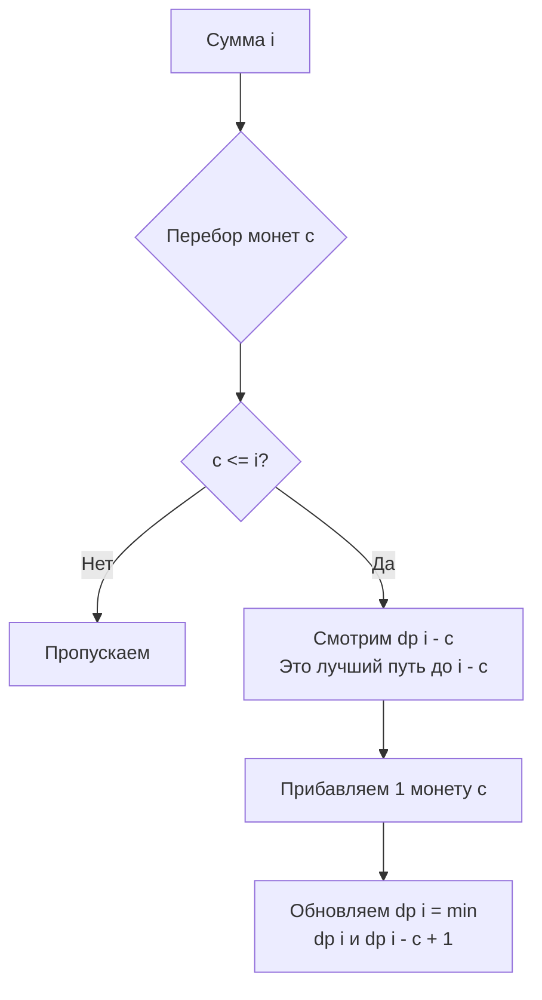

Задача о сдаче монетами (LeetCode 322: Coin Change) — это классический представитель задач о неограниченном рюкзаке (Unbounded Knapsack). В отличие от [[4. House Robber]], где мы могли только выбирать брать или не брать элемент, здесь мы можем брать один и тот же элемент (монету) неограниченное количество раз. Наша цель — минимизировать количество используемых элементов.

**Условие:** Дан массив `coins`, представляющий номиналы монет, и целое число `amount`. Верните наименьшее количество монет, которыми можно собрать сумму `amount`. Если сумму собрать нельзя, верните `-1`. Монет каждого номинала бесконечно много.

В бэкенде этот паттерн применяется везде, где есть разбиение ресурса на чанки: от выбора оптимального размера сетевых пакетов до аллокации блоков памяти в памяти пула (например, в `sync.Pool` или аллокаторах вроде TCMalloc).

## Ловушка: Жадный алгоритм не работает

Первая мысль при решении этой задачи — всегда брать монету с максимальным номиналом (жадность). Но это ошибочный путь.

Представьте, что номиналы `[1, 3, 4]`, а сумма `6`.
- Жадный алгоритм возьмет: `4 + 1 + 1` = 3 монеты.
- Оптимально: `3 + 3` = 2 монеты.

Жадность не работает, потому что локально оптимальный выбор может заблокировать глобально оптимальное решение. Нам нужен полный перебор с кэшированием — то есть DP.

## Формулировка DP: Минимум шагов

Мы используем 1D массив, где `dp[i]` означает минимальное количество монет для суммы `i`.

1. **База:** `dp[0] = 0` (чтобы собрать 0, нужно 0 монет). Остальные заполняем "бесконечностью" (недостижимым значением).
2. **Переход:** Для каждой суммы `i` мы перебираем все монеты `c`. Если монета помещается (`c <= i`), мы смотрим на сумму без этой монеты `dp[i-c]` и прибавляем 1 (сама монета). Берем минимум по всем монетам:
   $$dp[i] = \min_{c \in coins} (dp[i], dp[i-c] + 1)$$

## Идиоматичный Go и проблема переполнения

В C++ или Java для "бесконечности" часто используют `INT_MAX`. Но в Go при прибавлении единицы к `math.MaxInt64` произойдет переполнение (overflow), значение станет отрицательным, и логика `min` сломается.

Решение — использовать `math.MaxInt32` (которое точно больше любого возможного ответа, так как максимальное количество монет не превысит `amount`, если есть монета номиналом 1) или обрабатывать переполнение явно.

```go
import "math"

func coinChange(coins []int, amount int) int {
    // dp[i] - минимальное кол-во монет для суммы i
    dp := make([]int, amount+1)
    
    // Инициализация "бесконечностью"
    for i := 1; i <= amount; i++ {
        dp[i] = math.MaxInt32
    }
    dp[0] = 0
    
    // Заполнение снизу вверх
    for i := 1; i <= amount; i++ {
        for _, c := range coins {
            if c <= i {
                // Выбираем минимум: не использовать монету c или использовать
                dp[i] = min(dp[i], dp[i-c]+1)
            }
        }
    }
    
    // Если сумма не достигнута, вернем -1
    if dp[amount] == math.MaxInt32 {
        return -1
    }
    return dp[amount]
}

func min(a, b int) int {
    if a < b {
        return a
    }
    return b
}
```



> [!warning] Ловушка / Gotcha
> Почему мы инициализируем `math.MaxInt32`, а не `amount + 1`? 
> Если монета номиналом 1 есть, максимальное количество монет действительно равно `amount`. Но если монеты `[2, 5]`, а сумма `3`, то `amount + 1 = 4`. Мы могли бы использовать `amount + 1` как заглушку, так как это гарантирует, что любой реальный ответ будет меньше. `amount + 1` безопаснее с точки зрения переполнения, но `math.MaxInt32` — это классический идиоматический паттерн, явно выражающий концепцию "бесконечности". На интервью можно использовать любой вариант, главное — озвучить проблему overflow.

## Mechanical Sympathy: Паттерн доступа к кэшу

Давайте проанализируем, как наш код обращается к памяти.

Внешний цикл идет по суммам `i` от 1 до `amount`. Внутренний цикл перебирает монеты. При вычислении `dp[i]` мы делаем прыжки назад в массиве: `dp[i-c1]`, `dp[i-c2]` и так далее.

Размер слайса `dp` — `(amount + 1) * 8 байт`. Если `amount` = 10 000, слайс занимает 80 КБ. Это больше, чем размер L1 кэша процессора (обычно 32 КБ), но помещается в L2.

Проблема в том, что если монеты имеют большие номиналы (например, `c = 5000`), чтение `dp[i-5000]` заставит процессор искать данные далеко за пределами текущей кэш-линии. Это вызовет Cache Miss и задержку в десятки тактов.

> [!info] Под капотом
> Можно ли поменять циклы местами? (Внешний по монетам, внутренний по суммам)?
> Да, это классическая оптимизация для Unbounded Knapsack в задачах, где важна локальность. Если мы зафиксируем монету `c` и пойдем по суммам `i` от `c` до `amount`, доступ к памяти станет строго последовательным: `dp[i]` зависит от `dp[i-c]`, но шаг `c` фиксирован. Prefetcher процессора гораздо лучше справляется с предсказанием регулярных шагов, чем с хаотичными прыжками разных номиналов. Сложность останется $O(\text{amount} \cdot |\text{coins}|)$, но константа времени выполнения на железе уменьшится.

## System Design: Аллокация памяти и чанки

Где паттерн Coin Change встречается в архитектуре бэкенда?

1. **Memory Allocators (TCMalloc, Go runtime):** Когда горутине нужно `N` байт памяти, аллокатор не всегда дает точный размер. У него есть классы размеров (size classes), например: 8, 16, 32, 48, 64, 80, 96... Задача аллокатора — выдать минимальное количество блоков (span), чтобы покрыть запрос. Это вариация задачи Coin Change, где номиналы монет — это size classes, а запрашиваемая сумма — это `N` байт.
2. **Сетевые пакеты:** Фрагментация большого файла на MTU-совместимые пакеты. Если у вас есть протокол с поддержкой разных размеров чанков, вы хотите минимизировать количество пакетов (меньше оверхеда на заголовки), что в точности является минимизацией количества монет.

> [!tip] Собеседование
> Если вы решили базовую задачу, интервьюер спросит: *"А как вывести сами монеты, а не только их количество?"*
> **Ответ:** Нам нужен дополнительный массив `choice := make([]int, amount+1)`. Каждый раз, когда мы обновляем `dp[i] = dp[i-c] + 1`, мы сохраняем выбранную монету: `choice[i] = c`. В конце мы просто восстанавливаем путь: `amount -= choice[amount]`, пока `amount > 0`. Это стандартный прием восстановления ответа (Path Reconstruction) в DP, который часто требуется в реальных системах.

## Итог

1. **Жадность — зло:** В задачах с произвольными номиналами и оптимизацией количества жадный подход не гарантирует оптимума. Только полный DP.
2. **Overflow:** В Go при использовании "бесконечности" в задачах на минимум всегда следите за тем, чтобы прибавление единицы не вызвало переполнение знакового целого. `math.MaxInt32` — безопасный выбор.
3. **Unbounded Knapsack:** Одномерный DP позволяет использовать один и тот же элемент много раз, так как мы заполняем массив слева направо, и обновленное значение `dp[i]` сразу становится доступным для следующих сумм.
4. **Порядок циклов:** С точки зрения Mechanical Sympathy, внешний цикл по монетам может быть дружелюбнее к кэшу CPU из-за предсказуемости шага доступа к памяти.

В следующей статье мы разберем еще одну вариацию задачи о стоимости пути, которая внешне похожа на лестницу Фибоначчи, но требует поиска минимума: [[7. Min Cost Climbing Stairs]].