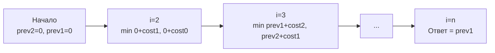

Задача о минимальной стоимости подъема по лестнице (LeetCode 746: Min Cost Climbing Stairs) — это идеальное закрепление паттерна "Оптимальный путь", который мы обсуждали в [[2. Базовые паттерны]]. Внешне она похожа на [[3. Climbing Stairs]], но вместо подсчета количества способов мы минимизируируем "штраф" (стоимость) перехода.

**Условие:** Дан массив `cost`, где `cost[i]` — стоимость шага на `i`-ю ступень. Как только вы оплачиваете ступень, вы можете сделать 1 или 2 шага вверх. Вы можете начать с индекса 0 или 1. Найдите минимальную стоимость, чтобы достичь вершины лестницы (индекса `n`, то есть шаг за пределы массива).

В бэкенде этот паттерн описывает системы, где переход между состояниями требует затрат ресурсов (CPU, памяти, сетевых хопов), и我们需要 выбрать маршрут с минимальными издержками.

## Формулировка DP: Стоимость достижения

Ключевой вопрос: что такое `dp[i]`? 
Ошибка — считать, что `dp[i]` — это стоимость стояния на ступени `i`. Правильно определять `dp[i]` как **минимальную стоимость достижения ступени `i`**.

Поскольку мы можем шагнуть на `i` с `i-1` или с `i-2`, стоимость достижения `i` складывается из стоимости достижения предыдущей ступени и оплаты самого перехода (которая записана в `cost` предыдущей ступени).

**Формула перехода:**
$$dp[i] = \min(dp[i-1] + cost[i-1], dp[i-2] + cost[i-2])$$

**База:**
Мы можем начать с 0 или 1 бесплатно:
- `dp[0] = 0`
- `dp[1] = 0`

Ответом будет `dp[n]`, где `n` — длина массива (вершина лестницы, находящаяся за пределами массива).

## Идиоматичный Go: O(1) памяти

Как и в предыдущих задачах 1D DP, зависимость от `i-1` и `i-2` позволяет сжать слайс состояний до двух переменных. Это убирает аллокацию в куче и давление на GC, что критично для высоконагруженных сервисов.

```go
func minCostClimbingStairs(cost []int) int {
    n := len(cost)
    if n == 0 {
        return 0
    }
    if n == 1 {
        return cost[0]
    }
    
    // dp[i-2] и dp[i-1], начинаем с нулевой стоимости
    var prev2, prev1 int = 0, 0
    
    // Идем до вершины (индекс n)
    for i := 2; i <= n; i++ {
        // Выбираем, откуда дешевле прийти: с i-1 или с i-2
        curr := min(prev1+cost[i-1], prev2+cost[i-2])
        prev2, prev1 = prev1, curr
    }
    
    return prev1
}

func min(a, b int) int {
    if a < b {
        return a
    }
    return b
}
```



> [!warning] Ловушка / Gotcha
> Самая частая ошибка в этой задаче — неправильное определение ответа. Кандидаты останавливаются на `n-1` и возвращают `min(dp[n-1], dp[n-2])`. Но по условию вершина лестницы находится *после* последнего элемента. Чтобы ступить на вершину, вы должны заплатить за `n-1` или `n-2` и сделать прыжок. Поэтому цикл должен идти до `n` включительно, и тогда `dp[n]` (в нашем случае `prev1`) и будет чистой стоимостью достижения финиша без лишних `min` в конце.

## Mechanical Sympathy: Зависимости данных и конвейер CPU

Давайте посмотрим на цикл:
```go
curr := min(prev1+cost[i-1], prev2+cost[i-2])
prev2, prev1 = prev1, curr
```

С точки зрения процессора, это классическая **цепочка зависимостей по данным (Data Dependency Chain)**. Вычисление `curr` на текущей итерации напрямую зависит от значений `prev1` и `prev2`, вычисленных на предыдущей. 

Процессор не может распараллелить этот цикл (векторизовать его через SIMD инструкции, такие как AVX2/AVX-512), потому что каждое следующее состояние строго ждет предыдущего. 

> [!info] Под капотом
> Хотя векторизация невозможна, конвейер (Instruction Pipeline) процессора работает здесь на полную мощность. Пока Арифметико-логическое устройство (ALU) вычисляет `curr`, подраздел предсказания ветвлений (Branch Predictor) уже обрабатывает условие внутри `min()`, а Prefetcher подгружает следующие элементы `cost[i]` из RAM в L1 кэш. 
> 
> Компилятор Go (через SSA) скомпилирует функцию `min` не как вызов функции, а как условную пересылку (CMOV - Conditional Move) на x86_64, что позволяет избежать сброса конвейера (pipeline flush). Цикл будет выполняться практически за 1-2 такта на итерацию.

## System Design: Маршрутизация с издержками

В реальных распределенных системах "лестница со стоимостью" — это не абстракция, а ежедневная рутина:

1. **Network Hops (OSPF / BGP):** Пакет перемещается между маршрутизаторами. Каждый переход (хоп) имеет задержку (cost). Маршрутизатор выбирает следующий шаг с минимальной совокупной стоимостью пути до целевой подсети.
2. **Retry Strategies с Backoff:** Система пытается восстановить соединение. Шаг 1: немедленный реконнект. Шаг 2: пауза 100мс. Шаг 3: 500мс. Стоимость (накопленная задержка) растет. Выбор стратегии — это выбор пути по лестнице с разной стоимостью ступеней.
3. **Миграция данных (Shard Rebalancing):** Перенос данных между нодами кластера. Переход от ноды A к B может стоить 1 единицу сетевого I/O, а от A к C — 2 единицы (из-за кросс-DC трафика). Балансировщик ищет путь миграции с минимальной стоимостью.

> [!tip] Собеседование
> Если вы быстро решили эту задачу, интервьюер может спросить: *"А что если вы можете прыгать на 1, 2 или 3 ступени?"*
> 
> **Ответ:** Формула расширяется: `dp[i] = min(dp[i-1]+cost[i-1], dp[i-2]+cost[i-2], dp[i-3]+cost[i-3])`. Теперь нам нужно хранить 3 предыдущих состояния вместо 2. Базу нужно будет определить для `dp[0]`, `dp[1]` и `dp[2]`. Если размер прыжка ограничен константой `K`, сложность останется $O(N \cdot K)$ по времени и $O(K)$ по памяти.

## Итог

1. **Интерпретация состояния:** Всегда четко определяйте, что такое `dp[i]`. В этой задаче это стоимость *достижения* `i`, а не стоимость *пребывания* на `i`. Это избавляет от запутанной логики в конце.
2. **Границы цикла:** Вершина находится за пределами массива (`i <= n`). Не забывайте обработать этот последний шаг.
3. **Сжатие памяти:** Как и в других 1D DP, сжимаем массив до переменных на стеке. Это делает код идиоматичным и дружелюбным к GC.
4. **Архитектура:** Задача моделирует поиск кратчайшего пути во взвешенном направленном ациклическом графе (DAG), где вершины — это ступени, а веса ребер — стоимость переходов.

На этом мы завершаем раздел одномерного динамического программирования. Мы увидели, как от простых последовательностей Фибоначчи мы перешли к сложным оптимизациям выбора (House Robber), комбинаторике (Coin Change) и путям с издержками (Min Cost). В следующей статье мы добавим еще одно измерение и перейдем к матричным вычислениям: [[1. Теория. Динамическое программирование 2D]].