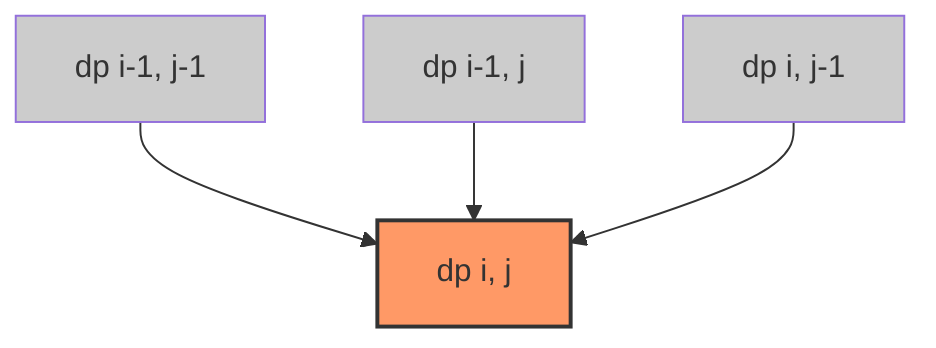

Переход от одномерного динамического программирования к двумерному (2D DP) — это качественный скачок. Если в 1D DP мы двигались по прямой линии, опираясь на 1-2 предыдущих состояния, то в 2D DP наше состояние описывается уже двумя параметрами, образуя плоскость (матрицу).

Как правило, один параметр отвечает за прогресс в одной сущности (например, длина первой строки), а второй — в другой (длина второй строки). Либо же оба параметра описывают координаты в сетке (grid). Массив `dp[i][j]` становится пространством всех возможных пересечений этих состояний.

## Анатомия 2D DP: Зависимости в матрице

В 2D DP значение `dp[i][j]` обычно вычисляется на основе "соседей" — состояний, которые находятся левее, выше или по диагонали слева-сверху. 

Существует три базовых шаблона зависимостей:
1. **Сетевой путь (Grid Path):** `dp[i][j] = f(dp[i-1][j], dp[i][j-1])`. Мы приходим в текущую клетку либо сверху, либо слева.
2. **Строковое сравнение (Edit Distance):** `dp[i][j] = f(dp[i-1][j], dp[i][j-1], dp[i-1][j-1])`. Добавляется диагональный переход, означающий совпадение символов или замену.
3. **Рюкзак (0/1 Knapsack):** `dp[i][j] = f(dp[i-1][j], dp[i-1][j-w[i]])`. Мы берем или не берем предмет `i` при вместимости `j`.



## Mechanical Sympathy: Джаггед-массивы и Кэш

В Go нет встроенного типа "двумерный массив" фиксированного размера, как в C++ (`int dp[m][n]`). Вместо этого разработчики используют слайс слайсов: `[][]int`. И здесь кроется огромная ловушка с точки зрения архитектуры CPU.

Когда вы пишете:
```go
dp := make([][]int, rows)
for i := range dp {
    dp[i] = make([]int, cols)
}
```
Go выделяет внешний слайс (массив указателей), а затем **для каждой строки** делает отдельный вызов `make`, выделяя память в куче (heap).

Результат: ваша матрица разбросана по куче. Строка 0 может лежать по адресу `0x0001`, а строка 1 — по адресу `0xFF00`. При обходе такой матрицы `dp[i][j] -> dp[i+1][j]` процессор каждый раз промахивается мимо L1/L2 кэша (Cache Miss), потому что данные не лежат рядом, и вынужден ждать подгрузки из RAM (~100+ наносекунд).

### Решение: Плоский массив (Flat Array)

Для latency-critical бэкенда мы должны выделять один непрерывный блок памяти и вручную вычислять индекс.

```go
// ВМЕСТО джаггед-массива:
// dp := make([][]int, rows) ...

// ИСПОЛЬЗУЕМ плоский слайс:
dp := make([]int, rows*cols) // Одна аллокация, непрерывный кусок памяти!

// Доступ к элементу [i][j]:
// Строки идут подряд. Смещение = индекс_строки * кол_во_столбцов + индекс_столбца
val := dp[i*cols + j]
```

> [!info] Под капотом
> При использовании плоского массива `dp[i*cols + j]` и построчном обходе (внешний цикл по `i`, внутренний по `j`), доступ к памяти становится строго последовательным. Процессор увидит, что мы читаем память вперед, и его аппаратный префетчер (Hardware Prefetcher) начнет подгружать следующие кэш-линии (по 64 байта) заранее. Это ускоряет заполнение матрицы в десятки раз по сравнению со слайсом слайсов. Кроме того, одна аллокация вместо `N+1` радикально снижает нагрузку на Garbage Collector.

## Оптимизация памяти: Сжатие размерности (Space Optimization)

Матрица `dp` размером $M \times N$ требует $O(M \cdot N)$ памяти. Если $M$ и $N$ равны 10 000, наш плоский слайс займет 800 МБ (для `int64`). Это неприемлемо для бэкенда.

Ключ к оптимизации — анализ зависимостей. Если для вычисления `dp[i][j]` нужны только значения из текущей строки `i` и предыдущей строки `i-1`, то хранить строки `0 ... i-2` бессмысленно.

Мы можем сжать 2D матрицу до **двух 1D слайсов** (или даже одного, если быть аккуратным).

**Трюк с одним слайсом (In-place update):**
Если переход выглядит как `dp[i][j] = dp[i-1][j] + dp[i][j-1]`:
- `dp[i-1][j]` — это старое значение в нашем 1D слайсе на позиции `j` (с прошлой итерации внешнего цикла).
- `dp[i][j-1]` — это новое, только что вычисленное значение на позиции `j-1` (в текущей итерации).

Следовательно, мы можем переписать формулу так:
`dp[j] = dp[j] + dp[j-1]`

> [!warning] Ловушка / Gotcha
> Для такой in-place оптимизации порядок обновления **критически важен**. Если обходить слайс слева направо (по `j`), то при вычислении `dp[j]` значение `dp[j-1]` уже будет обновлено до `i`-й строки, а `dp[j]` всё ещё хранит значение с `i-1`-й строки. Это именно то, что нам нужно! Если бы переход требовал `dp[i-1][j-1]` (старое диагональное значение), то перезапись `dp[j-1]` уничтожила бы его. В таких случаях нужно либо вводить переменную `prev` для хранения диагонали, либо использовать два слайса (`prevRow` и `currRow`).

## System Design: Где 2D DP на бэкенде?

1. **Diff-алгоритмы (Git, Wikipedia):** Сравнение версий файлов или документов — это классическая задача Longest Common Subsequence (LCS). Git ищет минимальное количество правок (insert/delete), чтобы превратить файл A в файл B. Это чистое 2D DP с двумя строками.
2. **Поиск плагиата и дедупликация:** Сравнение логов или текстов на схожесть. Расстояние Левенштейна (Edit Distance) — это 2D DP.
3. **Ресурсное планирование (Bin Packing):** Задача о рюкзаке. У вас есть серверы (вместимость) и микросервисы (вес и потребление CPU). Как оптимально распределить сервисы по серверам? 2D DP дает точный ответ для ограниченных размерностей.

> [!tip] Собеседование
> На интервью по 2D DP ваш главный козырь — не написать код за 2 минуты, а нарисовать матрицу на доске.
> 1. Нарисуйте оси (что значит `i`, что значит `j`).
> 2. Заполните базовые случаи (первую строку и первый столбец).
> 3. Возьмите произвольную клетку внутри и покажите стрелками, откуда в нее приходят значения.
> 4. Напишите формулу перехода.
> 5. Скажите: *"Поскольку нам нужны только две предыдущие строки, мы можем сжать память до O(min(N,M)) используя один слайс"*. Это мгновенный Strong Hire.

## Итог

1. **Два измерения:** 2D DP моделирует пересечение двух последовательностей или координатной сетки.
2. **Плоский массив:** Никогда не используйте `[][]int` для больших матриц в Go. Выделяйте плоский слайс `make([]int, rows*cols)` и вычисляйте индекс для идеальной локальности кэша.
3. **Сжатие памяти:** Если переход зависит только от предыдущей строки, сжимайте матрицу до 1D слайса. Всегда следите за тем, не затираете ли вы данные, которые понадобятся на следующем шаге.
4. **Практика:** 2D DP — это основа алгоритмов сравнения строк (diff, LCS), которые активно используются в инфраструктурных инструментах.

В следующей статье мы применим теорию сетевого пути к матрицам на практических задачах: [[2. Матрицы]].
 должны выделять один непрерывный блок памяти и вручную вычислять индекс.

```go
// ВМЕСТО джаггед-массива:
// dp := make([][]int, rows) ...

// ИСПОЛЬЗУЕМ плоский слайс:
dp := make([]int, rows*cols) // Одна аллокация, непрерывный кусок памяти!

// Доступ к элементу [i][j]:
// Строки идут подряд. Смещение = индекс_строки * кол_во_столбцов + индекс_столбца
val := dp[i*cols + j]
```

> [!info] Под капотом
> При использовании плоского массива `dp[i*cols + j]` и построчном обходе (внешний цикл по `i`, внутренний по `j`), доступ к памяти становится строго последовательным. Процессор увидит, что мы читаем память вперед, и его аппаратный префетчер (Hardware Prefetcher) начнет подгружать следующие кэш-линии (по 64 байта) заранее. Это ускоряет заполнение матрицы в десятки раз по сравнению со слайсом слайсов. Кроме того, одна аллокация вместо `N+1` радикально снижает нагрузку на Garbage Collector.

## Оптимизация памяти: Сжатие размерности (Space Optimization)

Матрица `dp` размером $M \times N$ требует $O(M \cdot N)$ памяти. Если $M$ и $N$ равны 10 000, наш плоский слайс займет 800 МБ (для `int64`). Это неприемлемо для бэкенда.

Ключ к оптимизации — анализ зависимостей. Если для вычисления `dp[i][j]` нужны только значения из текущей строки `i` и предыдущей строки `i-1`, то хранить строки `0 ... i-2` бессмысленно.

Мы можем сжать 2D матрицу до **двух 1D слайсов** (или даже одного, если быть аккуратным).

**Трюк с одним слайсом (In-place update):**
Если переход выглядит как `dp[i][j] = dp[i-1][j] + dp[i][j-1]`:
- `dp[i-1][j]` — это старое значение в нашем 1D слайсе на позиции `j` (с прошлой итерации внешнего цикла).
- `dp[i][j-1]` — это новое, только что вычисленное значение на позиции `j-1` (в текущей итерации).

Следовательно, мы можем переписать формулу так:
`dp[j] = dp[j] + dp[j-1]`

> [!warning] Ловушка / Gotcha
> Для такой in-place оптимизации порядок обновления **критически важен**. Если обходить слайс слева направо (по `j`), то при вычислении `dp[j]` значение `dp[j-1]` уже будет обновлено до `i`-й строки, а `dp[j]` всё ещё хранит значение с `i-1`-й строки. Это именно то, что нам нужно! Если бы переход требовал `dp[i-1][j-1]` (старое диагональное значение), то перезапись `dp[j-1]` уничтожила бы его. В таких случаях нужно либо вводить переменную `prev` для хранения диагонали, либо использовать два слайса (`prevRow` и `currRow`).

## System Design: Где 2D DP на бэкенде?

1. **Diff-алгоритмы (Git, Wikipedia):** Сравнение версий файлов или документов — это классическая задача Longest Common Subsequence (LCS). Git ищет минимальное количество правок (insert/delete), чтобы превратить файл A в файл B. Это чистое 2D DP с двумя строками.
2. **Поиск плагиата и дедупликация:** Сравнение логов или текстов на схожесть. Расстояние Левенштейна (Edit Distance) — это 2D DP.
3. **Ресурсное планирование (Bin Packing):** Задача о рюкзаке. У вас есть серверы (вместимость) и микросервисы (вес и потребление CPU). Как оптимально распределить сервисы по серверам? 2D DP дает точный ответ для ограниченных размерностей.

> [!tip] Собеседование
> На интервью по 2D DP ваш главный козырь — не написать код за 2 минуты, а нарисовать матрицу на доске.
> 1. Нарисуйте оси (что значит `i`, что значит `j`).
> 2. Заполните базовые случаи (первую строку и первый столбец).
> 3. Возьмите произвольную клетку внутри и покажите стрелками, откуда в нее приходят значения.
> 4. Напишите формулу перехода.
> 5. Скажите: *"Поскольку нам нужны только две предыдущие строки, мы можем сжать память до O(min(N,M)) используя один слайс"*. Это мгновенный Strong Hire.

## Итог

1. **Два измерения:** 2D DP моделирует пересечение двух последовательностей или координатной сетки.
2. **Плоский массив:** Никогда не используйте `[][]int` для больших матриц в Go. Выделяйте плоский слайс `make([]int, rows*cols)` и вычисляйте индекс для идеальной локальности кэша.
3. **Сжатие памяти:** Если переход зависит только от предыдущей строки, сжимайте матрицу до 1D слайса. Всегда следите за тем, не затираете ли вы данные, которые понадобятся на следующем шаге.
4. **Практика:** 2D DP — это основа алгоритмов сравнения строк (diff, LCS), которые активно используются в инфраструктурных инструментах.

В следующей статье мы применим теорию сетевого пути к матрицам на практических задачах: [[2. Матрицы]].