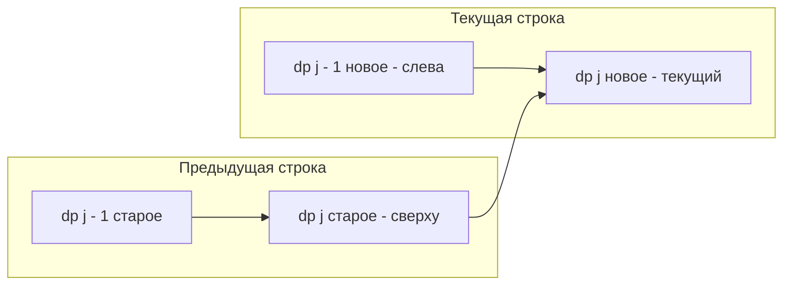

Задачи на матрицы (Grid DP) — это самый наглядный и интуитивный вход в мир двумерного динамического программирования. В отличие от строковых задач, где индексы абстрактны, здесь мы физически двигаемся по плоскости: от левого верхнего угла к правому нижнему.

В бэкенде матричное DP моделирует задачи маршрутизации в сетях с квадратной/гексагональной топологией, расчет стоимости передачи данных через узлы и поиск оптимальных путей в геоинформационных системах (GIS).

## Суть паттерна: Движение по сетке

Классическая постановка: дана матрица `grid` размером $M \times N$. Мы начинаем в клетке `(0,0)` и должны попасть в `(M-1, N-1)`. Двигаться можно только вправо или вниз. 

Вопрос может быть двух типов:
1. **Подсчет путей:** Сколько уникальных маршрутов существует? (Unique Paths)
2. **Оптимизация стоимости:** Каков минимальный штраф за прохождение, если каждая клетка имеет стоимость? (Minimum Path Sum)

**Переход состояний:**
Поскольку мы приходим в клетку `(i, j)` либо сверху `(i-1, j)`, либо слева `(i, j-1)`, формула всегда строится на этих двух предках:
- Количество путей: $dp[i][j] = dp[i-1][j] + dp[i][j-1]$
- Минимальная стоимость: $dp[i][j] = \min(dp[i-1][j], dp[i][j-1]) + grid[i][j]$

**База:**
Первая строка и первый столбец заполняются тривиально, так как путь туда всего один (идти прямо по краю).

## Mechanical Sympathy: Плоский слайс на практике

В [[1. Теория. Динамическое программирование 2D]] мы договорились никогда не использовать джаггед-массивы (`[][]int`) для больших матриц. Давайте применим плоский слайс на классической задаче Minimum Path Sum.

```go
func minPathSum(grid [][]int) int {
    rows := len(grid)
    cols := len(grid[0])
    
    // Плоский слайс: одна аллокация вместо rows+1
    // Идеально для кэша L1/L2
    dp := make([]int, rows*cols)
    
    // База: начальная клетка
    dp[0] = grid[0][0]
    
    // Заполнение первой строки (индексы от 1 до cols-1)
    for j := 1; j < cols; j++ {
        dp[0*cols+j] = dp[0*cols+j-1] + grid[0][j]
    }
    
    // Заполнение первого столбца (индексы от 1 до rows-1)
    for i := 1; i < rows; i++ {
        dp[i*cols+0] = dp[(i-1)*cols+0] + grid[i][0]
    }
    
    // Заполнение остальной матрицы
    for i := 1; i < rows; i++ {
        for j := 1; j < cols; j++ {
            top := dp[(i-1)*cols+j]
            left := dp[i*cols+j-1]
            
            if top < left {
                dp[i*cols+j] = top + grid[i][j]
            } else {
                dp[i*cols+j] = left + grid[i][j]
            }
        }
    }
    
    return dp[(rows-1)*cols+cols-1]
}
```

> [!info] Под капотом
> Почему `if-else` быстрее `min(top, left)` в Go?
> Встроенных generic-функций `min`/`max` для чисел в Go до версии 1.21 не было, и многие пишут свою функцию `min(a, b int)`. Вызов функции (даже если она инлайнится) может генерировать чуть менее оптимальный ассемблерный код, чем прямой `if`, который компилируется в инструкцию `CMOV` (Conditional Move). `CMOV` не ломает конвейер (pipeline) процессора в отличие от ветвлений, зависящих от данных. Современный компилятор Go 1.22+ инлайнит `min` корректно, но для критических участков прямой `if` остается надежной гарантией отсутствия вызова функции.

## Сжатие размерности: In-place 1D DP (O(N) памяти)

Мы выделили `rows * cols` памяти. Если матрица $10^4 \times 10^4$, это 800 МБ. Бэкенд не может позволить себе такие траты на каждый запрос.

Заметим: для вычисления строки `i` нам нужна **только** строка `i-1`. Мы можем сжать 2D массив в 1D слайс длиной `cols`.

**Логика обновления `dp[j]` в цикле по `i`:**
- `dp[j]` до обновления хранит результат с предыдущей строки (сверху).
- `dp[j-1]` уже обновлен на текущей итерации внутреннего цикла (слева).
- Текущая клетка: `dp[j] = min(dp[j], dp[j-1]) + grid[i][j]`

```go
func minPathSumOptimized(grid [][]int) int {
    rows := len(grid)
    cols := len(grid[0])
    
    // Только один слайс!
    dp := make([]int, cols)
    
    dp[0] = grid[0][0]
    for j := 1; j < cols; j++ {
        dp[j] = dp[j-1] + grid[0][j]
    }
    
    for i := 1; i < rows; i++ {
        // Обновляем базу (первый столбец текущей строки)
        // dp[0] берется сверху (старое значение dp[0]) + текущая клетка
        dp[0] += grid[i][0]
        
        for j := 1; j < cols; j++ {
            // dp[j] - это значение сверху (из пред. итерации по i)
            // dp[j-1] - это значение слева (уже обновлено на этой итерации по j)
            top := dp[j]
            left := dp[j-1]
            
            if top < left {
                dp[j] = top + grid[i][j]
            } else {
                dp[j] = left + grid[i][j]
            }
        }
    }
    
    return dp[cols-1]
}
```



> [!warning] Ловушка / Gotcha
> Порядок обхода при сжатии размерности **критичен**. Внутренний цикл должен идти слева направо (`j` от 1 до `cols-1`). Только так в момент вычисления `dp[j]` в `dp[j-1]` уже будет лежать обновленное значение "слева", а в `dp[j]` — еще не перезаписанное значение "сверху". Если вы перепутаете порядок или обходите справа налево, логика сломается.

## Вариации: Препятствия (Unique Paths II)

Часто на интервью в матрицу добавляют препятствия (клетки, где `grid[i][j] == 1` означает стену). 
Как меняется логика?
- Если клетка — стена, то `dp[i][j] = 0` (пути через нее нет).
- В сжатом 1D массиве это просто проверка: если `grid[i][j] == 1`, то `dp[j] = 0`, иначе `dp[j] = dp[j] + dp[j-1]`.

## System Design: Базовые станции и Cost-матрицы

В микросервисных архитектурах и IoT-системах (умные города, автономные автомобили) матричное DP используется для маршрутизации. 

Представьте сетку базовых станций. `grid[i][j]` — это задержка (latency) или стоимость передачи пакета через станцию `(i,j)`. Алгоритм Minimum Path Sum находит оптимальный маршрут для пакета от точки входа в сеть до точки выхода с минимальной суммарной задержкой. 

Сжатие памяти до $O(N)$ здесь не просто трюк для собеседования — это то, что позволяет встроенному роутеру с 2 МБ RAM вычислять пути на картах размером тысячи на тысячи узлов.

> [!tip] Собеседование
> Решив задачу, всегда добавьте: *"Мы можем сжать память до O(cols), используя один 1D массив, так как зависимость идет только от верхней и левой клетки"*. Если интервьюер спросит, можно ли оптимизировать еще сильнее (выбрать `min(rows, cols)`), ответьте: *"Да, мы можем транспонировать логику, если cols > rows, и итерироваться по меньшей размерности, чтобы уменьшить слайс dp и улучшить кэширование"*.

## Итог

1. **Два предка:** Формула матричного DP всегда опирается на клетку сверху и слева.
2. **Плоский слайс:** Забудьте про `[][]int`. Используйте `make([]int, rows*cols)` для предсказуемого доступа к памяти.
3. **In-place DP:** Сжимайте 2D матрицу до 1D слайса `dp[j] = f(dp[j], dp[j-1])`. Это снижает память с $O(M \cdot N)$ до $O(N)$ и спасает бэкенд от OOM.
4. **Порядок обхода:** При сжатии всегда идите слева направо, чтобы значение "слева" обновлялось до того, как оно понадобится "текущей" клетке.

В следующей статье мы разберем классическую задачу, которая идеально иллюстрирует этот паттерн подсчета маршрутов: [[3. Unique Paths]].