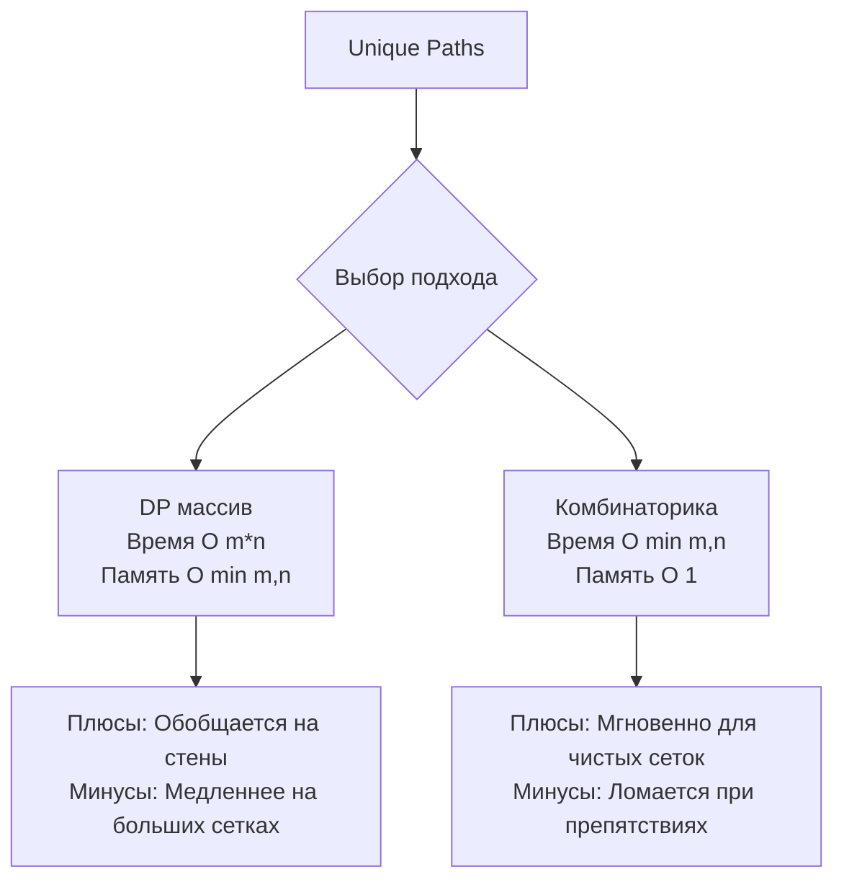

Задача Unique Paths (LeetCode 62) — это каноническая задача о роботе на сетке, которая идеально дополняет теорию из [[2. Матрицы]]. Если там мы искали минимальную стоимость пути, то здесь мы считаем количество способов достичь финиша. 

**Условие:** Робот находится в левом верхнем углу сетки $m \times n$. Он может двигаться только вниз или вправо. Сколько уникальных путей приведут его в правый нижний угол?

В бэкенде эта задача моделирует расчет количества возможных маршрутов передачи данных в mesh-сетях (сетках с коммутацией) или количество способов распределения задач в кластере с топологией строгой иерархии.

## Подход 1: Классический 1D DP (O(m\*n) времени, O(n) памяти)

Формула перехода для количества путей тривиальна: чтобы попасть в клетку `(i, j)`, робот должен прийти либо сверху `(i-1, j)`, либо слева `(i, j-1)`. Следовательно:
$$dp[i][j] = dp[i-1][j] + dp[i][j-1]$$

Как мы обсуждали в предыдущей статье, мы можем сжать 2D матрицу до 1D слайса. Более того, мы можем выбрать меньшую размерность для слайса, чтобы минимизировать использование памяти и улучшить локальность кэша.

```go
func uniquePaths(m int, n int) int {
    // Оптимизация: делаем слайс по меньшей стороне
    // Если m=3, n=7, слайс будет длины 3, а не 7
    if m < n {
        m, n = n, m 
    }
    
    dp := make([]int, n)
    
    // База: первая строка заполнена единицами (всего 1 путь по прямой)
    for i := range dp {
        dp[i] = 1
    }
    
    // Итерируемся по строкам, начиная со второй
    for i := 1; i < m; i++ {
        for j := 1; j < n; j++ {
            // dp[j] до обновления = значение сверху
            // dp[j-1] после обновления = значение слева
            dp[j] += dp[j-1]
        }
    }
    
    return dp[n-1]
}
```

> [!info] Под капотом
> Почему `dp[j] += dp[j-1]` работает так эффективно на уровне железа?
> Это чистый **Sequential Access**. Процессор видит, что мы обращаемся к элементам слайса по возрастанию индекса `j`. Аппаратный префетчер (Hardware Prefetcher) распознает этот паттерн с шагом 8 байт (размер `int` на 64-bit) и начинает подгружать следующие кэш-линии в L1 кэш заранее. Доступ к памяти занимает 0 тактов ожидания (Cache Hit). Для сетки $100 \times 100$ этот цикл отработает за микро- или даже наносекунды.

## Подход 2: Комбинаторика (O(min(m,n)) времени, O(1) памяти)

На позиции Senior/Lead интервьюер ожидает, что вы увидите математическую суть задачи. Роботу нужно сделать ровно $m-1$ шагов вниз и $n-1$ шагов вправо. Итого он делает $m+n-2$ шагов, из которых ему нужно выбрать $m-1$ позиций для шагов "вниз" (остальные будут "вправо").

Это классическая формула сочетаний из комбинаторики:
$$C_{N}^{k} = \frac{N!}{k! \cdot (N-k)!}$$
Где $N = m+n-2$, а $k = m-1$.

Но вычислять факториалы напрямую — это самоубийство для бэкенда. Даже для небольших $m$ и $n$ (например, 30) факториал превысит лимит `uint64`. 

**Инсайт:** Мы можем вычислять сочетания итеративно, избегая дробей и огромных чисел, если будем сокращать на каждом шаге.

Формулу можно переписать как произведение:
$$C_{N}^{k} = \frac{N \cdot (N-1) \cdot ... \cdot (N-k+1)}{k \cdot (k-1) \cdot ... \cdot 1}$$

Мы можем считать это в цикле, умножая на числитель и деля на знаменатель на каждом шаге. Деление всегда будет без остатка (благодаря свойствам сочетаний), поэтому переполнения на промежуточных шагах не будет.

```go
func uniquePathsMath(m int, n int) int {
    // Обозначения для формулы
    N := m + n - 2
    k := m - 1
    
    // Оптимизация: C(N, k) == C(N, N-k). Считаем по меньшему k.
    if k > N-k {
        k = N - k
    }
    
    var result uint64 = 1
    
    for i := 1; i <= k; i++ {
        // Умножаем на следующий элемент числителя
        // Делим на следующий элемент знаменателя
        result = result * uint64(N-k+i) / uint64(i)
    }
    
    return int(result)
}
```

> [!warning] Ловушка / Gotcha
> Порядок операций в строке `result = result * uint64(N-k+i) / uint64(i)` критически важен!
> Если вы сначала разделите `result / uint64(i)`, вы можете получить 0 из-за целочисленного деления (например, `1 / 2 = 0`), и весь результат обнулится. Сначала умножение, затем деление — это гарантирует целочисленный результат без потери точности, так как `result * (N-k+i)` гарантированно делится на `i` нацело. Мы используем `uint64`, так как промежуточное произведение может временно выйти за рамки `int`, хотя итоговый результат задачи (для лимитов LeetCode) всегда влезает в `int`.

## Сравнение подходов



## System Design: Clos-топологии в ДЦ

В дата-центрах часто используется Clos-топология (leaf-spine) для соединения коммутаторов (switches). Если упростить её до 2D сетки (где один уровень — leaf, другой — spine), количество путей между сервером A и сервером B, проходящими через разные спайны, вычисляется именно перемножением вариантов на каждом уровне — это чистой воды комбинаторика подсчета уникальных путей.

Использование математического подхода $O(1)$ по памяти позволяет контроллеру сети (SDN Controller) пересчитывать маршруты за наносекунды без аллокаций в куче, что критично для предотвращения микростормов (micro-bursts) и балансировки нагрузки (ECMP).

> [!tip] Собеседование
> Если вы решаете эту задачу, всегда показывайте оба пути:
> 1. *"Сначала я бы использовал DP с 1D слайсом. Это O(m*n) времени и O(n) памяти. Это надежно и легко масштабируется на задачи с препятствиями."*
> 2. *"Однако, поскольку здесь нет стен, мы можем использовать комбинаторику. Это снизит время до O(min(m,n)) и память до O(1), так как мы просто вычисляем число сочетаний."*
> Интервьюер поймет, что вы видите задачу с разных сторон и выбираете инструмент под ограничения системы.

## Итог

1. **Сжатие DP:** Переход от 2D матрицы к 1D слайсу (и выбор меньшей стороны) делает решение быстрым и экономным по памяти.
2. **Математика > Массивы:** Для задач подсчета путей без ограничений комбинаторика ($C_{N}^{k}$) выносит DP по производительности и памяти.
3. **Целочисленная арифметика:** При вычислении сочетаний инлайн умножение с последующим делением предотвращает потерю точности и переполнение промежуточных значений.
4. **Архитектура:** Комбинаторика путей — это фундамент балансировки нагрузки в сетях с избыточными связями.

В следующей статье мы добавим в матрицу препятствия и посмотрим, как адаптировать наше DP-решение: [[4. Unique Paths II]].