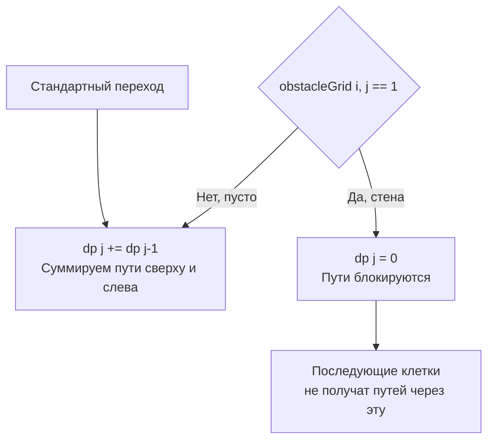

Задача Unique Paths II (LeetCode 63) элегантно усложняет предыдущую [[3. Unique Paths]], добавляя в сетку препятствия. Это момент, когда красивая математика комбинаторики разбивается о суровую реальность: мы больше не можем использовать формулу сочетаний, так как стены ломают симметрию путей. Нам приходится возвращаться к чистому DP.

**Условие:** Робот находится в левом верхнем углу сетки $m \times n$. В некоторых клетках находятся препятствия (обозначены 1), в остальных — пусто (0). Робот может двигаться только вниз или вправо. Сколько уникальных путей приведут его в правый нижний угол?

В бэкенде эта задача — прямая аналогия с маршрутизацией в дата-центрах: мы ищем количество доступных путей передачи пакетов от источника к получателю, учитывая, что некоторые узлы (серверы или свитчи) могут быть "мертвыми" (упали, ушли на обслуживание).

## Адаптация 1D DP: Обнуление путей

Мы продолжаем использовать оптимизированный 1D DP из предыдущей статьи. Логика перехода остается той же: `dp[j] += dp[j-1]`, но с одним критическим изменением. Если мы натыкаемся на препятствие в клетке `(i, j)`, количество способов достичь этой клетки становится **строго равно 0**. 

Мы просто перезаписываем `dp[j] = 0`, и это автоматически "блокирует" все пути, которые пытались пройти через эту точку вниз или вправо.

```go
func uniquePathsWithObstacles(obstacleGrid [][]int) int {
    m, n := len(obstacleGrid), len(obstacleGrid[0])
    
    // Крайний случай: старт заблокирован
    if obstacleGrid[0][0] == 1 {
        return 0
    }
    
    dp := make([]int, n)
    
    // Инициализация первой строки
    dp[0] = 1
    for j := 1; j < n; j++ {
        if obstacleGrid[0][j] == 1 {
            dp[j] = 0 // Стена! Все пути справа заблокированы
            // В отличие от наивного подхода, здесь break не нужен, 
            // так как dp[j] = 0 + 0 для всех последующих клеток
        } else {
            dp[j] = dp[j-1]
        }
    }
    
    // Заполнение остальной сетки
    for i := 1; i < m; i++ {
        // Обновление первого столбца
        if obstacleGrid[i][0] == 1 {
            dp[0] = 0 // Стена! Все пути вниз заблокированы
        }
        
        for j := 1; j < n; j++ {
            if obstacleGrid[i][j] == 1 {
                dp[j] = 0 // Стена обнуляет текущую ячейку
            } else {
                dp[j] += dp[j-1] // Стандартный переход: сверху + слева
            }
        }
    }
    
    return dp[n-1]
}
```



> [!warning] Ловушка / Gotcha
> Кандидаты часто делают ошибку в инициализации первой строки и столбца, забывая, что если стена стоит на `(0, 3)`, то клетки `(0, 4)`, `(0, 5)` и так далее тоже недостижимы. 
> В 1D DP это обрабатывается изящно: как только мы ставим `dp[j] = 0`, на следующем шаге `dp[j+1] = dp[j+1] + dp[j]` (что равно `0 + 0` или `0 + что-то`, но левое слагаемое равно 0). Если мы идем по первой строке, `dp[j+1] = 0 + dp[j] = 0`. Заражение нулем распространяется автоматически!

## Mechanical Sympathy: Цена условного ветвления

На первый взгляд, код идеален: $O(m \cdot n)$ времени, $O(n)$ памяти. Но давайте посмотрим на него глазами процессора.

Внутри внутреннего цикла появилось условие: `if obstacleGrid[i][j] == 1`. Это **Branch (ветвление)**. Современные процессоры пытаются предсказать, пойдет ли код по ветке `if` или `else`, чтобы заранее загрузить инструкции в конвейер (Instruction Pipeline).

Если препятствия распределены случайно, предсказатель ветвлений (Branch Predictor) будет часто ошибаться. Каждая ошибка (Branch Misprediction) означает сброс конвейера и потерю 10-20 тактов процессора. Для матрицы $10^4 \times 10^4$ с рандомными стенами это может замедлить алгоритм в 2-3 раза по сравнению с чистой сеткой из [[3. Unique Paths]].

> [!info] Под капотом
> В высоконагруженных системах, где сетка генерируется динамически (например, карта доступности узлов кластера), плотность и паттерн "стен" влияют на latency. Если стены идут полосами, предсказатель быстро поймет паттерн. Если это random noise — конвейер будет сбрасываться постоянно. Это отличный пример того, как бизнес-данные (расположение стен) напрямую влияют на производительность железа.

## System Design: Circuit Breaker и Annihilated Routes

В микросервисных архитектурах и SDN (Software-Defined Networking) мы регулярно сталкиваемся с динамическими графами. 

Представьте, что наш алгоритм работает в Control Plane оркестратора (например, Kubernetes). Узлы — это поды. Стены — это поды, здоровье которых (Health Check) упало. 

Логика `dp[j] = 0` — это срабатывание **Circuit Breaker** на маршруте. Как только мы узнаем, что узел мертв, мы не просто перестаем слать туда трафик, мы "обнуляем" все маршруты, которые через него проходили, заставляя систему искать обходные пути (через `dp[j-1]`, то есть смещая трафик на соседние узлы).

> [!tip] Собеседование
> Интервьюер может спросить: *"А что если мы можем телепортироваться через стены, но с штрафом?"* или *"А что если мы можем разрушать стены за определенную плату?"*
> Это переход к задачам вида "Shortest Path with Obstacle Removal" (часто решается через 0-1 BFS или 3D DP, где третье измерение — это количество разрушенных стен). Ваш ответ должен показать, что вы понимаете, как модифицировать состояние: добавляем третье измерение `k` (сколько стен сломано), и переход становится `dp[i][j][k] = min(...)`.

## Итог

1. **Смерть комбинаторики:** Как только в задаче появляются неравномерные ограничения (стены), мы обязаны использовать DP. Формулы $C_N^k$ больше не работают.
2. **Обнуление:** Обработка стен в DP сводится к простой проверке. Если `grid[i][j] == 1`, мы устанавливаем `dp[j] = 0`, что автоматически отсекает все пути, проходящие через эту точку.
3. **Инициализация базы:** Стена в нулевой строке или столбце делает все последующие клетки в этом ряду недостижимыми. 1D DP обрабатывает это элегантно благодаря "заражению нулем".
4. **Железо:** Условные ветвления на пустых/заполненных клетках могут вызывать Branch Misprediction, что делает время выполнения менее детерминированным по сравнению с чистыми сетками.

В следующей статье мы объединим концепции стоимости из Minimum Path Sum и механизма обхода стен: [[5. Minimum Path Sum]].