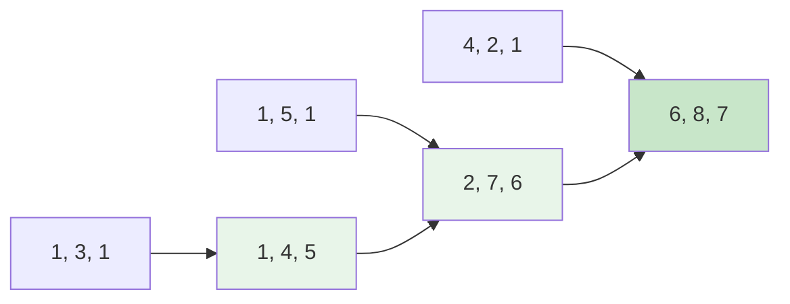

Задача Minimum Path Sum (LeetCode 64) поднимает паттерн из [[2. Матрицы]] на новый уровень. В [[4. Unique Paths II]] мы считали количество маршрутов с препятствиями, а теперь мы минимизируем стоимость прохождения. Это фундаментальная задача для любого бэкенда, где маршрутизация запросов или данных имеет ценовую метку (latency, money, CPU cycles).

**Условие:** Дана сетка `grid` размером $m \times n$, заполненная неотрицательными числами. Найдите путь из левого верхнего угла в правый нижний, который минимизирует сумму чисел на этом пути. Двигаться можно только вниз или вправо.

## Подход 1: In-place DP (O(1) дополнительной памяти)

Поскольку значение в каждой клетке зависит только от верхнего и левого соседей, и нам нужно лишь финальное минимальное значение, мы можем **перезаписывать исходную матрицу**. Это избавляет нас от любых аллокаций, сводя дополнительную память к $O(1)$.

```go
func minPathSumInPlace(grid [][]int) int {
    m, n := len(grid), len(grid[0])
    
    // Инициализация первой строки (можем идти только вправо)
    for j := 1; j < n; j++ {
        grid[0][j] += grid[0][j-1]
    }
    
    // Инициализация первого столбца (можем идти только вниз)
    for i := 1; i < m; i++ {
        grid[i][0] += grid[i-1][0]
    }
    
    // Заполнение остальной матрицы
    for i := 1; i < m; i++ {
        for j := 1; j < n; j++ {
            if grid[i-1][j] < grid[i][j-1] {
                grid[i][j] += grid[i-1][j] // Пришли сверху
            } else {
                grid[i][j] += grid[i][j-1] // Пришли слева
            }
        }
    }
    
    return grid[m-1][n-1]
}
```



> [!warning] Ловушка / Gotcha
> В производственном коде мутация (изменение) входных аргументов часто считается антипаттерном (Side Effect). Если другой компонент системы рассчитывает использовать исходную матрицу повторно, её изменение приведет к трудновоспроизводимым багам. На собеседовании всегда спрашивайте: *"Могу ли я модифицировать входную матрицу?"* Если нет, переходите к Подходу 2.

## Подход 2: 1D Слайс (O(n) памяти, иммутабельность)

Если мы не можем трогать `grid`, нам нужно выделить память под состояния. Как обсуждалось в [[1. Теория. Динамическое программирование 2D]], джаггед-массив (`[][]int`) — это зло для кэша. Мы используем плоский 1D слайс длиной `n`.

```go
func minPathSum(grid [][]int) int {
    m, n := len(grid), len(grid[0])
    
    dp := make([]int, n)
    dp[0] = grid[0][0]
    
    for j := 1; j < n; j++ {
        dp[j] = dp[j-1] + grid[0][j]
    }
    
    for i := 1; i < m; i++ {
        dp[0] += grid[i][0] // Обновляем первый столбец
        for j := 1; j < n; j++ {
            // dp[j] сейчас хранит значение "сверху"
            // dp[j-1] хранит обновленное значение "слева"
            top := dp[j]
            left := dp[j-1]
            
            if top < left {
                dp[j] = top + grid[i][j]
            } else {
                dp[j] = left + grid[i][j]
            }
        }
    }
    
    return dp[n-1]
}
```

## Mechanical Sympathy: Write-Back Cache и Джаггед-массивы

Давайте сравним In-place и 1D подходы на уровне ассемблера и контроллера памяти.

В In-place подходе мы пишем в `grid[i][j]`. Напомним, что `grid` — это слайс слайсов. Его строки разбросаны по куче. Когда мы обновляем `grid[i][j]`, CPU загружает кэш-линию (64 байта), модифицирует 8 байт и помечает линию как "грязную" (Dirty). Рано или поздно контроллер памяти запишет эту линию обратно в RAM (Write-Back).

Проблема в том, что переход к следующей строке `grid[i+1][j]` — это прыжок в совершенно другую область памяти. Предыдущая "грязная" кэш-линия вытесняется, вызывая запись в RAM. Мы генерируем массу событий Cache Miss и Write-Back.

В подходе с 1D слайсом `dp` — это единый непрерывный кусок памяти. Внутренний цикл по `j` идет строго последовательно. Процессор модифицирует ячейки в кэше, и пока мы не дойдем до конца слайса, данные могут не вытесняться в RAM. Это значительно снижает нагрузку на шину памяти.

> [!info] Под капотом
> В высоконагруженных вычислениях (HPC) и сетевых маршрутизаторах копирование данных в плоский буфер с последующим вычислением часто оказывается быстрее, чем in-place обновление разрозненных структур, из-за особенностей работы CPU L1/L2 кэша. Экономия аллокаций (In-place) не всегда равно экономия времени (CPU cycles).

## Восстановление маршрута (Path Reconstruction)

Часто бэкенду недостаточно знать *стоимость* пути, ему нужен *сам маршрут* (какие узлы выбрать).

Если бы мы использовали 2D матрицу `dp`, мы могли бы завести вторую матрицу `parent[][]`, хранящую направление прихода (`'D'` или `'R'`). Но при оптимизации до O(1) или O(N) памяти мы стираем историю.

**Решение:** Мы можем восстановить путь "задом наперед" из правого нижнего угла в левый верхний, используя исходную матрицу `grid` и вычисленные суммы. Если в точке `(i, j)` сумма сверху `grid[i-1][j]` меньше суммы слева `grid[i][j-1]`, значит оптимальный путь пришел сверху. Это требует $O(m+n)$ времени, но не требует дополнительной памяти.

## System Design: OSPF и BGP метрики

В реальных сетях (включая инфраструктуру Kubernetes с Calico/Cilium) маршрутизация работает по похожим принципам:

1. **Weighted Graphs:** Каждый узел (роутер, под) имеет стоимость (задержка, пропускная способность). Minimum Path Sum — это упрощенная модель протокола OSPF, где ищется кратчайший путь (Shortest Path First).
2. **Fire-and-forget vs Acknowledged:** Если мы используем In-place DP, мы "сжигаем мосты" — исходные данные теряются. В телекоме это аналогично перезаписи таблиц маршрутизации (RIB) напрямую. В критичных системах сначала строят новую таблицу (наш 1D слайс), а затем атомарно подменяют указатель на нее (Double Buffering), чтобы избежать состояния, когда маршрут наполовину посчитан.

> [!tip] Собеседование
> Интервьюер спросит: *"А что если в матрице есть отрицательные числа?"*
> В этой задаче (с движением только вправо/вниз) отрицательные числа не создают циклов, поэтому DP всё равно сработает корректно, и жадность по-прежнему будет ошибкой. Но если бы мы могли двигаться влево, отрицательные числа создали бы циклы отрицательной стоимости, и нам потребовался бы алгоритм Беллмана-Форда.

## Итог

1. **In-place DP:** Модификация входного массива экономит память $O(1)$, но является Side Effect. Убедитесь, что это разрешено архитектурой.
2. **Кэш-дружелюбность:** In-place на джаггед-массивах `[][]int` может быть медленнее, чем выделение плоского 1D слайса из-за Cache Miss при переходе между строками.
3. **Восстановление пути:** При нехватке памяти маршрут можно восстановить обратным проходом от финиша к старту, сравнивая веса соседей.
4. **Архитектура:** В распределенных системах предпочтительнее иммутабельный подход с выделением нового буфера под стейт, чтобы избежать частичных сбоев при конкурентном чтении.

В следующей статье мы перейдем к одной из самых известных задач сравнения строк, где 2D DP раскрывается во всей красе: [[6. Edit Distance]].