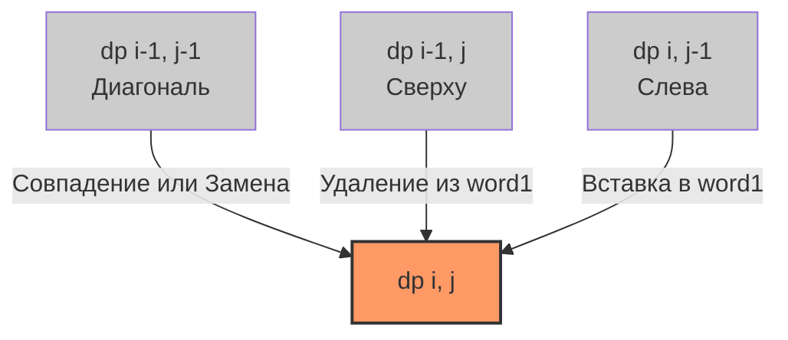

Задача Edit Distance (LeetCode 72: Расстояние Левенштейна) — это вершина двумерного динамического программирования на строках. Если [[5. Minimum Path Sum]] была задачей о перемещении по сетке, то здесь мы трансформируем одну строку в другую, и наша сетка — это пространство всех возможных трансформаций.

Для бэкенд-инженера расстояние Левенштейна — это не просто абстракция. Это фундамент поиска опечаток (fuzzy search), систем авто-коррекции ("Did you mean?"), алгоритмов сравнения версий (diff) и биоинформатики.

**Условие:** Даны два слова `word1` и `word2`. Вернуть минимальное количество операций, необходимых для преобразования `word1` в `word2`. Доступные операции: вставка символа, удаление символа, замена символа.

## Формулировка DP: Матрица трансформаций

Мы создаем матрицу `dp`, где `dp[i][j]` означает минимальное количество операций для преобразования префикса `word1[0..i-1]` в префикс `word2[0..j-1]`.

**База:**
- `dp[i][0] = i`: Чтобы превратить `i` символов в пустую строку, нужно `i` удалений.
- `dp[0][j] = j`: Чтобы получить `j` символов из пустой строки, нужно `j` вставок.

**Переход:**
Находясь в клетке `(i, j)`, мы смотрим на последние символы префиксов:
1. **Совпадение:** Если `word1[i-1] == word2[j-1]`, ничего делать не нужно. `dp[i][j] = dp[i-1][j-1]`
2. **Замена (Replace):** Меняем `word1[i-1]` на `word2[j-1]`. `dp[i][j] = dp[i-1][j-1] + 1`
3. **Удаление (Delete):** Удаляем `word1[i-1]`. Тогда мы должны были уже получить `word2[0..j-1]` из `word1[0..i-2]`. `dp[i][j] = dp[i-1][j] + 1`
4. **Вставка (Insert):** Вставляем `word2[j-1]` в `word1`. Тогда мы должны были получить `word2[0..j-2]` из `word1[0..i-1]`. `dp[i][j] = dp[i][j-1] + 1`

Мы выбираем минимум из трех операций.



## Идиоматичный Go: O(min(M, N)) памяти

Как и в [[3. Unique Paths]], нам не нужна вся матрица $M \times N$. Для вычисления текущей строки нам нужна только предыдущая. Это снижает память с $O(M \cdot N)$ до $O(N)$, где $N$ — длина второго слова.

Более того, мы можем использовать **один 1D слайс** вместо двух, если будем аккуратно сохранять значение по диагонали (`prevDiag`), которое перезаписывается при обновлении `dp[j]`.

```go
func minDistance(word1 string, word2 string) int {
    m, n := len(word1), len(word2)
    
    // Оптимизация: делаем word2 более короткой строкой, чтобы слайс был меньше
    if m < n {
        word1, word2 = word2, word1
        m, n = n, m
    }
    
    dp := make([]int, n+1)
    
    // Инициализация базы (преобразование пустой строки в word2)
    for j := 0; j <= n; j++ {
        dp[j] = j
    }
    
    for i := 1; i <= m; i++ {
        // dp[0] до обновления хранит dp[i-1][0], после обновления станет dp[i][0]
        prevDiag := dp[0] 
        dp[0] = i // База: преобразование word1[0..i-1] в пустую строку
        
        for j := 1; j <= n; j++ {
            temp := dp[j] // Сохраняем старое dp[i-1][j] для следующей итерации (как диагональ)
            
            if word1[i-1] == word2[j-1] {
                dp[j] = prevDiag // Совпадение
            } else {
                // Минимум из: Замены (prevDiag), Удаления (dp[j] - сверху), Вставки (dp[j-1] - слева)
                min := prevDiag
                if dp[j] < min {
                    min = dp[j]
                }
                if dp[j-1] < min {
                    min = dp[j-1]
                }
                dp[j] = min + 1
            }
            
            prevDiag = temp // Обновляем диагональ
        }
    }
    
    return dp[n]
}
```

> [!warning] Ловушка / Gotcha
> При сжатии 2D матрицы до 1D слайса диагональное значение `dp[i-1][j-1]` уничтожается при записи нового `dp[j]` (которое становится `dp[i][j]`). Если вы забудете сохранить `prevDiag` (старое значение `dp[j]` до перезаписи), логика сломается, так как вы будете использовать значение `dp[i][j-1]` (обновленное, "слева") вместо `dp[i-1][j-1]` ("по диагонали"). Этот паттерн с `prevDiag` — классический тест на понимание механики работы с кэшем DP.

## Mechanical Sympathy: Строки и Runes

В условии задачи LeetCode подразумевается, что строки состоят из английских букв. Поэтому `len(word1)` и индексация `word1[i-1]` работают корректно. 

Но в реальном бэкенде (поиск по именам пользователей, анализ логов) строки — это Unicode (UTF-8 в Go). 

> [!info] Под капотом
> Если вы вызовете `len("строка")` в Go, он вернет количество байт (12), а не символов (6). Индексация `s[i]` вернет байт, а не руну. Если вы запустите наивный алгоритм Левенштейна на UTF-8 строках без конвертации, он будет "разрывать" многобайтные символы (например, кириллицу или эмодзи) при операциях вставки/удаления, что приведет к неверному результату и панике при попытке сконвертировать результат обратно в `string`.
> 
> **Решение:** Всегда конвертируйте строки в слайсы рун перед вычислением: `runes1 := []rune(word1)`. Это потребует $O(M+N)$ аллокаций в куче, но гарантирует корректную работу алгоритма на уровне code points.

## System Design: Fuzzy Search на масштабе

Расстояние Левенштейна — мощный инструмент, но вычисление его для двух слов имеет сложность $O(M \cdot N)$. 

Представьте, что вы реализуете поиск "Did you mean?" в словаре из 100 000 слов, а пользователь ввел "progrm". Если вы будете считать Edit Distance между "progrm" и каждым словом в БД, запрос займет секунды. Для high-load бэкенда это недопустимо.

В продакшене чистый DP используется редко или только как финальный фильтр. Как это оптимизируют?

1. **Levenshtein Automata:** Превращение паттерна поиска в конечный автомат, который может за $O(M)$ проверять, находится ли слово из БД в допустимом радиусе ошибок (например, расстояние $\le 2$). Это реализовано в библиотеках вроде `liblevenshtein`.
2. **BK-Trees (Burkhard-Keller trees):** Метрические деревья, которые используют свойства расстояния Левенштейна (неравенство треугольника), чтобы отсекать целые ветви словаря, не вычисляя дистанцию до каждого слова.
3. **SymSpell:** Алгоритм, который меняет парадигму. Вместо того чтобы генерировать все возможные мутации словаря на лету, он предвычисляет все "удаления" для каждого слова (Delete + Distance). Это увеличивает размер индекса, но делает поиск за время $O(1)$.

> [!tip] Собеседование
> Если вы решили задачу на DP, интервьюер по System Design спросит: *"Как вы реализуете поиск опечаток в поисковой строке для 10 000 RPS?"*
> Ваш ответ должен быть: *"Я не буду гонять DP Левенштейна на каждом запросе. Я предвычислю индекс с помощью SymSpell или использую Levenshtein Automata в связке с Elasticsearch, чтобы сначала сузить круг кандидатов, а затем, при необходимости, применю точный DP для ранжирования."*

## Итог

1. **Три операции:** Edit Distance требует анализа трех предков в матрице: по диагонали (Match/Replace), сверху (Delete) и слева (Insert).
2. **Сжатие памяти:** Мы можем сжать 2D матрицу до 1D слайса, но критически важно сохранять диагональное значение `prevDiag` перед его перезаписью.
3. **Unicode в Go:** Для продакшен-кода всегда работайте с `[]rune`, а не с `string` напрямую, иначе многобайтные UTF-8 символы сломают логику.
4. **Архитектура поиска:** Расстояние Левенштейна дорого для полного скана. В распределенных поисковых системах используются структуры данных (SymSpell, BK-Tree), позволяющие избежать вычисления DP для большинства записей.

В следующей статье мы разберем еще одну сложную строковую задачу, где переплетаются состояния "взять" и "пропустить" из двух разных строк: [[7. Interleaving String]].