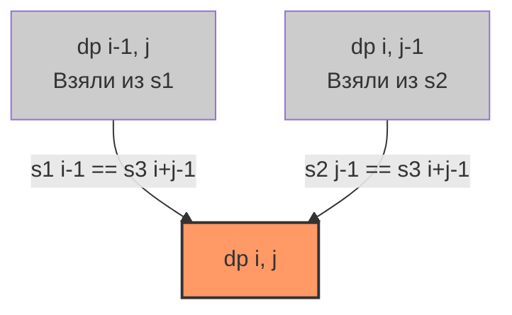

Задача Interleaving String (LeetCode 97: Перемежающаяся строка) — это одна из самых изящных и сложных задач двумерного DP. Если в [[6. Edit Distance]] мы могли заменять, удалять и вставлять символы, то здесь мы лишены этих привилегий. У нас есть две строки-источника, и мы должны собрать третью, сохраняя строгий порядок символов внутри каждого источника.

**Условие:** Даны строки `s1`, `s2` и `s3`. Необходимо проверить, можно ли получить `s3`, перемежая (interleaving) символы `s1` и `s2`. Порядок символов в `s1` и `s2` при этом менять нельзя.

В бэкенде этот паттерн моделирует задачу слияния двух упорядоченных потоков данных (например, логов или транзакций из двух дата-центров) в один общий временной ряд, где относительный порядок событий каждого источника должен быть строго сохранен.

## Формулировка DP: Два источника истины

Мы создаем матрицу `dp`, где `dp[i][j]` означает: можно ли собрать префикс `s3` длиной `i+j`, используя первые `i` символов `s1` и первые `j` символов `s2`.

**Переход:**
Чтобы собрать `s3[0..i+j-1]`, последний символ должен был прийти либо из `s1`, либо из `s2`.
1. **Берем из s1:** Если `s1[i-1] == s3[i+j-1]`, то результат зависит от того, могли ли мы собрать префикс без этого символа: `dp[i-1][j]`.
2. **Берем из s2:** Если `s2[j-1] == s3[i+j-1]`, то результат зависит от: `dp[i][j-1]`.

Итоговая формула (логическое ИЛИ):
$$dp[i][j] = (dp[i-1][j] \land s1[i-1] == s3[i+j-1]) \lor (dp[i][j-1] \land s2[j-1] == s3[i+j-1])$$



**База:**
- `dp[0][0] = true` (две пустые строки образуют пустую строку).
- Первая строка: `dp[0][j]` — собираем `s3` только из `s2`.
- Первый столбец: `dp[i][0]` — собираем `s3` только из `s1`.

## Идиоматичный Go: 1D Булевый слайс

Поскольку наше состояние зависит только от текущей и предыдущей строк, мы можем сжать 2D матрицу `[][]bool` до 1D слайса `[]bool`.

В Go `bool` занимает 1 байт (а не 1 бит, как можно было бы подумать). Но даже так слайс `make([]bool, n+1)` ложится в кэш процессора гораздо лучше, чем матрица указателей. Кроме того, мы используем встроенную ленивую оценку (short-circuit evaluation) оператора `||`, что делает код лаконичным и безопасным.

```go
func isInterleave(s1 string, s2 string, s3 string) bool {
    m, n := len(s1), len(s2)
    
    // Критическая оптимизация: длина s3 должна быть равна сумме длин
    if m+n != len(s3) {
        return false
    }
    
    dp := make([]bool, n+1)
    
    for i := 0; i <= m; i++ {
        for j := 0; j <= n; j++ {
            if i == 0 && j == 0 {
                dp[j] = true
            } else if i == 0 {
                // Первая строка: берем только из s2
                dp[j] = dp[j-1] && s2[j-1] == s3[j-1]
            } else if j == 0 {
                // Первый столбец: берем только из s1
                // dp[0] обновляется на основе своего старого значения (сверху)
                dp[j] = dp[j] && s1[i-1] == s3[i-1]
            } else {
                // Общий случай: либо сверху (dp[j] до обновления), либо слева (dp[j-1])
                fromS1 := dp[j] && s1[i-1] == s3[i+j-1]
                fromS2 := dp[j-1] && s2[j-1] == s3[i+j-1]
                dp[j] = fromS1 || fromS2
            }
        }
    }
    
    return dp[n]
}
```

> [!warning] Ловушка / Gotcha
> При сжатии 2D матрицы до 1D слайса для обновления первого столбца (`j == 0`) мы обращаемся к `dp[0] = dp[0] && ...`. Здесь левый `dp[0]` — это новое значение (строка `i`), а правый `dp[0]` — это старое значение (строка `i-1`). В Go выражение вычисляется слева направо, и старое значение `dp[0]` считывается до его перезаписи, так что логика работает корректно. Но если бы мы использовали параллельные присваивания или горутины, здесь могла бы возникнуть race condition.

## Mechanical Sympathy: Branch Prediction и Булева алгебра

В отличие от числового DP, где процессор выполняет `CMOV` (условные пересылки), в булевом DP мы работаем с флагами. Операции `&&` и `||` в Go компилируются в инструкции, зависящие от предсказателя ветвлений (Branch Predictor).

Если строки `s1` и `s2` состоят из одинаковых символов (например, `s1 = "aaa"`, `s2 = "aaa"`, `s3 = "aaaaaa"`), на каждом шаге оба условия `fromS1` и `fromS2` истинны. Процессор хорошо предсказывает такие паттерны.

Но если строки сильно перемешаны и случайны, предсказатель будет часто ошибаться (Branch Misprediction), сбрасывая конвейер. В высоконагруженных системах для вероятностных вычислений иногда переходят на побитовую математику (используя `uint64` как 64 битовых поля), чтобы убрать ветвления вообще, но для этой задачи алгоритмическая сложность $O(M \cdot N)$ перевешивает микрооптимизации.

> [!info] Под капотом
> В системе команд x86_64 есть инструкции `PTEST`, которые позволяют проверять битовые маски без условных переходов. Теоретически, если переписать этот алгоритм так, чтобы `dp` был слайсом `uint64`, где каждый бит — это состояние для 64 различных `j`, мы могли бы обрабатывать 64 столбца матрицы за один такт процессора (SIMD-подход). Это называется "Bitset DP" и используется в поисковых движках для супербыстрого approximate matching.

## System Design: Мультиплексирование потоков

Задача перемежения строк — это точная модель **мультиплексирования (Multiplexing)** в сетевых протоколах и логировании.

1. **Распределенный трейсинг:** Представьте, что у вас есть логи от микросервиса A (`s1`) и микросервиса B (`s2`). Они отправляют свои логи в центральный коллектор, который складывает их в единый поток `s3` в порядке поступления (по timestamp). Проверка корректности сборки лога — это задача Interleaving String. Если относительный порядок событий внутри логов A или B нарушился, значит, коллектор работает некорректно.
2. **TCP Segment Reassembly:** Когда TCP-пакеты приходят из сети, они могут фрагментироваться. Сборка потока из двух TCP-потоков (например, при соединении данных из кэша и данных с диска) требует проверки, что фрагменты не перемешались внутри каждого потока.
3. **Event Sourcing:** Слияние веток в Git (Merge) по сути является задачей перемежения, но с обнаружением конфликтов (когда символы не совпадают ни с одним источником, нужен 3-way merge).

> [!tip] Собеседование
> На интервью часто спрашивают: *"А можно ли решить эту задачу без DP, через BFS/DFS?"*
> **Ответ:** Да! Матрицу `dp` можно рассматривать как ориентированный граф, где `dp[i][j]` — это узел. Если мы можем взять символ из `s1`, мы идем по ребру вниз. Если из `s2` — идем вправо. Задача сводится к проверке, достижима ли клетка `(m, n)` из `(0, 0)`. Это решается через BFS или DFS с мемоизацией посещенных клеток. Это отличный альтернативный ответ, который показывает гибкость вашего мышления.

## Итог

1. **Два источника:** В отличие от Edit Distance, мы не модифицируем символы. Мы либо берем готовый символ из `s1`, либо из `s2`, сохраняя их внутренний порядок.
2. **Логическое ИЛИ/И:** Переход строится на логике: `(предыдущее состояние) И (совпадение символа)`.
3. **Сжатие памяти:** Булеву матрицу можно и нужно сжимать до 1D слайса, аккуратно обрабатывая обновление `dp[0]` (первого столбца).
4. **Ранняя проверка:** Всегда проверяйте `len(s1) + len(s2) == len(s3)` в самом начале. Это отсеивает целый класс невалидных входов за $O(1)$.

На этом мы завершаем раздел двумерного динамического программирования. В следующей статье мы перейдем к задачам, где DP применяется не к матрицам, а к строкам, требуя поиска общих подпоследовательностей: [[1. Теория. DP на строках]].