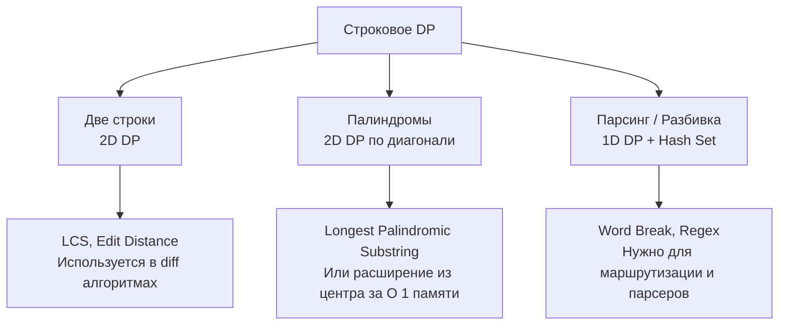

Строковое динамическое программирование — это особый раздел DP, где в качестве состояний выступают индексы одного или двух строковых массивов. В отличие от числовых массивов, строки обладают уникальными свойствами: они иммутабельны, состоят из байт (или рун), и к ним применимы специфические оптимизации вроде откатов (rollback) и расширения из центра.

Для бэкенд-инженера этот раздел критически важен. Поиск плагиата, системы контроля версий (diff-алгоритмы), обработка естественного языка (NLP) и даже синтаксический разбор конфигураций (парсинг) — всё это опирается на строковое DP.

## Анатомия строк в Go: StringHeader

Прежде чем писать алгоритмы, нужно понять, как Go видит строки на уровне железа и рантайма. В отличие от C++, где `std::string` — это сложный объект с кучей методов, строка в Go — это крайне примитивная структура из двух полей.

В исходниках Go (`reflect/string.go`) строка представлена так:
```go
type StringHeader struct {
    Data unsafe.Pointer // Указатель на начало массива байт
    Len  int            // Длина строки в байтах
}
```

Строка в Go — это просто **окно просмотра (view)** в массив байт. Она неизменяема (immutable).

> [!warning] Ловушка / Gotcha (Memory Leak)
> Поскольку строка — это лишь указатель и длина, операция взятия среза `s[l:r]` создает новую структуру `StringHeader`, но указатель `Data` всё ещё ссылается на оригинальный массив байт!
> 
> Представьте, что вы парсите HTTP-запрос размером 1 МБ и берете из него маленький заголовок длиной 10 байт: `authToken := header[0:10]`. Этот слайс всё еще держит указатель на весь мегабайтный массив. Garbage Collector не сможет очистить 1 МБ, так как на него есть ссылка.
> 
> **Решение в production:** Всегда делайте копию, если извлекаете маленькие строки из больших данных: `authToken := string([]byte(header[0:10]))`. Это заставит рантайм аллоцировать новый массив в 10 байт и освободить мегабайтный оригинал.

## Mechanical Sympathy: Байты против Рун

Алгоритмы DP подразумевают индексацию за $O(1)$. В Go `s[i]` возвращает `byte` (uint8). Это работает мгновенно, так как процессор просто прибавляет смещение к указателю `Data`. Кэш процессора обожает такие последовательные чтения.

Но если строка содержит UTF-8 (кириллицу, эмодзи), один символ (руна) может занимать от 1 до 4 байт. В таком случае `s[i]` вернет лишь часть символа, что сломает логику сравнения.

**Дилемма на интервью:**
1. Если вы знаете, что строка ASCII (например, DNA-последовательности `ATGC` или логи) — работайте напрямую с `[]byte` или индексами. Это максимально быстро и дружелюбно к кэшу L1.
2. Если возможен Unicode — сконвертируйте строку в `[]rune` перед DP. Это стоит $O(N)$ времени и аллокации в куче, но гарантирует корректность.

```go
// Для Unicode строк:
runes1 := []rune(s1)
runes2 := []rune(s2)
// Дальше работаем с индексами runes[i]
```

## Основные паттерны строкового DP

Всё строковое DP можно разделить на три большие категории:

### 1. Сравнение двух строк (2D DP)
Это классика вроде наибольшей общей подпоследовательности (LCS) и редакционного расстояния (Edit Distance). Состояние `dp[i][j]` означает оптимальный ответ для префиксов `s1[0..i-1]` и `s2[0..j-1]`.
- **Переход:** Зависит от совпадения `s1[i-1] == s2[j-1]`.
- **Память:** Требует $O(M \cdot N)$, что для строк в 100 000 символов составит 10^10 операций и десятки гигабайт памяти. На бэкенде такие алгоритмы применяют только к коротким строкам (поиск опечаток), а для длинных используют алгоритмы Майерса (Myers diff) или суффиксные массивы.

### 2. Палиндромы и подстроки (2D DP с сокращением)
Здесь состояние `dp[i][j]` обычно означает: "является ли подстрока с индекса `i` по `j` палиндромом?".
- **Переход:** `dp[i][j] = (s[i] == s[j]) && dp[i+1][j-1]`.
- **Особенность:** Заполнение матрицы идет не слева направо, а по диагоналям (по длине подстроки), так как внутреннее состояние зависит от ячеек, находящихся ниже и левее.

### 3. Парсинг и регулярные выражения (1D DP)
Задачи вроде "может ли строка быть разбита на слова из словаря" (Word Break). Состояние `dp[i]` означает: "можно ли собрать префикс длины `i`".
- **Переход:** Для каждого `i` мы перебираем слова из словаря и проверяем, заканчивается ли строка на это слово, и если да, смотрим на `dp[i - len(word)]`.



## System Design: Алгоритм Майерса и Git

В бэкенде мы постоянно сталкиваемся с задачей сравнения текстов: генерация патчей, синхронизация конфигов, мерж-реквесты в Git.

Чистый 2D DP (Edit Distance) для файлов размером 10 000 строк потребует матрицу 10^8 ячеек. Это неприемлемо. 

В Git используется **Алгоритм Майерса (Myers Diff Algorithm)**. Он превращает задачу DP в поиск кратчайшего пути на графе редактирования с помощью BFS. Алгоритм отдает приоритет операциям удаления/вставки, которые не меняют контекст (то есть ищет "змеи" - совпадающие блоки). 
Математически он всё еще опирается на концепции LCS, но эксплуатирует тот факт, что в реальном коде 90% строк не меняются, позволяя алгоритму "перепрыгивать" целые блоки за $O(1)$. Это уменьшает сложность с $O(N \cdot M)$ до $O((N+M) \cdot D)$, где $D$ — количество реальных изменений (часто $D \ll N$).

> [!tip] Собеседование
> Если вас просят реализовать LCS или Edit Distance, обязательно скажите: *"Для коротких строк я использую 2D DP с оптимизацией памяти до O(min(M,N)). Но если бы это были огромные логи, я бы перешел к алгоритму Майерса или использовал rolling hash (алгоритм Рабина-Карпа), так как квадратичная сложность положит бэкенд на больших данных"*.

## Итог

1. **Иммутабельность строк:** В Go строки — это `StringHeader` (указатель + длина). Операция среза `s[l:r]` не копирует данные, что может привести к утечке памяти (memory leak) в продакшене. Всегда копируйте маленькие подстроки через `string([]byte(...))`.
2. **Кодировки:** Для ASCII работайте с индексами `s[i]` (максимально быстро). Для Unicode конвертируйте в `[]rune` (корректно, но требует аллокации).
3. **Три паттерна:** Строковое DP делится на сравнение двух строк (2D), поиск подстрок/палиндромов (2D по диагонали) и парсинг (1D).
4. **Масштабирование:** Классический 2D DP не масштабируется на большие тексты. В System Design применяются специализированные алгоритмы (Myers, Rabin-Karp, Suffix Trees).

В следующей статье мы детально разберем самый известный паттерн сравнения двух строк и то, как он связан с редакционным расстоянием: [[2. LCS и edit distance]].