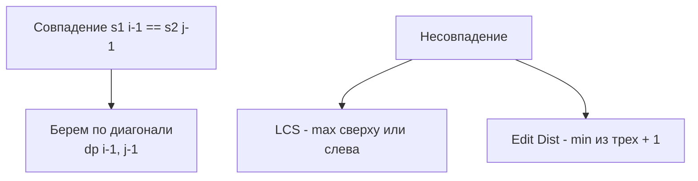

Наибольшая общая подпоследовательность (LCS - Longest Common Subsequence) и редакционное расстояние (Edit Distance / Levenshtein Distance) — это две фундаментальные задачи строкового DP, которые являются двумя сторонами одной медали. Если вы понимаете одну, вы автоматически понимаете другую.

В бэкенде эти алгоритмы — основа систем контроля версий (как работает `git diff`), инструментов сравнения конфигураций и систем поиска плагиата.

## Математическая связь: Две стороны одной медали

Обе задачи сводятся к заполнению матрицы $M \times N$, где строки — символы `s1`, а столбцы — `s2`.

1. **LCS** ищет максимальное количество совпадающих символов, которые идут в одном порядке, но не обязательно подряд.
2. **Edit Distance** ищет минимальное количество операций (вставка, удаление, замена), чтобы превратить `s1` в `s2`.

Если мы ограничим Edit Distance только операциями вставки и удаления (замена запрещена), то между ними возникает строгая математическая связь:
$$EditDistance_{ins/del}(s1, s2) = |s1| + |s2| - 2 \cdot LCS(s1, s2)$$

Каждый несовпавший символ в LCS требует удаления из `s1` и вставки в `s2`. Понимание этой связи позволяет мгновенно переключаться между паттернами.

## Формулировка DP

Мы создаем матрицу `dp`, где `dp[i][j]` — это ответ для префиксов `s1[0..i-1]` и `s2[0..j-1]`.

**База:**
- `dp[i][0] = 0` для LCS (пустая вторая строка — 0 совпадений).
- `dp[i][0] = i` для Edit Distance (нужно `i` удалений).

**Переходы:**
Если символы совпадают (`s1[i-1] == s2[j-1]`), нам повезло:
- **LCS:** `dp[i][j] = dp[i-1][j-1] + 1`
- **Edit Distance:** `dp[i][j] = dp[i-1][j-1]` (бесплатно)

Если символы не совпадают, мы выбираем лучший из вариантов:
- **LCS:** `dp[i][j] = max(dp[i-1][j], dp[i][j-1])` (пропускаем символ либо в первой, либо во второй строке).
- **Edit Distance:** `dp[i][j] = 1 + min(dp[i-1][j-1], dp[i-1][j], dp[i][j-1])` (замена, удаление, вставка).



## Идиоматичный Go: O(min(M,N)) по памяти

Наивная реализация требует матрицы $M \times N$. Для двух файлов по 10 000 строк это 100 миллионов `int` (около 800 МБ памяти). Любой бэкенд упадет с OOM.

Как и в других 2D DP-задачах, мы можем сжать матрицу до 1D слайса. Но есть критический нюанс: в формуле используется значение по диагонали (`dp[i-1][j-1]`). При обновлении слайса слева направо это значение будет затерто новым.

**Трюк:** Мы сохраняем значение по диагонали в отдельную переменную (`prevDiag`).

Также мы делаем оптимизацию, чтобы слайс соответствовал *более короткой* строке. Это радикально экономит кэш процессора.

```go
func longestCommonSubsequence(text1, text2 string) int {
    // Оптимизация памяти: делаем text2 более короткой строкой
    if len(text1) < len(text2) {
        text1, text2 = text2, text1
    }
    m, n := len(text1), len(text2)
    
    dp := make([]int, n+1)
    
    for i := 1; i <= m; i++ {
        prevDiag := dp[0] // Сохраняем dp[i-1][0] перед перезаписью
        for j := 1; j <= n; j++ {
            temp := dp[j] // temp хранит старое dp[i-1][j] до обновления
            
            if text1[i-1] == text2[j-1] {
                dp[j] = prevDiag + 1
            } else {
                // dp[j] - это старое значение (сверху), dp[j-1] - новое (слева)
                if dp[j-1] > dp[j] {
                    dp[j] = dp[j-1]
                }
            }
            prevDiag = temp // Для следующего j диагональю станет старое верхнее
        }
    }
    
    return dp[n]
}
```

> [!info] Под капотом
> При выполнении `if text1[i-1] == text2[j-1]` мы обращаемся к памяти через указатель `Data` в `StringHeader` и смещение. Поскольку строки в Go иммутабельны и лежат в памяти компактно, процессор отлично справляется с Prefetching. Однако, если мы ранее конвертировали строки в `[]rune` для поддержки Unicode, доступ к рунам потребует чтения из слайса в куче. Это медленнее, но безопаснее.

## Mechanical Sympathy: Ветвления и регистры

Внутренний цикл DP содержит условие `if text1[i-1] == text2[j-1]`. Для процессора это "развилка" (Branch). В зависимости от данных (совпадают символы или нет), предсказатель ветвлений (Branch Predictor) может ошибаться.

В коде выше мы также используем инлайн-максимум через `if dp[j-1] > dp[j]` вместо вызова функции `max()`. 
В современных версиях Go (1.21+) встроенная функция `max` инлайнится компилятором в инструкцию `CMOV` (Conditional Move), которая не сбрасывает конвейер (pipeline) процессора. Но ручной `if` всё равно остается идиоматичным и надежным способом гарантировать отсутствие накладных расходов на вызов функции в старых версиях компилятора.

Переменные `prevDiag` и `temp` компилятор Go попытается разместить не на стеке, а напрямую в **регистрах процессора** (например, RAX, RBX). Обмен значениями между регистрами занимает 0 тактов, тогда как чтение даже из L1 кэша — около 4 тактов. Таким образом, трюк с `prevDiag` не только экономит память, но и ускоряет вычисления на аппаратном уровне.

## System Design: Git Diff и Алгоритм Майерса

Если LCS и Edit Distance — это DP, то как `git diff` умудряется сравнивать файлы по тысячам строк за миллисекунды? 

Чистый DP имеет сложность $O(M \cdot N)$ и всегда выполняет $M \cdot N$ итераций, даже если файлы отличаются всего на 1 строку. В 1986 году Юджин Майерс придумал алгоритм, который эксплуатирует тот факт, что в реальном коде большинство строк совпадают.

**Алгоритм Майерса (Myers Diff):** Он превращает поиск LCS в поиск кратчайшего пути на графе редактирования с помощью BFS. Сложность снижается до $O((M+N) \cdot D)$, где $D$ — количество реальных различий (длина Edit Distance). Если файлы почти одинаковые ($D$ мало), алгоритм работает в тысячи раз быстрее классического DP.

> [!tip] Собеседование
> Если вас просят написать Edit Distance, напишите 1D DP. Но затем обязательно добавьте:
> *"Этот алгоритм работает за O(M*N). Если бы мы писали систему сравнения конфигов в продакшене, где файлы огромны, но изменения малы, я бы использовал алгоритм Майерса, так как он работает за O((M+N)*D), где D - размер diff'а. Именно его использует Git под капотом."*
> Это мгновенно выделит вас из 95% кандидатов, которые знают лишь алгоритм из учебника.

## Восстановление ответа (Path Tracing)

Часто нам нужен не только размер LCS или Edit Distance, но и сама последовательность (или список операций).

При 1D сжатии мы стираем историю состояний, поэтому восстановить путь напрямую нельзя. У нас есть два выхода:
1. **Потратить память:** Хранить полную матрицу `[][]int` (или `[][]byte` с флагами направления), а затем пройти по ней обратным ходом от `dp[m][n]` к `dp[0][0]`.
2. **Разделяй и властвуй (Hirschberg's Algorithm):** Гениальный алгоритм, который позволяет найти саму последовательность LCS за $O(M \cdot N)$ времени, но используя всего $O(min(M, N))$ памяти. Он делит первую строку пополам, находит середину пути через вторую строку с помощью прямого и обратного DP, и рекурсивно применяется к двум половинам. Это стандарт для систем, где память критична.

## Итог

1. **Две стороны медали:** LCS ищет совпадения, Edit Distance — различия. При ограничении операций (без replace) они связаны формулой $D = M + N - 2 \cdot LCS$.
2. **Сжатие памяти:** Всегда сжимайте матрицу до 1D слайса по короткой строке. Сохраняйте диагональное значение `prevDiag` перед перезаписью ячейки.
3. **Регистры CPU:** Локальные переменные `temp` и `prevDiag` попадают в регистры, делая 1D DP невероятно быстрым.
4. **Алгоритм Майерса:** Для System Design задач (diff-инструменты) классический DP неприменим из-за $O(M \cdot N)$. Используйте Myers Diff, зависящий от количества реальных изменений.

В следующей статье мы детально разберем реализацию классической задачи LCS и ее углубленные вариации: [[3. Longest Common Subsequence]].